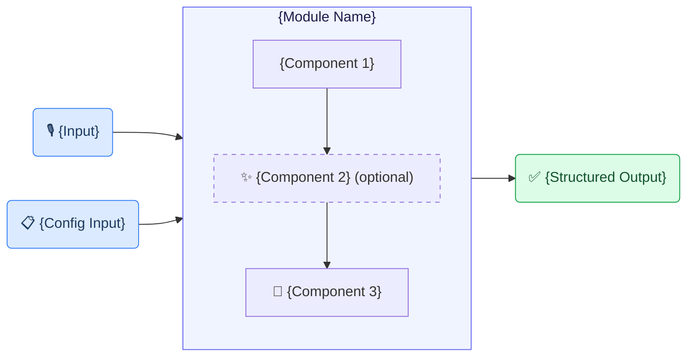
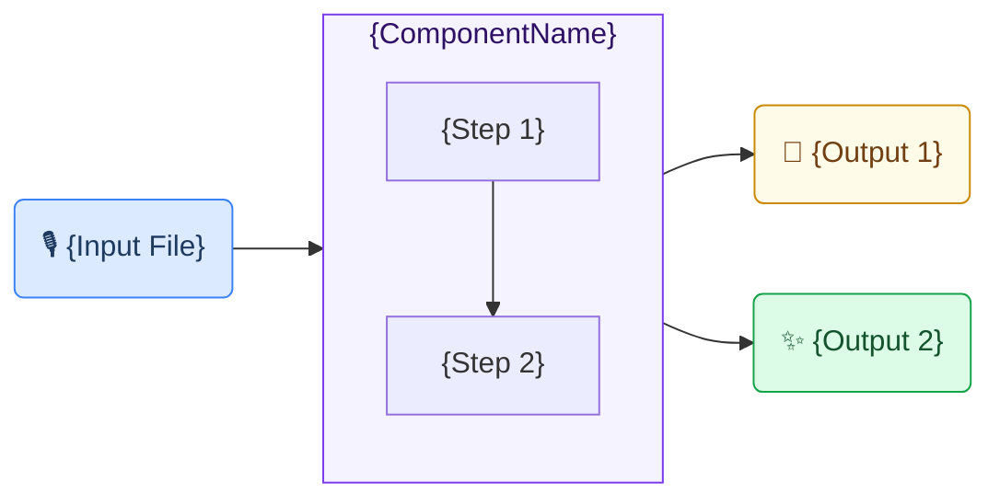
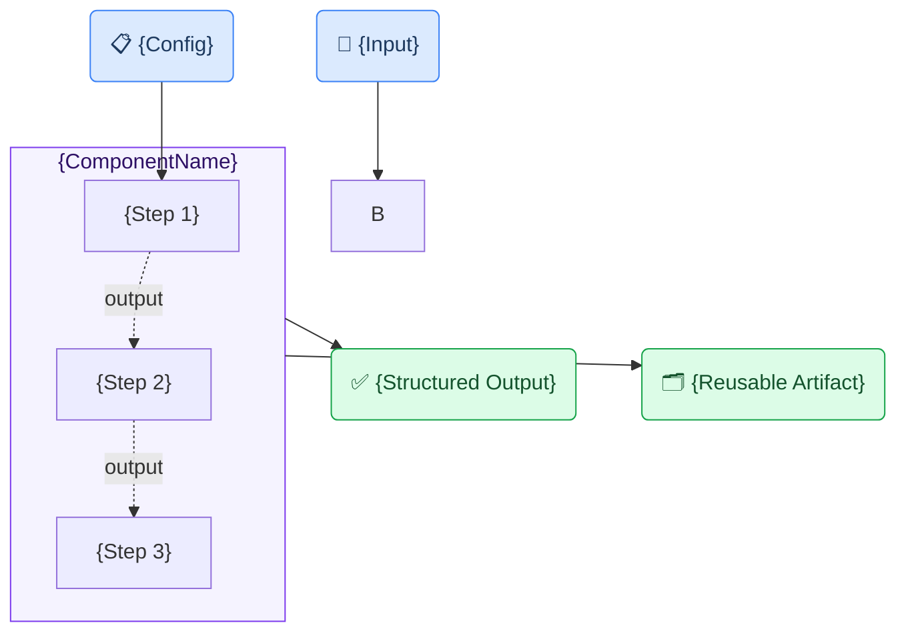
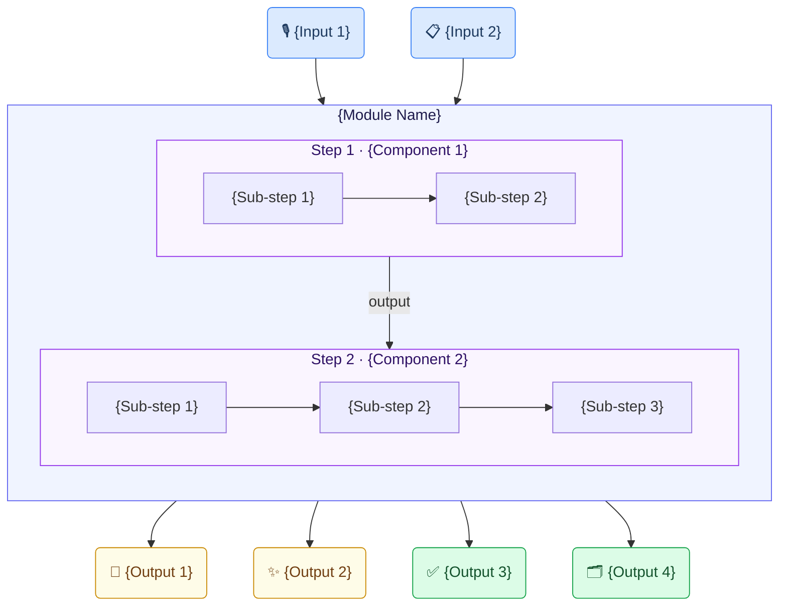

# MDX Template — Use-Case Description Page

Canonical structure for `guidance_layer/website/content/docs/use-cases/{slug}.mdx`.

**Primary reference:** `incident-reporting.mdx` — read it fully before generating any content.

---

## Frontmatter + Opening

```mdx
---
title: {Use Case Display Name}
description: {One-sentence description for SEO and sidebar}
---
# {Use Case Display Name} Generic Use Case (Cross-Cutting Use Case)

{1–2 sentence business context. What problem does this solve and who benefits?}
```

The H1 heading always ends exactly with "Generic Use Case (Cross-Cutting Use Case)".

---

## Section Order and Content

### 1. `## Business layer – use case specification` *(required)*

```markdown
## Business layer – use case specification

{1–2 sentence description of what the canvas covers and who the users are.}

Concrete example fragments reflected in the use case design include:
- {Fragment describing the input/trigger}
- {Fragment describing the goal}
- {Fragment describing the delivery context}
- {Fragment defining success}

{1 sentence on what the canvas provides — shared understanding without technical detail.}


- **Reference GenAI Product Description for {Use Case}** - [Download Raw File ({filename}.pptx)]({github_url})
```

---

### 2. `## Strategy layer – value evaluation and monitoring` *(optional; Coming Soon if not provided)*

```markdown
## Strategy layer – value evaluation and monitoring

At the strategy layer, the value evaluation model applies the [Value Evaluation Framework]({github_url}) to this generic use case and makes value assumptions explicit.

Example value fragments from the model include:

{Repeat one block per value type present in the user-provided model. Common types: Functional (primary), Informational, Financial, Emotional, Social, Operational. Use exactly the types the model contains — do not limit to 3.}

Functional value (primary):
"{Fragment 1}", "{Fragment 2}", "{Fragment 3}"
→ Outcome: {outcome sentence}

Informational value:
"{Fragment 1}", "{Fragment 2}"
→ Outcome: {outcome sentence}

Emotional value:
"{Fragment 1}", "{Fragment 2}"
→ Outcome: {outcome sentence}

{Optional: value evaluation image reference}


{Optional: PowerPoint download link}
The source version of the **Value evaluation model: {Use Case}** - [Download Raw File ({filename}.pptx)]({github_url})

The same model can be used both before implementation (to evaluate expected value) and after deployment (to monitor realized value across different dimensions).
```

---

### 3. `## Implementation layer using No-Code` *(required)*

**Use Structure A when only one type of no-code asset exists.**

```markdown
## Implementation layer using No-Code

{Use case name} can be supported by Generative AI using a no-code approach.
At the implementation layer, the use case is realized using no-code assets from the toolkit:
1) [Prompt templates for {task}]({github_url})
2) [Reusable agent skills for {task}]({github_url})

{1–2 sentences explaining what the assets specify and how organizations can adapt them.}

What the business user sets up (once):

{Role} defines a {template/policy}, not code. Conceptually, it says:
- "{Rule 1}"
- "{Rule 2}"
- "{Rule 3}"
- "{Rule 4}"

What happens in daily work:

**Step 1 – {Action name}**
{Description of what the user does.}
- {Detail}
- {Detail}

**Step 2 – {Action name} (no-code logic)**
{Description of what the system does automatically.}
- {Rule applied}
- {Rule applied}

Example of what the business gets out:

{1 sentence framing the output.}

- {Output field}: {value}
- {Output field}: {value}

This makes the result:
- easy to paste into an existing system
- safe to store in a database
- reliable for analytics and reporting
- suitable for audits and compliance
```

**Use Structure B when both prompt-based assets AND a Claude Skill exist.**

```markdown
## Implementation layer using No-Code

{Use case name} can be supported by Generative AI using two no-code approaches: a **prompt-based approach** for quick experimentation directly in ChatGPT, and a **Claude Skill** for a more structured, repeatable workflow in Claude Desktop.

### Prompt-based approach

{1–2 sentences describing the prompt(s) and what they do. Mention if there are variants (e.g. single-document vs multi-document).}

{Brief bullet list of what each prompt does.}

> 📁 [{Display name} →]({github_url_to_prompts_folder})

### Claude Skill

{2–4 sentences: what the skill does, when to prefer it over the prompt-based approach, and where to find documentation.}

For a detailed walkthrough, see the article: [{Article title}]({url})

> 📁 [{Display name} →]({github_url_to_skill_folder})
```

**Key rules for both structures:**
- Use **"Claude Skill"** — never "Claude Desktop agent skill" or "Claude Desktop Skill"
- In Structure B, keep each subsection concise — do not include detailed setup steps in the Claude Skill subsection; link to the documentation instead
- Divider `---` follows immediately after this section

---

### 4. `## Implementation Layer Using Code-Based Method.` *(required)*

Note: trailing period in heading — match exactly.

```markdown
## Implementation Layer Using Code-Based Method.

{1–2 sentences naming the components and module used end-to-end.}


```

Divider `---` follows.

---

### 5. `## Software Components` *(required)*

One `###` per component, numbered, each ending with `---`:

```markdown
## Software Components

### 1. {ComponentName}

{2–3 sentences: what it does, its inputs, its outputs.}



> 📁 [`implementation_layer/src/gaik/software_components/{component}/`](https://github.com/GAIK-project/gaik-toolkit/tree/main/implementation_layer/src/gaik/software_components/{component})

---

### 2. {ComponentName}

{Description.}



> 📁 [`implementation_layer/src/gaik/software_components/{component}/`](...)

---
```

---

### 5b. `### Downstream tasks` *(add when non-GenAI steps follow the GAIK extraction)*

Add this unnumbered subsection **after the last numbered software component** when the pipeline output feeds into business-specific or conventional (non-AI) processing — such as pricing calculation, document rendering, ERP integration, or database storage.

**Do NOT list these as software components.** Only include them here.

```markdown
### Downstream tasks

Once the GAIK extraction components produce the structured {output type}, the result feeds into downstream tasks that are outside the GenAI pipeline and specific to each organisation's business rules.

**{Primary downstream step}** is the main downstream task for this use case. {1–2 sentences describing what it does with the structured output and why it requires customisation per organisation.}

After {primary step}, the enriched result can be passed to any further step:

- **{Step}** — {brief description}
- **{Step}** — {brief description}
- **{Step}** — {brief description}
```

Rules:
- Prose only — no diagram for downstream tasks
- Explicitly state that these steps are outside the GenAI pipeline
- Mention that pricing/calculation logic may vary per organisation if applicable

---

### 6. `## Defining What to Extract: User Requirements` *(extraction use cases only; omit otherwise)*

```markdown
## Defining What to Extract: User Requirements

Fields are specified in plain language — no code, no schema configuration. Each line names a field and optionally defines allowed values or extraction rules:

```
Extract the following fields from the {document type}.
- {FieldName} [Choose one from: Option1, Option2, ""]
- {FieldName}
- {FieldName} [output "Yes" only if explicitly stated; otherwise ""]
- {FieldName} [date text exactly as written; do not normalize]

Output rules:
- Return every schema field.
- For missing/unknown/not stated values, always return "".
- {Domain-specific rule.}
```
```

Divider `---` follows.

---

### 7. `## Software Module: {ModuleName}` *(optional; include if a combined GAIK module is used)*

```markdown
## Software Module: {ModuleName}

{1–2 sentences: what the module packages and what you provide vs. what it returns.}



{Optional: example output images — side-by-side JSX if two images are available:}

<p>
  
  
</p>

> 📁 [`implementation_layer/src/gaik/software_modules/{module}/`](...)
> 📁 [`implementation_layer/examples/software_modules/`](...)

{Optional demo link:} To test the {use case} use case, please visit the [GAIK demo link]({url}).
```

Divider `---` follows.

---

### 8. `## Adaptable to Other Domains` *(required)*

```markdown
## Adaptable to Other Domains

The same pipeline applies to any domain requiring {core task description} — only the **User Requirements** definition changes:

- {Domain 1}, {Domain 2}, {Domain 3}, {Domain 4}
```

Divider `---` follows. Keep this section short — one sentence + one bullet line.

---

### 9. `## Evaluation Methods` *(required; Coming Soon if no eval page exists)*

```markdown
## Evaluation Methods

The quality of this use case is evaluated by assessing each software component independently:

### {Component} Evaluation

{1–2 sentences describing what is measured and the key metric used.}

> 📊 **{Title}:** [`implementation_layer/eval_methods/{folder}/`](https://github.com/GAIK-project/gaik-toolkit/tree/main/implementation_layer/eval_methods/{folder})
```

Divider `---` follows.

---

### 10. `## Related Resources` *(required)*

**2-column table** — `Resource | Link` — not 3 columns:

```markdown
## Related Resources

| Resource | Link |
|----------|------|
| {Component name} | [GitHub →]({url}) |
| {Module name} | [GitHub →]({url}) |
| {Examples} | [GitHub →]({url}) |
| GenAI Product Canvas ({Use Case}) | [Download →]({url}) |
| Implementation Layer overview | [GitHub →]({url}) |
```

---

## Formatting Rules

| Rule | Detail |
|------|--------|
| `---` dividers | After every H2 section |
| H1 heading | Always `# {Title} Generic Use Case (Cross-Cutting Use Case)` |
| Mermaid keyword | `flowchart` (not `graph`) |
| Node emojis | 🎙️ audio · 📋 config/requirements · 📄 text output · ✨ enhanced · ✅ structured output · 🗂️ schema/reusable · 🤖 AI step |
| Node style colors | Input: `fill:#dbeafe,stroke:#3b82f6,color:#1e3a5f` · Processing subgraph: `fill:#f5f3ff,stroke:#7c3aed,color:#2e1065` · Output: `fill:#dcfce7,stroke:#16a34a,color:#14532d` · Intermediate: `fill:#fefce8,stroke:#ca8a04,color:#713f12` · Module: `fill:#f0f4ff,stroke:#6366f1,color:#1e1b4b` |
| Optional steps | `stroke-dasharray: 5 5` on the node style |
| GitHub links | `> 📁 [\`path/\`](full_github_url)` |
| Eval links | `> 📊 **Title:** [\`path/\`](full_github_url)` |
| Value type format | `Functional value (primary):` / `"Fragment"` / `→ Outcome: sentence` |
| Step headers (No-Code) | Bold `**Step N – description**` |
| Related Resources | 2 columns only (`Resource \| Link`) |
| Coming Soon | `<Callout type="warn">**Coming Soon:** [placeholder]</Callout>` |
| Demo link | Inline text before `📁` links in Module section |
| Side-by-side images | JSX `<p>` with `style={{ width: "45%", ... }}` — only when 2 images available |
| Generic content | Never use specific company, organization, or client names |
