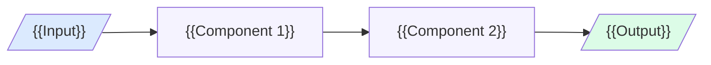
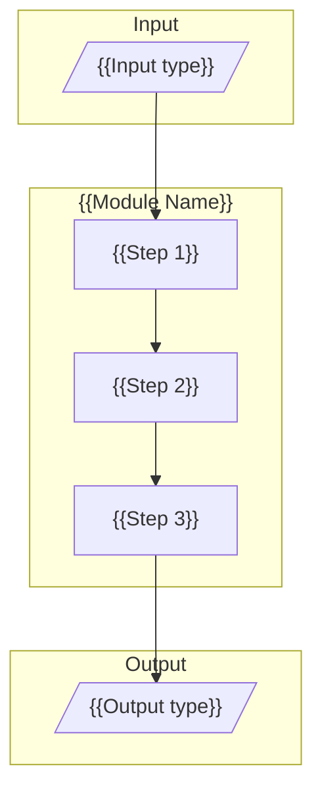

# MDX Template — Use-Case Description Page

Canonical structure for `guidance_layer/website/content/docs/use-cases/{slug}.mdx`.

Reference: `incident-reporting.mdx` (gold standard, 338 lines) and `purchase-order-processing.mdx` (463 lines).

---

## Frontmatter

```yaml
---
title: {{Use Case Display Name}}
description: {{One-sentence description for SEO and sidebar navigation}}
---
```

Only `title` and `description`. No other keys.

---

## Page Structure

### Opening (before first H2)

```markdown
# {{Use Case Display Name}} Generic Use Case (Cross-Cutting Use Case)

{{1–2 sentence business context. What problem does this solve? Who benefits?}}
```

If a live demo exists, add immediately after the intro:

```mdx
<Callout type="info">
**Live Demo Available →** [Try it here](https://gaik-demo.2.rahtiapp.fi/)
</Callout>
```

---

## Section Order (all H2)

All sections are separated by `---` horizontal dividers. Order is fixed; omit optional sections only if the user explicitly declines them.

### 1. `## Business layer – use case specification` *(required)*

Structure:
```markdown
## Business layer – use case specification

{{1–2 sentences describing the business context and the problem being solved.}}

{{Optional: reference to canvas image}}

[Download the Use Case Canvas (PowerPoint) →](https://github.com/GAIK-project/gaik-toolkit/blob/main/...)

**Concrete example:**

The following fragments illustrate a typical {{use case}} scenario:

- {{Actor/role}}: {{what they do or say}}
- {{Actor/role}}: {{what they do or say}}
- {{Actor/role}}: {{what they do or say}}
```

Value outcomes (functional/informational/emotional):
```markdown
**Value outcomes:**

**Functional value:**
- {{faster, more accurate, more consistent outcome}}
- {{reduction in manual steps or errors}}

**Informational value:**
- {{better data, audit trail, structured knowledge}}

**Emotional value:**
- {{less stress, higher confidence, easier to use}}
```

---

### 2. `## Strategy layer – value evaluation and monitoring` *(optional; Coming Soon if not provided)*

```markdown
## Strategy layer – value evaluation and monitoring

{{Link to value evaluation framework + monitoring approach.}}

[Value Evaluation Framework →](https://github.com/GAIK-project/gaik-toolkit/...)
```

If not yet available:
```mdx
<Callout type="info">
Value evaluation and monitoring documentation is in preparation.
</Callout>
```

---

### 3. `## Implementation layer using No-Code` *(required)*

Written for non-technical business users. Three fixed sub-sections:

```markdown
## Implementation layer using No-Code

{{1–2 sentence overview of the no-code approach.}}

**What the business user sets up (once):**

{{Numbered or bulleted list of one-time setup steps.}}
1. {{Step}}
2. {{Step}}

**What happens in daily work:**

1. {{Step — what the user does}}
2. {{Step — what the AI does automatically}}

**Example of what the business gets out:**

{{1 sentence framing the output.}}

- {{Output field or result item}}
- {{Output field or result item}}
- {{Output field or result item}}
```

---

### 4. `## Implementation Layer Using Code-Based Method.` *(required)*

Note: the trailing period in the heading is intentional — match it exactly from the reference.

```markdown
## Implementation Layer Using Code-Based Method.



{{1–2 sentences naming the components and their roles.}}
```

---

### 5. `## Software Components` *(required)*

One `###` per component, in pipeline order.

```markdown
## Software Components

### 1. {{ComponentName}}

{{2–3 sentences describing what this component does, its inputs, and its outputs.}}

```mermaid
graph LR / TD
  ...
```

```python
from gaik.software_components.{{module}} import {{ClassName}}, get_openai_config

config = get_openai_config(use_azure=True)
{{component}} = {{ClassName}}(api_config=config)
result = {{component}}.{{main_method}}(...)
print(result.{{output_field}})
```

> 📁 [Source →](https://github.com/GAIK-project/gaik-toolkit/tree/main/implementation_layer/src/gaik/software_components/{{module}})

### 2. {{ComponentName}}

...
```

---

### 6. `## Defining What to Extract: User Requirements` *(extraction use cases only; omit otherwise)*

```markdown
## Defining What to Extract: User Requirements

{{1–2 sentences explaining what plain-language requirements do.}}

```
{{Plain-text requirements spec — field names and descriptions, one per line}}
```

Output rules:
- {{Rule 1}}
- {{Rule 2}}
```

---

### 7. `## Software Module: {{ModuleName}}` *(optional; include if a combined GAIK module is used)*

```markdown
## Software Module: {{ModuleName}}



{{Prose: inputs, outputs, and what the module does.}}

> 📁 [Module →](https://github.com/GAIK-project/gaik-toolkit/tree/main/implementation_layer/src/gaik/software_modules/{{module}})
> 📁 [Examples →](https://github.com/GAIK-project/gaik-toolkit/tree/main/implementation_layer/examples/software_modules/{{module}})
```

---

### 8. `## Adaptable to Other Domains` *(required)*

```markdown
## Adaptable to Other Domains

The same pipeline can be applied to:
- **{{Domain}}** — {{one-sentence description}}
- **{{Domain}}** — {{one-sentence description}}
- **{{Domain}}** — {{one-sentence description}}
```

---

### 9. `## Evaluation Methods` *(required; Coming Soon if no eval page exists)*

```markdown
## Evaluation Methods

### {{Evaluator Name}} Evaluation

{{1–2 sentences describing what is evaluated and how.}}

[Evaluation details →](/toolkit/evals/{{eval-slug}})
[Evaluation code →](https://github.com/GAIK-project/gaik-toolkit/tree/main/implementation_layer/eval_methods/{{eval_folder}})
```

If no evaluation exists yet:
```mdx
<Callout type="warn">
**Coming Soon:** Evaluation methods for this use case are under development.
</Callout>
```

---

### 10. `## Related Resources` *(required)*

Always the last section. 3-column Markdown table:

```markdown
## Related Resources

| Resource | Link | Notes |
|----------|------|-------|
| {{Resource name}} | [GitHub →](https://github.com/GAIK-project/gaik-toolkit/tree/main/...) | {{brief note}} |
| {{Resource name}} | [Docs →](/toolkit/...) | {{brief note}} |
```

Typical rows to include:
- Source code for each component
- Example scripts
- Eval folder (if exists)
- Demo link (if exists)
- Related use-case pages

---

## Formatting Rules

| Rule | Detail |
|------|--------|
| Dividers | `---` between every H2 section |
| Callout: info | Demo links, helpful tips, in-preparation notes |
| Callout: warn | Coming Soon stubs only |
| Code blocks | `python` for Python, plain (no lang tag) for requirements specs |
| Images | `` — file must exist in `guidance_layer/website/public/images/` |
| GitHub links | Pattern: `https://github.com/GAIK-project/gaik-toolkit/tree/main/[path]` |
| Internal links | Pattern: `/toolkit/evals/[slug]` or `/use-cases/[slug]` |
| H3 numbering | Number components: `### 1. ComponentName`, `### 2. ComponentName` |
| Trailing period | `## Implementation Layer Using Code-Based Method.` — keep the period (matches reference) |
| Coming Soon text | Must start with `**Coming Soon:**` inside the Callout |
