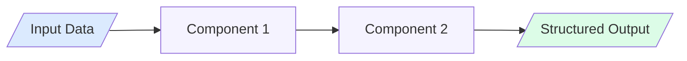
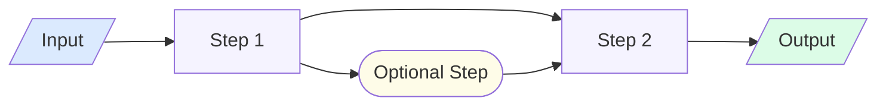
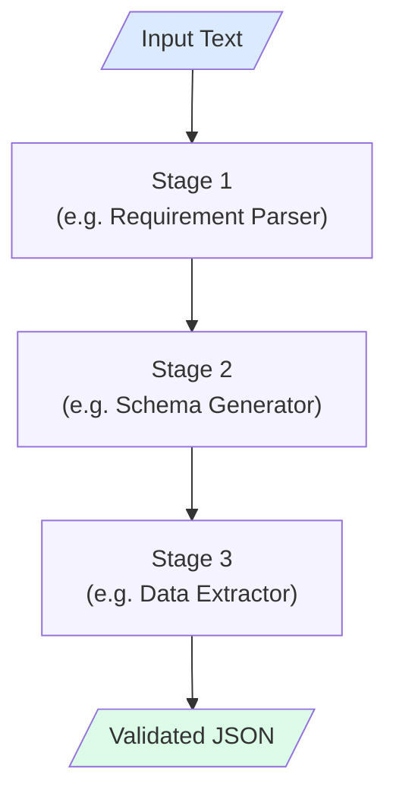
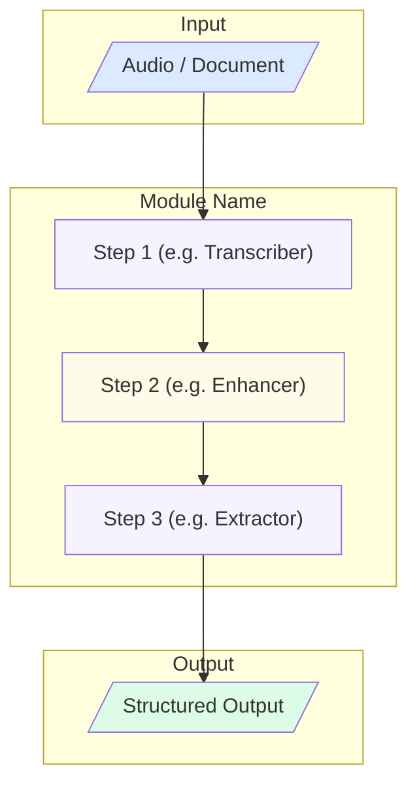
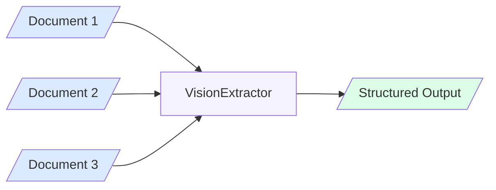

# Mermaid Diagram Guide — GAIK Use-Case Pages

All Mermaid diagrams in GAIK use-case pages follow a consistent color scheme, orientation convention, and node-labeling style. Follow this guide exactly when generating diagrams.

---

## Color Palette

| Role | Color | Hex | Usage |
|------|-------|-----|-------|
| Input | Blue | `#dbeafe` | Source data: audio files, documents, user queries, raw text |
| Processing | Purple | `#f5f3ff` | GAIK components: Transcriber, Extractor, Parser, Matcher |
| Output | Green | `#dcfce7` | Final results: structured JSON, report, search results, PDF |
| Intermediate | Yellow | `#fefce8` | Optional steps or intermediate data: enhanced transcript, matched items |

Apply colors with `style NodeId fill:#hex` on separate lines after the graph definition.

---

## Orientation Rules

| Use when | Orientation | Directive |
|----------|-------------|-----------|
| Linear pipeline: A → B → C → D | Left-to-right | `graph LR` |
| Multi-step internal process with sub-phases | Top-to-bottom | `graph TD` |
| Module with grouped subgraphs | Top-to-bottom | `graph TD` with `subgraph` blocks |

**Default to LR** for simple component pipelines. Use TD only when the pipeline has branching, grouping, or more than ~5 nodes.

---

## Node Shape Conventions

| Shape | Syntax | Usage |
|-------|--------|-------|
| Rounded rectangle | `A["Label"]` | Processing steps (components) |
| Stadium / pill | `A(["Label"])` | Optional or alternative steps |
| Cylinder | `A[("Label")]` | Databases, vector stores |
| Parallelogram | `A[/"Label"/]` | Input or output data |

Use `[/"Label"/]` for all inputs and outputs so they are visually distinct from processing components.

---

## Label Conventions

- **Processing nodes**: use the GAIK class name — `"Transcriber"`, `"DataExtractor"`, `"VisionExtractor"`, `"SchemaGenerator"`
- **Input nodes**: describe the data type — `"Audio File"`, `"PDF Document"`, `"Field Notes"`
- **Output nodes**: describe the result — `"Structured JSON"`, `"Incident Report"`, `"Priced Sales Order"`
- Keep labels short (1–4 words). Use Title Case.

---

## Diagram Skeletons

### 1. Linear Pipeline (LR) — most common

### 2. Pipeline with Optional Step (LR)

### 3. Internal Component Pipeline (TD)

Use for a single component that has multiple internal stages:

### 4. Software Module with Subgraphs (TD)

Use for GAIK software modules (`AudioToStructuredData`, `DocumentsToStructuredData`):

### 5. Multi-Input Pipeline (LR)

Use when multiple document types feed into the same extractor:

---

## Syntax Rules

- **Node IDs**: use short alphanumeric names (`A`, `B`, `C1`, `DB`) — no spaces, no special characters
- **Labels with spaces**: always wrap in double quotes: `A["My Label"]`
- **Newlines in labels**: use `\n` inside quoted labels: `A["Stage 1\nSub-label"]`
- **Arrow syntax**: `-->` (no spaces before/after unless between nodes)
- **Subgraph syntax**: `subgraph "Title"` / `end` — title in quotes if it contains spaces
- **Style lines**: one per node, placed after all arrows: `style A fill:#dbeafe`
- **No semicolons**: MDX Mermaid blocks do not require semicolons
- **Close all subgraphs**: every `subgraph` block must have a matching `end`

---

## Common Mistakes to Avoid

| Mistake | Fix |
|---------|-----|
| Node ID reused for two different nodes | Use unique IDs: `A1`, `A2` |
| Label with unquoted special characters | Wrap in double quotes |
| Subgraph not closed | Add `end` after last node in subgraph |
| Style applied before graph body | Always put `style` lines after all arrow definitions |
| Using `graph` instead of `graph LR` or `graph TD` | Always specify direction |
