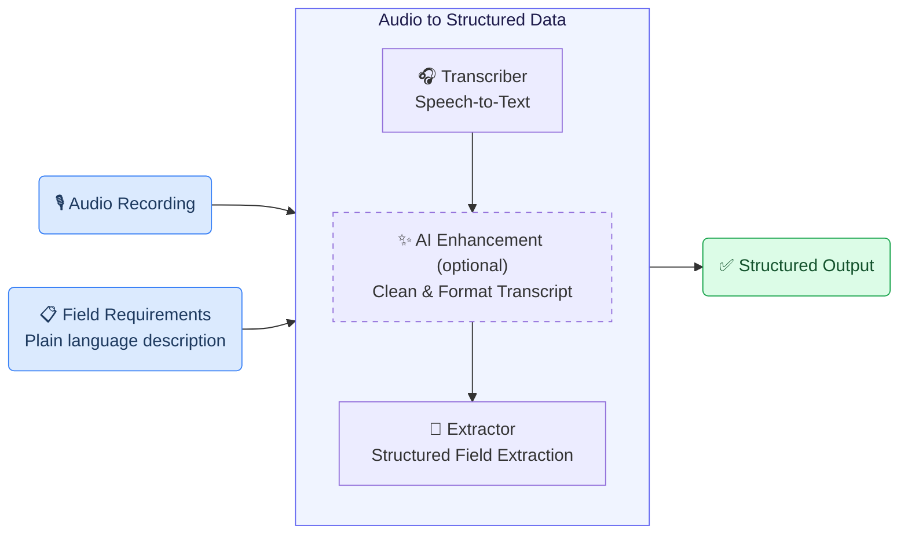
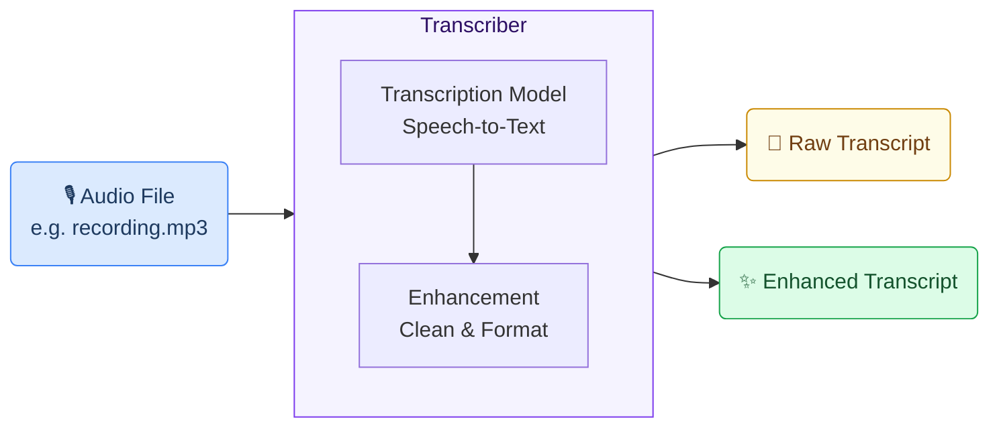
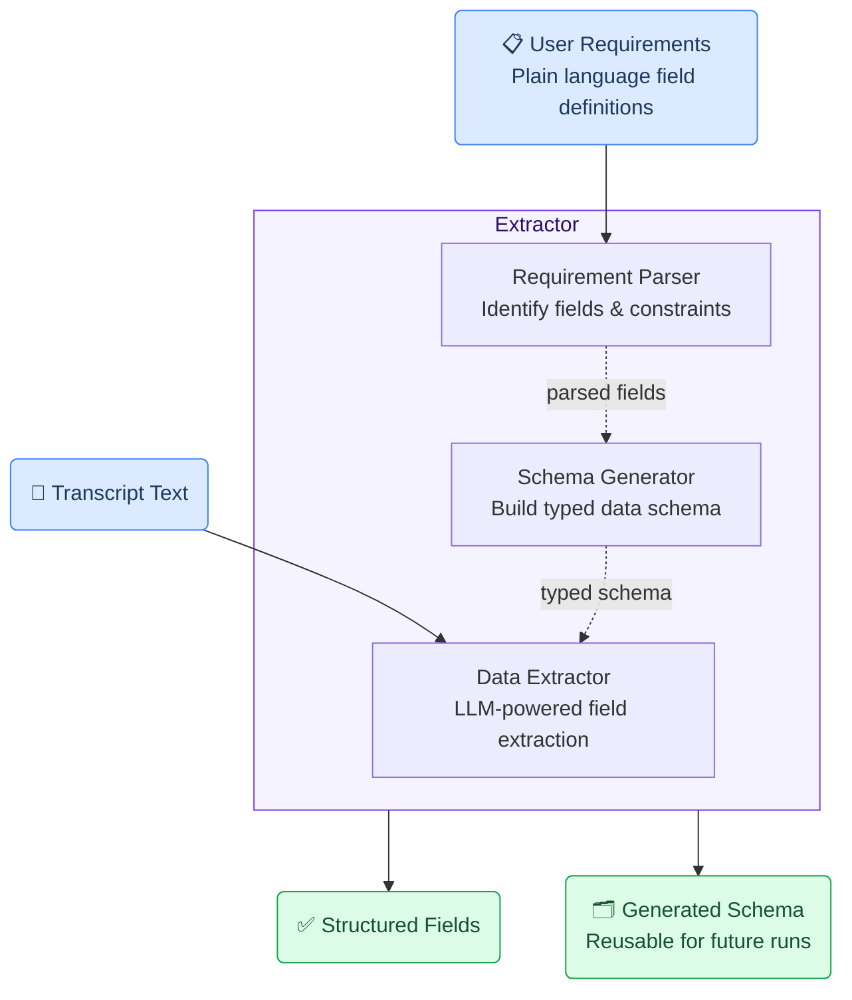
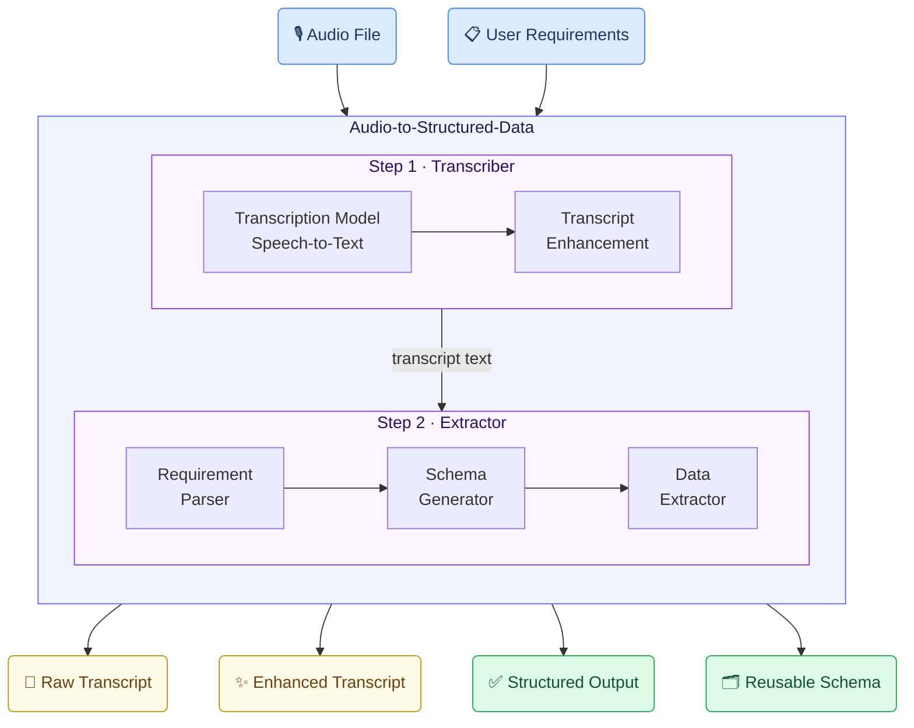

# Mermaid Diagram Guide — GAIK Use-Case Pages

All Mermaid diagrams in GAIK use-case pages use the `flowchart` keyword (not `graph`), include emojis in node labels, and apply `stroke:` colors in style lines. Follow `incident-reporting.mdx` as the exact reference for diagram style.

---

## Keyword

Always use `flowchart`, never `graph`:

```
flowchart LR   ← linear pipelines
flowchart TD   ← multi-step internal pipelines, module diagrams
```

---

## Color Palette

| Role | Fill | Stroke | Text | Usage |
|------|------|--------|------|-------|
| **Input** | `#dbeafe` | `#3b82f6` | `#1e3a5f` | Audio files, documents, user requirements |
| **Processing subgraph** | `#f5f3ff` | `#7c3aed` | `#2e1065` | Individual components (Transcriber, Extractor) |
| **Module wrapper** | `#f0f4ff` | `#6366f1` | `#1e1b4b` | Top-level software module container |
| **Nested step subgraph** | `#faf5ff` | `#9333ea` | `#2e1065` | Step 1, Step 2 inside a module |
| **Final output** | `#dcfce7` | `#16a34a` | `#14532d` | Structured results, validated data, schemas |
| **Intermediate output** | `#fefce8` | `#ca8a04` | `#713f12` | Raw transcript, partially processed data |

Apply as: `style NodeId fill:#dbeafe,stroke:#3b82f6,color:#1e3a5f`

Optional steps use: `style NodeId stroke-dasharray: 5 5`

---

## Node Emojis

Use emojis to make nodes visually scannable — match these conventions:

| Emoji | Use for |
|-------|---------|
| 🎙️ | Audio input, voice recording |
| 📋 | Configuration, requirements, field specs |
| 📄 | Text output, raw transcript |
| ✨ | Enhanced/processed output |
| ✅ | Final structured output, validated result |
| 🗂️ | Schema, reusable artifact |
| 🤖 | AI/LLM processing step |
| 🎧 | Transcription model step |

---

## Orientation Rules

| Use when | Directive |
|----------|-----------|
| Linear A → B → C pipeline | `flowchart LR` |
| Component with internal stages | `flowchart TD` inside a subgraph |
| Module with multiple sub-components | `flowchart TD` with nested subgraphs |

---

## Node Shape Conventions

| Shape | Syntax | Usage |
|-------|--------|-------|
| Rounded rectangle | `A("Label")` | All nodes — preferred throughout |
| Bracket rectangle | `A["Label"]` | Internal sub-step nodes inside subgraphs |

Use `("Label")` for inputs/outputs and `["Label"]` for internal processing steps.

---

## Diagram Skeletons

### 1. Module Overview — `flowchart LR` with subgraph (Code-Based section)



### 2. Component with Two Outputs — `flowchart LR` (Software Components section)



### 3. Multi-Step Component — `flowchart TD` (Software Components section)



### 4. Full Module — `flowchart TD` with nested subgraphs (Software Module section)



---

## Syntax Rules

- **Always** `flowchart LR` or `flowchart TD` — never just `flowchart` or `graph`
- **Node IDs** — short alphanumeric: `A`, `B`, `IN1`, `RP`, `MOD`
- **Labels** — wrap in `("...")` for inputs/outputs, `["..."]` for internal steps
- **Line breaks in labels** — use `<br/>` inside quoted labels
- **`direction TB`** — add inside every subgraph to control internal flow direction
- **Style lines** — one per node, always after all arrows
- **Subgraph syntax** — `subgraph ID["Display Label"]` ... `end`; title in quotes if it contains spaces
- **No semicolons** required
- **Optional steps** — use `stroke-dasharray: 5 5` in the style line

---

## Common Mistakes to Avoid

| Mistake | Fix |
|---------|-----|
| Using `graph LR` | Use `flowchart LR` |
| Missing stroke color in style | Always include both `fill:` and `stroke:` |
| Subgraph without `direction TB` | Add `direction TB` as first line inside subgraph |
| Node ID reused | Use unique IDs: `IN1`, `IN2`, `O1`, `O2` |
| Unclosed subgraph | Every `subgraph` block needs a matching `end` |
| Style applied before arrows | Put all `style` lines after all arrow definitions |
