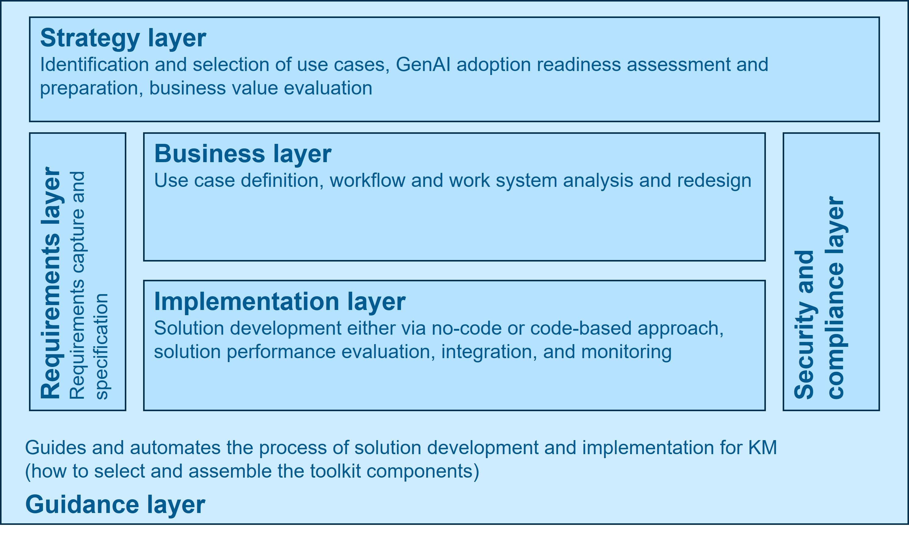

# GAIK – Generative AI Knowledge Management Toolkit

[](https://pypi.org/project/gaik/)


This is a generative AI toolkit of the GAIK project ([gaik.ai](https://gaik.ai)). It provides a complete set of components and guidance for building knowledge-centric GenAI solutions, from strategic directions to deployable implementations.

# Project Documentation

Project documentation is available at:

https://gaik-project.github.io/gaik-toolkit/

**Live Demo:** https://gaik-demo.2.rahtiapp.fi/

# Why the toolkit is needed

**Generative AI has significant potential to increase the productivity of knowledge work** 
- Example experiments: consultants using AI were significantly more productive – they completed 12.2% more tasks on average, and completed tasks 25.1% more quickly (Dell'Acqua, 2023) 
- Example cases from practice: Customer-support agents at a large firm selling business-process software demonstrated a 15% increase in productivity when assisted by generative AI (Brynjolfsson, 2025).

**However, tangible business value from Generative AI implementation projects is still limited**
- “only 26% of companies have advanced beyond the proof-of-concept stage to generate value” Source: BCG’s report (de Bellefonds et al, 2024). 
- “Despite $30–40 billion in enterprise investment into GenAI, 95% of organizations are getting zero return.” Source: MIT report (Challapally et al, 2025).

Adopting Generative AI and creating value from **it is especially challenging for small and medium-sized enterprises (SMEs)**, which lack the technical expertise and capabilities to implement GenAI solutions effectively. The literature review of Oldemeyer et al. (2024) identified the following three most frequent challenges for SMEs in the AI implementation in the industrial sector: knowledge, costs, and the low maturity level in digitalization.

# Overall approach
Companies can deal with GenAI challenges by combining reusable building blocks with clear guidelines.
Instead of designing solutions from scratch, teams assemble existing components and follow proven ways of working. 
This makes it easier to turn ideas into real results, while reducing implementation time, risk, and required resources, and improving overall solution quality.

# Toolkit Focus
The knowledge management perspective for structuring GenAI development and implementation activities.

The toolkit focuses on three core **knowledge processes** in organizations:
| Knowledge process | Description | Illustration |
|-----------|-------------|--------------|
| **Knowledge capture** | Extract needed information from business documents, videos, voice recordings, emails, and meeting recordings |  |
| **Knowledge access** | Intelligent access to organizational knowledge (document repositories, databases, wikis, CRMs) |  |
| **Knowledge synthesis** | Automatic generation of business reports, sales proposals, marketing materials, project proposals |  |

The following **generic use cases** are defined as the top priority at the moment:
| Knowledge process | Generic use cases |
|---|---|
| **Knowledge capture** | A. Incident reporting in industry (e.g., for equipment, buildings)<br>B. Creating construction site diaries<br>C. Creation of transcripts and closed captions in various languages for instructional videos and podcasts<br>D. … |
| **Knowledge access** | A. Customer assistant for complex products and services<br>B. Semantic audio and video search for medical instructions<br>C. Learning assistant |
| **Knowledge synthesis** | A. Sales proposal generation<br>B. Report preparation<br>C. … |


---

## Layer-Based Architecture

The GAIK Toolkit is organized into a layer-based architecture that spans from strategic planning to implementation and security:

| Layer | Purpose | Contents |
|-------|---------|----------|
| **Strategy Layer** | Identification and selection of use cases, GenAI adoption readiness assessment and preparation | Use case selection framework, AI maturity assessment tool, GenAI success canvas  |
| **Requirements Layer** | Requirements capture and specification | Requirement templates, test cases |
| **Business Layer** | Use case definition, workflow and work system analysis and redesign | GenAI product canvas, Workflow templates, Work systems definitions |
| **Implementation Layer** | Solution development either via no-code or code-based approach, integration, and monitoring | Reusable software components and modules for system development, (`gaik` code package), no-code assets, unit tests, deployment packages, connectors |
| **Evaluation Layer** | Evaluation of the business value of GenAI and of the technical quality of solution outputs | Value evaluation framework, Output evaluation methods (transcription, extraction, LLM-as-judge, RAG, report writing, translation) |
| **Security Compliance Layer** | Security policies and compliance frameworks | Security guidelines, compliance checks, audit trails |
| **Guidance Layer** | Guides and automates the process of solution development and implementation for KM (how to select and assemble building blocks) | Process and guide for GenAI solution implementation, Configuration wizard, Glossary |

This architecture ensures that GenAI solutions are built with proper governance, clear requirements, and comprehensive implementation support.




---

## Solution Configuration Wizard

The **GAIK Solution Configuration Wizard** is the Guidance Layer in action. It takes a plain-language description of a business problem and guides you — through a structured, multi-turn conversation — all the way to a validated, deployable GenAI solution.

### What the wizard produces

| Deliverable | Description |
|---|---|
| `use_case.blueprint.json` | Executable source of truth — components, artifacts, workflow steps, schemas, model settings |
| `workflow.bpmn` | BPMN 2.0 visual blueprint with swimlanes, gateways, and data objects for stakeholder review |
| `workflow.mmd` | Mermaid diagram (quick developer flow view) |
| `poc/` | Runnable proof of concept: `run_poc.py`, `requirements.txt`, schema, prompt, eval script |
| `docs/` | Documentation suite: GenAI product canvas, technical specification, user guide, developer guide, evaluation plan |

Everything is written to a directory you choose — nothing is written into the toolkit repository.

### How to run it

**Option 1 — Claude Code or Claude Desktop (recommended)**

```
/solution-wizard
```

Type this in a Claude Code session or Claude Desktop chat. The wizard guides you through the full workflow conversationally.

**Option 2 — Web chat (demo website)**

Open the [live demo](https://gaik-demo.2.rahtiapp.fi/) and navigate to **Solution Configuration Wizard**. Token-by-token streaming, generated files appear in the sidebar, downloadable as a `.zip`.

To run the demo locally:

```bash
cd implementation_layer/toolkit_demo_app
bun dev:all   # starts Next.js frontend + FastAPI backend
# open http://localhost:3000/solution-wizard
```

**Option 3 — Individual scripts (CLI)**

The wizard's deterministic scripts can be run independently:

```bash
cd implementation_layer/solution_wizard

# Validate an existing blueprint
python scripts/validate_blueprint.py --blueprint ~/my-use-case/use_case.blueprint.json

# Generate BPMN visual blueprint
python scripts/generate_bpmn.py --blueprint ~/my-use-case/use_case.blueprint.json --output-dir ~/my-use-case

# Scaffold a PoC from a validated blueprint
python scripts/scaffold_poc.py --blueprint ~/my-use-case/use_case.blueprint.json
```

### Full documentation

See [`implementation_layer/solution_wizard/README.md`](implementation_layer/solution_wizard/README.md) for the complete walkthrough, output directory layout, component registry, validation rules, and test suite.

---

## License

This project is licensed under the MIT License – see `LICENSE` for details.
