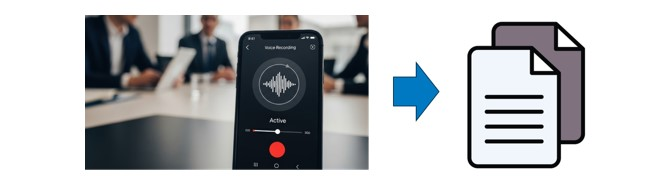
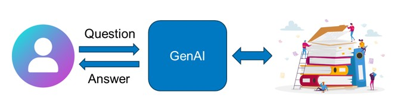
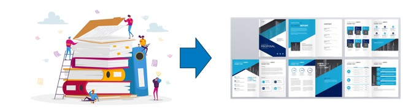
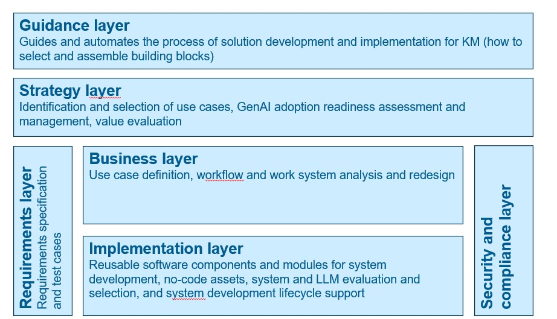

# GAIK – Generative AI Knowledge Management Toolkit

This is a generative AI toolkit of the GAIK project ([gaik.ai](https://gaik.ai)). It provides a complete set of components and guidance for building knowledge-centric GenAI solutions, from strategic directions to deployable implementations.

# Project Documentation

Project documentation is available at:

https://gaik-project.github.io/gaik-toolkit/

# Why the toolkit is needed

**Generative AI has significant potential to increase the productivity of knowledge work** 
- Example experiments: consultants using AI were significantly more productive – they completed 12.2% more tasks on average, and completed tasks 25.1% more quickly (Dell'Acqua, 2023) 
- Example cases from practice: Customer-support agents at a large firm selling business-process software demonstrated a 15% increase in productivity when assisted by generative AI (Brynjolfsson, 2025).

**However, tangible business value from Generative AI implementation projects is still limited**
- “only 26% of companies have advanced beyond the proof-of-concept stage to generate value” Source: BCG’s report (de Bellefonds et al, 2024). 
- “Despite $30–40 billion in enterprise investment into GenAI, 95% of organizations are getting zero return.” Source: MIT report (Challapally et al, 2025).

Adopting Generative AI and creating value from **it is especially challenging for small and medium-sized enterprises (SMEs)**, which lack the technical expertise and capabilities to implement GenAI solutions effectively. The literature review of Oldemeyer et al. (2024) identified the following three most frequent challenges for SMEs in the AI implementation in the industrial sector: knowledge, costs, and the low maturity level in digitalization.

# Overall approach
Companies can deal with GenAI challenges by combining reusable building blocks with clear guidelines.
Instead of designing solutions from scratch, teams assemble existing components and follow proven ways of working. 
This makes it easier to turn ideas into real results, while reducing implementation time, risk, and required resources, and improving overall solution quality.

# Toolkit Focus
The knowledge management perspective for structuring GenAI development and implementation activities.

The toolkit focuses on three core knowledge processes in organizational workflows:
| Capability | Description | Illustration |
|-----------|-------------|--------------|
| **Knowledge capture** | Extract needed information from business documents, videos, voice recordings, emails, and meeting recordings |  |
| **Knowledge access** | Intelligent access to organizational knowledge (document repositories, databases, wikis, CRMs) |  |
| **Knowledge synthesis** | Automatic generation of business reports, sales proposals, marketing materials, project proposals |  |

The toolkit focuses on three core knowledge processes in organizational workflows:
|-----------|-------------|--------------|
| **Knowledge capture** | Extract needed information from business documents, videos, voice recordings, emails, and meeting recordings |  |
| **Knowledge access** | Intelligent access to organizational knowledge (document repositories, databases, wikis, CRMs) |  |
| **Knowledge synthesis** | Automatic generation of business reports, sales proposals, marketing materials, project proposals |  |

If you want, I can also:

The toolkit focuses on three core knowledge processes in organizational workflows:

- **Knowledge extraction** – extracting structured information from unstructured content (documents, PDFs, web pages, audio transcripts).
- **Knowledge capture** – precise and accurate access of information from variety of data sources (internal documents, ERPs, Drives, etc.).
- **Knowledge generation** – using the structured representations (and underlying models) to produce summaries, reports, insights, and other human-readable outputs tailored to specific tasks.

Internally, these capabilities are exposed as:

- **Software components** – reusable utilities such as `Transcriber`, `SchemaGenerator`, `DataExtractor`, `VisionParser`, `PyMuPDFParser`, `DoclingParser`, and RAG components like `rag_parser_docling`, `rag_parser_vision`, `embedder`, `vector_store`, `retriever`, `answer_generator`
- **Software modules** – end‑to‑end pipelines combining the software components such as "audio → structured data", "documents → structured data", and "RAG workflow"

This repository provides a **complete layer-based architecture** ranging from strategic guidance and business requirements to implementation and security compliance.

> If the **Solution Wizard** decides *what* workflow you need, this toolkit provides the complete architecture to guide, design, implement, and deploy it.

---

## Layer-Based Architecture

The GAIK Toolkit is organized into a layer-based architecture that spans from strategic planning to implementation and security:

| Layer | Purpose | Contents |
|-------|---------|----------|
| **Guidance Layer** | Documentation, best practices, and development guides | CONTRIBUTING.md, documentation (software components & modules), project website |
| **Strategy Layer** | Identification and selection of use cases, GenAI adoption readiness assessment and preparation, business value evaluation | Strategic planning documents, decision frameworks |
| **Requirements Layer** | Requirements capture and specification | Requirement templates, user stories, acceptance criteria |
| **Business Layer** | Use case definition, workflow and work system analysis and redesign | GenAI product canvas, workflow templates, work systems definitions |
| **Implementation Layer** | Executable code, examples, and tests | Source code (`gaik` package), examples, unit tests, deployment packages, connectors |
| **Security Compliance Layer** | Security policies and compliance frameworks | Security guidelines, compliance checks, audit trails |

This architecture ensures that GenAI solutions are built with proper governance, clear requirements, and comprehensive implementation support.

## License

This project is licensed under the MIT License – see `LICENSE` for details.
