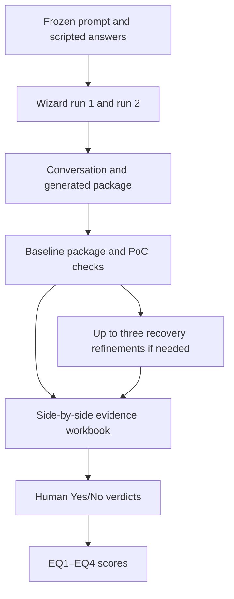

# UC01 evaluation package: Audio to structured incident reports

This package evaluates two independent runs of the GAIK Solution Configuration Wizard for one fixed use case. It contains the scenario oracle, the exact interaction script, a Finnish audio fixture, two run workspaces, deterministic package and execution checks, optional LLM-assisted evidence extraction, an Excel review workbook, and a scoring script.

The method is deliberately compact enough for a Demo/Tool paper:

- **EQ1:** Did the wizard capture the supplied requirements?
- **EQ2:** Did it select and configure a valid GAIK solution?
- **EQ3:** Did it generate a valid and traceable solution package?
- **EQ4:** Did the original, unmodified generated PoC build and run successfully?

Every EQ row has evidence next to the generated value and human verdict. The package does **not** extract or classify a failure type. If a verdict is `No`, the oracle value, generated value, and evidence are sufficient to show what did not match.

## 1. Evaluation design in one page

One frozen scenario is run through the wizard twice. In each run, the evaluator first supplies the run-specific output directory, then sends the same initial prompt and uses the same scripted answers. At every routine confirmation, the evaluator answers “Yes” and proceeds without changes. This prevents human correction from hiding wizard omissions or configuration errors.

After each run, the evaluator supplies:

1. `conversation.txt`: the complete wizard conversation.
2. `generated_package/`: the complete, unmodified output package.
3. Environment variables or credentials needed to execute the PoC. Secrets are never stored in this package.

The included `run_metadata.json` is a small execution configuration, not a provenance form. It already contains the default PoC setup command, run command, output patterns, and three-attempt recovery limit. The evaluator normally leaves it unchanged. The execution script records the actual resolved paths and commands in its evidence files.

The execution script adds:

5. `poc_execution.log`: human-readable commands, exit codes, output, and discovered files.
6. `poc_execution.json`: the same evidence in structured form.

The evidence collector compares these materials with the **one** `scenario_oracle.json`. It produces side-by-side rows for EQ1–EQ4 but leaves the final verdict blank. The evaluator reviews the evidence in Excel and enters `Yes` or `No` for each run. The scorer then calculates the four metrics.

EQ4 always uses the original, unmodified PoC. If that PoC fails to execute successfully, a separate recovery diagnostic allows the wizard up to three refinement attempts. It records `0` for original success, `1`–`3` for success after refinement, and `N/A` when the PoC never executes successfully after the third refinement. Recovery never changes the baseline EQ4 result.



## 2. Fixed UC01 scenario

Field technicians in a facility maintenance team report observed faults. They currently type what is broken, where it is, and how urgent it is into a maintenance system. The process is slow and can omit details. The target solution accepts Finnish voice messages, converts them into structured maintenance tickets, and requires supervisor review before a ticket is transferred to the maintenance system.

`initial_prompt.txt` contains the exact use-case description. The wizard normally asks for an output directory before this description. Select `runs/run_01/generated_package` for Run 1 and `runs/run_02/generated_package` for Run 2. If the interface uses another workspace, copy its complete, unmodified output into the corresponding folder after the run. No absolute path is stored in `run_metadata.json`. `scripted_answers.json` and `scripted_answers.md` contain the fixed answers supplied only when the wizard asks the relevant question. One global policy answers every routine confirmation with “Yes. Proceed without changes.”

`wizard_requirement_coverage.json` is the machine-checkable audit of the answer sheet against the wizard `SKILL.md` and `requirements.py` at the frozen GAIK commit. `wizard_requirement_coverage.md` presents the same audit for readers. The matrix covers all business, technical, target-output, optional business-process, and selection-relevant option categories defined by that wizard version.

The wizard can phrase or split clarifying questions adaptively. Therefore, “every possible question” means every defined requirement category and planned confirmation point, not every possible sentence. An unexpected adaptive question uses the fixed fallback below.

If the wizard asks an unanticipated question, use exactly:

> Not specified for this evaluation. If a value is required, record it as an explicit assumption for user confirmation.

Do not invent an answer for the sake of completing the wizard.

## 3. What the oracle contains

There is one oracle: `scenario_oracle.json`. It contains four groups of scored checks and one unscored diagnostic group:

| Group | What it defines | Scoring unit |
|---|---|---|
| `EQ1` | Atomic expected business, input, output, review, governance, and runtime requirements | One requirement fact |
| `EQ1_diagnostics` | Values that were not supplied and therefore must not be presented as confirmed requirements | Unscored transparency check |
| `EQ2` | Valid GAIK module/component, option, schema, workflow, and PoC-scope constraints | One configuration constraint |
| `EQ3` | Mandatory structural and traceability checks over the generated package | One package check; all must pass for the run |
| `EQ4` | Mandatory setup, execution, output, and fixture-acceptance checks for the original unmodified PoC | One execution check; all must pass for the run |

The PoC recovery result is a protocol diagnostic, not a second oracle or headline EQ. It is read from `poc_recovery.json`.

Each check contains:

- a stable `id`;
- a human-readable parameter;
- the oracle value;
- accepted semantic meaning where wording may differ;
- the source that established the oracle value;
- blueprint path hints or a named automated check;
- required evidence.

### What “path” means

A path identifies where a value is expected inside the generated JSON. For example:

- `technical_spec.language`
- `components.selected_modules`
- `workflow.steps.parameters.enhanced_transcript`

A path is an evidence locator, not a requirement that the wizard use identical field names. The evidence collector walks lists and nested objects, and the optional LLM step may align a semantically equivalent value at a different path. The human evaluator judges meaning, not string identity.

### GAIK configuration basis

The EQ2 oracle was checked against `GAIK-project/gaik-toolkit` at commit `79586c93ea3286f68acf3ad3810a370c4295fa01`. Relevant sources are recorded in `scenario_oracle.json`:

- the official wizard blueprint schema;
- the component registry;
- the component reference cards.

For UC01, the expected module-first solution is `AudioToStructuredData`. It covers transcription, Finnish transcript enhancement, schema generation, and data extraction. The Finnish input requires:

- `language = fi`;
- `enhanced_transcript = true`.

The executable PoC must not independently run a duplicate `Transcriber` → `TranscriptEnhancer` → `SchemaGenerator` → `DataExtractor` pipeline alongside the selected module. Those component names may still appear as internal decomposition or traceability evidence.

Provider and exact model names are not scored because the fixed user answers do not specify them. A concrete provider/model is acceptable as an implementation default or explicit assumption, but it must not be presented as a user-confirmed requirement.

## 4. How each EQ is measured

### EQ1 — Requirement capture

The oracle contains 42 atomic requirement facts. The expanded rows include the full wizard requirement model: stakeholders, success criteria, risks, data source and output language, domain vocabulary, provider/model preferences, output format, complete schema details, confidence handling, validation rules, business-process detail, evaluation requirements, and security scope. For each fact, the comparison workbook shows:

- the oracle parameter and expected meaning;
- the oracle source;
- the closest generated value from the conversation, blueprint, or package;
- exact evidence such as a conversation line or JSON path/value;
- a separate Run 1 and Run 2 verdict.

Enter `Yes` when the wizard output captures the requirement with equivalent meaning. Enter `No` when it contradicts or omits the requirement.

If the wizard misses a requirement, the row is **not removed**. The collector writes `NOT FOUND` and states which sources and paths were searched. The evaluator enters `No`. Because the row remains in the workbook, the omission stays in the recall denominator.

The metric is:

```
Requirement capture recall =
  pooled Yes verdicts across both runs
  ------------------------------------------------
  42 requirements × 2 runs
```

`EQ1_diagnostics` separately checks unsupported provider/model, retention-period, and SLA/scale commitments. These rows require evidence and verdicts but are not included in recall.

### EQ2 — Configuration constraint satisfaction

EQ2 compares the generated configuration against nine constraints:

1. knowledge-capture classification;
2. module-first `AudioToStructuredData` selection;
3. Finnish language configuration;
4. Finnish transcript enhancement;
5. no duplicate executable component pipeline;
6. connected schema and extraction requirements;
7. correct position of the supervisor review gate;
8. sufficient review inputs;
9. CLI and JSON PoC scope.

Evidence can come from the blueprint, generated schema/prompt/configuration, and PoC source. The metric is:

```
Configuration constraint satisfaction =
  pooled Yes verdicts across both runs
  ------------------------------------------------
  9 constraints × 2 runs
```

### EQ3 — Valid solution package

EQ3 is not measured only from the generated JSON. It combines the blueprint with the actual files in `generated_package/`.

| Check | Evidence source |
|---|---|
| Blueprint exists and parses | File path, size, JSON parser result |
| Official wizard validation | Exact command, exit code, validator output |
| Artifact-flow consistency | Blueprint steps, artifacts, dependencies, and producer links |
| Mermaid workflow | File existence, size, and workflow-step coverage |
| BPMN workflow | XML parser result and blueprint-to-BPMN mapping/identifier coverage |
| PoC scaffold | Entrypoint, dependencies, configuration, prompt, and schema assets |
| Documentation | Non-empty solution documents and PoC usage instructions |
| Traceability | Blueprint traceability entries linked to selected GAIK assets |

The human enters a verdict for every check. A run is a valid solution package only if all eight EQ3 checks are `Yes`.

```
Valid solution package rate =
  number of runs in which all EQ3 checks are Yes
  ------------------------------------------------
  2 runs
```

The official validator result is important evidence. The collector first looks for a `commands.blueprint_validator` override, then `GAIK_SOLUTION_WIZARD_ROOT`, nearby standard GAIK repository locations, and a `gaik-validate-blueprint` executable. If no official validator is available, the collector marks that row `needs_review` rather than pretending validation passed; all other EQ3 checks still run.

### EQ4 — PoC execution

`run_poc_evaluation.py` first executes the original unmodified PoC in its own directory. It records:

- setup command and exit code;
- run command, input fixture hash, and exit code;
- standard output and error;
- new or modified output files;
- JSON parsing results and output contents.

The four mandatory checks are:

1. setup/build/import succeeds;
2. end-to-end execution over `incident_report_fi.wav` succeeds;
3. a non-empty JSON output is generated and parses;
4. output preserves the expected fixture facts and does not silently invent unsupported facts.

The expected facts are in `fixtures/expected_ticket.json`. Field names may differ, so the last comparison is semantic and must be reviewed by the evaluator. The optional LLM step can align generated and expected fields, but cannot enter the verdict.

```
PoC execution success rate =
  number of runs in which all EQ4 checks are Yes
  ------------------------------------------------
  2 runs
```

### PoC recovery diagnostic

If the original PoC fails one or more deterministic execution conditions, return the recorded execution evidence to the wizard. Do not provide corrective code or new requirements. The wizard may refine the PoC at most three times, and each refined package is saved as a separate snapshot.

The diagnostic is:

- `0`: the original PoC executed successfully;
- `1`, `2`, or `3`: first successful execution occurred after that many refinements;
- `N/A`: the PoC remained unsuccessful after refinement attempt 3.

There can therefore be up to four executions: one original execution and three refinements. Stop immediately after the first successful execution. The refined executions are not used to recalculate EQ4.

## 5. Evidence and verdict policy

Every final verdict must be supported by adjacent evidence.

| EQ | Minimum useful evidence |
|---|---|
| EQ1 | Oracle source plus conversation line and/or generated JSON path/value |
| EQ2 | Oracle constraint plus module/component/option/workflow value and PoC file path where relevant |
| EQ3 | File path, parser/validator result, counts, mapping, or manifest evidence |
| EQ4 | Command, fixture hash, exit code, log excerpt, output path, parser result, and expected/generated value comparison |

The `Auto aid` column may show `pass`, `fail`, or `needs_review`. It is a convenience for the evaluator. It is not copied into the final verdict.

Use only:

- `Yes`: generated result satisfies the oracle meaning and evidence supports it;
- `No`: generated result is absent, contradictory, invalid, incomplete, or unsupported.

There is no “partly” verdict. If one oracle row contains two inseparable conditions, both must be satisfied for `Yes`. Evaluator notes can explain a close case.

## 6. Directory structure

```text
UC01_audio_incident_evaluation/
├── README.md
├── initial_prompt.txt
├── scenario_oracle.json
├── scripted_answers.json
├── scripted_answers.md
├── wizard_requirement_coverage.json
├── wizard_requirement_coverage.md
├── requirements-optional.txt
├── fixtures/
│   ├── incident_report_fi.wav
│   ├── incident_report_fi.txt
│   ├── expected_ticket.json
│   └── fixture_manifest.json
├── prompts/
│   └── evidence_extraction_prompt.md
├── schemas/
│   ├── evaluation_results.schema.json
│   ├── poc_execution.schema.json
│   ├── poc_recovery.schema.json
│   ├── refinement_attempt_metadata.schema.json
│   ├── run_metadata.schema.json
│   ├── scenario_oracle.schema.json
│   └── scripted_answers.schema.json
├── scripts/
│   ├── build_workbook.mjs
│   ├── collect_evidence.py
│   ├── package_checks.py
│   ├── run_poc_evaluation.py
│   ├── score_workbook.mjs
│   └── validate_evaluation_package.py
├── templates/
│   ├── README.md
│   └── UC01_comparison_template.xlsx
├── runs/
│   ├── run_01/
│   │   ├── run_metadata.json
│   │   ├── poc_recovery.json
│   │   ├── generated_package/
│   │   └── refinement/
│   │       ├── README.md
│   │       ├── attempt_01/
│   │       ├── attempt_02/
│   │       └── attempt_03/
│   └── run_02/
│       ├── run_metadata.json
│       ├── poc_recovery.json
│       ├── generated_package/
│       └── refinement/
└── results/
    └── README.md
```

After evaluation, each run directory will additionally contain:

```text
run_0X/
├── conversation.txt
├── poc_execution.log
├── poc_execution.json
├── poc_recovery.json
└── evaluation_results.json
```

`generated_package/` must contain the wizard's complete output, normally including:

```text
generated_package/
├── use_case.blueprint.json
├── workflow.bpmn
├── workflow.mmd
├── poc/
└── docs/
```

When recovery is required, every used attempt directory contains:

```text
attempt_0N/
├── attempt_metadata.json
├── feedback_to_wizard.txt
├── conversation.txt
├── generated_package/
├── poc_execution.log
└── poc_execution.json
```

## 7. Step-by-step execution

Run commands from the package root.

### Step 1 — Validate the static package

The final ZIP has already been validated, but run this after modifying the oracle, scripts, or fixtures:

```bash
python scripts/validate_evaluation_package.py
```

This checks required files, unique check IDs, JSON consistency, fixture hashes, and Python syntax.

### Step 2 — Conduct wizard run 1

1. When the wizard asks for its output directory, select `runs/run_01/generated_package/`. If it requires an absolute path, use the operating system's **Copy as path** action on that folder.
2. When the wizard asks for the use-case description, send `initial_prompt.txt` verbatim.
3. Use `scripted_answers.md` only when the matching requirement question is asked.
4. At every routine confirmation, answer “Yes. Proceed without changes.”
5. Do not correct or refine any wizard proposal before the original PoC is executed.
6. Save the complete transcript as `runs/run_01/conversation.txt`.
7. If the wizard used another workspace, copy its complete, unmodified output to `runs/run_01/generated_package/`.

Repeat the same procedure for `run_02`.

Do not reuse a conversation between runs. Do not reveal the oracle to the wizard.

### Requirement-completeness caveat

The cited wizard implementation treats explicit values such as “unknown,” “none,” and “not specified” as answered. Its reported completeness count therefore measures whether required categories are represented, not whether every category contains a substantive constraint. This package makes such values explicit and preserves them in the conversation and oracle instead of silently filling them.

### Step 3 — Check the PoC execution configuration

Commands are JSON argument arrays, not shell strings. This avoids shell-quoting ambiguity.

Normally, do not edit `run_metadata.json`. Its defaults expect the standard GAIK audio template:

```json
"poc": {
  "setup_command": ["python", "-m", "pip", "install", "-r", "requirements.txt"],
  "run_command": ["python", "run_poc.py", "--input", "{fixture}"],
  "output_globs": ["output/**/*.json", "output/*.json"]
}
```

`{fixture}` is replaced with the absolute path of `fixtures/incident_report_fi.wav`. Adjust only the command and output glob when the generated entrypoint differs. Do not edit the generated PoC to make the test pass.

Use an isolated Python environment for each run when possible. Supply API credentials through environment variables or an external `.env` that is excluded from the evaluation ZIP.

The official blueprint validator needs no manual configuration when it is available in a nearby GAIK checkout or through `GAIK_SOLUTION_WIZARD_ROOT`. An advanced user may still add an optional `commands.blueprint_validator` argument array to `run_metadata.json` as an explicit override.

### Step 4 — Execute each original PoC

```bash
python scripts/run_poc_evaluation.py --run-dir runs/run_01 --attempt 0
python scripts/run_poc_evaluation.py --run-dir runs/run_02 --attempt 0
```

The script writes both structured and readable execution evidence and updates `poc_recovery.json`. A non-zero script exit means one of the deterministic setup, run, or JSON-output checks did not pass; evidence is still preserved. These original execution records are the only records used for EQ4.

### Step 5 — Run recovery refinements when needed

Skip this step when the original PoC succeeds. Otherwise:

1. Open `runs/run_0X/refinement/attempt_01/feedback_to_wizard.txt`.
2. Append the relevant contents of the original `poc_execution.log`.
3. Send that evidence to the wizard without adding corrective code or new requirements.
4. Save the complete refinement conversation and refined package snapshot.
5. Run the attempt:

```bash
python scripts/run_poc_evaluation.py --run-dir runs/run_01 --attempt 1
```

If it fails, repeat with attempts 2 and 3:

```bash
python scripts/run_poc_evaluation.py --run-dir runs/run_01 --attempt 2
python scripts/run_poc_evaluation.py --run-dir runs/run_01 --attempt 3
```

The script enforces sequential execution and refuses another refinement after a successful attempt. After the third failure, `poc_recovery.json` records `"refinement_attempts_to_success": "N/A"`.

### Step 6 — Collect EQ1–EQ4 evidence and recovery data

Deterministic mode uses blueprint path hints, conversation keyword excerpts, package parsers, and execution records:

```bash
python scripts/collect_evidence.py --run all
```

For better semantic alignment of conversation wording and blueprint values, install the optional OpenAI package, set `OPENAI_API_KEY`, and use:

```bash
python -m pip install -r requirements-optional.txt
python scripts/collect_evidence.py --run all --use-llm --model gpt-5-mini
```

The LLM receives the oracle check, numbered conversation, generated blueprint, and relevant PoC excerpts. It returns only a generated value and evidence. It is explicitly instructed not to return a verdict.

The script writes:

- `runs/run_01/evaluation_results.json`;
- `runs/run_02/evaluation_results.json`;
- `results/comparison_data.json`.

### Step 7 — Build the populated Excel workbook

The workbook scripts use `@oai/artifact-tool`. If it is not already installed in the active Node environment, install it locally and run:

```bash
npm install --no-save --no-package-lock @oai/artifact-tool
node scripts/build_workbook.mjs \
  results/comparison_data.json \
  results/UC01_comparison.xlsx
```

In a managed coding environment that already provides the package, use that environment's Node executable and module-resolution procedure instead of installing it again.

The workbook contains:

- Instructions;
- Summary;
- EQ1 Requirements;
- EQ1 Diagnostics;
- EQ2 Configuration;
- EQ3 Package;
- EQ4 Execution;
- PoC Recovery.

Each EQ sheet shows oracle evidence, Run 1 evidence, Run 1 verdict, Run 2 evidence, and Run 2 verdict side by side. Verdict cells have a `Yes`/`No` dropdown.

### Step 8 — Human review

Open `results/UC01_comparison.xlsx` and work row by row:

1. Read the oracle expected value.
2. Inspect the generated value.
3. Verify the cited evidence directly in the conversation, JSON, artifact, log, or output.
4. Enter `Yes` or `No`.
5. Add a note when the wording differs substantially or the case is close.

Do not fill verdicts only from the `Auto aid` column.

### Step 9 — Calculate the final scores

After every scored Run 1 and Run 2 verdict is complete:

```bash
node scripts/score_workbook.mjs \
  results/UC01_comparison.xlsx \
  results/UC01_scores.json
```

The scorer refuses to report a complete evaluation while required verdicts are blank. It writes per-run and combined values for EQ1–EQ4 and copies the unscored PoC recovery diagnostic into `UC01_scores.json`.

## 8. The Finnish execution fixture

`fixtures/incident_report_fi.wav` is a 22-second synthetic Finnish recording generated offline from `incident_report_fi.txt`. It describes:

- reporter: Matti Virtanen;
- asset: pump P-17;
- location: boiler room B2;
- fault: pump leak;
- date and time: 26 July 2026, 09:30;
- urgency: high;
- actions: area marked and pump stopped.

`expected_ticket.json` stores those facts in a comparison-friendly form. It also names unsupported facts that must not be silently created, such as repair cost or root cause.

The fixture is suitable for a repeatable smoke test. It is not evidence that the PoC is robust to real facility noise, accents, microphone variation, or longer messages. Those concerns are outside this compact wizard evaluation.

## 9. Modifying the package with a coding assistant

A coding assistant should preserve these invariants:

1. Keep one frozen oracle per use case.
2. Keep initial prompt and scripted answers separate from generated run evidence.
3. Never remove an oracle row because the wizard omitted it.
4. Keep `human_verdict` empty during evidence extraction.
5. Keep final verdict choices limited to `Yes` and `No`.
6. Do not turn `automatic_result` into the final verdict.
7. Do not add failure-type classification unless the study design is explicitly changed.
8. Keep every EQ row's evidence adjacent in the workbook.
9. Keep EQ1 diagnostics out of the headline EQ1 denominator.
10. Preserve the all-mandatory-checks rule for EQ3 and EQ4.
11. Preserve the original execution as the only EQ4 evidence source.
12. Permit at most three sequential refinement attempts and stop after first success.
13. Record `N/A` only when all three refinement attempts are unsuccessful.

### Adding or changing an oracle check

1. Edit the appropriate list in `scenario_oracle.json`.
2. Give the check a unique stable ID.
3. State one verifiable condition.
4. Add a source and either `blueprint_hints` or `automated_check`.
5. If the fixed answer establishes the value, update `scripted_answers.json` and its `supports` list.
6. Run `validate_evaluation_package.py`.
7. Regenerate the workbook template.

Avoid combining unrelated conditions into one row. Atomic rows make omissions and evidence clearer.

### Adapting to another use case

Copy the whole package and change:

- scenario ID and title;
- initial prompt;
- scripted answers;
- oracle EQ1 and EQ2 checks;
- fixture and expected output;
- any PoC command defaults;
- fixture-specific EQ4 acceptance evidence.

EQ3 can usually be reused because it checks the common GAIK package structure. The workbook builder reads check lists dynamically, so row counts do not need to be hard-coded.

### Updating for a new GAIK version

Recheck:

- blueprint schema;
- component registry;
- component reference cards;
- official validator command;
- generated package manifest;
- module option names.

Update `gaik_basis.verified_commit` and the affected EQ2 checks. Do not silently apply a newer registry to results produced with an older wizard.

## 10. Aggregation beyond UC01

For this use case, the combined score pools the two runs:

- EQ1 and EQ2 pool row-level numerators and denominators;
- EQ3 and EQ4 count passing runs out of two.

Report recovery separately as counts of runs that were successful originally, recovered within three refinements, or never executed successfully. Do not average `N/A` with numeric refinement counts and do not include recovery in the EQ4 rate.

When all four paper use cases are complete, report both the use-case scores and a macro-average across the four use cases:

```
Overall EQ score =
  (UC01 score + UC02 score + UC03 score + UC04 score) / 4
```

Do not average percentages across rows with different meanings and call the result precision or F1. This package implements the four agreed measures: requirement capture recall, configuration constraint satisfaction, valid solution package rate, and PoC execution success rate.

## 11. Troubleshooting

### Evidence says `NOT FOUND`, but the value exists

First inspect the cited blueprint path hints and conversation lines. If the value uses a different schema location, run the LLM-assisted collector or improve that check's `blueprint_hints`. Do not immediately change the oracle meaning.

### Official validator is `needs_review`

Make the GAIK wizard directory available near the evaluation package, set `GAIK_SOLUTION_WIZARD_ROOT`, or add an optional `commands.blueprint_validator` override. Rerun evidence collection.

### The PoC generated output outside `output/`

For the original execution, change only `poc.output_globs` in `run_metadata.json`. For a refinement attempt, change only the corresponding `attempt_metadata.json`. Rerun that same attempt and keep the generated PoC snapshot unchanged.

### The PoC requires a different CLI argument

Change `poc.run_command`. Keep `{fixture}` so the recorded fixture is used.

### The generated output is not JSON

For UC01 that is an EQ4 failure unless the generated package also produces the required machine-readable JSON at another path. Point `output_globs` to that path and rerun.

### Workbook formulas are blank

Blank scores mean one or more required human verdicts are blank. Complete both verdict columns and run the scorer.

### Secrets appear in logs

Stop and redact only the secret value from the copied evaluation evidence. Do not alter commands, exit codes, or functional output. Never put secrets into `run_metadata.json`, the workbook, or the ZIP.

## 12. Reproducibility checklist

Before archiving a completed UC01 evaluation, verify:

- [ ] Both runs used the same initial prompt and scripted answers.
- [ ] Every routine confirmation was answered “Yes” without correction.
- [ ] Each conversation is complete.
- [ ] Each original generated package is complete and unmodified.
- [ ] Default PoC commands are valid, or only the necessary `poc` fields in `run_metadata.json` were adjusted.
- [ ] Official validator evidence is present.
- [ ] Both PoCs were executed with the included fixture.
- [ ] Both execution JSON and log files are present.
- [ ] `poc_recovery.json` records `0`, `1`, `2`, `3`, `N/A`, or an unfinished status supported by execution evidence.
- [ ] No run contains more than three refinement attempts.
- [ ] No refinement was performed after the first successful execution.
- [ ] Every EQ row has evidence.
- [ ] Every scored verdict is `Yes` or `No`.
- [ ] Missing requirements remain visible as `NOT FOUND`.
- [ ] `UC01_scores.json` reports `complete: true`.
- [ ] No credentials or personal secrets are included.
