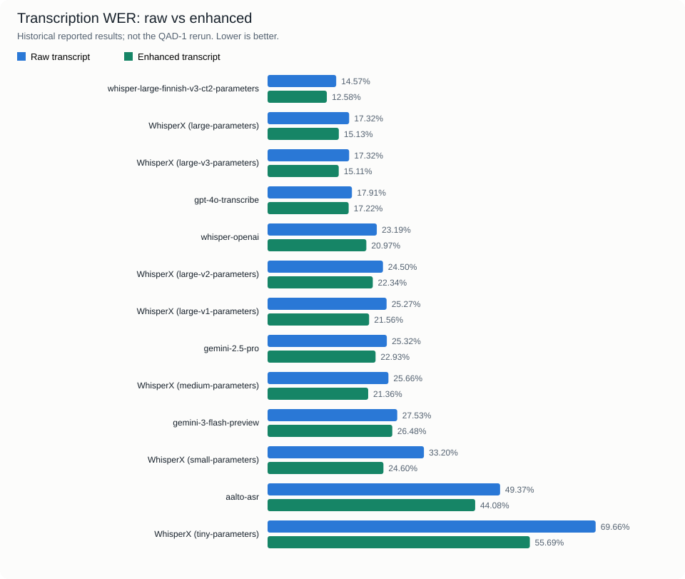
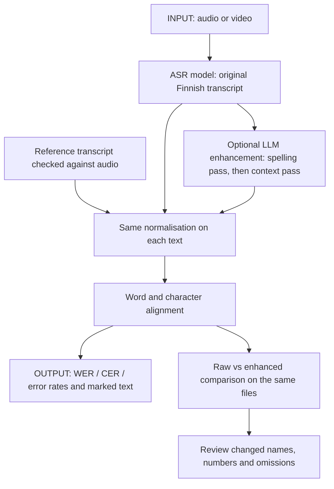

# Transcription evaluation

Compare Finnish speech-to-text outputs with a reference, inspect the aligned errors,
and measure whether transcript enhancement helps. Scoring is offline; enhancement
calls an LLM.

## Results at a glance

- **Historical raw/enhanced comparison:** Finnish-tuned Whisper has the lowest
  reported WER, **14.57% → 12.58%**, a reduction of **1.99 percentage points**.
  All 13 reported model aggregates improve; this does not mean every clip improves.
- **Separate QAD-1 rerun:** on one 180 s Ajokortti clip, QAdental's Finnish-NLP
  WhisperX gets **11.9% WER** and `gpt-4o-mini-transcribe` **13.9%**. HY's saved
  2025 WhisperX output gets **10.4%**, with its model settings unrecorded.
  These are raw transcripts, not the enhanced results below.
- **Interpretation:** WER measures textual differences, including spoken/written
  style and compound spelling. Check names, numbers and missing content directly
  before drawing a conclusion about usefulness.



The chart and table preserve the earlier README's published results in
[`data/historical_results.csv`](data/historical_results.csv). The original
model transcripts, complete clip list, enhancement model/settings and run metadata
are **not present here**, so these historical aggregates cannot be independently
recomputed from this folder. The chart is a rendering of those numbers, not a new run.
The CSV also retains spelling, substitution, deletion and insertion rates.

<!-- historical-results:start -->

| Model | Raw WER % | Enhanced WER % | Reduction (percentage points) |
|---|--:|--:|--:|
| whisper-large-finnish-v3-ct2-parameters | 14.57 | 12.58 | 1.99 |
| WhisperX (large-parameters) | 17.32 | 15.13 | 2.19 |
| WhisperX (large-v3-parameters) | 17.32 | 15.11 | 2.21 |
| gpt-4o-transcribe | 17.91 | 17.22 | 0.69 |
| whisper-openai | 23.19 | 20.97 | 2.22 |
| WhisperX (large-v2-parameters) | 24.50 | 22.34 | 2.16 |
| WhisperX (large-v1-parameters) | 25.27 | 21.56 | 3.71 |
| gemini-2.5-pro | 25.32 | 22.93 | 2.39 |
| WhisperX (medium-parameters) | 25.66 | 21.36 | 4.30 |
| gemini-3-flash-preview | 27.53 | 26.48 | 1.05 |
| WhisperX (small-parameters) | 33.20 | 24.60 | 8.60 |
| aalto-asr | 49.37 | 44.08 | 5.29 |
| WhisperX (tiny-parameters) | 69.66 | 55.69 | 13.97 |

<!-- historical-results:end -->

The QAD-1 rerun has model outputs, repeat ranges, scoring code and an audio-linked
reference audit in the private
[gaik-evals project](https://github.com/GAIK-project/gaik-evals/tree/main/projects/qadental-transcription-translation).
Its Finnish reference has unresolved review flags. Different datasets, references,
settings and enhancement stages prevent direct comparison with the historical table.

## Input → method → output



The scoring scripts consume **text**, not audio. Audio is used by the preceding
transcription step and by a person checking the reference.

| Script | Input | Method | Output |
|---|---|---|---|
| [`side_by_side_compare.py`](side_by_side_compare.py) | Reference and hypothesis folders; matching UTF-8 `.txt` filenames | jiwer word/character alignment | `<stem>_side_by_side.txt` per matched file; corpus metrics on stdout |
| [`enhance_transcript.py`](enhance_transcript.py) | Original transcript folder, selected LLM | Two prompt passes; no reference supplied | Enhanced `.txt` files with unchanged filenames; word-count changes on stdout |
| [`eval_enhanced.py`](eval_enhanced.py) | Reference, original and enhanced folders | Score the same matched files before/after | Per-file WER and corpus metrics on stdout |
| [`generate_results.py`](generate_results.py) | Historical CSV snapshot | Sort by raw WER; draw paired bars and a table | This README table and `images/historical-wer.svg`; no API calls |

A file is skipped when a corresponding hypothesis is missing. `eval_enhanced.py`
skips it from **both** aggregates if either version is missing. Check the warnings
and evaluated file count before comparing runs. The scripts overwrite matching
output filenames; use a new output directory to retain an earlier run.

## What the metrics mean

Both scorers lowercase the text, remove Unicode punctuation (including hyphens),
collapse runs of multiple whitespace characters and strip the ends. Word alignment
then splits on spaces; character alignment includes spaces. Number formatting,
Finnish inflections and compound word boundaries are not otherwise normalised.
A single embedded newline is not converted to a space by this transform: keep
comparable whitespace, or explicitly adopt and document a different policy for
both texts. QAD-1 preserves this HY behaviour and also reports a whitespace check.

| Metric | Calculation | Read it as |
|---|---|---|
| WER | `(substitutions + deletions + insertions) / reference words × 100` | Lower is better; can exceed 100% with many insertions |
| CER | Same calculation over reference characters, including spaces | Character differences; useful alongside WER |
| Substitution / deletion / insertion rate | Each error count / reference words × 100 | Wrong, missing or extra words; the three rates sum to WER |
| Spelling error rate | Spelling-close substitutions / reference words × 100 | A subset of substitutions, **not an extra term added to WER** |

“Spelling-close” means Levenshtein distance divided by the **longer** of the two
word lengths is at most 0.4. It is a text-distance heuristic; a close spelling can
still change meaning. Corpus WER uses **summed error counts divided by summed
reference word counts**, not the arithmetic mean of file WERs. Choose acceptance
criteria for your task from reviewed errors; WER alone is not a production gate.

## Run it again

From this folder, install the evaluation dependencies in an isolated environment:

```bash
uv venv .venv
uv pip install --python .venv -r requirements.txt
```

The root toolkit extras do not install jiwer and rapidfuzz. Use this evaluation
environment, or another environment with those dependencies. Commands below use
`python` from that environment (Windows: `.venv/Scripts/python.exe`).

Prepare `reference/`, `original/` and, for enhancement evaluation, `enhanced/`.
Each needs matching filenames, for example `Ajokortti.txt`. The checked-in
[`data/reference.txt`](data/reference.txt) is the sample reference;
[`data/Ajokortti.mp3`](data/Ajokortti.mp3) is the audio. Run your ASR first and save
its text as `original/Ajokortti.txt`.

```bash
python side_by_side_compare.py reference original reports/raw
python enhance_transcript.py --transcripts-dir original --output-dir enhanced --model YOUR_DEPLOYMENT
python eval_enhanced.py reference original enhanced
python side_by_side_compare.py reference enhanced reports/enhanced
python generate_results.py
```

Only the enhancement command needs credentials. Its CLI uses Azure OpenAI and
reads `AZURE_API_KEY` and `AZURE_ENDPOINT`; `--model` is your deployment name.
The current default is `gpt-5.4`. For standard OpenAI, call
`process_transcripts(..., model="YOUR_MODEL", use_azure=False)` from Python with
`OPENAI_API_KEY`. Model configuration describes a new run, not the provenance of
the historical results.

Pass 1 targets small spelling/consistency fixes. Pass 2 targets context, tokenisation
and number spelling, with a prompt limit of four inserted words per 100 words.
These are **prompt instructions**, not enforced guarantees. Review the changes
against the audio, especially names, numbers and anything newly inserted.

## Read an actual output

[`data/side-by-side-comparison.txt`](data/side-by-side-comparison.txt) contains a
saved single-file report: **402 reference words, 39 substitutions, 27 deletions,
1 insertion**. Thus WER is `(39 + 27 + 1) / 402 × 100 = 16.67%`; CER is 7.88%,
spelling error rate 4.98%. The generating model and raw hypothesis are not recorded,
so this is an output-format example, not a named-model benchmark.

The aligned hypothesis marks `[S:reference]` for substitution,
`[S,C:reference]` for a spelling-close substitution, `[D:reference]` for a deletion,
and `[I]` for insertion. The view can be truncated; metrics use the full text.

## Related examples

- [Transcriber examples](../../../implementation_layer/examples/software_components/transcriber/README.md): produce raw and optionally corrected text before scoring.
- [Translation evaluation](../translation_eval/README.md): evaluate the following Finnish-to-English step separately.
- [Evaluation methods](../README.md).
- [Documentation website](https://gaik-project.github.io/gaik-toolkit/evaluation-layer/transcription-eval/).
