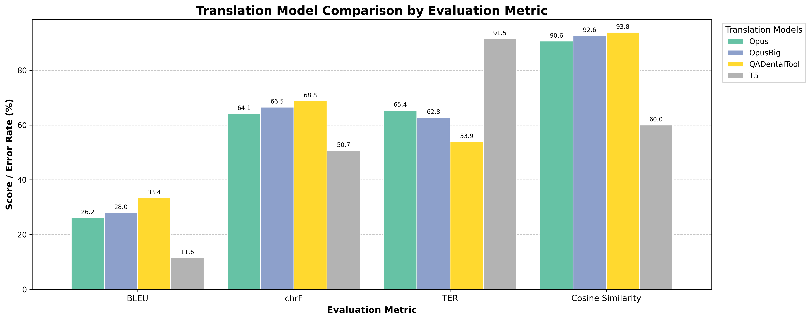

# Translation Evaluation

Multi-metric translation quality assessment comparing AI translation models against human reference translations. Evaluates BLEU, chrF, TER, and Cosine Similarity across single or multiple model outputs.

---

## 1. Evaluation Metrics

### 1.1 List of Metrics

The evaluation uses four complementary metrics covering n-gram overlap, character-level similarity, edit distance, and semantic meaning:

- BLEU (Bilingual Evaluation Understudy)
- chrF (Character n-gram F-score)
- TER (Translation Edit Rate)
- Cosine Similarity

### 1.2 Metric Descriptions

#### BLEU

- Definition:
  - Measures n-gram overlap between the hypothesis translation and the reference. Counts how many n-gram sequences (up to 4-grams) from the hypothesis appear in the reference.
- Formula:

```text
BLEU = BP × exp(Σ wₙ × log pₙ)
```

- Components:
  - `BP` = brevity penalty (penalizes translations shorter than reference)
  - `pₙ` = precision for n-grams of size n
  - `wₙ` = weight (typically 1/4 for n=1..4)
  - Smoothing (method1) applied to handle zero counts for short texts
- Business interpretation:
  - BLEU measures exact phrase-level agreement. High BLEU indicates the translation uses similar word sequences to the reference.
  - BLEU is sensitive to exact wording; paraphrases with the same meaning may still score low.
- Reference values:

| BLEU Range | Assessment |
|-----------|-----------|
| **> 40** | High quality — approaches human translation |
| **20–40** | Acceptable — useful for most purposes |
| **10–20** | Low quality — significant errors present |
| **< 10** | Poor — major problems with fluency and accuracy |

#### chrF

- Definition:
  - Computes F-score based on character n-gram overlap between hypothesis and reference. More forgiving than BLEU for morphological variation.
- Formula:

```text
chrF = (1 + β²) × chrP × chrR / (β² × chrP + chrR)
```

- Components:
  - `chrP` = character n-gram precision
  - `chrR` = character n-gram recall
  - `β = 2` (default — weights recall higher)
- Business interpretation:
  - chrF captures partial word matches and is better suited for morphologically rich languages.
  - Useful for languages where word forms vary through inflection (e.g. Finnish).
- Reference values:
  - No strict universal thresholds. Values above 60 generally indicate acceptable quality.

#### TER (Translation Edit Rate)

- Definition:
  - Measures the minimum number of edit operations (insertions, deletions, substitutions, shifts) needed to transform the hypothesis into the reference, normalized by reference length.
- Formula:

```text
TER = Edit Operations / Reference Length × 100%
```

- Business interpretation:
  - **Lower TER is better.** TER = 0 means the hypothesis is identical to the reference.
  - TER directly reflects post-editing effort: how much work a human editor would need to fix the translation.
- Reference values:

| TER Range | Assessment |
|-----------|-----------|
| **< 25** | Excellent — little post-editing needed |
| **25–50** | Good — moderate corrections required |
| **50–75** | Fair — significant editing needed |
| **> 75** | Poor — near full re-translation required |

#### Cosine Similarity

- Definition:
  - Measures the semantic similarity between the reference and hypothesis by comparing their transformer embedding vectors.
- Formula:

```text
CosineSim = (emb_ref · emb_hyp) / (‖emb_ref‖ × ‖emb_hyp‖) × 100%
```

- Components:
  - Embeddings computed by `sentence-transformers/all-mpnet-base-v2`
  - Raw text (not lemmatized) is used for embedding — preserves semantic nuance
- Business interpretation:
  - Cosine Similarity captures meaning preservation even when exact wording differs.
  - A translation can score high on Cosine Similarity but low on BLEU if it paraphrases correctly.
- Reference values:
  - Above 85% indicates strong semantic agreement. Below 70% suggests meaning drift.

---

## 2. Evaluation Tools / Code

### 2.1 Python Scripts

All scripts are located in the `src/` folder.

- **`src/evaluate_standalone.py`**
  - Evaluates all 10 ground-truth + translation pairs using all 4 metrics and reports averages only. No external script dependencies — `clean_text_translation` is inlined.
  - Input: `data/ground_truth/` and `data/translation_results/gpt-5.1/`
  - Output: Formatted console report with per-file scores and final averages

- **`src/translation_evaluation.py`**
  - Batch evaluation script for comparing multiple translation models across multiple files.
  - Auto-discovers all model subdirectories under `data/translation_results/`.
  - Uses fuzzy filename matching (RapidFuzz) to handle inconsistent naming across models.
  - Outputs: `evaluation_results/results.csv` + `evaluation_results/results.txt`

- **`src/generate_metrics_plot.py`**
  - Reads `evaluation_results/results.csv` and generates a grouped bar chart comparing all models across all metrics.
  - Output: `evaluation_results/translation_metrics_plot.png`

- **`src/TermsGenerate.py`**
  - Utility functions: `clean_text_translation()` (spacy lemmatization) and `extract_technical_terms_nlpTool()` (Finnish term extraction using stanza). Used by the batch evaluation script.

### 2.2 Python Dependencies

Defined in `requirements.txt`.

Main packages:
- `spacy` (with `en_core_web_sm`) — lemmatization for text cleaning
- `nltk` — BLEU and chrF metric computation
- `torchmetrics` — TER metric computation
- `sentence-transformers` — semantic embedding for Cosine Similarity
- `rapidfuzz` — fuzzy filename matching (batch script only)
- `pandas` + `matplotlib` — results CSV reading and chart generation

### 2.3 Sample Data

The sample files in `data/` are taken from a Finnish dental lecture corpus used to evaluate Finnish-to-English translation quality:

```
data/
├── ground_truth/
│   ├── Ajokortti.txt               — human reference translations (10 files)
│   └── ...
└── translation_results/
    └── gpt-5.1/                    — gpt-5.1 model outputs (10 files)
        ├── Ajokortti.txt
        └── ...
```

The sample data uses 10 dental lecture files evaluated with the gpt-5.1 model. **Replace or extend these files with your own data** to evaluate your own translation pipeline. See the [Customization Guide](#customization-guide) below.

---

## 3. Evaluations / Comparisons

### 3.1 Evaluation Setup / Context

Evaluation context:
- Domain: Dental education — lecture recordings transcribed and translated from Finnish to English
- Language pair: Finnish → English
- Dataset: 10 audio recording transcripts
- Ground truth: Human reference translations
- AI workflow: Audio transcription → Finnish transcript → AI translation → English output
- Embedding model: `sentence-transformers/all-mpnet-base-v2`
- Text normalization: spacy English lemmatization (alphabetic tokens only)

Models compared:

| Model | Description |
|-------|-------------|
| **gpt-5.1** | Domain-specialized translation tool |
| **OpusBig** | Claude Opus with extended context window |
| **Opus** | Claude Opus standard configuration |
| **T5** | Google T5 general-purpose translation model |

### 3.2 Results

Average scores across all 10 evaluation files:

| Model | BLEU ↑ | chrF ↑ | TER ↓ | Cosine Sim ↑ |
|-------|-------:|-------:|------:|------------:|
| **gpt-5.1** | **33.38** | **68.81** | **53.90** | **93.84** |
| **OpusBig** | 28.01 | 66.52 | 62.80 | 92.59 |
| **Opus** | 26.18 | 64.14 | 65.41 | 90.59 |
| **T5** | 11.59 | 50.67 | 91.47 | 59.99 |

*↑ higher is better; ↓ lower is better*



### 3.3 Key Findings

- **Domain specialization matters most**: gpt-5.1 leads on all four metrics, demonstrating that domain-adapted translation significantly outperforms general-purpose models on specialized terminology.
- **Claude Opus is competitive**: Both Opus variants achieve high Cosine Similarity (90–93%), indicating strong meaning preservation even when exact n-gram overlap is moderate.
- **Larger context window helps**: OpusBig consistently outperforms base Opus across all metrics, suggesting that more context improves translation coherence for technical content.
- **T5 underperforms on specialized content**: T5 shows high TER (91.47%) and low Cosine Similarity (59.99%), indicating both surface-level and semantic failure on domain-specific dental terminology.

---

## 4. Performance Issues

- **Domain terminology errors** — general-purpose models frequently mistranslate or invent dental terms (e.g. "protetiikassa" → "Protestants" instead of "prosthetics"). Specialized models handle these correctly.
- **Proper noun degradation** — speaker names and product brands are often garbled in AI output (e.g. "Martola" → "Martoon"), impacting BLEU and TER scores.
- **Word order divergence** — Finnish SOV structure causes word-order differences in translated output that increase TER even when meaning is preserved. Cosine Similarity is more robust to this than BLEU.
- **Compound word splitting** — Finnish medical compounds (e.g. "periimplantiitti") are inconsistently split or merged across models, causing BLEU penalties even for correct translations.
- **Fluency vs accuracy trade-off** — some models produce fluent-sounding English that diverges from the reference wording, scoring lower on BLEU/TER while maintaining high Cosine Similarity.

---

## 5. Improvement Strategies

### 5.1 Mapping Table: Issues → Improvement Strategies

| Performance issue | Improvement strategy |
|------------------|----------------------|
| Low BLEU on domain terms | Fine-tune on domain-specific parallel corpus; use terminology glossaries in the translation prompt |
| High TER for word-order differences | Accept semantically correct reorderings; normalize TER evaluation with reference paraphrases |
| Low Cosine Similarity | Use a domain-adapted embedding model for evaluation; improve base translation model selection |
| Proper noun garbling | Add named-entity pre/post-processing; use glossary injection in LLM translation prompts |
| Compound word inconsistency | Add normalization rules for known compound forms before metric computation |
| T5 failure on specialist content | Replace with domain-adapted NMT model or LLM-based translation for technical domains |

---

## Reproduction Notes (Usage Guide)

### Running the standalone evaluation

```bash
cd evaluation_layer/eval_methods/translation_eval
python src/evaluate_standalone.py
```

Evaluates the single sample file pair in `data/`. No arguments needed.

**Sample output:**

```
Loading models...
Models loaded.

============================================================
TRANSLATION EVALUATION RESULTS
============================================================
  Ground truth : data\ground_truth\Ajokortti.txt
  Translation  : data\translation_results\Ajokortti.txt
------------------------------------------------------------
  BLEU            : 32.01%   (higher is better; n-gram overlap)
  chrF            : 66.36%   (higher is better; character n-gram F-score)
  TER             : 50.92%   (lower is better; edit rate)
  Cosine Sim      : 88.93%   (higher is better; semantic similarity)
============================================================
```

### Running the batch evaluation (multiple models)

To evaluate multiple translation models at once, place each model's output files under a named subfolder inside `data/tool_results/`:

```
data/
├── ground_truth/         ← reference files (one per document)
└── tool_results/
    ├── ModelA/           ← model A translation outputs
    ├── ModelB/           ← model B translation outputs
    └── ModelC/           ← model C translation outputs
```

Then run:

```bash
python src/translation_evaluation.py
```

The script auto-discovers all model subdirectories under `data/translation_results/`, uses fuzzy filename matching to pair files, and writes results to `evaluation_results/results.csv` and `evaluation_results/results.txt`.

### Generating the comparison chart

After running the batch evaluation:

```bash
python src/generate_metrics_plot.py
```

Reads `evaluation_results/results.csv` and saves a grouped bar chart to `evaluation_results/translation_metrics_plot.png`.

---

## Customization Guide

### Using your own ground truth and translation files

1. Place your reference (human) translation files in `data/ground_truth/` — one `.txt` file per document, UTF-8 encoded.
2. For standalone evaluation: place your AI translations in `data/translation_results/<model_name>/` with matching filenames, then run `python src/evaluate_standalone.py` (update `TRANSLATION_DIR` to point to your folder).
3. For multi-model batch evaluation: create one subfolder per model under `data/translation_results/` and run `python src/translation_evaluation.py` — all models are auto-discovered.

### Adjusting the embedding model

The default embedding model is `sentence-transformers/all-mpnet-base-v2`. To use a different model, edit `src/evaluate_standalone.py`:

```python
transformer_model = SentenceTransformer("your-model-name")
```

For domain-specific evaluation, consider multilingual or domain-adapted models such as `paraphrase-multilingual-mpnet-base-v2`.

---

## Integration with GAIK Toolkit

### Evaluating GAIK Transcription + Translation Workflows

Use this evaluation after running the GAIK `Transcriber` component and a translation step:

```python
import json
from pathlib import Path
from evaluate_standalone import compute_scores  # after refactoring for reuse

from gaik.software_components.transcriber import Transcriber, get_openai_config

config = get_openai_config(use_azure=True)

# 1. Transcribe Finnish audio
transcriber = Transcriber(api_config=config)
result = transcriber.transcribe("lecture_audio.mp3")

# 2. Translate transcript (your translation step)
translation = your_translation_function(result.enhanced_transcript)

# 3. Save for evaluation
Path("data/translation_results/lecture.txt").write_text(translation, encoding="utf-8")

# 4. Evaluate: python evaluate_standalone.py
```

### Supported Use Cases

- **Dental / medical lecture translation** — evaluating Finnish-to-English translation of specialized content
- **Domain-specific video transcription and translation** — quality gate before publishing multilingual subtitles
- **Translation model benchmarking** — comparing general vs. domain-adapted models on a held-out test set

---

## Installation & Setup

### 1. Install Dependencies

```bash
cd evaluation_layer/eval_methods/translation_eval
pip install -r requirements.txt
python -m spacy download en_core_web_sm
```

### 2. Download NLTK Data (first run only)

```python
import nltk
nltk.download('punkt')
```

This is handled automatically on first use if not already downloaded.

---

## Related Resources

- **GAIK Transcriber Component**: [guidance_layer/docs/software_components/transcriber.md](../../../guidance_layer/docs/software_components/transcriber.md)
- **Transcription Evaluation**: [../transcription_eval/README.md](../transcription_eval/README.md)
- **Translation Evaluation — Website**: [guidance_layer/website/content/docs/toolkit/evals/translation-eval.mdx](../../../guidance_layer/website/content/docs/toolkit/evals/translation-eval.mdx)
- **Evaluation Methods Overview**: [../README.md](../README.md)
- **Project Website**: [gaik.ai](https://gaik.ai)
- **GitHub**: [github.com/GAIK-project/gaik-toolkit](https://github.com/GAIK-project/gaik-toolkit)
