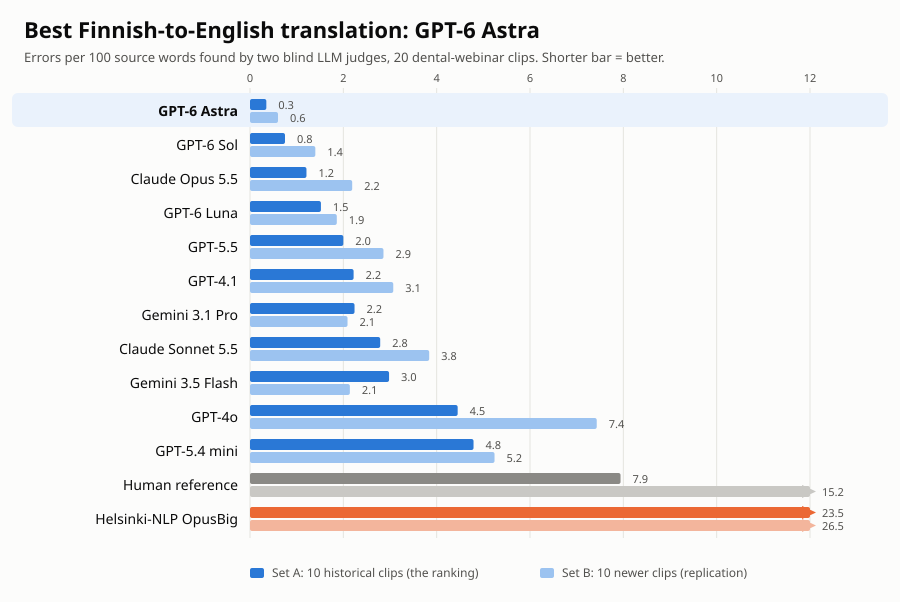
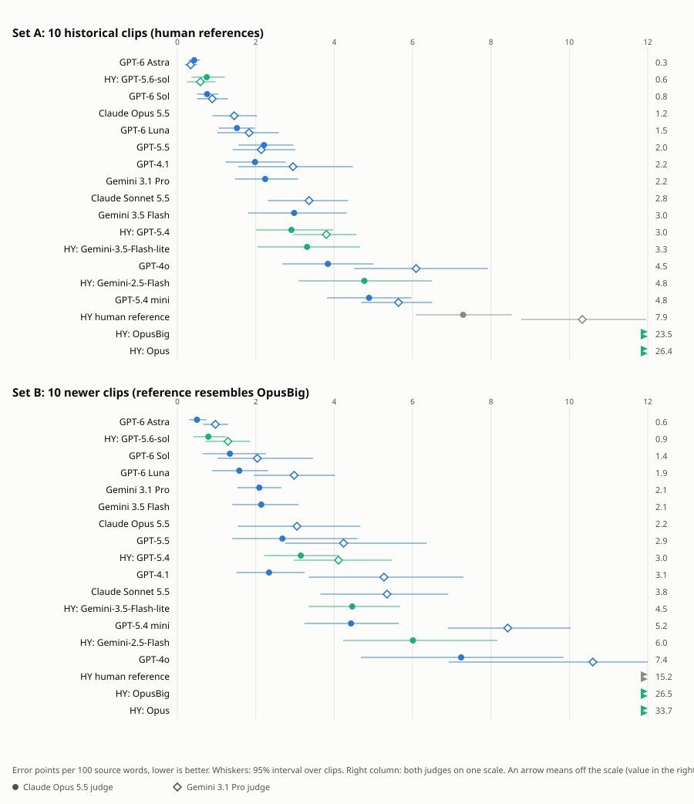
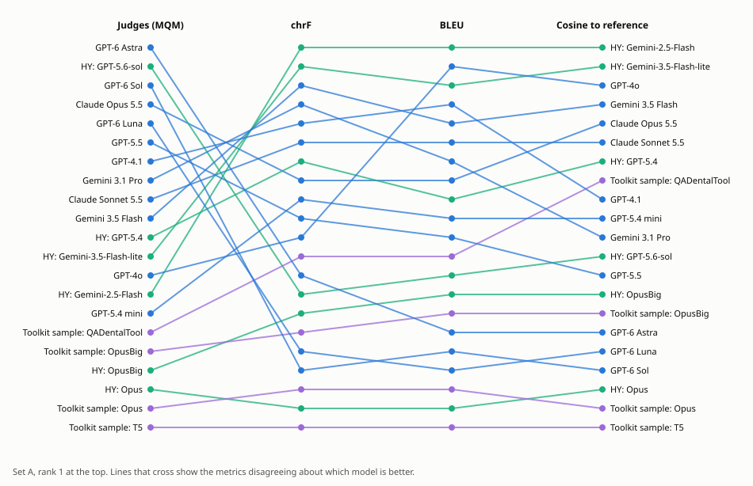

# Translation Evaluation

Translation quality assessment for Finnish-to-English speech translation. The scripts in this folder compare AI translation models against human reference translations with BLEU, chrF, TER and cosine similarity. A newer 20-clip evaluation (section 3.3) adds reference-free error annotation by blind LLM judges and shows why the reference-based numbers alone can pick the wrong model.

---

## Result: which model translates best?

**GPT-6 Astra.** In a 20-clip evaluation of Finnish dental-webinar speech, two blind LLM judges found the fewest translation errors in GPT-6 Astra on both clip sets, clearly ahead of every other model that was run. The human reference translations scored worse than every current model, and BLEU, chrF and cosine similarity ranked the models unrelated to the judges (or in reverse), so distance to a single reference should not choose the model.



Details, the other models and the limits are in section 3.

---

## 1. Evaluation Metrics

### 1.1 List of Metrics

The evaluation uses two families of metrics. Four **reference-based** metrics compare a translation with a human reference (n-gram overlap, character-level similarity, edit distance, semantic meaning). One **reference-free** method has blind LLM judges annotate errors against the Finnish source:

- BLEU (Bilingual Evaluation Understudy)
- chrF (Character n-gram F-score)
- TER (Translation Edit Rate)
- Cosine Similarity
- MQM error points from blind LLM judges (section 3; not computed by the scripts in `src/`)

### 1.2 Metric Descriptions

#### BLEU

- Definition:
  - Measures n-gram overlap between the hypothesis translation and the reference. Counts how many n-gram sequences (up to 4-grams) from the hypothesis appear in the reference.
- Formula:

```text
BLEU = BP × exp(Σ wₙ × log pₙ)
```

- Components:
  - `BP` = brevity penalty (penalizes translations shorter than reference)
  - `pₙ` = precision for n-grams of size n
  - `wₙ` = weight (typically 1/4 for n=1..4)
  - Smoothing (method1) applied to handle zero counts for short texts
- Business interpretation:
  - BLEU measures exact phrase-level agreement. High BLEU indicates the translation uses similar word sequences to the reference.
  - BLEU is sensitive to exact wording; paraphrases with the same meaning may still score low.
- Reference values:

| BLEU Range | Assessment |
|-----------|-----------|
| **> 40** | High quality — approaches human translation |
| **20–40** | Acceptable — useful for most purposes |
| **10–20** | Low quality — significant errors present |
| **< 10** | Poor — major problems with fluency and accuracy |

#### chrF

- Definition:
  - Computes F-score based on character n-gram overlap between hypothesis and reference. More forgiving than BLEU for morphological variation.
- Formula:

```text
chrF = (1 + β²) × chrP × chrR / (β² × chrP + chrR)
```

- Components:
  - `chrP` = character n-gram precision
  - `chrR` = character n-gram recall
  - `β = 2` (default — weights recall higher)
- Business interpretation:
  - chrF captures partial word matches and is better suited for morphologically rich languages.
  - Useful for languages where word forms vary through inflection (e.g. Finnish).
- Reference values:
  - No strict universal thresholds. Values above 60 generally indicate acceptable quality.

#### TER (Translation Edit Rate)

- Definition:
  - Measures the minimum number of edit operations (insertions, deletions, substitutions, shifts) needed to transform the hypothesis into the reference, normalized by reference length.
- Formula:

```text
TER = Edit Operations / Reference Length × 100%
```

- Business interpretation:
  - **Lower TER is better.** TER = 0 means the hypothesis is identical to the reference.
  - TER directly reflects post-editing effort: how much work a human editor would need to fix the translation.
- Reference values:

| TER Range | Assessment |
|-----------|-----------|
| **< 25** | Excellent — little post-editing needed |
| **25–50** | Good — moderate corrections required |
| **50–75** | Fair — significant editing needed |
| **> 75** | Poor — near full re-translation required |

#### Cosine Similarity

- Definition:
  - Measures the semantic similarity between the reference and hypothesis by comparing their transformer embedding vectors.
- Formula:

```text
CosineSim = (emb_ref · emb_hyp) / (‖emb_ref‖ × ‖emb_hyp‖) × 100%
```

- Components:
  - Embeddings computed by `sentence-transformers/all-mpnet-base-v2`
  - Raw text (not lemmatized) is used for embedding — preserves semantic nuance
- Business interpretation:
  - Cosine Similarity captures meaning preservation even when exact wording differs.
  - A translation can score high on Cosine Similarity but low on BLEU if it paraphrases correctly.
- Reference values:
  - Above 85% indicates strong semantic agreement. Below 70% suggests meaning drift.

#### MQM error points (LLM judge, reference-free)

- Definition:
  - Two LLM judges from different vendors annotate every error in a candidate translation with the MQM typology (mistranslation, omission, addition, untranslated text, terminology, names, grammar, unnatural phrasing, register), a severity and the verbatim text spans, by reading only the Finnish source and the candidate.
- Score:

```text
MQM points per 100 source words = (10 x critical + 5 x major + 1 x minor) / source words x 100
```

- Business interpretation:
  - Lower is better; 1 point per 100 words is one minor slip per 100 Finnish words. The judge never sees the reference, so a weak reference cannot distort the score, and the reference itself can be scored like any other text.
  - A judge never scores a candidate from its own vendor, and every annotated span is checked to occur in the candidate. The judges are LLMs: treat the numbers as a ranking aid and have a native reader check a sample before quoting them as quality figures.

---

## 2. Evaluation Tools / Code

### 2.1 Python Scripts

All scripts are located in the `src/` folder.

- **`src/evaluate_standalone.py`**
  - Evaluates all 10 ground-truth + translation pairs from one model folder using all 4 reference-based metrics and reports averages only. No external script dependencies — `clean_text_translation` is inlined.
  - Input: `data/ground_truth/` and `data/translation_results/gpt-5.1/` (a legacy sample folder that only demonstrates the script)
  - Output: Formatted console report with per-file scores and final averages

- **`src/translation_evaluation.py`**
  - Batch evaluation script for comparing multiple translation models across multiple files.
  - Auto-discovers all model subdirectories under `data/translation_results/`.
  - Uses fuzzy filename matching (RapidFuzz) to handle inconsistent naming across models.
  - Outputs: `evaluation_results/results.csv` + `evaluation_results/results.txt`

- **`src/generate_metrics_plot.py`**
  - Reads `evaluation_results/results.csv` and generates a grouped bar chart comparing all models across all metrics.
  - Output: `evaluation_results/translation_metrics_plot.png`

- **`src/TermsGenerate.py`**
  - Utility functions: `clean_text_translation()` (spacy lemmatization) and `extract_technical_terms_nlpTool()` (Finnish term extraction using stanza). Used by the batch evaluation script.

### 2.2 Python Dependencies

Defined in `requirements.txt`.

Main packages:
- `spacy` (with `en_core_web_sm`) — lemmatization for text cleaning
- `nltk` — BLEU and chrF metric computation
- `torchmetrics` — TER metric computation
- `sentence-transformers` — semantic embedding for Cosine Similarity
- `rapidfuzz` — fuzzy filename matching (batch script only)
- `pandas` + `matplotlib` — results CSV reading and chart generation

### 2.3 Sample Data

The sample files in `data/` are taken from a Finnish dental lecture corpus used to evaluate Finnish-to-English translation quality:

```
data/
├── ground_truth/
│   ├── Ajokortti.txt               — human reference translations (10 files)
│   └── ...
└── translation_results/
    └── <model_name>/               — one folder of outputs per model (legacy samples: gpt-5.1, Opus, OpusBig, T5)
```

The sample data (10 dental lecture files) only demonstrates the scripts. It is not the evaluation result: that is in section 3.

---

## 3. Evaluations / Comparisons

### 3.1 Evaluation Setup / Context

- Domain: dental education, Finnish webinar speech translated into English
- Dataset: 20 clips of about three minutes from the University of Helsinki (HY) QAD-1 task, in two sets that are never pooled. **Set A** (10 historical clips, human-made references) is used for the ranking. **Set B** (10 newer clips) only checks that the order holds, because its reference resembles one machine-translation system's output
- Input: HY's corrected Finnish transcript, so this tests translation only, not speech recognition
- Models: 11 current models, three runs each, with one plain translator prompt: GPT-6 Astra, Sol and Luna, GPT-5.5, GPT-5.4 mini, GPT-4.1, GPT-4o, Gemini 3.1 Pro, Gemini 3.5 Flash, Claude Opus 5.5 and Claude Sonnet 5.5. HY's committed outputs of six other systems (including the Helsinki-NLP `opus-mt` models Opus and OpusBig) and HY's human reference were scored the same way
- Judges: Claude Opus 5.5 and Gemini 3.1 Pro annotate errors with MQM (section 1.2), each seeing only the Finnish source and one candidate. A judge never scores a candidate from its own vendor, so Claude and Gemini models are scored by one judge and converted to a common scale with the ratio fitted on the 12 candidates both judges scored
- Reference-based metrics (BLEU, chrF, TER and embedding cosine to the reference) were computed as context. The 20-clip run used sacrebleu on the raw text and Azure `text-embedding-3-large`; the scripts in `src/` use spaCy lemmatization and `all-mpnet-base-v2` (section 1.2), so their numbers are not comparable

### 3.2 Results



Error points per 100 source words, lower is better, both judges on one scale (95 % intervals over clips are in the figure):

| Model | Set A | Set B |
|-------|------:|------:|
| **GPT-6 Astra** | **0.3** | **0.6** |
| GPT-6 Sol | 0.8 | 1.4 |
| Claude Opus 5.5 | 1.2 | 2.2 |
| GPT-6 Luna | 1.5 | 1.9 |
| GPT-5.5 | 2.0 | 2.9 |
| Gemini 3.1 Pro | 2.2 | 2.1 |
| Gemini 3.5 Flash | 3.0 | 2.1 |
| GPT-4.1 | 2.2 | 3.1 |
| GPT-5.4 mini | 4.8 | 5.2 |
| GPT-4o | 4.5 | 7.4 |
| **Human reference** | **7.9** | **15.2** |
| HY: OpusBig / Opus (Helsinki-NLP) | 23.5 / 26.4 | 26.5 / 33.7 |

HY's own files of GPT-5.6-sol, GPT-5.4, Gemini-2.5-Flash and Gemini-3.5-Flash-lite land where their model family does (0.6-4.8 on set A).



### 3.3 Key Findings

- **GPT-6 Astra translated best on both sets and with both judges**, clearly ahead of every model run here. Its lead over HY's committed GPT-5.6-sol file is borderline (0.3 points).
- **Reference-based metrics ranked the models almost unrelated to the judges on set A** (Spearman agreement -0.16 to -0.27; 1 means the same order) **and in reverse on set B** (-0.55 to -0.70). BLEU, chrF or cosine alone would have picked a different, worse model.
- **The human reference is not a clean gold standard.** The judges score it at 7.9 (set A) and 15.2 (set B) error points, above every current LLM. One set A reference is 69 % of the length of every tool output and ends with a summary; set B's reference is close to OpusBig's output (chrF 82 and BLEU 68 for OpusBig against it, chrF 62-70 for the other five tools), so OpusBig ranks first on set B by BLEU while the judges rank it near the bottom.
- **The Helsinki-NLP models make more than ten times as many errors as the top four LLMs** (23-34 points against 0.3-1.4), the largest gap in the study and consistent across both judges.
- **Limits:** the judges are LLMs and no human has checked their annotations; differences of a few tenths of a point between the top models are within judge noise; speed and cost were not compared beyond a rough latency (Astra 16 s, Sol 13 s, Luna 10 s per three-minute clip).

The full study (code, per-clip data, judge annotations) is kept in the project's private evaluation repository; ask the GAIK team for access.

---

## 4. Performance Issues

- **Domain terminology errors** — models mistranslate or invent dental terms (e.g. "protetiikassa" → "Protestants" instead of "prosthetics"), and a term that is right in English can still be wrong in speech, such as saying "twenty-four" for tooth number 24. The Helsinki-NLP models have the highest error counts overall; for the human reference in the 20-clip evaluation, terminology and mistranslation are the two largest error categories.
- **Proper noun degradation** — speaker names and product brands are often garbled in AI output (e.g. "Martola" → "Martoon"), impacting BLEU and TER scores.
- **Word order divergence** — Finnish SOV structure causes word-order differences in translated output that increase TER even when meaning is preserved. Cosine Similarity is more robust to this than BLEU.
- **Compound word splitting** — Finnish medical compounds (e.g. "periimplantiitti") are inconsistently split or merged across models, causing BLEU penalties even for correct translations.
- **Fluency vs accuracy trade-off** — some models produce fluent-sounding English that diverges from the reference wording, scoring lower on BLEU/TER while maintaining high Cosine Similarity.
- **Reference quality** — a human reference can be a loose paraphrase, incomplete, or resemble one machine-translation system's output. Every reference-based metric then rewards the wrong thing, and the judges' ranking can be the reverse of the metrics' (section 3.3).

---

## 5. Improvement Strategies

### 5.1 Mapping Table: Issues → Improvement Strategies

| Performance issue | Improvement strategy |
|------------------|----------------------|
| Low BLEU on domain terms | Fine-tune on domain-specific parallel corpus; use terminology glossaries in the translation prompt |
| High TER for word-order differences | Accept semantically correct reorderings; normalize TER evaluation with reference paraphrases |
| Low Cosine Similarity | Use a domain-adapted embedding model for evaluation; improve base translation model selection |
| Proper noun garbling | Add named-entity pre/post-processing; use glossary injection in LLM translation prompts |
| Compound word inconsistency | Add normalization rules for known compound forms before metric computation |
| Errors from older neural MT models (Opus-MT, T5) | Use a current LLM translator; the 20-clip evaluation shows more than a 10x lower error rate for the top LLMs |
| Reference-based metrics disagree with quality | Add reference-free MQM judging, check each reference (length against several systems' outputs, similarity to any single system) and score the reference like any candidate |
| LLM judge noise and vendor bias | Use judges from two vendors, never let a judge score its own vendor, repeat runs, and have a native reader check a sample of annotations |

---

## Reproduction Notes (Usage Guide)

### Running the standalone evaluation

```bash
cd evaluation_layer/eval_methods/translation_eval
python src/evaluate_standalone.py
```

Evaluates the 10 sample file pairs in `data/` (ground truth against the legacy `gpt-5.1` sample folder) and prints one score block per file plus averages. No arguments needed. Edit `TRANSLATION_DIR` and `MODEL_NAME` at the top of the script to evaluate another folder.

### Running the batch evaluation (multiple models)

To evaluate multiple translation models at once, place each model's output files under a named subfolder inside `data/translation_results/`:

```
data/
├── ground_truth/         ← reference files (one per document)
└── translation_results/
    ├── ModelA/           ← model A translation outputs
    ├── ModelB/           ← model B translation outputs
    └── ModelC/           ← model C translation outputs
```

Then run:

```bash
python src/translation_evaluation.py
```

The script auto-discovers all model subdirectories under `data/translation_results/`, uses fuzzy filename matching to pair files, and writes results to `evaluation_results/results.csv` and `evaluation_results/results.txt`.

### Reproducing the 20-clip evaluation

The scripts in `src/` compute the four reference-based metrics only. The MQM judging in section 3 needs a judge prompt built on the MQM categories in 1.2, one call per candidate to two judges from different vendors, and a check that every quoted span occurs in the candidate. The GAIK validators (`gaik.software_components.validators`, see the [LLM judge](../../../guidance_layer/docs/software_components/llm_judge.md) docs) provide the judge plumbing.

### Generating the comparison chart

After running the batch evaluation:

```bash
python src/generate_metrics_plot.py
```

Reads `evaluation_results/results.csv` and saves a grouped bar chart to `evaluation_results/translation_metrics_plot.png`.

---

## Customization Guide

### Using your own ground truth and translation files

1. Place your reference (human) translation files in `data/ground_truth/` — one `.txt` file per document, UTF-8 encoded.
2. For standalone evaluation: place your AI translations in `data/translation_results/<model_name>/` with matching filenames, then run `python src/evaluate_standalone.py` (update `TRANSLATION_DIR` to point to your folder).
3. For multi-model batch evaluation: create one subfolder per model under `data/translation_results/` and run `python src/translation_evaluation.py` — all models are auto-discovered.

### Adjusting the embedding model

The default embedding model is `sentence-transformers/all-mpnet-base-v2`. To use a different model, edit `src/evaluate_standalone.py`:

```python
transformer_model = SentenceTransformer("your-model-name")
```

For domain-specific evaluation, consider multilingual or domain-adapted models such as `paraphrase-multilingual-mpnet-base-v2`.

---

## Integration with GAIK Toolkit

### Evaluating GAIK Transcription + Translation Workflows

Use this evaluation after running the GAIK `Transcriber` component and a translation step:

```python
import json
from pathlib import Path
from evaluate_standalone import compute_scores  # after refactoring for reuse

from gaik.software_components.transcriber import Transcriber, get_openai_config

config = get_openai_config(use_azure=True)

# 1. Transcribe Finnish audio
transcriber = Transcriber(api_config=config)
result = transcriber.transcribe("lecture_audio.mp3")

# 2. Translate transcript (your translation step)
translation = your_translation_function(result.enhanced_transcript)

# 3. Save for evaluation
Path("data/translation_results/lecture.txt").write_text(translation, encoding="utf-8")

# 4. Evaluate: python evaluate_standalone.py
```

### Supported Use Cases

- **Dental / medical lecture translation** — evaluating Finnish-to-English translation of specialized content
- **Domain-specific video transcription and translation** — quality gate before publishing multilingual subtitles
- **Translation model benchmarking** — comparing general vs. domain-adapted models on a held-out test set

---

## Installation & Setup

### 1. Install Dependencies

```bash
cd evaluation_layer/eval_methods/translation_eval
pip install -r requirements.txt
python -m spacy download en_core_web_sm
```

### 2. Download NLTK Data (first run only)

```python
import nltk
nltk.download('punkt')
```

This is handled automatically on first use if not already downloaded.

---

## Related Resources

- **GAIK Transcriber Component**: [guidance_layer/docs/software_components/transcriber.md](../../../guidance_layer/docs/software_components/transcriber.md)
- **Transcription Evaluation**: [../transcription_eval/README.md](../transcription_eval/README.md)
- **Translation Evaluation — Website**: [gaik-project.github.io/gaik-toolkit/evaluation-layer/translation-eval](https://gaik-project.github.io/gaik-toolkit/evaluation-layer/translation-eval/)
- **Evaluation Methods Overview**: [../README.md](../README.md)
- **Project Website**: [gaik.ai](https://gaik.ai)
- **GitHub**: [github.com/GAIK-project/gaik-toolkit](https://github.com/GAIK-project/gaik-toolkit)
