# Contributing to GAIK

Quick guide for developers.

---

## ➕ Adding New Code

### Project Module Structure

```text
implementation_layer/src/gaik/
├── software_components/   # Building blocks (extractor, parsers, transcriber, RAG, …) (+ tests)
├── software_modules/      # End-to-end pipelines (audio_to_structured_data, …)
└── observability/         # Tracing/metrics helpers
```

### Extend Existing Module

Add new functionality to existing components (e.g., `software_components/extractor/`, `software_components/parsers/`, `software_components/transcriber/`).

#### Example: Add a new parser to `software_components/parsers/`

1. **Create parser file** → `implementation_layer/src/gaik/software_components/parsers/your_parser.py`

2. **Export in module** → [implementation_layer/src/gaik/software_components/parsers/\_\_init\_\_.py](implementation_layer/src/gaik/software_components/parsers/__init__.py)

   ```python
   from .your_parser import YourParser
   __all__ = [..., "YourParser"]
   ```

3. **Add dependencies** → [pyproject.toml](pyproject.toml)

   Add to existing `[parser]` group (NOT a new group):

   ```toml
   [project.optional-dependencies]
   parser = [
       "PyMuPDF>=1.26.0",
       "python-docx>=1.2.0",
       "your-new-dependency>=1.0.0",  # Add here
   ]
   ```

4. **Add tests** _(recommended)_ → `implementation_layer/unit_tests/test_your_parser.py`

5. **Add example** _(recommended)_ → `implementation_layer/examples/software_components/parsers/demo_your_parser.py`

### Add New Standalone Feature

Create entirely new module for capabilities that don't fit existing modules.

#### Example: New analysis module

1. **Create module** → `implementation_layer/src/gaik/software_components/analysis/`

   ```text
   implementation_layer/src/gaik/software_components/analysis/
   ├── __init__.py
   ├── analyzer.py
   └── utils.py
   ```

2. **Add dependencies** → [pyproject.toml](pyproject.toml)

   Create NEW optional dependency group:

   ```toml
   [project.optional-dependencies]
   analysis = [
       "numpy>=1.24.0",
       "pandas>=2.0.0",
   ]
   all = ["gaik[extract,parser,transcriber,analysis]"]  # Update all group
   ```

3. **Export public API** → [implementation_layer/src/gaik/software_components/\_\_init\_\_.py](implementation_layer/src/gaik/software_components/__init__.py)

   ```python
   from . import analysis

   __all__ = [
       "extractor",
       "parsers",
       "transcriber",
       "analysis",  # Add new component
   ]
   ```

4. **Add tests** _(recommended)_ → `implementation_layer/unit_tests/test_analysis.py`

5. **Add examples** _(recommended)_ → `implementation_layer/examples/software_components/analysis/` with README

## Testing and Formatting

GitHub Actions runs on every push and pull request. It first checks formatting with a pinned
ruff version and fails before any test runs if a file is not formatted; `ruff check` is
reported but not blocking. It then runs the deterministic tests with `pytest -m "not llm"`.

**Tests go in:** `implementation_layer/unit_tests/` (CI collects only this suite)

```bash
uv sync --all-extras                                  # Missing extras make components silently absent
uv run pytest -m "not llm"                            # Offline tests, as in CI
uvx ruff@0.14.10 format implementation_layer/         # Same pinned formatter as CI
uvx ruff@0.14.10 check implementation_layer/src/gaik/
```

Tests marked `llm` call a real model and need provider credentials; CI runs them nightly.

## Release Process

Every tag and PyPI release requires the authenticated release gate described in
[docs/releasing.md](../docs/releasing.md). Commit the intended release, set
`implementation_layer/solution_wizard/gaik_validated_version.txt` to the planned version,
then run:

```bash
uv run python scripts/release_check.py --live --version X.Y.Z
```

Tag only after it passes for that exact commit, and rerun it after any tracked change.

```bash
git push origin main
git tag vX.Y.Z              # Must be vX.Y.Z format; the version comes from the tag
git push origin vX.Y.Z      # Triggers GitHub Actions
```

**GitHub Actions automatically:**

- Runs the format check and offline tests, then the same live release gate on the tag commit
- Builds the package
- **Validates version matches tag** (fails early if mismatch)
- Validates package (twine check and distribution contents)
- Publishes to PyPI
- Creates GitHub Release

Publishing depends on the release gate. Missing credentials, timeouts and skipped checks
fail it; do not bypass it to publish.

### Fixing Version Mismatch

If the pipeline fails with "Version mismatch" error, it means commits were added after the tag. Fix by recreating the tag:

```bash
# 1. Delete old tag locally and from remote
git tag -d v0.3.0
git push origin :refs/tags/v0.3.0

# 2. Rerun the release gate for current HEAD, then create the new tag there
git tag v0.3.0
git push origin v0.3.0
```

## Project Structure

```text
gaik-toolkit/
├── implementation_layer/
│   ├── src/gaik/                       # Package source
│   │   ├── software_components/         # Building blocks (extractor, parsers, transcriber, RAG, …)
│   │   ├── software_modules/            # End-to-end pipelines
│   │   └── observability/               # Tracing/metrics helpers
│   ├── examples/                        # Usage examples
│   └── unit_tests/                      # Shared test suite
├── scripts/                        # CI/build scripts
└── .github/workflows/              # CI/CD
```

## Release Flow

```mermaid
flowchart LR
    A[Code Changes] --> B[git commit & push]
    B --> R[release_check.py --live passes]
    R --> C[git tag v0.X.Y]
    C --> D[git push tag]
    D --> E[GitHub Actions]
    E --> F[Format Check, Tests + Live Release Gate]
    F --> G[Build Package]
    G --> H[Validate Version]
    H --> I[Validate with Twine]
    I --> J[Publish to PyPI]
    J --> K[Create GitHub Release]

    style E fill:#f9f,stroke:#333
    style F fill:#bbf,stroke:#333
    style G fill:#bbf,stroke:#333
    style H fill:#fbb,stroke:#333
    style I fill:#bbf,stroke:#333
    style J fill:#bfb,stroke:#333
    style K fill:#bfb,stroke:#333
```


