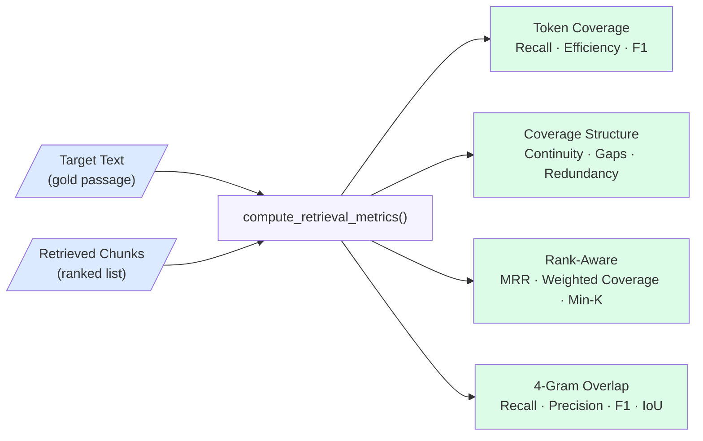
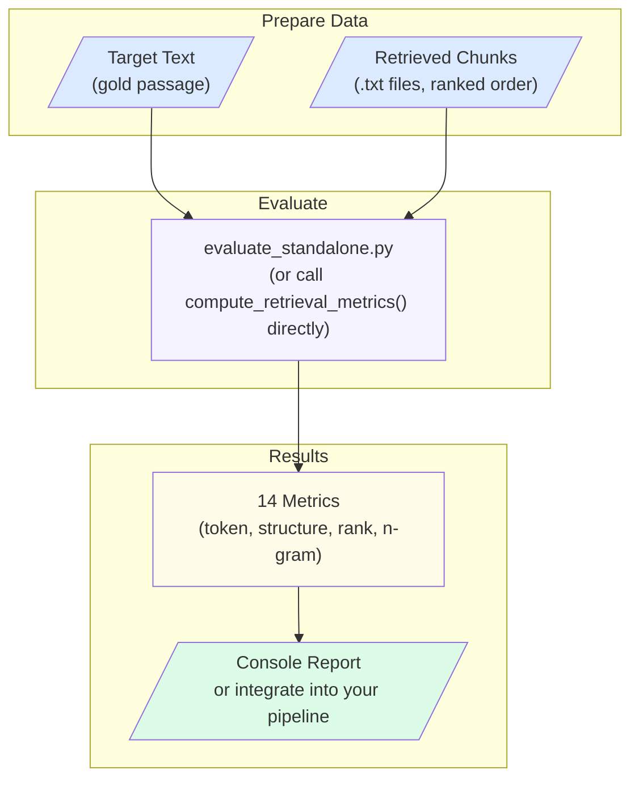

## The Problem

Retrieval-Augmented Generation (RAG) systems depend on two sequential steps: first retrieving the right chunks from a document index, then generating an answer from those chunks. Most evaluation effort focuses on the final answer quality — but if the retrieval step fails, no amount of generation quality can compensate. A system may produce fluent, confident answers that are factually wrong simply because the relevant passage was never retrieved.

Key challenges include:
- **Coverage gaps** — relevant content exists in the knowledge base but is not retrieved for a given query
- **Redundant retrieval** — multiple chunks return the same content, wasting context window space and reducing answer diversity
- **Rank sensitivity** — the most relevant chunk may be ranked fifth instead of first, degrading reranker and generator performance
- **Phrase fragmentation** — chunk boundaries split important multi-word expressions across separate chunks, reducing phrase-level coverage
- **Configuration complexity** — chunk size, overlap, embedding model, retriever type, and reranker settings all interact in non-obvious ways

---

## How We Evaluate

Retrieval quality is measured by comparing the retrieved chunks against a target text — a manually annotated gold passage that a correct retrieval should cover. The evaluation function takes the target text and a ranked list of chunks, and computes 14 deterministic metrics using token sequences and n-gram sets. No LLM calls are made.

The figure below shows how the evaluation works at the function level.

### Token Coverage Metrics

Token-level metrics measure how much of the target text is covered by the retrieved chunks.

| Metric | Formula | What it measures |
|--------|---------|-----------------|
| **Token Recall** | Unique covered tokens / target tokens | Fraction of target content retrieved |
| **Retrieval Efficiency** | Unique covered tokens / total retrieved tokens | Coverage gained per retrieved token |
| **Token F1** | 2·Recall·Efficiency / (Recall+Efficiency) | Balanced summary of coverage and density |

### Coverage Structure Metrics

Structure metrics diagnose *how* the target is covered — whether coverage is contiguous or fragmented.

| Metric | What it measures |
|--------|-----------------|
| **Coverage Continuity** | Longest unbroken covered span as a fraction of target length |
| **Gap Count** | Number of internal uncovered stretches within the covered region |
| **Mean Gap Size** | Average length of coverage gaps in tokens |
| **Chunk Redundancy** | Fraction of matched tokens that repeat content already covered |

### Rank-Aware Metrics

Rank-aware metrics reward systems that surface relevant content in the top positions.

| Metric | Formula | What it measures |
|--------|---------|-----------------|
| **MRR** | 1 / rank of first hit | How early the first matching chunk appears |
| **Rank-Weighted Coverage** | Avg cumulative coverage over all ranks | Whether coverage builds quickly or slowly |
| **Effective Chunk Ratio** | Chunks with new coverage / total chunks | Fraction of chunks that contribute something new |
| **Min-K Full Coverage** | Fewest top-k chunks for full coverage | Retrieval efficiency in terms of chunks needed |

### 4-Gram Overlap Metrics

4-gram metrics capture phrase-level overlap rather than individual token hits — sensitive to chunk fragmentation and multi-word expression coverage.

| Metric | Formula |
|--------|---------|
| **4-Gram Recall** | Target 4-grams ∩ Retrieved / Target 4-grams |
| **4-Gram Precision** | Target 4-grams ∩ Retrieved / Retrieved 4-grams |
| **4-Gram F1** | Harmonic mean of 4-gram recall and precision |
| **4-Gram IoU** | Intersection / Union of 4-gram sets |

---

## Error Classification

### Low Token Recall

**Problem**: The retrieved chunks collectively fail to cover a significant portion of the target passage — relevant content exists in the index but is not being retrieved.

**Impact**: The generator receives incomplete context and cannot produce a correct answer regardless of its capability.

### High Chunk Redundancy

**Problem**: Multiple high-ranked chunks return the same or heavily overlapping content, consuming context window space without adding new information.

**Impact**: Reduces effective context diversity and wastes retrieval capacity that could have surfaced different relevant passages.

### High Gap Count

**Problem**: Coverage of the target is scattered — some parts are retrieved but internal stretches are missed, leaving gaps in the evidence the generator sees.

**Impact**: The generator may produce answers that are partially correct but miss critical details that fall in the uncovered gaps.

### Low MRR

**Problem**: Relevant chunks appear deep in the ranked list rather than at the top. The best-ranked chunks do not match the target.

**Impact**: If a reranker or a top-k cutoff is applied, the relevant passage may be discarded before reaching the generator.

### Low 4-Gram Metrics

**Problem**: Phrase-level coverage is low even when token recall is reasonable — chunk boundaries are fragmenting important multi-word expressions.

**Impact**: Key terminology, named entities, or technical phrases are split across chunks, making it harder for the generator to reference them accurately.

---

## Real-World Applications

RAG retrieval evaluation applies to any GAIK use case that involves document retrieval before answer generation:

- **Semantic video search** — measuring whether retrieved transcript segments contain the queried topic before generating a time-stamped answer
- **Document Q&A** — evaluating whether the right passage is retrieved from enterprise knowledge bases before answer synthesis
- **Knowledge base interrogation** — assessing retrieval coverage across organizational corpora (contracts, manuals, reports)
- **Benchmarking RAG configurations** — systematically comparing embedding models, chunk sizes, and retriever types on a held-out question set to choose the optimal configuration before production deployment

---

## Quality Considerations

**Token recall is the minimum bar** — a system with low token recall cannot produce correct answers no matter how good the generator is. Start by optimizing recall before tuning precision or rank quality.

**Chunk size interacts with all metrics** — smaller chunks tend to reduce gap count but increase redundancy and fragment phrases; larger chunks improve continuity but may reduce recall for short queries.

**Rank matters as much as coverage** — two configurations with equal token recall can differ significantly in MRR and rank-weighted coverage, meaning one surfaces relevant content much earlier in the ranked list.

**Redundancy is not always bad** — moderate redundancy in overlapping-chunk configurations can be acceptable if it ensures high recall; the trade-off depends on context window size and generation cost.

**Use Min-K to right-size retrieval** — if Min-K full coverage is consistently 3 out of 15 retrieved chunks, you can safely reduce `similarity_top_k` and `rerank_top_n`, cutting latency and token cost without losing coverage.

---

## Getting Started

The figure below shows the complete evaluation workflow from data preparation to metric output.

To evaluate retrieval quality with the provided sample data:

1. Clone the GAIK repository and navigate to `evaluation_layer/eval_methods/RAG_eval/`
2. Inspect `data/target.txt` (the gold passage) and `data/chunks/chunk_*.txt` (the retrieved chunks in ranked order)
3. Run `python evaluate_standalone.py` — no dependencies required beyond Python standard library
4. Review the printed report; pay particular attention to `token_recall`, `token_f1`, `mrr`, and `4gram_iou`
5. Replace the sample files with your own target text and retrieved chunks to evaluate your RAG pipeline
6. To benchmark across multiple configurations (embedding models, chunk sizes, retrievers), use `rag_eval.py` with a test CSV dataset

For technical details, the evaluation script, and sample data, visit the [GAIK GitHub repository](https://github.com/GAIK-project/gaik-toolkit/tree/main/evaluation_layer/eval_methods/RAG_eval).
