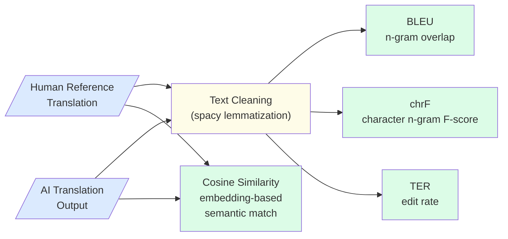
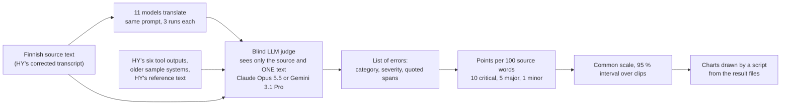
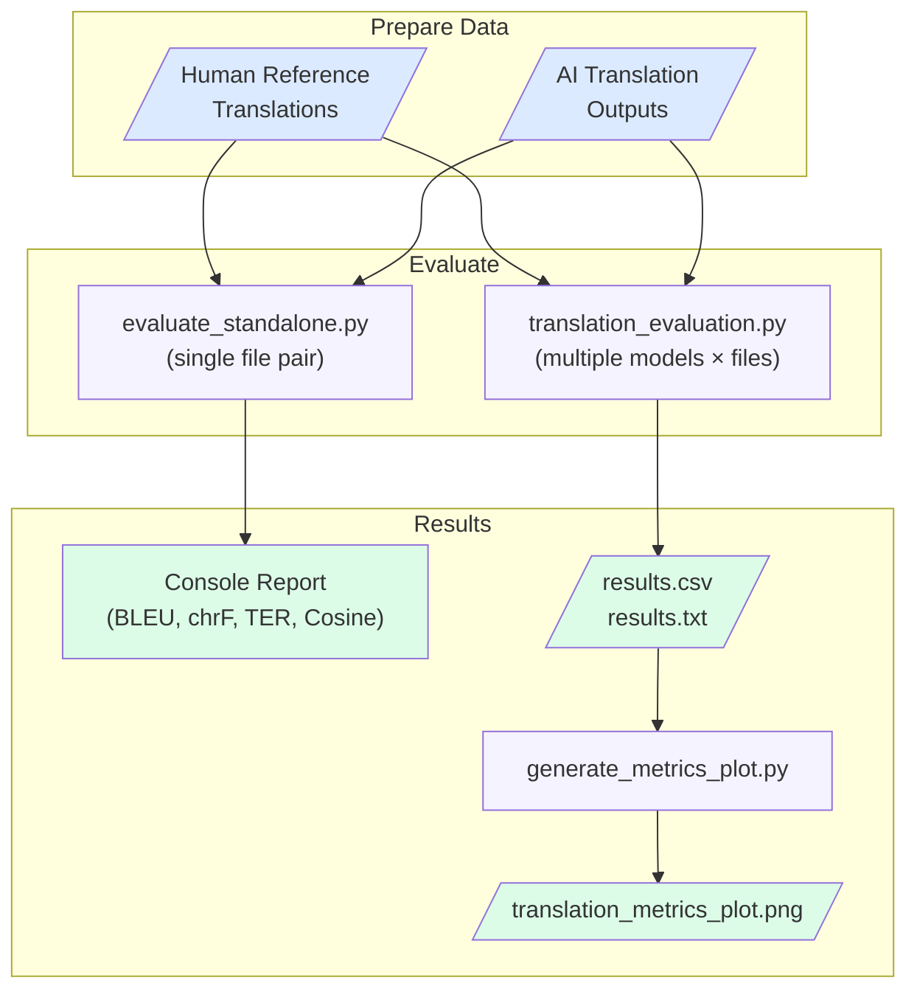

## The Problem

When AI systems transcribe and translate domain-specific spoken content — such as technical lectures, medical consultations, or training videos — the translation step introduces quality risks that are distinct from transcription errors. A translation can be fluent and grammatically correct while still using wrong terminology, losing key meaning, or rendering proper nouns incorrectly. Without systematic evaluation, these failures are hard to detect and even harder to compare across different translation approaches.

Key challenges include:
- **Domain terminology** — specialized fields (medical, legal, engineering) use precise vocabulary that general-purpose translation models frequently get wrong or approximate
- **Proper noun accuracy** — speaker names, product brands, and institution names are often garbled by AI translation
- **Structural divergence** — source language syntax (e.g. Finnish verb-final order) causes word-order changes that penalize exact-match metrics even when meaning is preserved
- **Compound word handling** — morphologically complex languages form multi-part technical terms that AI models split or merge inconsistently
- **Fluency vs accuracy trade-off** — a translation can read naturally in the target language while still departing from the reference wording in ways that matter for technical accuracy

---

## How We Evaluate

Translation quality is measured two ways. Four reference-based metrics compare each AI-generated translation against a human reference translation, and blind LLM judges annotate errors against the Finnish source without seeing the reference. The figure below shows the reference-based pipeline.

### Metrics Overview

| Metric | Measures | Better when |
|--------|----------|------------|
| **BLEU** | N-gram phrase overlap between hypothesis and reference | Higher |
| **chrF** | Character n-gram F-score — handles morphological variation | Higher |
| **TER** | Edit operations needed to transform hypothesis to reference | Lower |
| **Cosine Similarity** | Semantic closeness via transformer embeddings | Higher |
| **MQM error points** | Errors per 100 source words found by two blind LLM judges, weighted by severity (critical 10, major 5, minor 1); no reference needed | Lower |

### Text Normalization

Before computing BLEU, chrF, and TER, both the reference and hypothesis texts are lemmatized using spacy's English pipeline: alphabetic tokens only, reduced to their base form. This normalizes inflectional variation (e.g. "running" → "run") so that morphological differences between reference and hypothesis do not unfairly penalize semantically correct translations.

Cosine Similarity is computed on the raw (non-lemmatized) texts to preserve semantic nuance in the embedding space.

### Metric Interpretation

**BLEU** rewards translations that use the same phrases as the reference. It is strict — paraphrases score lower even if correct. Smoothing is applied to handle short texts.

**chrF** operates at the character level and is more forgiving of morphological variation and partial word matches. Particularly useful for morphologically rich source languages like Finnish.

**TER** directly models post-editing effort: a TER of 50% means that 50% of the reference words need to be edited (inserted, deleted, substituted, or shifted). Lower TER means less correction work.

**Cosine Similarity** captures meaning preservation independent of exact wording. A translation can score low on BLEU but high on Cosine Similarity if it correctly paraphrases the reference.

---

## Benchmarking Results

**GPT-6 Astra translates best.** Two blind LLM judges found the fewest errors in it on both clip sets, and the human references scored worse than every current model.

### Which model is best? A 20-clip evaluation with blind judges

Eleven current models (three runs each) were tested against six outputs committed by the University of Helsinki (HY) team and the human reference, on all 20 HY clips of Finnish dental-education speech. The clips form two sets that are never pooled: **set A** (10 historical clips with human references, used for the ranking) and **set B** (10 newer clips, used only to check that the order holds, because its reference resembles one machine-translation system's output). Every text was scored by two blind LLM judges (Claude Opus 5.5 and Gemini 3.1 Pro) that read only the Finnish source and one candidate, and by BLEU, chrF, TER and embedding cosine. The Finnish input is HY's corrected transcript, so this tests translation only.

Error points per 100 source words, lower is better, both judges on one scale:

| Model | Set A | Set B |
|-------|------:|------:|
| **GPT-6 Astra** | **0.3** | **0.6** |
| GPT-6 Sol | 0.8 | 1.4 |
| Claude Opus 5.5 | 1.2 | 2.2 |
| GPT-6 Luna | 1.5 | 1.9 |
| GPT-5.5 | 2.0 | 2.9 |
| Gemini 3.1 Pro | 2.2 | 2.1 |
| Gemini 3.5 Flash | 3.0 | 2.1 |
| GPT-4.1 | 2.2 | 3.1 |
| GPT-5.4 mini | 4.8 | 5.2 |
| GPT-4o | 4.5 | 7.4 |
| **Human reference** | **7.9** | **15.2** |
| HY: OpusBig / Opus (Helsinki-NLP) | 23.5 / 26.4 | 26.5 / 33.7 |

Claude and Gemini models were scored by the other vendor's judge only (a judge never scores its own vendor), then converted to the common scale with the ratio fitted on the 12 candidates both judges scored.

### The toolkit scripts on all 15 model folders

The reference-based scores of `translation_evaluation.py` (means over the 10 set A clips), next to the judges' error rate, sorted by the judges' error rate:

| Model | Errors per 100 words (judges) | BLEU ↑ | chrF ↑ | TER ↓ | Cosine ↑ |
|-------|------:|------:|------:|------:|------:|
| GPT-6 Astra | **0.3** | 30.4 | 69.3 | 60.9 | 93.1 |
| GPT-6 Sol | **0.8** | 29.3 | 66.8 | 58.7 | 93.0 |
| Claude-Opus-5.5 | **1.2** | 35.8 | 72.1 | 53.8 | 93.9 |
| GPT-6 Luna | **1.5** | 29.9 | 68.0 | 59.0 | 92.8 |
| GPT-5.5 | **2.0** | 33.6 | 72.2 | 57.2 | 93.7 |
| GPT-4.1 | **2.2** | 39.6 | 73.4 | 50.4 | 95.3 |
| Gemini-3.1-Pro | **2.2** | 35.9 | 73.4 | 56.8 | 94.6 |
| Claude-Sonnet-5.5 | **2.8** | 36.5 | 72.0 | 53.9 | 94.3 |
| Gemini-3.5-Flash | **3.0** | 36.8 | 73.0 | 53.0 | 94.9 |
| GPT-4o | **4.5** | 38.6 | 69.8 | 46.1 | 93.7 |
| GPT-5.4-mini | **4.8** | 34.8 | 72.4 | 56.3 | 94.4 |
| QAdental app, older translation (folder `gpt-5.1`) | **8.0** | 33.4 | 68.8 | 53.9 | 93.8 |
| OpusBig, Opus-MT big (older sample) | **23.1** | 28.0 | 66.5 | 62.8 | 92.6 |
| Opus-MT (older sample) | **26.8** | 26.2 | 64.1 | 65.4 | 90.6 |
| T5 (older sample) | **53.5** | 11.6 | 50.7 | 91.5 | 60.0 |

The reference-based columns do not follow the judges' order. The QAdental app's older translation has about as many judged errors as HY's own reference text (7.9).

### Key Findings

- **GPT-6 Astra translated best on both sets and with both judges**, clearly ahead of every model run here; its lead over HY's committed GPT-5.6-sol file is borderline (0.3 points)
- **Reference-based metrics ranked the models almost unrelated to the judges on set A and in reverse on set B** (Spearman agreement -0.16 to -0.27 and -0.55 to -0.70; 1 means the same order), so BLEU, chrF or cosine alone would have picked a different, worse model
- **The human reference is not a clean gold standard** — the judges score it at 7.9 and 15.2 error points, above every current LLM; one set A reference is incomplete, and set B's reference is close to OpusBig's output, so OpusBig ranks first on set B by BLEU (68) while the judges rank it near the bottom
- **The Helsinki-NLP models make more than ten times as many errors as the top four LLMs** (23-34 points against 0.3-1.4)
- **Limits** — the judges are LLMs and no human has checked their annotations; differences of a few tenths of a point between the top models are within judge noise

### How the judging works

The judge is blind (it sees only the Finnish source and one text, with no model or vendor name, and HY's reference text is judged like any model). It returns every error with an MQM category, a severity and the quoted words; points are 10, 5 and 1 for critical, major and minor errors per 100 source words. Claude never judges Claude and Gemini never judges Gemini, and scores are put on one scale. The charts are plain SVG drawn by a script from the result files, not AI-generated images, so every bar is a number in a file.

---

## Error Classification

### Domain Terminology Errors

**Problem**: General-purpose translation models frequently mistranslate or approximate domain-specific terms. Finnish dental terminology is converted to phonetically similar but semantically wrong English words.

**Impact**: Critical content errors that would mislead professional readers and require correction before any practical use.

### Proper Noun Degradation

**Problem**: Speaker names, product brands, and institution names are garbled or phonetically approximated rather than preserved.

**Impact**: Attribution and traceability are broken; errors are especially noticeable to people who know the original source material.

### Word-Order Divergence

**Problem**: Finnish syntax differs structurally from English, causing translated output to reorder phrases in ways that differ from the reference even when meaning is preserved.

**Impact**: Increases TER and reduces BLEU scores even for semantically correct translations — metrics may underestimate quality for structure-divergent language pairs.

### Compound Word Inconsistency

**Problem**: Finnish medical compounds (e.g. "periimplantiitti") are split, merged, or hyphenated inconsistently across different translation systems.

**Impact**: BLEU and chrF penalties even when the underlying meaning is correct; inconsistency makes downstream NLP processing less reliable.

---

## Real-World Applications

Translation evaluation supports the following GAIK workflows:

- **Domain-specific video transcription and translation** — quality assessment before publishing multilingual subtitles or transcripts for educational or professional content
- **Dental and medical lecture localization** — evaluating Finnish-to-English (or other language pair) translation of specialist recordings as part of knowledge distribution workflows
- **Translation model selection** — benchmarking general-purpose vs. domain-adapted models to choose the right tool for a given domain before production deployment

---

## Quality Considerations

**Use multiple metrics together, and do not let the reference-based ones decide alone** — no single metric tells the full story. In the 20-clip evaluation the reference-based metrics ranked the models almost unrelated to the judges on one set and in reverse on the other.

**Model generation matters more than domain adaptation** — in the 20-clip evaluation the current LLMs made more than ten times fewer errors than the Helsinki-NLP translation models on dental speech, and the newest GPT-6 models led. Terminology injection can still help with names and specialist terms, but choose the model on judged quality, not on distance to a reference.

**TER reflects real editing effort** — if post-editing by human translators is part of your workflow, TER is the most actionable metric: it directly estimates the number of corrections needed per document.

**Cosine Similarity depends on the embedding model** — scores reflect semantic similarity as measured by the chosen transformer. For highly specialized domains, consider using a domain-adapted or multilingual embedding model for more reliable results.

**Reference quality caps reference-based evaluation** — BLEU, chrF, TER and cosine assume the human reference is the gold standard. In this data the judges scored the reference at 7.9 and 15.2 error points per 100 words, above every current LLM, one reference was incomplete, and another set's reference resembled one machine-translation system's output. Check each reference, and add reference-free judging before ranking models.

---

## Getting Started

The figure below shows the complete evaluation workflow from data preparation to results.

To run the evaluation on the provided sample data:

1. Navigate to `evaluation_layer/eval_methods/translation_eval/`
2. Install dependencies: `pip install -r requirements.txt && python -m spacy download en_core_web_sm`
3. Run `python src/evaluate_standalone.py` — evaluates all 10 sample file pairs of the legacy sample folder and prints a metrics report with averages
4. To evaluate multiple models, place outputs under `data/translation_results/<model_name>/` and run `python src/translation_evaluation.py`
5. After batch evaluation, run `python src/generate_metrics_plot.py` to generate the comparison chart
6. Review results in `evaluation_results/results.csv` and `evaluation_results/translation_metrics_plot.png`

For technical details, scripts, and sample data, visit the [GAIK GitHub repository](https://github.com/GAIK-project/gaik-toolkit/tree/main/evaluation_layer/eval_methods/translation_eval).
