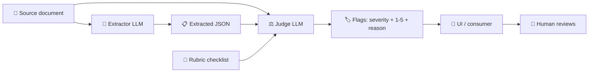

## What it is

`LLMJudge` is a vision-capable LLM that reads page images and an extractor's
JSON output, then flags fields whose value does not match the document. It
ships with v2 (2026 research-backed) features:

- **Integer Likert 1-5 scoring** alongside severity (~30 % better
  human-correlation than continuous scales).
- **Few-shot calibration** via reference examples (1-2 are the sweet spot).
- **Panel/jury aggregation** with `LLMJudgePanel` (3+ judges, majority vote,
  agreement metric).
- **Pairwise A/B comparison** with position-bias mitigation
  (`compare_pairwise(swap_and_average=True)`).
- **Calibration utility** that returns Pearson r vs. human raters.

## What happens when you turn it on

The validator is a **second LLM pass** over the first extractor's output.
Three inputs go to the judge, one structured response comes back:

1. **Source pages** — the original document as one or more images.
2. **Extracted JSON** — what the first extractor produced (the structured
   fields the user is about to confirm).
3. **Rubric** — a short checklist of what to verify, including any
   domain-specific failure modes you have seen in the wild.

The judge LLM returns one entry per field with a severity
(`ok` / `suspect` / `wrong`), an integer 1-5 Likert score, a short reason,
and — when readable from the source — a suggested correct value. The
application then surfaces those flags in the UI so a human can review
them before confirming.

In other words: the parsed result is handed to an LLM with the source
document, and the LLM is asked *"is this right?"* — exactly as a human
reviewer would do, but consistently across every record.



<Callout type="info">
**Wondering whether the research-backed prompt is actually worth it?**
The [LLM-Judge Prompt Benchmark](/toolkit/evals/llm-judge-benchmark)
runs the naive 1-10 baseline against the prompt design described below
on the public [JudgeBench](https://hf.co/datasets/ScalerLab/JudgeBench)
dataset and reports the empirical delta.
</Callout>

### The simplest possible usage

You do not need a calibration dataset, a panel of judges, or a pairwise
comparison to start. The minimum viable setup is **one judge, one call,
one rubric** — give it the document, the extractor's output, and a
short checklist. That is exactly how the
[Luvata OC Builder](https://github.com/GAIK-project/Luvata) consumes the
component in production: a single `LLMJudge.validate()` call per
purchase order, opt-in via a UI toggle.

The advanced features below (panels, pairwise, calibration) are tools
you reach for **after** the basic pass is in place — when you want to
quantify judge reliability, track regressions, or A/B-test prompt
variants. Skip them on day one.

## Why this design

- **Likert over float**: the
  [HuggingFace LLM Judge cookbook](https://huggingface.co/learn/cookbook/llm_judge)
  reports a ~30 % improvement in human-correlation when moving from
  float scales (0-10) to integer Likert (1-4 or 1-5).
- **Severity + Likert together**: severity stays as the action gate
  ("ok / suspect / wrong" maps cleanly to UI badges), score gives a stable
  numeric signal for tracking regressions.
- **Cross-model panels**: judges have self-preference bias — they score
  outputs that look familiar to their own policy more leniently
  ([arXiv 2604.22891](https://arxiv.org/html/2604.22891)). Pairing
  providers from different families (Gemini + Claude + GPT) averages
  this out.
- **Position-bias mitigation in pairwise**: GPT-4-class judges flip
  their decision ~40 % of the time when A and B are swapped
  ([Justice or Prejudice, OpenReview 2024](https://openreview.net/forum?id=3GTtZFiajM)).
  The `swap_and_average` flag runs the comparison twice and only
  declares a winner when both passes agree.

## Quick start

```python
from gaik.software_components.validators import LLMJudge, ValidationRubric

judge = LLMJudge(
    model_provider="google",
    model="gemini-3-flash-preview",
    use_vertexai=True,
)

result = judge.validate(
    source_pages=[png_bytes_page1],
    extracted=[{"item_index": 0, "quantity": "940"}],
    rubric=ValidationRubric(
        scoring_mode="likert_1_5",
        field_checks=["Quantity is integer pounds before decimal"],
    ),
)

for flag in result.flags:
    print(flag.field, flag.severity, f"{flag.score}/5", flag.reason)
```

## End-to-end synthetic example

A complete walkthrough with a fictitious vendor and a single bug planted
in the extracted output. No real PDF or API key needed if you stub the
judge — but the same code shape works against a live model.

```python
from pathlib import Path

from gaik.software_components.validators import (
    LLMJudge,
    ValidationRubric,
)

# 1. The extractor's output (what the first LLM produced from the PDF)
#    For the demo we hand-write it. In production this comes from the
#    multimodal parser. Notice item_index=0 has quantity "10" — wrong;
#    the PDF actually shows the line ordered for 1500 units (the "10"
#    came from the unit-price column).
extracted = [
    {
        "item_index": 0,
        "item_number": "10",
        "material_number": "PART-A-001",
        "quantity": "10",
        "delivery_date": "2026-06-15",
    },
    {
        "item_index": 1,
        "item_number": "20",
        "material_number": "PART-A-002",
        "quantity": "500",
        "delivery_date": "2026-06-15",
    },
]

# 2. Page images of the source PDF — render once, reuse for the judge
pages = [Path("sample_po_page1.png").read_bytes()]

# 3. Rubric: a checklist of failure modes you have seen on this kind
#    of document. Short instructions nudge the judge toward the bugs
#    that matter for your domain.
rubric = ValidationRubric(
    vendor_id="acme-supply",
    scoring_mode="likert_1_5",
    field_checks=[
        "quantity must equal the line-amount column, not the unit-price column.",
        "delivery_date must be ISO format YYYY-MM-DD.",
        "material_number must match the part code printed on the PDF row.",
    ],
    item_level_checks=[
        "If the PDF lists more rows than the JSON does, emit a flag with "
        "item_index=-1 and field='_document.item_count'.",
    ],
)

# 4. Run the judge
judge = LLMJudge(
    model_provider="google",
    model="gemini-3-flash-preview",
    use_vertexai=True,
)
result = judge.validate(source_pages=pages, extracted=extracted, rubric=rubric)

# 5. Inspect what the judge returned
for f in result.flags:
    print(
        f"item={f.item_index} field={f.field:20s} "
        f"severity={f.severity:8s} score={f.score}/5 -> {f.reason}"
    )

# Expected output (judge correctly catches the planted bug):
# item=0 field=quantity            severity=wrong    score=1/5 -> PDF shows line ordered for 1500; "10" is the unit-price column.
# item=0 field=delivery_date       severity=ok       score=5/5 -> Matches PDF row 10.
# item=0 field=material_number     severity=ok       score=5/5 -> Matches PDF row 10.
# item=1 field=quantity            severity=ok       score=5/5 -> Matches PDF row 20.
# item=1 field=delivery_date       severity=ok       score=5/5 -> Matches PDF row 20.
# item=1 field=material_number     severity=ok       score=5/5 -> Matches PDF row 20.

print(f"Cost: ${result.usage.cost_usd:.4f}, latency: {result.usage.duration_s:.1f}s")
```

The application now has `result.flags` to render in the UI: red chip on
row 0 for the wrong quantity, no chips on row 1, and the user fixes that
one cell before confirming the order.

## Scoring modes

| `scoring_mode` | Output | When to use |
| --- | --- | --- |
| `"severity"` | Severity only — `flag.score = 0` | Simple yes/no/maybe gates. |
| `"likert_1_5"` | Severity + integer 1-5 score | Calibration, regression-tracking, anywhere you want a numeric metric. |
| `"additive"` | Severity + 1 point per `evaluation_aspect` | When the rubric is a checklist of independent criteria. |

The severity-to-score mapping the prompt enforces:

- score 1 → `"wrong"`
- score 2-3 → `"suspect"`
- score 4-5 → `"ok"`

## Panel / jury

```python
from gaik.software_components.validators import LLMJudge, LLMJudgePanel, ValidationRubric

panel = LLMJudgePanel(judges=[
    LLMJudge(model_provider="google", model="gemini-3-flash-preview"),
    LLMJudge(model_provider="anthropic", model="claude-haiku-4-5-20251001"),
    LLMJudge(model_provider="azure", model="gpt-5.4-mini"),
])

result = panel.validate(source_pages, extracted, ValidationRubric(scoring_mode="likert_1_5"))
print(f"Agreement: {result.agreement_score:.1%}")
for flag in result.aggregated_flags:
    print(flag.severity, flag.score, flag.field, flag.reason)
```

The panel runs each judge sequentially. Cost is the sum of per-judge calls;
latency is sequential. Aggregation rules:

- **Severity** = mode across judges; ties resolve to the worst severity.
- **Score** = median of non-zero Likert scores.
- **`agreement_score`** = fraction of `(item_index, field)` keys where ALL
  judges produced the same severity.

## Pairwise A/B comparison

```python
from gaik.software_components.validators import LLMJudge, compare_pairwise

judge = LLMJudge(model_provider="google", model="gemini-3-flash-preview")

result = compare_pairwise(
    judge=judge,
    source_pages=pages,
    extracted_a=output_from_prompt_v1,
    extracted_b=output_from_prompt_v2,
    swap_and_average=True,  # mitigate position bias
)

print(result.winner, result.score_a, result.score_b, result.swap_consistent)
```

When `swap_and_average=True` (recommended), the comparison runs twice with A
and B swapped and only reports a winner when both passes agree. Otherwise
the result is forced to `"tie"` and `swap_consistent=False`.

## Calibration against human labels

```python
from gaik.software_components.validators import (
    CalibrationItem,
    LLMJudge,
    ValidationRubric,
    calibrate_against_human_labels,
)

dataset = [
    CalibrationItem(source_pages=..., extracted=..., human_score=5, human_severity="ok"),
    # ... 30 hand-labeled items in total
]
report = calibrate_against_human_labels(
    judge=LLMJudge(model_provider="google"),
    dataset=dataset,
    rubric=ValidationRubric(scoring_mode="likert_1_5"),
)
print(report)
# CalibrationReport(n=30, pearson_r=0.847 ✓ at HF reference,
#   severity_agreement=86.7%, mean_judge=3.40, mean_human=3.50)
```

The HuggingFace cookbook reference Pearson is ~0.84. If your judge is below
that, iterate on the rubric (better field checks, more relevant evaluation
aspects, 1-2 few-shot examples) and re-run.

## Best practices — when to use which feature

The full v2 surface is a **menu**, not a contract. Pick the smallest set
that matches your use case; reach for the rest only when you have
evidence you need them.

| Need | Reach for | Skip if |
| --- | --- | --- |
| Spot-check extractor output, opt-in toggle in a UI | Single `LLMJudge.validate()` per record | Toggle is opt-in and low-risk — no calibration needed on day one |
| Always-on validation gating customer-facing values | Calibration first ([Pearson r ≥ 0.7 vs ~30 human labels](#calibration-against-human-labels)), then deploy | You haven't shipped opt-in yet — add the toggle first, calibrate later |
| High-stakes scoring where one judge's variance is the risk | `LLMJudgePanel` with 3 cross-provider judges | Latency / cost matter more than variance — sequential calls add up |
| A/B-testing two prompt or model versions | `compare_pairwise(swap_and_average=True)` | You only have one version |
| Quoting a tracked numeric KPI (e.g. dashboards) | `scoring_mode="likert_1_5"` so scores are comparable across runs | Severity-only is enough for the UI |
| Empirical evidence that the research-backed prompt beats naive 1-10 | [`JudgeBenchmark`](/toolkit/evals/llm-judge-benchmark) on JudgeBench HF dataset | You trust the cited research and don't need to demo it |

The [Luvata OC Builder](https://github.com/GAIK-project/Luvata) currently
runs only the first row — single judge call, opt-in toggle, no
calibration yet — and is in production. The advanced features are there
when the use case justifies the extra complexity.

## Picking a model

Benchmarked on five hand-curated Luvata test cases:

| Pipeline | F1 | Cost / call | Latency |
| --- | ---: | ---: | ---: |
| `gemini-3-flash-preview` (Vertex) | 1.000 | $0.0041 | 37.6 s |
| `gpt-5.5` / `gpt-5.4` / `gpt-5.4-mini` | 0.750 | $0.004–0.024 | 11–25 s |
| `gemini-3.1-flash-lite-preview` | 0.750 | $0.0013 | 3.6 s |

**Default**: Gemini 3 Flash via Vertex. **Cheap screener**: Gemini 3.1 Flash Lite.

## Examples

- [`demo_llm_judge.py`](https://github.com/GAIK-project/gaik-toolkit/blob/main/implementation_layer/examples/software_components/validators/demo_llm_judge.py) — single-judge basic usage with Likert scoring.
- [`demo_likert_scoring.py`](https://github.com/GAIK-project/gaik-toolkit/blob/main/implementation_layer/examples/software_components/validators/demo_likert_scoring.py) — few-shot calibration on top of Likert mode.
- [`demo_panel_jury.py`](https://github.com/GAIK-project/gaik-toolkit/blob/main/implementation_layer/examples/software_components/validators/demo_panel_jury.py) — three-judge majority vote.
- [`demo_pairwise.py`](https://github.com/GAIK-project/gaik-toolkit/blob/main/implementation_layer/examples/software_components/validators/demo_pairwise.py) — A/B comparison with swap-and-average.
- [`demo_calibration.py`](https://github.com/GAIK-project/gaik-toolkit/blob/main/implementation_layer/examples/software_components/validators/demo_calibration.py) — Pearson-r calibration vs. a human-labeled dataset.

## Research references

- [HuggingFace LLM Judge Cookbook](https://huggingface.co/learn/cookbook/llm_judge)
- [A Survey on LLM-as-a-Judge (arXiv 2411.15594)](https://arxiv.org/abs/2411.15594)
- [Justice or Prejudice? Quantifying Biases (OpenReview)](https://openreview.net/forum?id=3GTtZFiajM)
- [Self-Preference Bias in LLM Judges (arXiv 2604.22891)](https://arxiv.org/html/2604.22891)
- [Evaluating and Mitigating LLM-as-a-judge Bias (arXiv 2510.12462)](https://arxiv.org/abs/2510.12462)
