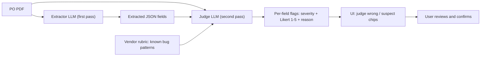
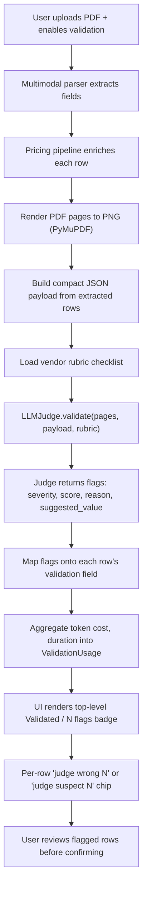

## What it is

`LLMJudge` is a vision-capable LLM that reads page images and an extractor's
JSON output, then flags fields whose value does not match the document. It
ships with v2 (2026 research-backed) features:

- **Integer Likert 1-5 scoring** alongside severity (~30 % better
  human-correlation than continuous scales).
- **Few-shot calibration** via reference examples (1-2 are the sweet spot).
- **Panel/jury aggregation** with `LLMJudgePanel` (3+ judges, majority vote,
  agreement metric).
- **Pairwise A/B comparison** with position-bias mitigation
  (`compare_pairwise(swap_and_average=True)`).
- **Calibration utility** that returns Pearson r vs. human raters.

## What happens when you turn it on

The validator is a **second LLM pass** over the first extractor's output.
Concretely, when validation is enabled the system:

1. Renders each PDF page to a PNG image in memory.
2. Builds a compact JSON payload from what the first extractor produced
   (the structured fields the user is about to confirm).
3. Loads a domain-specific rubric — a checklist of known failure modes
   (e.g. "quantity must be the integer pounds before the decimal",
   "delivery date must be in ISO format").
4. Sends the page images + the extracted JSON + the rubric to a second
   LLM with the system prompt: *"You are a quality validator. For every
   field, compare the JSON value against what the PDF actually says. If
   they disagree, flag it."*
5. The judge LLM returns one entry per field with a severity
   (`ok` / `suspect` / `wrong`), an integer 1-5 Likert score, a short
   reason, and (when readable from the PDF) a suggested correct value.
6. The application maps those flags onto the extractor's row data and
   the UI surfaces them as red / amber chips next to the affected rows
   so the user reviews them before confirming the order.

In other words: the parsed result is handed to an LLM with the source
document, and the LLM is asked *"is this right?"* — exactly as a human
reviewer would do, but consistently across every order.



A more detailed view of the runtime pipeline:



## Why this design

- **Likert over float**: HuggingFace cookbook reports a ~30 % improvement in
  human-correlation when moving from float scales (0-10) to integer Likert
  (1-4 or 1-5).
- **Severity + Likert together**: severity stays as the action gate
  ("ok / suspect / wrong" maps cleanly to UI badges), score gives a stable
  numeric signal for tracking regressions.
- **Cross-model panels**: judges have self-preference bias — they score
  outputs that look familiar to their own policy more leniently
  (arXiv 2604.22891). Pairing providers from different families
  (Gemini + Claude + GPT) averages this out.
- **Position-bias mitigation in pairwise**: GPT-4-class judges flip their
  decision ~40 % of the time when A and B are swapped (Justice or Prejudice,
  OpenReview 2024). The `swap_and_average` flag runs the comparison twice
  and only declares a winner when both passes agree.

## Quick start

```python
from gaik.software_components.validators import LLMJudge, ValidationRubric

judge = LLMJudge(
    model_provider="google",
    model="gemini-3-flash-preview",
    use_vertexai=True,
)

result = judge.validate(
    source_pages=[png_bytes_page1],
    extracted=[{"item_index": 0, "quantity": "940"}],
    rubric=ValidationRubric(
        scoring_mode="likert_1_5",
        field_checks=["Quantity is integer pounds before decimal"],
    ),
)

for flag in result.flags:
    print(flag.field, flag.severity, f"{flag.score}/5", flag.reason)
```

## Scoring modes

| `scoring_mode` | Output | When to use |
| --- | --- | --- |
| `"severity"` | Severity only — `flag.score = 0` | Simple yes/no/maybe gates. |
| `"likert_1_5"` | Severity + integer 1-5 score | Calibration, regression-tracking, anywhere you want a numeric metric. |
| `"additive"` | Severity + 1 point per `evaluation_aspect` | When the rubric is a checklist of independent criteria. |

The severity-to-score mapping the prompt enforces:

- score 1 → `"wrong"`
- score 2-3 → `"suspect"`
- score 4-5 → `"ok"`

## Panel / jury

```python
from gaik.software_components.validators import LLMJudge, LLMJudgePanel, ValidationRubric

panel = LLMJudgePanel(judges=[
    LLMJudge(model_provider="google", model="gemini-3-flash-preview"),
    LLMJudge(model_provider="anthropic", model="claude-haiku-4-5-20251001"),
    LLMJudge(model_provider="azure", model="gpt-5.4-mini"),
])

result = panel.validate(source_pages, extracted, ValidationRubric(scoring_mode="likert_1_5"))
print(f"Agreement: {result.agreement_score:.1%}")
for flag in result.aggregated_flags:
    print(flag.severity, flag.score, flag.field, flag.reason)
```

The panel runs each judge sequentially. Cost is the sum of per-judge calls;
latency is sequential. Aggregation rules:

- **Severity** = mode across judges; ties resolve to the worst severity.
- **Score** = median of non-zero Likert scores.
- **`agreement_score`** = fraction of `(item_index, field)` keys where ALL
  judges produced the same severity.

## Pairwise A/B comparison

```python
from gaik.software_components.validators import LLMJudge, compare_pairwise

judge = LLMJudge(model_provider="google", model="gemini-3-flash-preview")

result = compare_pairwise(
    judge=judge,
    source_pages=pages,
    extracted_a=output_from_prompt_v1,
    extracted_b=output_from_prompt_v2,
    swap_and_average=True,  # mitigate position bias
)

print(result.winner, result.score_a, result.score_b, result.swap_consistent)
```

When `swap_and_average=True` (recommended), the comparison runs twice with A
and B swapped and only reports a winner when both passes agree. Otherwise
the result is forced to `"tie"` and `swap_consistent=False`.

## Calibration against human labels

```python
from gaik.software_components.validators import (
    CalibrationItem,
    LLMJudge,
    ValidationRubric,
    calibrate_against_human_labels,
)

dataset = [
    CalibrationItem(source_pages=..., extracted=..., human_score=5, human_severity="ok"),
    # ... 30 hand-labeled items in total
]
report = calibrate_against_human_labels(
    judge=LLMJudge(model_provider="google"),
    dataset=dataset,
    rubric=ValidationRubric(scoring_mode="likert_1_5"),
)
print(report)
# CalibrationReport(n=30, pearson_r=0.847 ✓ at HF reference,
#   severity_agreement=86.7%, mean_judge=3.40, mean_human=3.50)
```

The HuggingFace cookbook reference Pearson is ~0.84. If your judge is below
that, iterate on the rubric (better field checks, more relevant evaluation
aspects, 1-2 few-shot examples) and re-run.

## Picking a model

Benchmarked on five hand-curated Luvata test cases:

| Pipeline | F1 | Cost / call | Latency |
| --- | ---: | ---: | ---: |
| `gemini-3-flash-preview` (Vertex) | 1.000 | $0.0041 | 37.6 s |
| `gpt-5.5` / `gpt-5.4` / `gpt-5.4-mini` | 0.750 | $0.004–0.024 | 11–25 s |
| `gemini-3.1-flash-lite-preview` | 0.750 | $0.0013 | 3.6 s |

**Default**: Gemini 3 Flash via Vertex. **Cheap screener**: Gemini 3.1 Flash Lite.

## Examples

- [`demo_llm_judge.py`](https://github.com/aakselileskinen/gaik-toolkit/blob/main/implementation_layer/examples/software_components/validators/demo_llm_judge.py) — single-judge basic usage with Likert scoring.
- [`demo_likert_scoring.py`](https://github.com/aakselileskinen/gaik-toolkit/blob/main/implementation_layer/examples/software_components/validators/demo_likert_scoring.py) — few-shot calibration on top of Likert mode.
- [`demo_panel_jury.py`](https://github.com/aakselileskinen/gaik-toolkit/blob/main/implementation_layer/examples/software_components/validators/demo_panel_jury.py) — three-judge majority vote.
- [`demo_pairwise.py`](https://github.com/aakselileskinen/gaik-toolkit/blob/main/implementation_layer/examples/software_components/validators/demo_pairwise.py) — A/B comparison with swap-and-average.
- [`demo_calibration.py`](https://github.com/aakselileskinen/gaik-toolkit/blob/main/implementation_layer/examples/software_components/validators/demo_calibration.py) — Pearson-r calibration vs. a human-labeled dataset.

## Research references

- [HuggingFace LLM Judge Cookbook](https://huggingface.co/learn/cookbook/llm_judge)
- [A Survey on LLM-as-a-Judge (arXiv 2411.15594)](https://arxiv.org/abs/2411.15594)
- [Justice or Prejudice? Quantifying Biases (OpenReview)](https://openreview.net/forum?id=3GTtZFiajM)
- [Self-Preference Bias in LLM Judges (arXiv 2604.22891)](https://arxiv.org/html/2604.22891)
- [Evaluating and Mitigating LLM-as-a-judge Bias (arXiv 2510.12462)](https://arxiv.org/abs/2510.12462)
