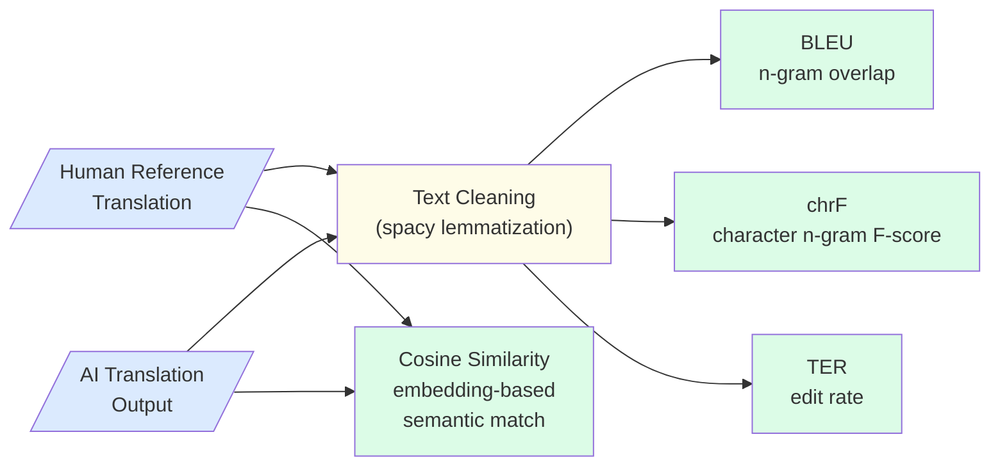
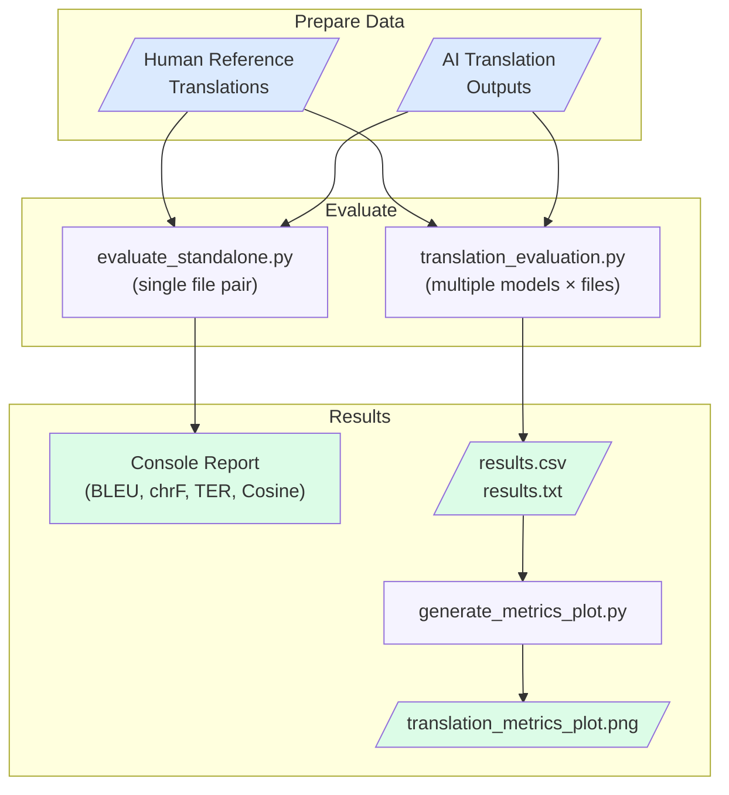

## The Problem

When AI systems transcribe and translate domain-specific spoken content — such as technical lectures, medical consultations, or training videos — the translation step introduces quality risks that are distinct from transcription errors. A translation can be fluent and grammatically correct while still using wrong terminology, losing key meaning, or rendering proper nouns incorrectly. Without systematic evaluation, these failures are hard to detect and even harder to compare across different translation approaches.

Key challenges include:
- **Domain terminology** — specialized fields (medical, legal, engineering) use precise vocabulary that general-purpose translation models frequently get wrong or approximate
- **Proper noun accuracy** — speaker names, product brands, and institution names are often garbled by AI translation
- **Structural divergence** — source language syntax (e.g. Finnish verb-final order) causes word-order changes that penalize exact-match metrics even when meaning is preserved
- **Compound word handling** — morphologically complex languages form multi-part technical terms that AI models split or merge inconsistently
- **Fluency vs accuracy trade-off** — a translation can read naturally in the target language while still departing from the reference wording in ways that matter for technical accuracy

---

## How We Evaluate

Translation quality is measured by comparing each AI-generated translation against a human reference translation using four complementary metrics. The figure below shows the evaluation pipeline.

### Metrics Overview

| Metric | Measures | Better when |
|--------|----------|------------|
| **BLEU** | N-gram phrase overlap between hypothesis and reference | Higher |
| **chrF** | Character n-gram F-score — handles morphological variation | Higher |
| **TER** | Edit operations needed to transform hypothesis to reference | Lower |
| **Cosine Similarity** | Semantic closeness via transformer embeddings | Higher |

### Text Normalization

Before computing BLEU, chrF, and TER, both the reference and hypothesis texts are lemmatized using spacy's English pipeline: alphabetic tokens only, reduced to their base form. This normalizes inflectional variation (e.g. "running" → "run") so that morphological differences between reference and hypothesis do not unfairly penalize semantically correct translations.

Cosine Similarity is computed on the raw (non-lemmatized) texts to preserve semantic nuance in the embedding space.

### Metric Interpretation

**BLEU** rewards translations that use the same phrases as the reference. It is strict — paraphrases score lower even if correct. Smoothing is applied to handle short texts.

**chrF** operates at the character level and is more forgiving of morphological variation and partial word matches. Particularly useful for morphologically rich source languages like Finnish.

**TER** directly models post-editing effort: a TER of 50% means that 50% of the reference words need to be edited (inserted, deleted, substituted, or shifted). Lower TER means less correction work.

**Cosine Similarity** captures meaning preservation independent of exact wording. A translation can score low on BLEU but high on Cosine Similarity if it correctly paraphrases the reference.

---

## Benchmarking Results

The evaluation was conducted on 10 dental lecture transcripts translated from Finnish to English. Human-produced reference translations were used as ground truth. Four translation approaches were compared.

### Model Performance

| Model | BLEU ↑ | chrF ↑ | TER ↓ | Cosine Sim ↑ |
|-------|-------:|-------:|------:|------------:|
| **gpt-5.1** | **33.38** | **68.81** | **53.90** | **93.84** |
| **OpusBig** | 28.01 | 66.52 | 62.80 | 92.59 |
| **Opus** | 26.18 | 64.14 | 65.41 | 90.59 |
| **T5** | 11.59 | 50.67 | 91.47 | 59.99 |

*↑ higher is better; ↓ lower is better*

### Key Findings

- **Domain specialization outperforms general models** — the domain-adapted tool leads on all four metrics, confirming that fine-tuning for specialized vocabulary makes a measurable difference
- **Claude Opus variants preserve meaning well** — both Opus configurations achieve Cosine Similarity above 90%, showing strong semantic fidelity even when exact n-gram overlap is moderate
- **Larger context improves quality** — OpusBig consistently outperforms base Opus across all metrics, indicating that more context helps translation coherence for technical content
- **General-purpose NMT fails on specialist content** — T5 scores TER of 91.47% and Cosine Similarity of only 59.99%, indicating both surface-level and semantic failure on dental terminology
- **BLEU scores are modest overall** — even the best model reaches only 33.38 BLEU, reflecting the difficulty of exactly matching human phrasing in a specialized domain

---

## Error Classification

### Domain Terminology Errors

**Problem**: General-purpose translation models frequently mistranslate or approximate domain-specific terms. Finnish dental terminology is converted to phonetically similar but semantically wrong English words.

**Impact**: Critical content errors that would mislead professional readers and require correction before any practical use.

### Proper Noun Degradation

**Problem**: Speaker names, product brands, and institution names are garbled or phonetically approximated rather than preserved.

**Impact**: Attribution and traceability are broken; errors are especially noticeable to people who know the original source material.

### Word-Order Divergence

**Problem**: Finnish syntax differs structurally from English, causing translated output to reorder phrases in ways that differ from the reference even when meaning is preserved.

**Impact**: Increases TER and reduces BLEU scores even for semantically correct translations — metrics may underestimate quality for structure-divergent language pairs.

### Compound Word Inconsistency

**Problem**: Finnish medical compounds (e.g. "periimplantiitti") are split, merged, or hyphenated inconsistently across different translation systems.

**Impact**: BLEU and chrF penalties even when the underlying meaning is correct; inconsistency makes downstream NLP processing less reliable.

---

## Real-World Applications

Translation evaluation supports the following GAIK workflows:

- **Domain-specific video transcription and translation** — quality assessment before publishing multilingual subtitles or transcripts for educational or professional content
- **Dental and medical lecture localization** — evaluating Finnish-to-English (or other language pair) translation of specialist recordings as part of knowledge distribution workflows
- **Translation model selection** — benchmarking general-purpose vs. domain-adapted models to choose the right tool for a given domain before production deployment

---

## Quality Considerations

**Use multiple metrics together** — no single metric tells the full story. A model can score moderately on BLEU but excellently on Cosine Similarity if it paraphrases correctly. Reviewing all four gives a more accurate picture than any one alone.

**Domain matters more than model size** — the results show a domain-adapted specialized tool outperforming large general models. For specialized content, domain adaptation or terminology injection is more valuable than raw model scale.

**TER reflects real editing effort** — if post-editing by human translators is part of your workflow, TER is the most actionable metric: it directly estimates the number of corrections needed per document.

**Cosine Similarity depends on the embedding model** — scores reflect semantic similarity as measured by the chosen transformer. For highly specialized domains, consider using a domain-adapted or multilingual embedding model for more reliable results.

**Reference quality caps evaluation quality** — all metrics assume the human reference is the gold standard. If reference translations have inconsistencies or style variation, metric scores will reflect those differences too.

---

## Getting Started

The figure below shows the complete evaluation workflow from data preparation to results.

To run the evaluation on the provided sample data:

1. Install dependencies: `pip install -r requirements.txt && python -m spacy download en_core_web_sm`
2. Navigate to `implementation_layer/eval_methods/translation_eval/`
3. Run `python src/evaluate_standalone.py` — evaluates all 10 sample file pairs and prints a metrics report with averages
4. To evaluate multiple models, place outputs under `data/translation_results/<model_name>/` and run `python src/translation_evaluation.py`
5. After batch evaluation, run `python src/generate_metrics_plot.py` to generate the comparison chart
6. Review results in `evaluation_results/results.csv` and `evaluation_results/translation_metrics_plot.png`

For technical details, scripts, and sample data, visit the [GAIK GitHub repository](https://github.com/GAIK-project/gaik-toolkit/tree/main/implementation_layer/eval_methods/translation_eval).
