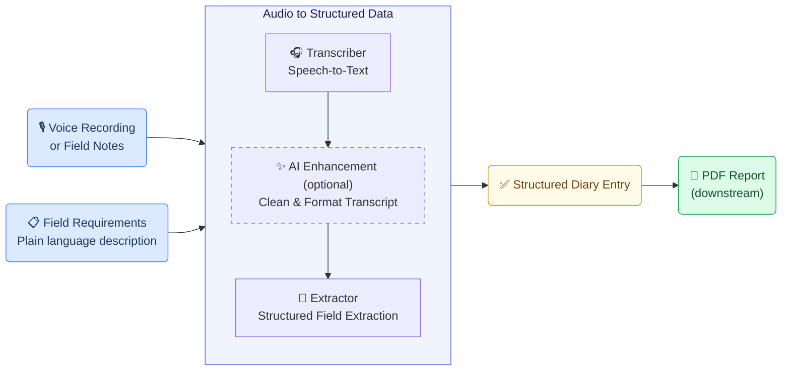
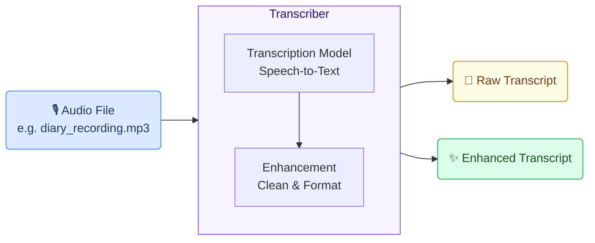
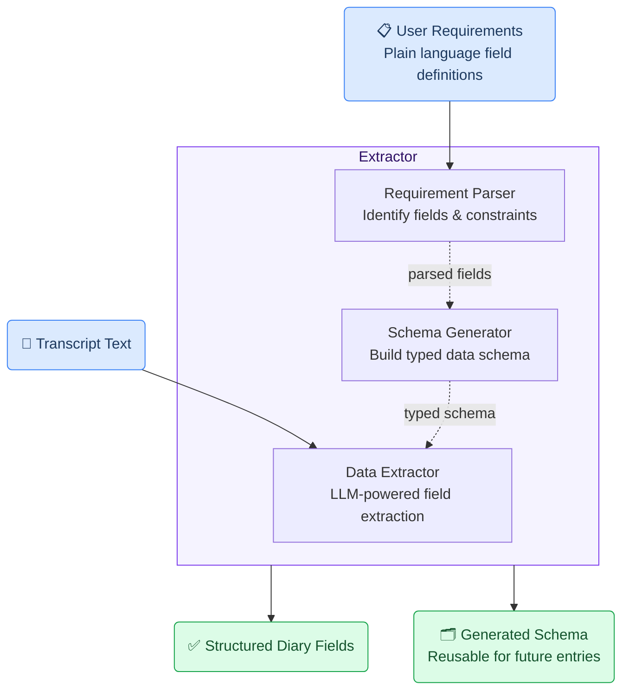
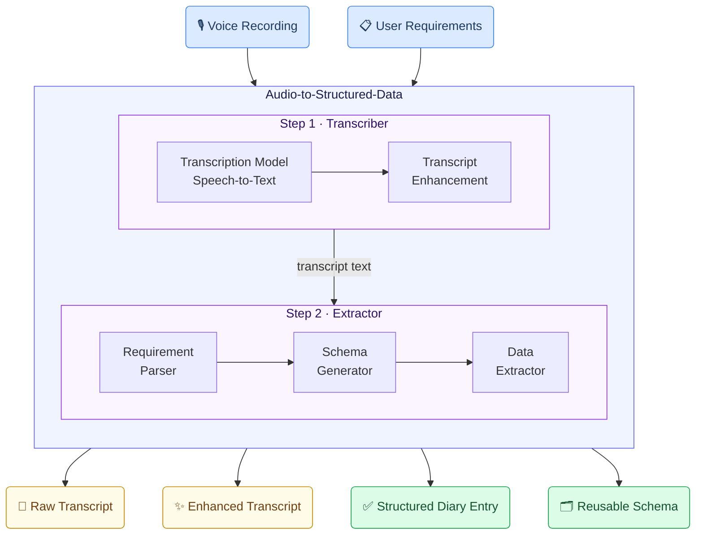

# Construction Site Diary Creation Generic Use Case (Cross-Cutting Use Case)

This use case demonstrates how the GAIK toolkit converts spoken field observations, daily activity reports, and site notes into complete, structured construction site diaries — eliminating manual transcription and form-filling while keeping supervisors and site managers in control of the final record.

## Business layer – use case specification

At the business layer, the use case targets construction projects where daily site diaries are a legal and operational requirement. Site supervisors and foremen must document daily activities, workforce, weather conditions, work phases, and observations — a time-consuming process that is typically done at the end of a long workday from memory. Errors, omissions, and delays in diary completion create compliance risks and make it harder to track project progress. The AI-supported workflow allows field workers to record observations by voice throughout the day and converts them into a structured, standardised diary entry ready for review and submission.

Concrete example fragments reflected in the use case design include:
- Site supervisors record daily observations by voice on a mobile device during or after work
- The diary must capture work phases (started, ongoing, completed, interrupted), personnel, weather, and any inspections or extensions
- Manual form completion is slow, inconsistent, and prone to missing information
- The structured output must align with the organisation's standard diary format and be ready for PDF export and archival
- Success is defined as complete, consistently structured diaries produced with minimal manual effort

The canvas clarifies the purpose of the solution, the main users (site supervisors, foremen, project managers, and QA teams), and the expected outcomes.

[](/images/diary-canvas.png)

- **Reference GenAI Product Canvas for Construction Site Diary Creation** — [Download (diary-canvas.png)](/images/diary-canvas.png)

---

## Strategy layer – value evaluation and monitoring

At the strategy layer, the value evaluation model applies the [Value Evaluation Framework](https://github.com/GAIK-project/gaik-toolkit/blob/main/strategy_layer/value_evaluation_framework/README.md) to this generic use case and makes value assumptions explicit.

Example value fragments from the model include:

Functional value (primary):
"Faster diary completion", "Consistent field structure", "Voice-to-diary without manual typing", "Automated work phase tracking", "Accurate capture of personnel and subcontractors"
→ Outcome: More complete and consistent site diaries produced with less effort

Informational value:
"Structured, searchable project records", "Better visibility into daily site progress", "Reliable audit trail for compliance", "Consistent data for project analytics"
→ Outcome: Better project oversight and faster access to accurate site information

Emotional value:
"Less end-of-day documentation stress", "Higher confidence in diary completeness", "Reduced frustration with manual forms"
→ Outcome: Happier site teams and smoother daily workflows

Social value:
"Better information sharing between site and office", "Clearer handovers between supervisors", "More consistent communication with inspectors and clients"
→ Outcome: Stronger collaboration and reduced misunderstandings across project stakeholders

[](/images/diary-value.png)

- **Reference Value Evaluation Model for Construction Site Diary Creation** — [Download (diary-value.png)](/images/diary-value.png)

The same model can be used both before implementation (to evaluate expected value) and after deployment (to monitor realized value across different dimensions).

---

## Implementation layer using No-Code

_N/A — no no-code implementation is currently available for this use case._

---

## Implementation Layer Using Code-Based Method.

Two software components — **Transcriber** (with an optional AI enhancement step) and **Extractor** — are combined into the **Audio to Structured Data** module to handle this use case end-to-end. The resulting structured diary fields feed into downstream tasks — primarily PDF report generation — that are outside the GenAI pipeline.



---

## Software Components

### 1. Transcriber

Converts a voice recording of site observations into text using a configurable speech-to-text backend, with an optional enhancement step that corrects speech artefacts and improves readability. Site supervisors can record a spoken summary of the day's activities on a mobile device; the Transcriber produces a clean transcript ready for structured extraction.



> 📁 [`implementation_layer/src/gaik/software_components/transcriber/`](https://github.com/GAIK-project/gaik-toolkit/tree/main/implementation_layer/src/gaik/software_components/transcriber)

---

### 2. Extractor

Takes the transcript and a plain-language field specification and returns structured diary data. Internally it runs three steps: the **Requirement Parser** identifies the diary fields from the plain-language description; the **Schema Generator** builds a typed data schema; the **Data Extractor** uses an LLM to fill each field from the transcript.

The schema is generated once and **saved for reuse** — future diary entries skip regeneration entirely, making the daily workflow fast and consistent.



> 📁 [`implementation_layer/src/gaik/software_components/extractor/`](https://github.com/GAIK-project/gaik-toolkit/tree/main/implementation_layer/src/gaik/software_components/extractor)

---

### Downstream tasks

Once the Extractor produces the structured diary entry, the result feeds into downstream tasks that are outside the GenAI pipeline and specific to each organisation's reporting and documentation requirements.

**PDF report generation** is the primary downstream step for this use case. It takes the structured diary fields and renders them into a formatted, standardised daily site diary document. The layout, branding, and field presentation depend on the organisation's template and may require customisation.

After report generation, the structured result can be passed to any further step:

- **Generate a formatted site diary PDF** — render the structured fields into a professional daily diary document using a template engine or PDF library
- **Store in a project management system** — persist the structured diary record for progress tracking, analytics, and project handovers
- **Submit for compliance archival** — export the diary entry to document management or compliance systems for audit trail purposes

---

## Defining What to Extract: User Requirements

Fields are specified in plain language — no code, no schema configuration. The field specification below covers the standard construction site diary format:

```
Extract the following fields from the construction diary:
- Project or site name
- Author or supervisor name
- Date and week number
- Weather conditions
- Personnel and subcontractors
- Day's work tasks
- Day's events
- Started work phases
- Ongoing work phases
- Completed work phases
- Interrupted work phases
- Supervisor observations or remarks
- Attachments, inspections, and requested extensions if mentioned

Output rules:
- Return every schema field.
- For missing or not stated values, always return "".
- Keep wording close to the source when possible.
```

The Schema Generator parses this description into a typed Pydantic model and saves both the model code (`schema.py`) and the parsed requirements (`requirements.json`). Subsequent diary entries reuse the cached schema — no re-parsing required.

---

## Software Module: Audio to Structured Data

Packages both components into a single workflow. Provide a voice recording and field requirements — the module returns transcripts, structured diary fields, and the reusable schema.



Example output from the demo — entering a voice recording and viewing the structured diary entry with extracted fields:

<p>
  
  
</p>

> 📁 [`implementation_layer/src/gaik/software_modules/audio_to_structured_data/`](https://github.com/GAIK-project/gaik-toolkit/tree/main/implementation_layer/src/gaik/software_modules/audio_to_structured_data)
>
> 📁 [`implementation_layer/examples/software_modules/`](https://github.com/GAIK-project/gaik-toolkit/tree/main/implementation_layer/examples/software_modules)

To test the construction site diary creation use case, please visit the [GAIK demo link](https://gaik-demo.2.rahtiapp.fi/diary). Access is available upon registration request.

---

## Adaptable to Other Domains

The same pipeline applies to any domain requiring structured daily or periodic records from spoken observations — only the **User Requirements** definition changes:

- Health and safety inspection reports, environmental monitoring logs, quality control checklists, facility maintenance records, field service reports

---

## Evaluation Methods

<Callout type="warn">
**Coming Soon:** Evaluation methods for the construction site diary creation use case are under development.
</Callout>

---

## Related Resources

| Resource | Link |
|----------|------|
| Transcriber component | [GitHub →](https://github.com/GAIK-project/gaik-toolkit/tree/main/implementation_layer/src/gaik/software_components/transcriber) |
| Extractor component | [GitHub →](https://github.com/GAIK-project/gaik-toolkit/tree/main/implementation_layer/src/gaik/software_components/extractor) |
| Audio to Structured Data module | [GitHub →](https://github.com/GAIK-project/gaik-toolkit/tree/main/implementation_layer/src/gaik/software_modules/audio_to_structured_data) |
| Module usage examples | [GitHub →](https://github.com/GAIK-project/gaik-toolkit/tree/main/implementation_layer/examples/software_modules) |
| Incident Reporting use case | [/use-cases/incident-reporting →](/use-cases/incident-reporting) |
| Implementation Layer overview | [GitHub →](https://github.com/GAIK-project/gaik-toolkit/tree/main/implementation_layer) |
