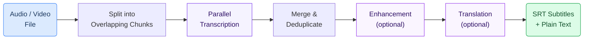

# Video Transcription & Subtitles

Turn lectures, training videos, and podcasts into accurate text transcripts and synchronized subtitle files — automatically. Upload a recording and receive ready-to-use SRT and VTT subtitles, even for hours-long content in Finnish or other languages.

<Callout type="info">
**Try the Live Demo:** [gaik-demo.2.rahtiapp.fi/dental-transcription](https://gaik-demo.2.rahtiapp.fi/dental-transcription)

Upload your own file or inspect a ready-made example with pre-generated subtitles.
</Callout>
---

## Why It Matters

- **Accessibility** — Subtitles make video content accessible to hearing-impaired audiences and non-native speakers
- **Searchability** — Once transcribed, every word in a video becomes searchable (see [Semantic Video Search](/docs/use-cases/semantic-dental-video-search))
- **Time savings** — Manual transcription takes 4–6x the audio duration; this pipeline processes content in a fraction of the time
- **Compliance** — Many institutions require captioned video content for accessibility regulations

---

## How It Works



1. **Audio is split into chunks** — Large files are divided into overlapping segments (~20 minutes each) for parallel processing
2. **Each chunk is transcribed** — Multiple chunks run simultaneously using Azure OpenAI Whisper, cutting total processing time significantly
3. **Results are merged** — Overlapping regions are deduplicated to produce seamless, continuous output
4. **Optional: Enhancement** — A language model corrects domain-specific terminology and formatting
5. **Optional: Translation** — Content can be translated while preserving original timestamps

---

## Key Features

- **Parallel processing** — Handles a 2-hour lecture in a fraction of sequential time by transcribing 3+ chunks simultaneously
- **Large file support** — No practical limit on audio duration; files are automatically chunked and reassembled
- **Multiple output formats** — SRT subtitle files (with timestamps), VTT subtitles, and plain text transcripts
- **Finnish and multilingual** — Works with Finnish, Swedish, English, and other languages supported by Whisper
- **Speaker diarization** — Optional GPT-4o Transcribe model identifies who is speaking
- **Overlap deduplication** — 15-second overlaps between chunks avoid cutting words mid-sentence

---

## Software Components

The toolkit ships **two** transcription components plus an optional enhancement pass. Pick the one that matches your input and infrastructure.

### 1. `Transcriber` — default, multi-backend

```bash
pip install gaik[transcriber]
```

The main transcriber component. Supports several backends through a single API:

| Model | When to use |
|-------|-------------|
| `whisper` / `whisper-1` | Azure OpenAI or OpenAI Whisper, chunked via PyDub for files > 25 MB |
| `gpt-4o-transcribe` | OpenAI's newer transcription model, optional speaker diarization |
| `whisper_local` | Self-hosted Whisper server — required for Finnish fine-tuned model `Finnish-NLP/whisper-large-finnish-v3-ct2` |

> **The live demo above uses `Transcriber` in `whisper_local` mode** with the Finnish fine-tuned Whisper model — no audio leaves the local infrastructure.

```python
from gaik.software_components.transcriber import Transcriber, get_openai_config

transcriber = Transcriber(
    api_config=get_openai_config(use_azure=True),
    transcription_model="whisper_local",
    local_api_base="https://your-whisper-server/v1",
    local_api_key="...",
    language="fi",                  # Finnish fine-tuned model
    enhanced_transcript=True,       # two-pass LLM correction
)

result = transcriber.transcribe(file_path="lecture.mp4")
print(result.raw_transcript)
print(result.enhanced_transcript)
```

### 2. `ParallelTranscriber` — long-form, FFmpeg-chunked

```bash
pip install gaik[parallel-transcriber]
```

For multi-hour recordings. Splits audio into overlapping chunks with FFmpeg and transcribes them in parallel, then merges and deduplicates. Requires `ffmpeg` + `ffprobe` on `$PATH`.

```python
from gaik.software_components.parallel_transcriber import ParallelTranscriber

transcriber = ParallelTranscriber(use_azure=True)
result = transcriber.transcribe("2-hour-lecture.mp4")
```

### 3. `TranscriptEnhancer` — optional cleanup

```bash
pip install gaik[enhance-transcript]
```

Two-pass LLM workflow that fixes domain-specific terminology, punctuation, and formatting on any existing transcript. Both transcribers can run it inline via `enhanced_transcript=True`.

### SRT / VTT utilities

```python
from gaik.software_components.transcriber import segments_to_srt, segments_to_vtt, parse_srt
```

Convert Whisper segments to subtitle files (and back) — used in the dental demo to ship synchronized captions.

---

## Related Resources

| Resource | Link |
|----------|------|
| `Transcriber` component (multi-backend, used in demo) | [GitHub](https://github.com/GAIK-project/gaik-toolkit/tree/main/implementation_layer/src/gaik/software_components/transcriber) |
| `ParallelTranscriber` component | [GitHub](https://github.com/GAIK-project/gaik-toolkit/tree/main/implementation_layer/src/gaik/software_components/parallel_transcriber) |
| `TranscriptEnhancer` component | [GitHub](https://github.com/GAIK-project/gaik-toolkit/tree/main/implementation_layer/src/gaik/software_components/enhance_transcript) |
| Audio to Structured Data module | [GitHub](https://github.com/GAIK-project/gaik-toolkit/tree/main/implementation_layer/src/gaik/software_modules/audio_to_structured_data) |
| Live Demo | [dental-transcription](https://gaik-demo.2.rahtiapp.fi/dental-transcription) |
