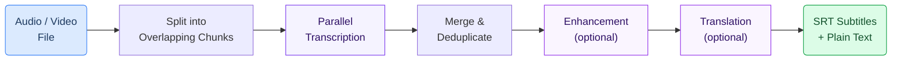

# Video Transcription & Subtitles

Turn lectures, training videos, and podcasts into accurate text transcripts and synchronized subtitle files — automatically. Upload a recording and receive ready-to-use SRT and VTT subtitles, even for hours-long content in Finnish or other languages.

<Callout type="info">
**Try the Live Demo:** [gaik-demo.2.rahtiapp.fi/dental-transcription](https://gaik-demo.2.rahtiapp.fi/dental-transcription)

Upload your own file or inspect a ready-made example with pre-generated subtitles.
</Callout>


---

## Why It Matters

- **Accessibility** — Subtitles make video content accessible to hearing-impaired audiences and non-native speakers
- **Searchability** — Once transcribed, every word in a video becomes searchable (see [Semantic Video Search](/docs/use-cases/semantic-dental-video-search))
- **Time savings** — Manual transcription takes 4–6x the audio duration; this pipeline processes content in a fraction of the time
- **Compliance** — Many institutions require captioned video content for accessibility regulations

---

## How It Works



1. **Audio is split into chunks** — Large files are divided into overlapping segments (~20 minutes each) for parallel processing
2. **Each chunk is transcribed** — Multiple chunks run simultaneously using Azure OpenAI Whisper, cutting total processing time significantly
3. **Results are merged** — Overlapping regions are deduplicated to produce seamless, continuous output
4. **Optional: Enhancement** — A language model corrects domain-specific terminology and formatting
5. **Optional: Translation** — Content can be translated while preserving original timestamps

---

## Key Features

- **Parallel processing** — Handles a 2-hour lecture in a fraction of sequential time by transcribing 3+ chunks simultaneously
- **Large file support** — No practical limit on audio duration; files are automatically chunked and reassembled
- **Multiple output formats** — SRT subtitle files (with timestamps), VTT subtitles, and plain text transcripts
- **Finnish and multilingual** — Works with Finnish, Swedish, English, and other languages supported by Whisper
- **Speaker diarization** — Optional GPT-4o Transcribe model identifies who is speaking
- **Overlap deduplication** — 15-second overlaps between chunks avoid cutting words mid-sentence

---

## Software Component

```bash
pip install gaik[parallel-transcriber]
```

The `ParallelTranscriber` class handles chunking, transcription, merging, and output — all configured through a simple `TranscriptionConfig` object. Requires `ffmpeg` for audio processing.

---

## Related Resources

| Resource | Link |
|----------|------|
| ParallelTranscriber component | [GitHub](https://github.com/GAIK-project/gaik-toolkit/tree/main/implementation_layer/src/gaik/software_components/parallel_transcriber) |
| Transcriber component (sequential) | [GitHub](https://github.com/GAIK-project/gaik-toolkit/tree/main/implementation_layer/src/gaik/software_components/transcriber) |
| Audio to Structured Data module | [GitHub](https://github.com/GAIK-project/gaik-toolkit/tree/main/implementation_layer/src/gaik/software_modules/audio_to_structured_data) |
| Live Demo | [dental-transcription](https://gaik-demo.2.rahtiapp.fi/dental-transcription) |
