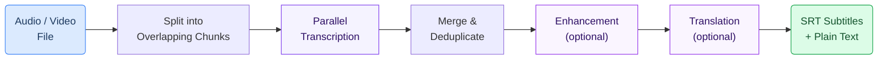

# Dental Transcription and Close Captioning

Automatically convert dental lectures, training videos, and podcasts into accurate text transcriptions and synchronized subtitles. The system handles hours of audio, supports Finnish and other languages, and can translate content for multilingual audiences.

## How It Works

The transcription pipeline processes audio through several stages:

1. **Audio is split into chunks** — Large files are divided into overlapping segments (~15 minutes each) for parallel processing
2. **Each chunk is transcribed** — Multiple chunks are transcribed simultaneously using Azure OpenAI Whisper, significantly reducing total processing time
3. **Results are merged** — Overlapping regions are deduplicated to produce seamless, continuous output
4. **Optional: Enhancement** — A language model corrects domain-specific dental terminology and formatting errors
5. **Optional: Translation** — Content can be translated to other languages while preserving original timestamps



---

## Key Features

- **Parallel processing** — Transcribes 3 or more chunks at the same time, handling a 2-hour lecture in a fraction of the time it would take sequentially
- **Large file support** — No practical limit on audio duration; files are automatically chunked and reassembled
- **Multiple output formats** — Produces SRT subtitle files (with timestamps) and plain text transcripts
- **Finnish and multilingual** — Works with Finnish, Swedish, English, and other languages supported by Whisper
- **Speaker diarization** — Optional GPT-4o Transcribe model identifies who is speaking (useful for panel discussions or Q&A sessions)
- **Overlap deduplication** — Chunks overlap by 15 seconds to avoid cutting words mid-sentence; duplicated text is automatically removed during merging

---

## Software Component

The transcription pipeline is available as a reusable component in the GAIK toolkit:

```bash
pip install gaik[parallel-transcriber]
```

The `ParallelTranscriber` class handles chunking, transcription, merging, and output — all configured through a simple `TranscriptionConfig` object. It requires `ffmpeg` on the system for audio processing.

> **Component documentation:** [`implementation_layer/src/gaik/software_components/parallel_transcriber/`](https://github.com/GAIK-project/gaik-toolkit/tree/main/implementation_layer/src/gaik/software_components/parallel_transcriber)

---

## Related Resources

| Resource | Link |
|----------|------|
| ParallelTranscriber component | [GitHub](https://github.com/GAIK-project/gaik-toolkit/tree/main/implementation_layer/src/gaik/software_components/parallel_transcriber) |
| Transcriber component (sequential) | [GitHub](https://github.com/GAIK-project/gaik-toolkit/tree/main/implementation_layer/src/gaik/software_components/transcriber) |
| Audio to Structured Data module | [GitHub](https://github.com/GAIK-project/gaik-toolkit/tree/main/implementation_layer/src/gaik/software_modules/audio_to_structured_data) |
