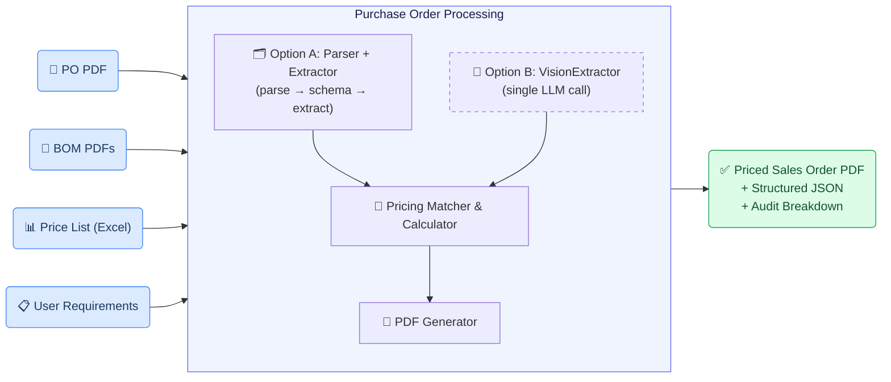
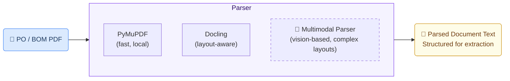
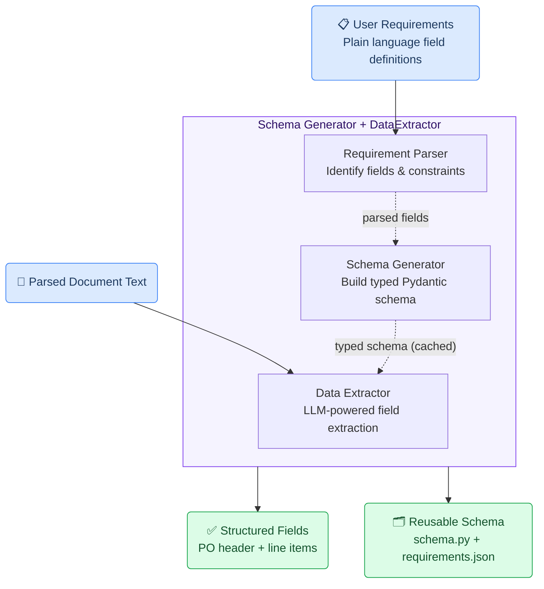
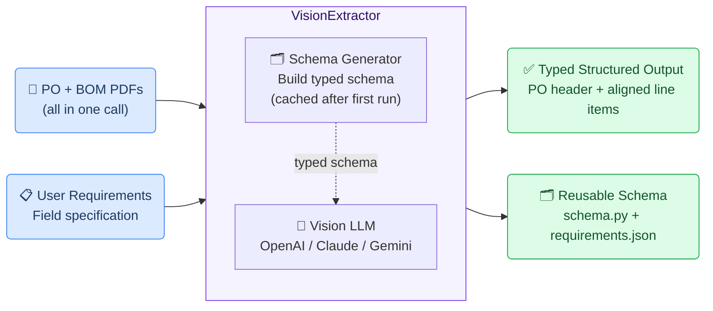
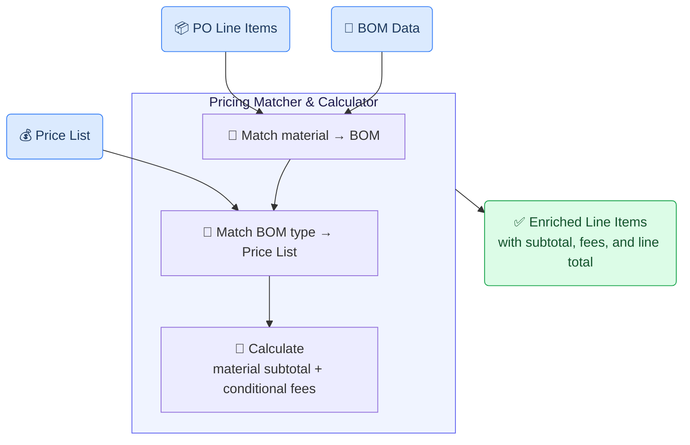
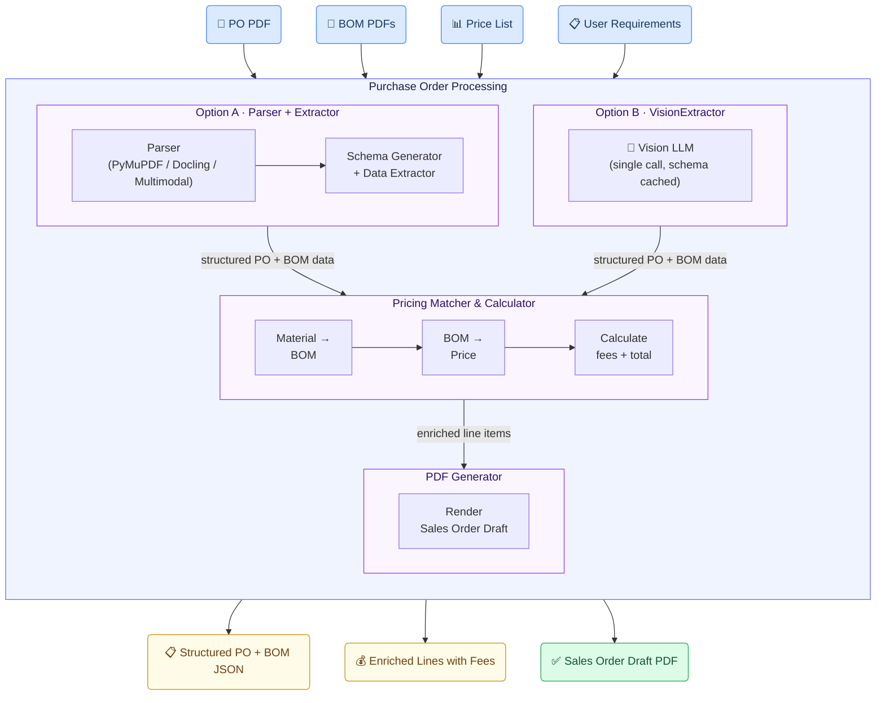

# Purchase Order Processing Generic Use Case (Cross-Cutting Use Case)

The purchase order processing use case shows how the GAIK toolkit turns incoming customer purchase orders — PDFs, scanned documents, and accompanying bills of material — into structured, priced sales orders ready for review and ERP intake, eliminating repetitive manual reading, matching, and arithmetic.

## Business layer – use case specification

At the business layer, the use case targets the manual workflow that follows a customer purchase order arriving by email or portal upload. Operations staff must read each document, look up every line item against internal material records and price lists, apply conditional fees, and assemble a sales order to be entered into the system. The GAIK pipeline replaces the manual reading, matching, and arithmetic steps with a single automated pass while leaving the reviewer in control of the final output.

Concrete example fragments reflected in the use case design include:
- Purchase orders arrive as PDFs, scanned documents, or email attachments with varying layouts from different customers
- Each line item links to a bill of material via a material number, and pricing requires matching that material against a master price list
- Conditional fees — cutting, testing, certification — apply per line only when the BOM flags them as required
- Success is defined as faster order handling, reduced data entry errors, consistent pricing, and an audit-ready calculation breakdown

The canvas clarifies the purpose of the solution, the main users (order handling staff, customer service, procurement, operations, and finance teams), and the expected outcomes.

[](/images/po-canvas.png)

- **Reference GenAI Product Canvas for Purchase Order Processing** — [Download (po-canvas.png)](/images/po-canvas.png)

---

## Strategy layer – value evaluation and monitoring

At the strategy layer, the value evaluation model for purchase order processing applies the [Value Evaluation Framework](https://github.com/GAIK-project/gaik-toolkit/blob/main/strategy_layer/value_evaluation_framework/README.md) to this generic use case and makes value assumptions explicit.

Example value fragments from the model include:

Functional value (primary):
"Faster PO processing", "Consistent data extraction", "Validation and compliance checks", "Easy integration with ERP systems", "Audit trail and traceability"
→ Outcome: More purchase orders processed faster and with higher quality

Informational value:
"Accurate PO data capture", "Real-time visibility", "Fewer errors and exceptions", "Better data for analysis"
→ Outcome: Better decisions with trusted data

Financial value:
"Lower material processing cost", "Reduced data entry errors", "Faster cash-to-cycle", "Early payment discounts captured"
→ Outcome: Reduced operating costs and better financial performance

Emotional value:
"Increased satisfaction and trust", "Less stress and frustration", "More confidence in data"
→ Outcome: Happier teams and higher engagement

Social value:
"Better collaboration across teams", "Stronger supplier relationships", "Promotes transparency and fairness"
→ Outcome: Stronger partnerships and reputation

[](/images/po-value.png)

- **Reference Value Evaluation Model for Purchase Order Processing** — [Download (po-value.png)](/images/po-value.png)

The same model can be used both before implementation (to evaluate expected value) and after deployment (to monitor realized value across different dimensions).

---

## Implementation layer using No-Code

Purchase order processing can be supported by Generative AI using a no-code approach.
At the implementation layer, the use case is realized using a no-code agent skill from the toolkit:
1) [Claude Desktop agent skill for purchase order processing](https://github.com/GAIK-project/gaik-toolkit/tree/main/implementation_layer/no-code-assets/agent-skills/purchase-order-processing)

The skill defines the extraction fields, matching logic, pricing calculation rules, and output format declaratively in plain-text reference files — no programming required. A sales operations manager installs the skill into Claude Desktop, points it to a folder containing the purchase order, bills of material, and price list, and Claude returns a complete sales order document plus a step-by-step calculation audit trail.

For a detailed walkthrough of this no-code implementation, see the article: [I Created a Claude Skill for Processing Complex Purchase Orders](https://medium.com/data-science-collective/i-created-a-claude-skill-for-processing-complex-purchase-orders-9f14f10308cd?sk=77bf841514627a9fc68129cb8cd7cdbd)

**What the business user sets up (once):**

A sales operations manager edits five plain-text reference files to match company conventions — no coding required:
- `EXTRACTION_FIELDS.md` — which fields to extract from the PO, BOM, and price list
- `PRICING_RULES.md` — volume-discount tiers, fee types, and matching logic
- `CALCULATION_LOGIC.md` — formulas for combining material cost, fees, discounts, and tax
- `OUTPUT_FORMAT.md` — the sales-order document template
- `BOM_TEMPLATE_WITH_FEES.md` — the BOM-side fields used for fee flags

**What happens in daily work:**

**Step 1 – Organise the input folder**
The user prepares an input folder with the following structure:

```
My-Order/
├── customer_data/
│   ├── PO.pdf
│   ├── BOM1.pdf
│   ├── BOM2.pdf
│   └── BOM3.pdf
├── price_list/
│   └── price_list.xlsx
└── sample_sales_order/        ← optional
    └── sample_order.docx
```

**Step 2 – Ask Claude to process it**
```
Process the purchase order in C:\Orders\Project-Q4 using purchase-order-processing skill
```

Claude extracts each PO line item, looks up the matching BOM by material number, finds the corresponding row in the price list, calculates the material subtotal plus any applicable cutting, testing, and certification fees, and emits two output files:

- `SO-{number}_{Date}.docx` — the formatted sales order document
- `Calculation_Breakdown.txt` — a step-by-step audit trail of all extractions, matches, and calculations

**Example of what the business gets out:**

Instead of manual data entry, the output is a ready-to-use structured sales order with full pricing transparency:

- Material Subtotal: $25,567.50
- Volume Discount (5%): −$1,278.38
- Net Material Cost: $24,289.12
- Total Testing / Certification Fees: $75.00
- Tax (6%): $1,488.85
- Grand Total: $26,302.97

This makes the result:
- easy to paste into an existing ERP system
- safe to store in a database with a full audit trail
- reliable for pricing analytics and compliance review
- suitable for audits requiring itemised fee breakdowns

---

## Implementation Layer Using Code-Based Method.

Three to five software components — **Parser**, **Schema Generator + DataExtractor**, and optionally the **VisionExtractor** (which combines parsing and extraction in a single LLM call), together with the **Pricing Matcher & Calculator** and a **PDF Generator** — combine to turn raw purchase order documents into a priced, formatted sales order.

Two pipeline variants are available:



---

## Software Components

### 1. Parser

Converts purchase order PDFs and BOM documents into structured text for downstream extraction. Three parser options are available, balancing speed, cost, and accuracy for different document layouts:

- **PyMuPDF (simple)** — fast local text extraction, no API calls; works well for clean, text-based PDFs
- **Docling** — higher-quality document parsing with table and layout detection
- **Multimodal parser** — GAIK's custom vision-based parser that delivers best performance for complex layouts, scanned documents, and PDFs with merged cells or non-standard table structures



For more details on the multimodal parser's approach to complex document layouts, see the article: [How to Accurately Extract Everything from Documents Using AI](https://medium.com/ai-advances/how-to-accurately-extract-everything-from-documents-using-ai-cf12d0125238?sk=a2a6db49c124da35bdd06addd0af6fde)

> 📁 [`implementation_layer/src/gaik/software_components/parsers/`](https://github.com/GAIK-project/gaik-toolkit/tree/main/implementation_layer/src/gaik/software_components/parsers)

---

### 2. Schema Generator + DataExtractor

Takes the parsed document text and a plain-language field specification, then returns structured data. The Schema Generator builds a typed Pydantic schema from the user's plain-language description — this schema is generated once and **saved for reuse** on all subsequent runs. The DataExtractor uses an LLM to fill each field from the parsed text according to the schema.



> 📁 [`implementation_layer/src/gaik/software_components/extractor/`](https://github.com/GAIK-project/gaik-toolkit/tree/main/implementation_layer/src/gaik/software_components/extractor)

---

### 3. VisionExtractor (Alternative Pipeline)

An alternative to the Parser + Extractor pipeline that combines document parsing and field extraction in a **single LLM vision call**, reducing cost, latency, and the number of API calls. In multi-document mode it accepts the PO and all BOM files together, and the model aligns each PO line item with its matching BOM via material number in one pass.

The VisionExtractor also supports multiple model providers (OpenAI, Claude, Gemini) and can return per-field confidence scores when verification is enabled.



For more details on the VisionExtractor's approach to structured data extraction from complex documents, see the article: [How to Accurately Extract Structured Data from Complex Documents Using AI](https://medium.com/ai-advances/how-to-accurately-extract-structured-data-from-complex-documents-using-ai-a400f412332a?sk=b347340578b0e587fa293368a58677f1)

> 📁 [`implementation_layer/src/gaik/software_components/vision_extractor/`](https://github.com/GAIK-project/gaik-toolkit/tree/main/implementation_layer/src/gaik/software_components/vision_extractor)
>
> 📁 [`implementation_layer/examples/software_components/vision_extractor/`](https://github.com/GAIK-project/gaik-toolkit/tree/main/implementation_layer/examples/software_components/vision_extractor)

---

### 4. Pricing Matcher & Calculator

Takes the structured PO line items and the parsed price list, and produces enriched rows with calculated pricing. Matching is two-stage: first the material number links each PO line to its BOM, then the BOM's type designation is matched against the price list. Per-line totals are calculated by combining the material subtotal with conditional fees — cutting, testing, and certification fees are only applied when the BOM flags them as required.

The price calculation logic can vary per use case. While the extraction task can be changed by updating the user requirements, the pricing calculation requires customisation to match each organisation's specific fee structure, discount tiers, and currency rules.



---

### 5. PDF Generator

Renders the enriched order data into a formatted sales order draft — including buyer and delivery addresses, line item table with per-line fee breakdown, and order totals — using a deterministic layout engine.

> 📁 [`implementation_layer/src/gaik/software_components/`](https://github.com/GAIK-project/gaik-toolkit/tree/main/implementation_layer/src/gaik/software_components)

---

## Defining What to Extract: User Requirements

Fields are specified in plain language — no code, no schema configuration. The user describes what to extract; the Schema Generator builds the typed schema automatically and saves it for reuse.

Example for a purchase order with BOM alignment:

```
Extract purchase order data.

The output will include the following top-level fields:
- Purchase order date (DD/MM/YYYY format when unambiguous)
- Delivery date (DD/MM/YYYY format when unambiguous)
- Purchase order number (separated by a dash after every 4 digits)
- Supplier number
- Shipping address (Format: company name, street number, postal code, city, country)

Also, the output will include the data for each line item.

For each line item, extract these scalar fields:
- Item number (e.g., 010, 020)
- Complete description
- Quantity (text string including the unit, e.g., "8.600 LB")
- Price per currency
- Material number

Output rules:
- Return every schema field.
- For missing or not stated values, always return "".
- Keep wording close to the source document where possible.
```

The Schema Generator parses this description into a typed Pydantic model and saves both the model code (`schema.py`) and the parsed requirements (`requirements.json`) into a `schema_dir`. Subsequent runs reuse the cached schema — no re-parsing required.

---

## Software Module: Purchase Order Processing

Packages the full pipeline into one end-to-end workflow. Two variants are supported: the parse → extract path for maximum flexibility and parser choice, and the VisionExtractor path for lower latency and fewer API calls.



Example output from the demo — uploading a purchase order with three BOM files and a price list, then viewing the calculated order summary and generated sales order draft:

<p>
  
  
</p>

> 📁 [`implementation_layer/examples/software_components/vision_extractor/`](https://github.com/GAIK-project/gaik-toolkit/tree/main/implementation_layer/examples/software_components/vision_extractor)

To test a smaller version of the purchase order use case, please visit the [GAIK demo link](https://gaik-demo.2.rahtiapp.fi/). Access is available upon registration request.

---

## Adaptable to Other Domains

The same parse → extract → match → calculate → generate pipeline applies to any procurement or back-office workflow requiring structured extraction from multi-document inputs — only the user requirements, matching keys, and pricing logic change:

- Vendor invoice processing with line-item reconciliation, sales order intake and ERP staging, request-for-quote ingestion with cost lookup, vendor catalogue normalisation, shipment and customs documentation aggregation

---

## Evaluation Methods

The quality of this use case is evaluated by assessing each pipeline component independently:

### Parser Evaluation

Parsing quality is benchmarked across different parsers — including the simple PyMuPDF parser, Docling, and GAIK's custom multimodal parser — on purchase order documents with varying layouts, including complex tables and non-standard column arrangements. The benchmark measures how accurately each parser recovers field values and table structures from challenging document formats.

> 📊 **Parsing evaluation methods:** [`implementation_layer/eval_methods/`](https://github.com/GAIK-project/gaik-toolkit/tree/main/implementation_layer/eval_methods)

### Extractor Evaluation

The quality of structured information extraction is evaluated using precision, recall, and F1 score — computed separately for exact-match fields (item numbers, dates, quantities) and semantic-match fields (descriptions, addresses). This measures how accurately the extracted fields match the expected values across a set of reference purchase orders.

> 📊 **Extraction evaluation methods:** [`implementation_layer/eval_methods/extraction_eval/`](https://github.com/GAIK-project/gaik-toolkit/tree/main/implementation_layer/eval_methods/extraction_eval)

---

## Related Resources

| Resource | Link |
|----------|------|
| Parser components | [GitHub →](https://github.com/GAIK-project/gaik-toolkit/tree/main/implementation_layer/src/gaik/software_components/parsers) |
| Schema Generator + DataExtractor | [GitHub →](https://github.com/GAIK-project/gaik-toolkit/tree/main/implementation_layer/src/gaik/software_components/extractor) |
| VisionExtractor component | [GitHub →](https://github.com/GAIK-project/gaik-toolkit/tree/main/implementation_layer/src/gaik/software_components/vision_extractor) |
| Vision Extractor PO + BOM example | [GitHub →](https://github.com/GAIK-project/gaik-toolkit/tree/main/implementation_layer/examples/software_components/vision_extractor) |
| No-code Claude Desktop skill | [GitHub →](https://github.com/GAIK-project/gaik-toolkit/tree/main/implementation_layer/no-code-assets/agent-skills/purchase-order-processing) |
| Implementation Layer overview | [GitHub →](https://github.com/GAIK-project/gaik-toolkit/tree/main/implementation_layer) |
