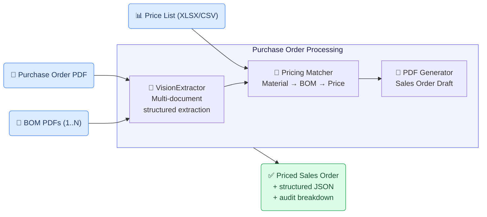
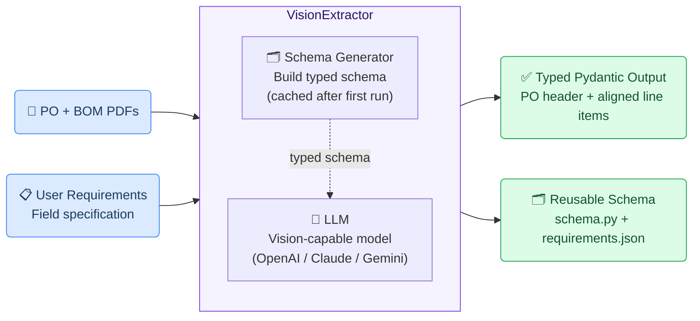
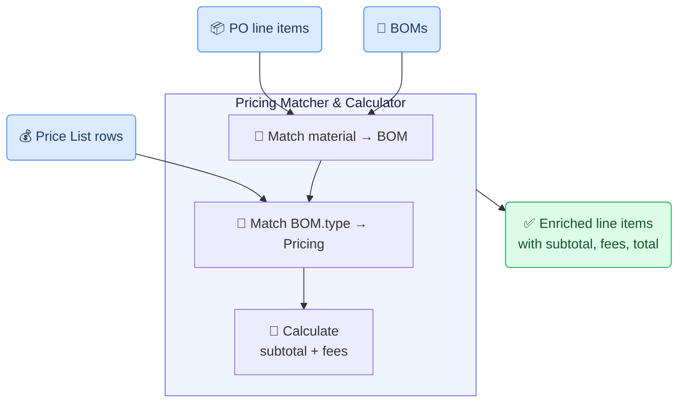
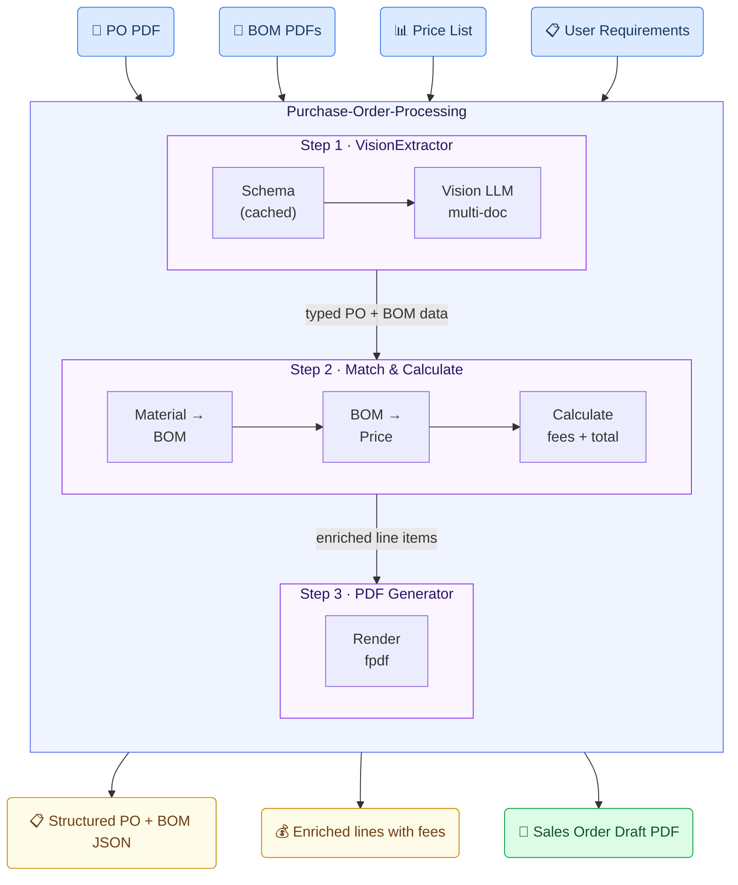

# Purchase Order Processing Generic Use Case (Cross-Cutting Use Case)

The purchase order processing use case demonstrates how the toolkit turns
multi-document customer paperwork — a purchase order PDF, one or more bills of
material (BOMs), and a master price list — into a single structured, priced
sales order ready for ERP intake. It illustrates how the toolkit's
`VisionExtractor`, schema-driven extraction, and downstream business logic
compose into a complete workflow for industrial procurement.

## Business layer – use case specification

At the business layer, the use case targets the manual workflow that follows a
customer purchase order arriving by email or portal upload. Procurement staff
today read the PO, look up each material in the company's own BOM library,
find unit prices and applicable fees in the master price list, add
cutting/testing/certification fees per item, and assemble a sales order to be
entered into the ERP. The GAIK pipeline replaces the manual reading, matching,
and arithmetic steps with a single automated pass while leaving the sales
person in control of the final review.

Concrete example fragments reflected in the use case design:
- The customer's PO and BOM PDFs may be unstructured or vendor-specific layouts
- Each PO line item links to a BOM via a Material Number
- Pricing combines unit price × quantity with conditional cutting, testing,
  and certification fees (only billed when the BOM flags them as required)
- Success is defined in terms of cycle-time reduction, fewer arithmetic
  errors, and an audit-ready calculation breakdown

<Callout type="info">
Business canvas materials (GenAI Product Canvas) for this use case are in
preparation. The Implementation Layer sections below describe the working
code-based reference architecture.
</Callout>

## Strategy layer – value evaluation and monitoring

The same Value Evaluation Framework used for incident reporting applies here:

Functional value (primary):
"Shorter order cycle time", "Fewer arithmetic errors", "Automatic fee
calculation", "Audit-ready breakdown"
→ Outcome: more orders processed per day, fewer corrections, cleaner ERP data

Informational value:
"Structured BOM/PO data for analytics", "Cross-customer pricing visibility",
"Margin tracking per material"
→ Outcome: faster decisions on pricing changes and stock policies

Emotional value:
"Less rote data entry", "Confidence in math", "Visible audit trail"
→ Outcome: procurement and sales teams free for higher-value work

<Callout type="info">
Value evaluation model materials for this use case are in preparation.
</Callout>

## Implementation layer using No-Code

The purchase order workflow can be operated through a Claude Desktop **agent
skill** without any coding.

The skill at
[`implementation_layer/no-code-assets/agent-skills/purchase-order-processing/`](https://github.com/GAIK-project/gaik-toolkit/tree/main/implementation_layer/no-code-assets/agent-skills/purchase-order-processing)
defines the inputs, fields, calculation rules, and output format declaratively
— no programming required. A salesperson installs the skill into Claude
Desktop, points it to a folder containing the PO, BOMs, and price list, and
Claude returns a complete sales order document plus a calculation breakdown.

**What the business user sets up (once):**

A sales operations manager edits five plain-text reference files to match
company conventions:
- `EXTRACTION_FIELDS.md` — which fields the PO, BOM, and price list contain
- `PRICING_RULES.md` — volume-discount tiers, default tax rate
- `CALCULATION_LOGIC.md` — how to combine subtotal, fees, discounts, tax
- `OUTPUT_FORMAT.md` — the sales-order template (or drop in a sample DOCX)
- `BOM_TEMPLATE_WITH_FEES.md` — the BOM-side fields used for fee logic

**What happens in daily work:**

**Step 1 – Drop the folder**

The user organises the input as:

```
My-Order/
├── customer_data/
│   ├── PO.pdf
│   ├── BOM1.pdf
│   ├── BOM2.pdf
│   └── BOM3.pdf
├── price_list/
│   └── price_list.xlsx
└── sample_sales_order/        ← optional
    └── sample_order.docx
```

**Step 2 – Ask Claude to process it**

```
Process the purchase order in C:\Orders\Project-Q4 using purchase-order-processing skill
```

Claude extracts each PO line item, looks up the matching BOM by Material
Number, finds the row in the price list, calculates `qty × unit_price` plus
the cutting / testing / certification fees that the BOM flags as required,
and emits two files:

- `SO-{number}_{Customer}_{Date}.docx` — the sales-order document
- `Calculation_Breakdown.txt` — a step-by-step audit trail

Workflow at a glance:


The no-code asset enforces the company's calculation rules through plain-text
specification — the same logic surfaces in the code-based path below.

---

## Implementation Layer Using Code-Based Method

Three software components — **VisionExtractor** for one-pass multi-document
extraction, the **Pricing Matcher & Calculator** for BOM/price-list lookup,
and a **PDF Generator** for the final sales-order draft — combine into a
single workflow that turns raw PDFs into a priced order ready for review.



---

## Software Components

### 1. VisionExtractor

A single LLM-based component that converts PDF/image inputs into structured
data in one pass, without a separate text-parsing stage. In multi-document
mode it accepts one PO plus N BOM files in a single call, and the model
aligns each PO line item with its matching BOM via Material Number.



A minimal usage example:

```python
from gaik.software_components.vision_extractor import VisionExtractor

extractor = VisionExtractor(
    model_provider="openai",
    use_azure=True,
    reasoning_effort="low",
    merge_table=True,
    include_verification=True,
)

result = extractor.extract(
    file_paths=["PO/PO.pdf", "PO/BOM1.pdf", "PO/BOM2.pdf", "PO/BOM3.pdf"],
    user_requirements=task_multi_doc_text,
    schema_dir="schema_multi",   # cached after first run
)

print(result.data)            # typed dict (PO header + aligned line items)
print(result.usage.cost_usd)  # cost per run
```

> 📁 [`implementation_layer/src/gaik/software_components/vision_extractor/`](https://github.com/GAIK-project/gaik-toolkit/tree/main/implementation_layer/src/gaik/software_components/vision_extractor)
>
> 📁 [`implementation_layer/examples/software_components/vision_extractor/`](https://github.com/GAIK-project/gaik-toolkit/tree/main/implementation_layer/examples/software_components/vision_extractor) — includes a runnable `PO/` example with one PO and three BOM PDFs

---

### 2. Pricing Matcher & Calculator

Takes the structured PO line items, the BOMs, and the parsed price list, and
produces enriched rows with calculated pricing.

Matching is two-stage:
1. **Material → BOM**: exact case-insensitive match on `material_id`
2. **BOM → Price List**: normalised type-designation match (lowercase,
   stripped of whitespace and punctuation), with a substring fallback

Per-line calculation:

```
material_subtotal = quantity × unit_price
cutting_fee       = pricing.cutting_fee  if bom.cutting_required       else 0
testing_fee       = pricing.testing_fee  if bom.testing_required       else 0
cert_fee          = pricing.cert_fee     if bom.certificates_required  else 0
line_total        = material_subtotal + cutting_fee + testing_fee + cert_fee
```

The fee flags live on the BOM, the rates on the price list — so the
calculation requires both before it can complete.



> 📁 Reference implementation in the demo app: [`toolkit_demo_app/api/routers/luvata_order.py`](https://github.com/GAIK-project/gaik-toolkit/blob/main/implementation_layer/toolkit_demo_app/api/routers/luvata_order.py) — functions `match_material_to_bom`, `match_pricing`, `calculate_simple_pricing`, `enrich_products`

---

### 3. PDF Generator

Renders the enriched data into a sales-order draft PDF — company logo, buyer
and delivery addresses, item table with per-line fee breakdown, summary
totals — using `fpdf` for deterministic layout.

The generated PDF is held in an in-memory store keyed by job ID with a
one-hour TTL, so the demo UI can fetch it after the SSE stream completes
without persisting customer documents to disk.

> 📁 Reference: [`toolkit_demo_app/api/routers/luvata_order.py`](https://github.com/GAIK-project/gaik-toolkit/blob/main/implementation_layer/toolkit_demo_app/api/routers/luvata_order.py) — `generate_pdf()` and surrounding helpers

---

## Defining What to Extract: User Requirements

The VisionExtractor accepts plain-language instructions describing fields,
units, alignment rules, and aggregation logic. Example for a multi-document
PO + BOM extraction:

```
The task is to extract key fields from customer documents (Purchase Order
(PO) and Bill of Material (BOM)), and align them so that each PO item is
enriched with the correct technical details. Begin with the customer's
purchase order, which may include multiple items. Each item is linked to its
BOM via a Material Number.

For every item in the PO, extract the Material Number along with the basic
item details: Quantity, Description, and Delivery Date (Format: DD/MM/YYYY).
Use the item's Material Number from the PO to find the BOM having the same
Material Number (represented as 'ID'). From the matching BOM, extract the
part's 'Part Designation' and part dimension (length followed by unit, e.g.,
1487mm).

The final output should contain as many lines as the number of items in the
PO. Each line should have: Material Number, Quantity, Description, Delivery
Date (from PO), Part Designation, part dimension (from BOM).

Also, extract the following header information from the PO: Order Date,
Buyer, Sales Person, Shipping Address, Payment Terms.
```

The Schema Generator parses this into a typed Pydantic model and saves both
the model code (`schema.py`) and the parsed requirements
(`requirements.json`) into a `schema_dir`. Subsequent runs reuse the cached
schema — no re-parsing required.

---

## Software Module: Purchase Order Processing

Combines the three components into one end-to-end workflow:



A live implementation of this module is available in the GAIK demo app at
[`gaik-demo.2.rahtiapp.fi/luvata-order`](https://gaik-demo.2.rahtiapp.fi/luvata-order)
(access available upon registration request). The demo accepts a PO PDF, a
folder of BOM PDFs, and a price list, then streams progress over SSE while
the pipeline runs.

Example output from the demo with the bundled sample data — three line items
with calculated material subtotals, conditional cutting/testing/certification
fees, and a generated order-draft PDF previewed in place:


> **Note on the live demo's current implementation:** the production demo
> currently composes the parsing and extraction stages separately
> (`DoclingApiClientParser` plus `DataExtractor`) rather than using
> `VisionExtractor`. New projects should prefer the `VisionExtractor`-based
> pattern documented above because it requires one LLM call instead of
> two, has native multi-document alignment via Material Number, and can
> return per-field confidence scores when verification is enabled.

> 📁 [`implementation_layer/examples/software_components/vision_extractor/PO/`](https://github.com/GAIK-project/gaik-toolkit/tree/main/implementation_layer/examples/software_components/vision_extractor) — runnable PO + three BOM example
>
> 📁 [`implementation_layer/toolkit_demo_app/api/routers/luvata_order.py`](https://github.com/GAIK-project/gaik-toolkit/blob/main/implementation_layer/toolkit_demo_app/api/routers/luvata_order.py) — live demo source

To try the use case end-to-end, visit the [GAIK demo](https://gaik-demo.2.rahtiapp.fi/luvata-order)
(access is available upon registration request).

---

## Adaptable to Other Domains

The same VisionExtractor + matcher + generator pattern fits many
multi-document procurement and back-office tasks — only the field
requirements, the matching keys, and the calculation logic change between
domains:

- Vendor invoice processing with line-item reconciliation
- Sales order intake and ERP staging
- Request-for-quote (RFQ) ingestion with cost lookup
- Vendor catalogue normalisation across mismatched formats
- Shipment and customs documentation aggregation

---

## Evaluation Methods

Quality is measured per component and end-to-end.

### Extraction Accuracy

`ExtractionEvaluator` (in `gaik.software_components.evaluators`) compares
ground-truth field values against extracted output, reporting per-field
precision / recall / F1 and an overall hallucination rate. Switch to
semantic mode by passing an `LLMJudge` instance to evaluate fields where
exact string match is too strict (free-text descriptions, addresses, dates
in non-canonical formats).

> 📊 **Extraction evaluation methods:** [`implementation_layer/src/gaik/software_components/evaluators/`](https://github.com/GAIK-project/gaik-toolkit/tree/main/implementation_layer/src/gaik/software_components/evaluators)

### Matching Quality

A simple metric tracks the share of PO line items that successfully matched
both a BOM and a price-list row. The demo's `enrich_products()` returns the
per-line `bom_match` / `price_match` booleans and an `errors` list — those
feed directly into the metric.

### Total-Price Accuracy

Compare the pipeline's final per-line `line_total` and the order's grand
total against a manually verified reference. A handful of representative
orders is enough to surface arithmetic regressions when the pricing rules
evolve.

### Hallucination Detection

`LLMJudge.detect_hallucinations(source, extracted)` is a schema-agnostic
post-validator that flags extracted values which have no support in the
source documents — useful when the VisionExtractor returns confident-
looking but unsupported field values for unusual layouts.

> 📊 Example reference output: [`PO_result.json`](https://github.com/GAIK-project/gaik-toolkit/blob/main/implementation_layer/examples/software_components/vision_extractor/PO_result.json)

---

## Related Resources

| Resource | Link |
|----------|------|
| VisionExtractor component | [GitHub →](https://github.com/GAIK-project/gaik-toolkit/tree/main/implementation_layer/src/gaik/software_components/vision_extractor) |
| SchemaGenerator + DataExtractor | [GitHub →](https://github.com/GAIK-project/gaik-toolkit/tree/main/implementation_layer/src/gaik/software_components/extractor) |
| Vision Extractor PO + BOMs example | [GitHub →](https://github.com/GAIK-project/gaik-toolkit/tree/main/implementation_layer/examples/software_components/vision_extractor) |
| Live demo | [gaik-demo.2.rahtiapp.fi/luvata-order →](https://gaik-demo.2.rahtiapp.fi/luvata-order) |
| Demo source code | [GitHub →](https://github.com/GAIK-project/gaik-toolkit/blob/main/implementation_layer/toolkit_demo_app/api/routers/luvata_order.py) |
| No-code Claude Desktop skill | [GitHub →](https://github.com/GAIK-project/gaik-toolkit/tree/main/implementation_layer/no-code-assets/agent-skills/purchase-order-processing) |
| ExtractionEvaluator | [GitHub →](https://github.com/GAIK-project/gaik-toolkit/tree/main/implementation_layer/src/gaik/software_components/evaluators) |
| LLMJudge (hallucination detection) | [GitHub →](https://github.com/GAIK-project/gaik-toolkit/tree/main/implementation_layer/src/gaik/software_components/validators) |
| Implementation Layer overview | [GitHub →](https://github.com/GAIK-project/gaik-toolkit/tree/main/implementation_layer) |
