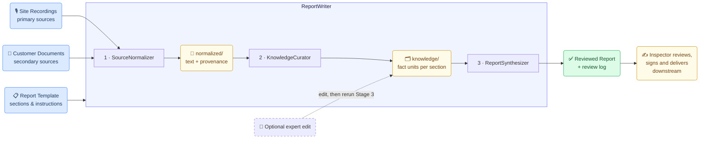
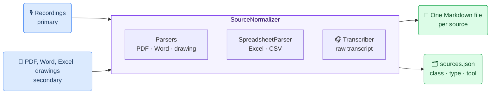
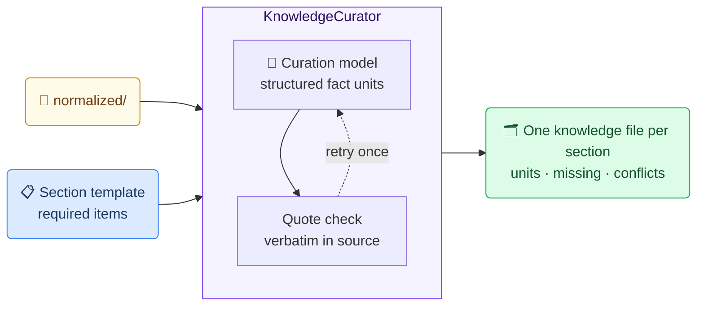
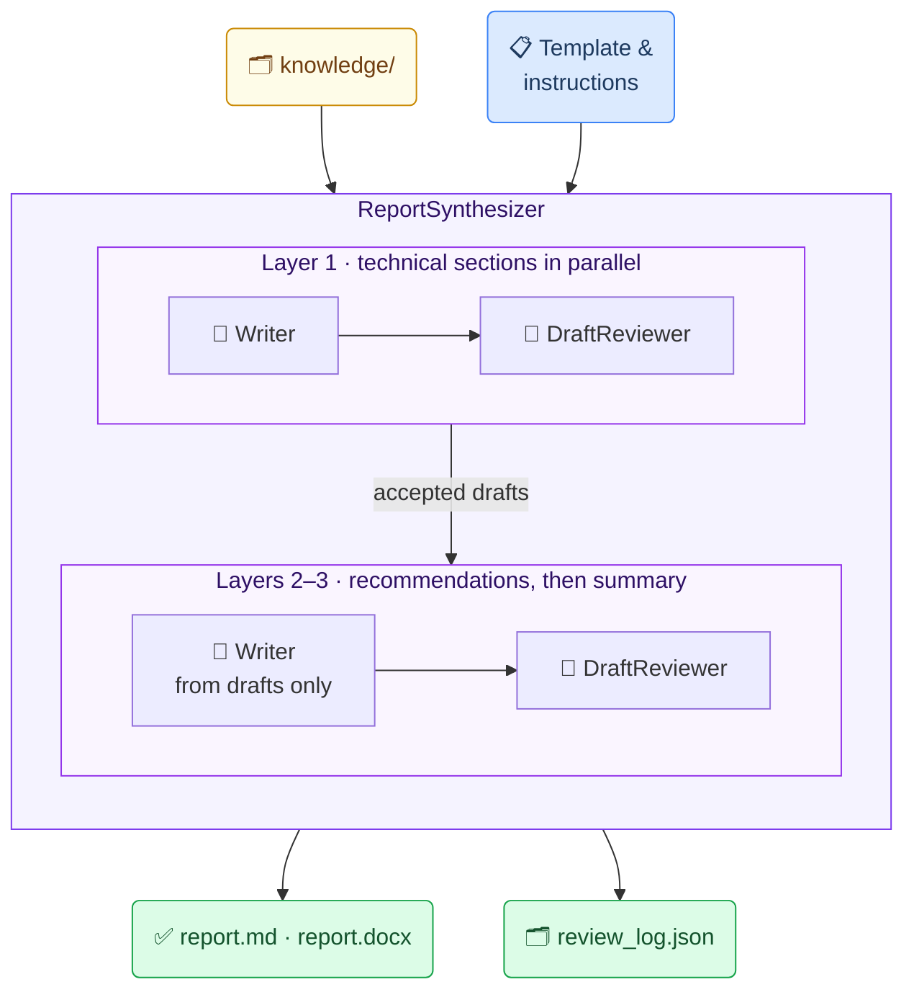
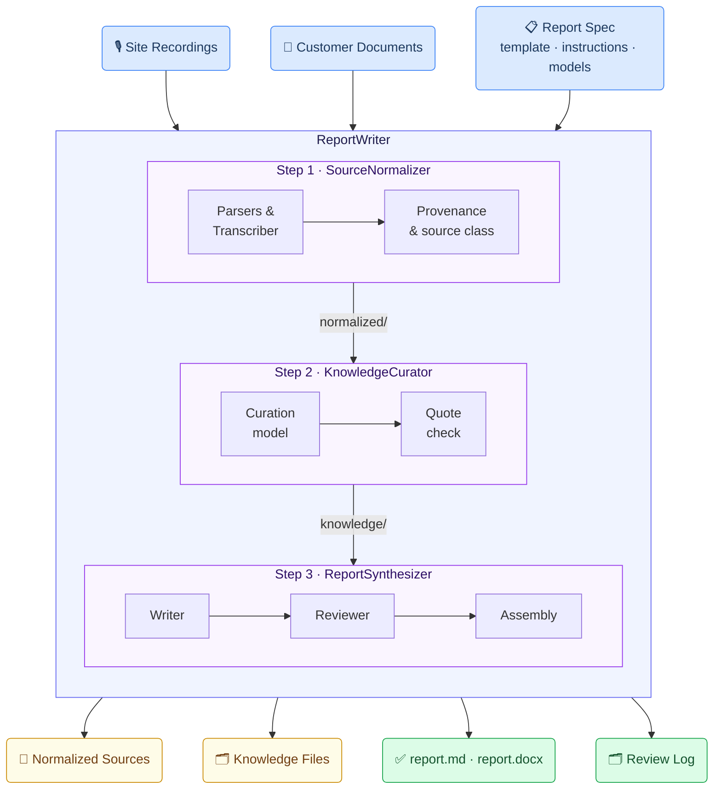

# Report Writing Generic Use Case (Cross-Cutting Use Case)

The report writing use case shows how the toolkit turns private material from several sources, such as field recordings and background documents, into a templated, source-grounded report that a professional signs. House condition assessment is the worked example. The design follows CURACT (Curation-Anchored, Governed, Traceable Reporting). CURACT adds a persisted, section-bound curation stage between reading the sources and writing the report.

---

## Business layer – use case specification

At the business layer, the use case is specified using the GenAI product canvas. The focus is on condition assessment reports for houses and apartments. A customer, typically a buyer, a seller or an owner planning a renovation, orders an assessment. An inspector visits the property and dictates observations as voice recordings while walking through it. The customer supplies the documentation they have: building and renovation reports, drawings, technical data and maintenance records. The inspector then writes the report on the company's fixed template, merging what was observed on site with what the documents say, and signs it. The main users are the inspector, who produces and signs the report, and the customer, who receives it. A senior inspector may also review reports as part of quality assurance.

Concrete example fragments reflected in the use case design include:
- Observations are dictated on site, area by area, with the date and time spoken at the start of each recording
- Background documents come from the customer and differ in age, format and reliability
- The report follows a fixed template with sections such as structures, wet rooms, building services (HVAC) and electrical systems, followed by recommendations and preceded by a summary
- Current observations take precedence over older documents, and information that is required but not available is marked as missing rather than filled in
- Success is defined as less writing time per report, fewer factual errors, and every statement traceable to its source

The canvas provides a shared understanding of what the GenAI solution does and why it is valuable, without going into technical implementation details.

---

## Strategy layer – value evaluation and monitoring

At the strategy layer, the value evaluation model for report writing applies the [Value Evaluation Framework](https://github.com/GAIK-project/gaik-toolkit/blob/main/evaluation_layer/value_evaluation_framework/README.md) to this generic use case and makes value assumptions explicit.

Example value fragments from the model include:

Functional value (primary):
"Faster report writing", "Less manual merging of sources", "Consistent template structure", "No required item silently left out"
→ Outcome: More assessments completed per inspector, with fewer revision rounds

Informational value:
"Every statement traceable to a source", "Conflicts between observations and documents made visible", "Reusable section-bound knowledge"
→ Outcome: Reports that can be checked, audited and reused

Economic value:
"Lower writing effort per report", "Fewer corrections after delivery", "Model cost matched to each task"
→ Outcome: Lower cost per report

Emotional value:
"Confidence in signing the report", "Less routine writing", "Trust in the draft"
→ Outcome: Inspectors spend their time on inspection and judgement

Social value:
"Clear, consistent reports for customers", "A transparent basis for property decisions"
→ Outcome: Stronger customer trust in the assessment

The same model can be used both before implementation (to evaluate expected value) and after deployment (to monitor realized value across different dimensions).

---

## Implementation layer using No-Code

Report writing can be supported by Generative AI using a no-code approach. At the implementation layer, the use case can be realized with a no-code asset from the toolkit:
1) [Report Writing Claude Skill](https://github.com/GAIK-project/gaik-toolkit/blob/main/implementation_layer/no-code-assets/agent-skills/report-writing-skill/README.md)

The Claude Skill reads a folder of source files: it transcribes recordings through a transcription server, reads PDF, Word, Excel and PowerPoint files and images, and writes a Word report. It follows an optional template and an optional sample report. No custom software development is needed.

What the business user sets up (once):

An inspection manager prepares reference material, not code:
- a blank report template in `templates/` with the fixed section structure
- a sample report in `sample_documents/` that shows the expected tone and format
- a short set of written instructions, to be pasted into each request. Conceptually, they say:
  - "Narrate site observations directly; attribute document content to the document and its year"
  - "When an observation contradicts a document, follow the observation and mention the document"
  - "If a required item is not covered by the sources, write `(missing: item)`"
  - "Do not copy facts from the sample report"

What happens in daily work:

**Step 1 – Record on site**
The inspector records voice notes while walking through the property:
- one recording per area, for example exterior and attic, interior and wet rooms, and building services
- the date, time and area spoken at the start of each recording

**Step 2 – Collect the documents**
The customer's documents and the recordings go into `input_documents/`.

**Step 3 – Generate the draft**
The inspector asks Claude to create the report from the folder using the skill, and adds the written instructions.

**Step 4 – Review and sign**
The inspector reads the draft, corrects it where needed and signs it.

Example of what the business gets out:

A draft on the company template, with sentences such as:

- "According to the 1998 renovation report, the mechanical ventilation system had a design life of 25 years."
- "It was observed that the basement supply-air unit ran but produced unusual vibration, with surface rust visible on the housing."
- "Latest electrical inspection record: `(missing: latest electrical inspection record)`"

This makes the result:
- a ready first draft on the company template
- consistent in how observations and documents are cited
- explicit about gaps
- quick for the inspector to review

The no-code route is quick to adopt, but all sources share one context: there is no persisted, section-bound knowledge to inspect or edit, the same model writes and checks the text, and the hierarchy rules are only as reliable as the prompt. The code-based method below adds these controls.

---

## Implementation Layer Using Code-Based Method.

Three stage components implement the three CURACT stages: **SourceNormalizer**, **KnowledgeCurator** and **ReportSynthesizer**. The **ReportWriter** module combines them. Each stage writes its result to a workspace folder that the next stage reads, so every stage can be inspected, edited and rerun. Reviewing, signing and delivering the report remain downstream tasks outside the GenAI pipeline.



### CURACT in this use case

| Stage | What happens | Component | Persisted artifact |
|-------|--------------|-----------|--------------------|
| 1 · Ingestion and normalization | Each recording is transcribed and each document is parsed into text. Every source is tagged as primary or secondary and recorded with its provenance. | SourceNormalizer | `normalized/`: one Markdown file per source and `sources.json` |
| 2 · Section-bound curation | For each technical section, a curation model extracts fact units with a verbatim quote. It also lists the required items that no source covers and the conflicts between sources. | KnowledgeCurator | `knowledge/`: one JSON file per section |
| 3 · Governed synthesis | A writer model drafts each section from its knowledge file only, and a separate reviewer model checks the draft. The recommendations and the summary are written last, from the accepted drafts. | ReportSynthesizer | `report/`: section drafts, `review_log.json`, `report.md` and `report.docx` |

The workspace of one assessment looks like this:

```
workspace/
├── normalized/
│   ├── 01_rec1_exterior_attic.md
│   ├── ...
│   ├── 08_floor_plan.md
│   └── sources.json
├── sample_report.md
├── knowledge/
│   ├── background.json
│   ├── structures.json
│   ├── wet_rooms.json
│   ├── building_services.json
│   └── electrical.json
└── report/
    ├── sections/
    ├── review_log.json
    ├── report.md
    └── report.docx
```

The recommendations and the summary have no knowledge file. They are derived sections, written from the accepted drafts of the sections they depend on.

A fact unit pairs a short summary with the exact words of the source it came from. The building services knowledge file of the example case contains, among others, this pair of a historical document and a field observation:

```json
{
  "section_id": "building_services",
  "units": [
    {
      "id": "building_services-01",
      "topic": "ventilation system age",
      "time_qualifier": "1998",
      "summary": "Mechanical ventilation was installed in the 1998 renovation with a 25-year design life.",
      "quote": "Mechanical ventilation system installed during 1998 renovation. Design life 25 years.",
      "source": { "file": "renovation_report_1998.pdf", "locator": "page 3" },
      "source_class": "secondary",
      "confidence": "high"
    },
    {
      "id": "building_services-02",
      "topic": "current ventilation condition",
      "time_qualifier": "site visit, 2026-03-14 11:23",
      "summary": "The basement supply-air unit ran but vibrated unusually, with surface rust on the housing.",
      "quote": "The machine produced a steady hum but also an unusual vibration; surface rust was visible on the housing.",
      "source": { "file": "rec3_building_services.mp3", "locator": null },
      "source_class": "primary",
      "confidence": "high"
    }
  ],
  "missing": ["latest sewer camera inspection"],
  "conflicts": []
}
```

- `locator` is the page, heading or sheet and row of the quote. A transcript has no time stamps, so the locator of a recording is `null`.
- `missing` lists the section's required items that no source covers. The writer turns each one into a `(missing: …)` marker.
- `conflicts` lists disagreements between sources. Each is marked either as resolved by the source hierarchy or as unresolved.
- The file is plain JSON, so an inspector can correct a unit, delete one or add one before the report is written.

<Callout type="info">
This use case simplifies CURACT in three ways:

- The user supplies only relevant sources, so there is no source-selection step.
- Human checkpoints are optional rather than mandatory.
- Site photos are left out, so no image descriptions are placed in the report. The floor plan is the only drawing, and the VisionParser converts it to text.
</Callout>

How the use case realizes the seven CURACT principles, and which checks of the [example case](#example-case-synthetic-house-condition-assessment) verify each one:

| Principle | Realization in this use case | Verified by |
|-----------|------------------------------|-------------|
| P1 Source grounding | Every fact unit carries a verbatim quote, which is checked against its source. The writer works only from fact units, and every citation names its source. | T1, L1 |
| P2 Knowledge filtering before writing | Each section writer sees only its own knowledge file. The derived sections see only the accepted drafts. | D1, D2, O1, B1 |
| P3 Persistence and provenance | `normalized/`, `knowledge/` and `report/` are human-readable files. Any stage can be rerun from them. | E1 |
| P4 Source hierarchy | Recordings are primary sources and customer documents are secondary. The hierarchy rules are part of the writer and reviewer instructions, and conflicts are listed in the knowledge files. | C1–C5 |
| P5 Role separation | The curator, the writer and the reviewer are separate calls, each with its own model setting. | R1 |
| P6 Human checkpoints | Optional in this use case: the artifacts can be inspected and edited between stages, but no stage waits for approval. | E1 |
| P7 Explicit missing data | A required item without a source becomes `(missing: …)`. An area that was not inspected is stated as a scope limit. | G1, G2, S1 |

---

## Software Components

### 1. SourceNormalizer (Stage 1)

Converts every input into text with provenance, using existing toolkit components:
- PDF and Word documents go through the Parsers, and drawings through the vision parser.
- Spreadsheets go through a new spreadsheet parser.
- Recordings go through the Transcriber. Its raw transcript is kept, because the curator quotes it word for word.

Each source is tagged primary or secondary according to the input group it was given in. PDF text carries `[Page N]` markers, so a fact unit can cite its page. An unsupported, unreadable or empty file stops the run instead of being skipped.



> 📁 [`implementation_layer/src/gaik/software_components/source_normalizer/`](https://github.com/GAIK-project/gaik-toolkit/tree/main/implementation_layer/src/gaik/software_components/source_normalizer)

---

### 2. KnowledgeCurator (Stage 2)

Works through the technical sections of the template one at a time. For each, it reads the normalized sources and extracts fact units, each with a topic, time qualifier, summary, verbatim quote, source and source class. It also records the required items that no source covers and the conflicts between sources. It uses a structured-output call of the toolkit's LLM client, with its own model setting, separate from the writer.

Every quote is checked against the source it cites: it must appear there word for word, ignoring only differences in whitespace. If a quote cannot be found, it is requested again once; if it still cannot be found, the run stops. Derived sections are not curated.



> 📁 [`implementation_layer/src/gaik/software_components/knowledge_curator/`](https://github.com/GAIK-project/gaik-toolkit/tree/main/implementation_layer/src/gaik/software_components/knowledge_curator)

---

### 3. ReportSynthesizer (Stage 3)

Writes the report section by section as a LangGraph workflow:
1. The independent technical sections are drafted in parallel, each from its own knowledge file only.
2. The DraftReviewer component, with its own model setting, checks each draft against that file for unsupported claims, missing required items, hierarchy phrasing and the section instructions. It returns exact search-and-replace edits.
3. The recommendations are written next and the summary last, each from the accepted drafts only.

Edits that cannot be applied are logged, and in strict mode they stop the run. The saved section drafts can be edited, and `report.md` and `report.docx` rebuilt from them without a model call. DraftReviewer is a component of its own: it fact-checks any generated text against reference material.



> 📁 [`implementation_layer/src/gaik/software_components/report_synthesizer/`](https://github.com/GAIK-project/gaik-toolkit/tree/main/implementation_layer/src/gaik/software_components/report_synthesizer) · [`draft_reviewer/`](https://github.com/GAIK-project/gaik-toolkit/tree/main/implementation_layer/src/gaik/software_components/draft_reviewer)

---

The stage components reuse these toolkit components. The Parsers include the SpreadsheetParser.

> 📁 [`parsers/`](https://github.com/GAIK-project/gaik-toolkit/tree/main/implementation_layer/src/gaik/software_components/parsers) · [`transcriber/`](https://github.com/GAIK-project/gaik-toolkit/tree/main/implementation_layer/src/gaik/software_components/transcriber) · [`draft_reviewer/`](https://github.com/GAIK-project/gaik-toolkit/tree/main/implementation_layer/src/gaik/software_components/draft_reviewer) · [`llm/`](https://github.com/GAIK-project/gaik-toolkit/tree/main/implementation_layer/src/gaik/software_components/llm)

### Downstream tasks

The generated report is a draft for the inspector. Checking it against the knowledge files, correcting it, signing it, delivering it to the customer and archiving it take place outside the GenAI pipeline. They follow the company's own quality system and document management and may need organisation-specific customisation. Because the workspace keeps the normalized sources, the knowledge files and the review log, the archived assessment shows which source supports each statement.

---

## Defining the Report: Template and Instructions

The report structure is defined in plain language. Each section has an identifier, a title and, optionally, the sections it depends on and the items it must cover:

```
Report: House condition assessment
Sections, in report order:

summary — Summary
  depends on: all other sections (written last, placed first)
  content: overall condition in 5–8 sentences and the most urgent actions

background — Property and background
  required: building year, floor area, main renovations with their years

structures — Structures and roof
  required: foundation and base floor, external walls, roof covering, attic and roof underlay

wet_rooms — Wet rooms
  required: age of the waterproofing, moisture measurements made during the visit

building_services — Building services (heating, ventilation, water and sewer)
  required: heating system, ventilation system and its age, latest sewer camera inspection

electrical — Electrical systems
  required: main distribution board, latest electrical inspection record

recommendations — Recommendations
  depends on: structures, wet_rooms, building_services, electrical
  content: one line per action, classed as Repair now / Within 1–2 years /
           Within 3–5 years / Further investigation / Maintenance
```

The additional instructions set the source hierarchy, the treatment of missing data and the style:

```
Source hierarchy
- Site recordings are primary sources. Customer documents are secondary sources.
- Narrate observations directly ("It was observed that ...") and cite them as
  [field observation, date].
- Attribute document content ("According to the 1998 renovation report ...") and
  cite the document.
- When a clear observation contradicts a document, follow the observation and
  mention what the document says.
- When an uncertain observation contradicts a document, write "Unresolved: ..."
  and give both views.
- When two documents disagree on the same topic, follow the newer one.

Missing data and scope
- If a required item is not covered by any source, write (missing: item).
- If an area was not inspected, state the limitation and the reason, e.g.
  "The roof surface was not inspected because of snow cover." Do not use the
  missing marker for this.

Style
- English, third person, past tense for observations.
- Short paragraphs; bullet lists only in Recommendations.
- Use the sample report for tone and format only. Never copy facts from it.
```

---

## Software Module: ReportWriter

ReportWriter connects the three stage components into one application with a single report spec, `report_spec.json`. The spec holds:
- the report title, language and template;
- the input groups, primary and secondary, and the sample report;
- the additional instructions;
- one optional model setting for each role: vision, transcription, curator, writer and reviewer.

The spec holds model names only. Credentials come from the LLM configuration.

`run()` executes all three stages. `normalize()`, `curate()` and `synthesize()` each run one stage, so a run can resume from an edited `knowledge/` folder. `rebuild()` rebuilds `report.md` and `report.docx` from edited section drafts without a model call. `mode="single_call"` writes the whole report in one call from all normalized sources. This curation-free baseline measures what the curation stage adds.



Illustrative output for the building services section:

> Mechanical ventilation was installed during the 1998 renovation; according to the 1998 renovation report, the system had a 25-year design life [1998 renovation report]. It was observed that the basement supply-air unit ran but produced unusual vibration, with surface rust visible on the housing [field observation, 14 March 2026]. Latest sewer camera inspection: `(missing: latest sewer camera inspection)`.

| Capability | Status |
|------------|--------|
| Document parsing and transcription | Available: Parsers, Transcriber |
| Spreadsheet parsing as a component | Available: `SpreadsheetParser` |
| Stage 1: SourceNormalizer | Available |
| Stage 2: KnowledgeCurator | Available |
| Stage 3: ReportSynthesizer, with DraftReviewer | Available |
| ReportWriter module with the single-call baseline | Available |
| Synthetic house dataset and expected behaviours | Available |

> 📁 [`implementation_layer/src/gaik/software_modules/report_writer/`](https://github.com/GAIK-project/gaik-toolkit/tree/main/implementation_layer/src/gaik/software_modules/report_writer)
> 📁 [`implementation_layer/examples/software_modules/report_writer/`](https://github.com/GAIK-project/gaik-toolkit/tree/main/implementation_layer/examples/software_modules/report_writer)

The earlier Multi-Source Report Generator module remains available as the legacy report writer.

To test the report writer, please visit the [GAIK demo link](https://gaik-demo.2.rahtiapp.fi/report-writer-v2). It runs the house condition assessment and a project meeting example. Every source and intermediate file can be downloaded, and the knowledge files and section drafts can be edited between stages. Access is available upon registration request.

---

## Example Case: Synthetic House Condition Assessment

A synthetic dataset, [`house_condition_assessment/`](https://github.com/GAIK-project/gaik-toolkit/tree/main/implementation_layer/examples/software_modules/report_writer/house_condition_assessment), lets the pipeline be tested and demonstrated without personal data. It describes a fictional property and plants the situations CURACT is designed to handle.

- **Property:** a fictional 1½-storey timber-frame detached house built in 1978, about 130 m², with a partial basement that houses the technical room.
- **Inspection:** 14 March 2026, at −4 °C with snow on the roof.

| File | Source class | Content |
|------|--------------|---------|
| `rec1_exterior_attic.mp3` | primary | Exterior, the roof seen from the ground, and the attic; recorded at 09:40 |
| `rec2_interior_wet_rooms.mp3` | primary | Interior and wet rooms, with moisture readings; recorded at 10:35 |
| `rec3_building_services.mp3` | primary | Technical room: heating, ventilation, water, sewer and the electrical board; recorded at 11:20 |
| `renovation_report_1998.pdf` | secondary | 1998 renovation: mechanical ventilation, bathroom waterproofing, main distribution board, and the original concrete tile roof |
| `roof_renovation_2012.pdf` | secondary | 2012 roof renovation: steel sheet covering and a new underlay |
| `moisture_survey_2019.docx` | secondary | 2019 moisture survey: no elevated readings in the wet rooms |
| `maintenance_log.xlsx` | secondary | Owner's maintenance log, with filter changes, sewer flushing in 2016 and unrelated garden entries |
| `floor_plan.png` | secondary | Floor plan drawing with room names and areas |

The recordings are generated from written scripts with the Text-to-Speech component. Each one opens with the date, time and area. The dataset also contains:
- `sample_report.docx`: a report on a different property, with an oil boiler, used for tone and format only;
- `report_spec.json`: the template and instructions above;
- `expected_behaviours.md`: the checks below.

| ID | Principle | Planted situation | Expected behaviour |
|----|-----------|-------------------|--------------------|
| C1 | P4 | The main distribution board was replaced in 1998, known only from the renovation report | Attributed: "According to the 1998 renovation report …" |
| C2 | P4 | Vibration and rust on the supply-air unit, known only from recording 3 | Narrated: "It was observed that …", with a field-observation citation |
| C3 | P4 | The 2019 survey found no elevated moisture; on site, elevated readings were measured next to the shower floor drain | The observation is followed, the 2019 result is mentioned, and the conflict is recorded as resolved |
| C4 | P4 | The inspector is unsure whether the attic underlay is original; the 2012 report says it was renewed | "Unresolved: …" in the text and an unresolved entry in `conflicts` |
| C5 | P4 | The 1998 report describes a concrete tile roof; the 2012 report describes a steel sheet roof | The report follows the newer document: a steel sheet roof |
| G1 | P7 | No source contains an electrical inspection record | `(missing: latest electrical inspection record)` |
| G2 | P7 | The log lists sewer flushing in 2016 but no camera inspection | `(missing: latest sewer camera inspection)`; the flushing is not presented as an inspection |
| S1 | P7 | The roof surface could not be inspected because of snow | A stated scope limit, not a missing marker and not an observation |
| D1 | P2 | Garden entries in the maintenance log | Absent from every knowledge file and section |
| D2 | P2 | A cost table in the 1998 renovation report | Absent from the report |
| L1 | P1 | The sample report describes an oil boiler | No oil boiler or oil tank in the output |
| T1 | P1 | – | Every quote in `knowledge/` appears verbatim in its normalized source |
| E1 | P3, P6 | One unit is deleted from `knowledge/building_services.json` and only Stage 3 is rerun | The fact disappears from the section; Stages 1 and 2 are not rerun |
| R1 | P5 | A draft with a planted wrong year is given to the reviewer | The reviewer corrects the year and logs the edit in `review_log.json` |
| O1 | P2 | – | The recommendations and the summary are written from section drafts only |
| B1 | – | The same inputs are run with `mode="single_call"` | Checks C1–L1 are scored for both modes and compared |

---

## Adaptable to Other Domains

The same pipeline applies to any fixed-template report that merges firsthand observations with background documents. Only the template, the required items and the source hierarchy change:

- Technical due diligence of properties, machinery audits, field service reports, environmental site assessments, clinical case summaries

Where executed documents outrank recollection, as in legal due diligence, the hierarchy is reversed by declaring the documents the primary sources.

---

## Evaluation Methods

The quality of this use case is evaluated by assessing each software component independently:

### Transcriber Evaluation

The recordings are generated from written scripts, so the scripts serve as reference transcripts. Transcription quality is measured with the **Word Error Rate (WER)** against them. This matters because the curator quotes the raw transcript word for word.

> 📊 **Transcription evaluation methods:** [`evaluation_layer/eval_methods/transcription_eval/`](https://github.com/GAIK-project/gaik-toolkit/tree/main/evaluation_layer/eval_methods/transcription_eval)

### Curation Evaluation

Curation fidelity is measured in three parts:
- **quote accuracy**: whether each quote appears verbatim in its source, checked automatically (T1);
- **summary inferability**: whether each summary follows from its quote, judged by the LLM Judge of the Validators component;
- **recall of the planted items**: whether the fact units cover the planted situations in the expected behaviours.

A dedicated evaluation method is planned.

> 📁 [`implementation_layer/src/gaik/software_components/validators/`](https://github.com/GAIK-project/gaik-toolkit/tree/main/implementation_layer/src/gaik/software_components/validators)

### Report Evaluation

The finished report is scored 0–10 by an LLM judge that looks for factual errors, missing sections, missing required elements and clarity issues. For this use case, three measures are added:
- the **claim-level faithfulness** of each section to its knowledge file, which the faithfulness metric of the Evaluators' RAG evaluator can score, with the knowledge file as the context;
- the expected-behaviour checks C1–O1;
- a comparison with the single-call baseline (B1).

> 📊 **Report writing evaluation methods:** [`evaluation_layer/eval_methods/report_writing_eval/`](https://github.com/GAIK-project/gaik-toolkit/tree/main/evaluation_layer/eval_methods/report_writing_eval)

---

## Related Resources

| Resource | Link |
|----------|------|
| Parsers component | [GitHub →](https://github.com/GAIK-project/gaik-toolkit/tree/main/implementation_layer/src/gaik/software_components/parsers) |
| Transcriber component | [GitHub →](https://github.com/GAIK-project/gaik-toolkit/tree/main/implementation_layer/src/gaik/software_components/transcriber) |
| SourceNormalizer component | [GitHub →](https://github.com/GAIK-project/gaik-toolkit/tree/main/implementation_layer/src/gaik/software_components/source_normalizer) |
| KnowledgeCurator component | [GitHub →](https://github.com/GAIK-project/gaik-toolkit/tree/main/implementation_layer/src/gaik/software_components/knowledge_curator) |
| DraftReviewer component | [GitHub →](https://github.com/GAIK-project/gaik-toolkit/tree/main/implementation_layer/src/gaik/software_components/draft_reviewer) |
| ReportSynthesizer component | [GitHub →](https://github.com/GAIK-project/gaik-toolkit/tree/main/implementation_layer/src/gaik/software_components/report_synthesizer) |
| LLM client component | [GitHub →](https://github.com/GAIK-project/gaik-toolkit/tree/main/implementation_layer/src/gaik/software_components/llm) |
| Evaluators component | [GitHub →](https://github.com/GAIK-project/gaik-toolkit/tree/main/implementation_layer/src/gaik/software_components/evaluators) |
| ReportWriter module | [GitHub →](https://github.com/GAIK-project/gaik-toolkit/tree/main/implementation_layer/src/gaik/software_modules/report_writer) |
| Module usage examples and the house dataset | [GitHub →](https://github.com/GAIK-project/gaik-toolkit/tree/main/implementation_layer/examples/software_modules/report_writer) |
| Multi-Source Report Generator module (legacy) | [GitHub →](https://github.com/GAIK-project/gaik-toolkit/tree/main/implementation_layer/src/gaik/software_modules/multi_source_report_generator) |
| Report Writing Claude Skill | [GitHub →](https://github.com/GAIK-project/gaik-toolkit/blob/main/implementation_layer/no-code-assets/agent-skills/report-writing-skill/README.md) |
| Report writing evaluation | [GitHub →](https://github.com/GAIK-project/gaik-toolkit/tree/main/evaluation_layer/eval_methods/report_writing_eval) |
| Value Evaluation Framework | [GitHub →](https://github.com/GAIK-project/gaik-toolkit/blob/main/evaluation_layer/value_evaluation_framework/README.md) |
| Implementation Layer overview | [GitHub →](https://github.com/GAIK-project/gaik-toolkit/tree/main/implementation_layer) |
