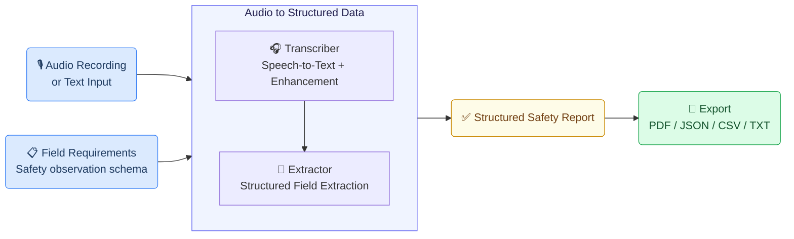
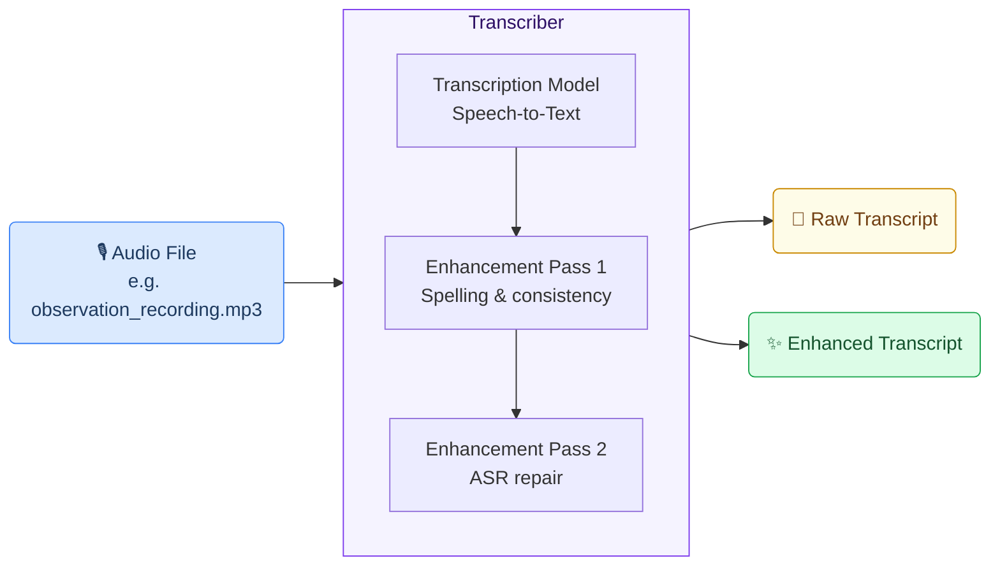
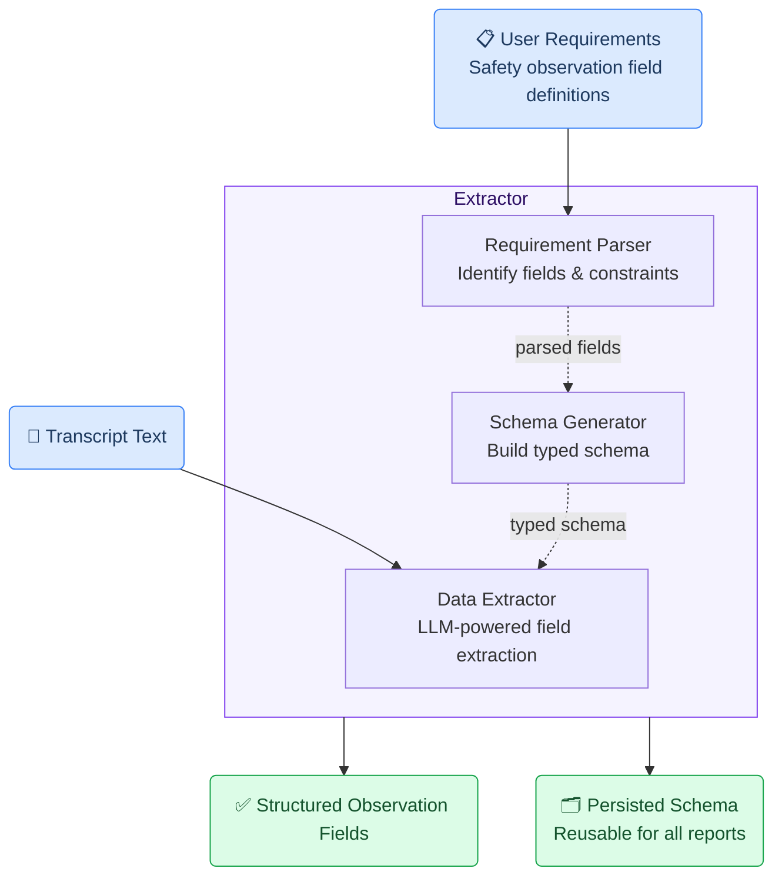
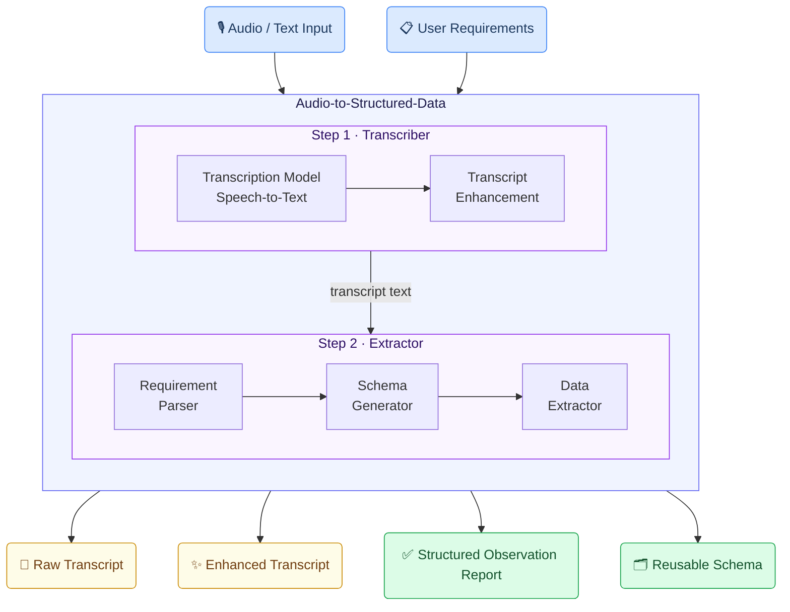

# Safety Observation Reporting Generic Use Case (Cross-Cutting Use Case)

This use case demonstrates how the GAIK toolkit converts spoken or written safety observations — near misses, incidents, hazards, and deviations — into complete, structured safety reports with all required fields populated, supporting faster and more consistent safety documentation across worksites.

## Business layer – use case specification

At the business layer, the use case targets organisations where safety observations, near misses, and deviations are often reported verbally or in short free-text notes. Important details can be incomplete, inconsistent in terminology, or difficult to translate into the structured fields required by official safety reporting forms. Delays and omissions in safety reporting reduce visibility into risk patterns and weaken follow-up actions. The AI-supported workflow allows workers and supervisors to record observations by voice or text at the moment they occur, and converts them into a structured, validated report ready for review, correction, and submission.

Concrete example fragments reflected in the use case design include:
- A safety observer records a verbal description of a near miss on a mobile device immediately after the event
- The report must capture incident type, contributing factors, actions taken, and prevention suggestions — consistently across all reporters
- Manual form-filling is slow, inconsistently worded, and often completed from memory after the workday
- The structured output must align with the organisation's official reporting schema and be exportable to PDF, JSON, or CSV for downstream systems
- Success is defined as more observations reported, faster completion, higher field completeness, and better follow-up traceability

The canvas clarifies the purpose of the solution, the main users (workers, supervisors, safety officers, project managers, and quality staff), and the expected outcomes.

[](/images/safety-canvas.png)

- **Reference GenAI Product Canvas for Safety Observation Reporting** — [Download (safety-canvas.png)](/images/safety-canvas.png)

---

## Strategy layer – value evaluation and monitoring

At the strategy layer, the value evaluation model applies the [Value Evaluation Framework](https://github.com/GAIK-project/gaik-toolkit/blob/main/strategy_layer/value_evaluation_framework/README.md) to this generic use case and makes value assumptions explicit.

Example value fragments from the model include:

Functional value (primary):
"Automatic transcription of spoken observations", "Faster submission to relevant persons", "Schema-guided field extraction", "Correct field selection before submission", "Consistent and structured reporting", "Export to JSON, PDF, CSV, or text", "Systematic handling of required fields"
→ Outcome: More safety observations processed faster and with higher quality

Informational value:
"Structured capture of safety observations", "Clear visibility into near misses and deviations", "Better quality of safety documentation", "Photo-supported evidence"
→ Outcome: Better safety knowledge with trusted reporting data

Financial value:
"Lower reporting and administrative cost", "Faster completion of safety documentation", "Reduced cost of missing or incorrect reports", "Better reuse of structured safety data"
→ Outcome: Lower production cost and better prevention readiness

Emotional value:
"Higher confidence in report completeness", "Reduced stress from manual reporting", "More confidence that observations are taken seriously"
→ Outcome: More engaged staff and smoother reporting

Social value:
"Stronger communication and safety culture", "Better collaboration between workers and safety staff", "Shared awareness of risks and follow-up actions"
→ Outcome: Stronger communication and broader safety culture collaboration

[](/images/safety-value.png)

- **Reference Value Evaluation Model for Safety Observation Reporting** — [Download (safety-value.png)](/images/safety-value.png)

The same model can be used both before implementation (to evaluate expected value) and after deployment (to monitor realized value across different dimensions).

---

## Implementation layer using No-Code

Safety observation reporting can be supported by Generative AI using a no-code prompt-based approach.
At the implementation layer, the use case is realized using a ready-made extraction prompt from the toolkit:
1) [Prompt for safety observation extraction from audio transcripts](https://github.com/GAIK-project/gaik-toolkit/tree/main/implementation_layer/no-code-assets/prompts/safety-observation-reporting)

The prompt converts a spoken audio transcript or typed text into a strict JSON object covering all 13 required observation fields. It can be pasted directly into ChatGPT, Claude.ai, or Gemini, or set up as a Custom GPT for repeated use.

**What the business user sets up (once):**

A safety officer or site supervisor copies the prompt from `prompt.txt` and optionally sets it up as a Custom GPT. The prompt defines:
- All 13 observation fields with extraction rules
- Fixed allowed values for incident type and incident category
- Anti-hallucination guardrails (only extract what is explicitly stated; leave fields blank otherwise)

**What happens in daily work:**

**Step 1 – Record or write the observation**
The worker or supervisor records a spoken description of the safety observation immediately after the event — or types a brief note describing what happened.

**Step 2 – Extract and review**
Paste the transcript into the AI assistant along with the prompt. The assistant extracts all observation fields and returns a structured JSON object plus a readable summary table.

**Example of what the business gets out:**

The output is a ready-to-review structured safety record:

- Vaaratilanne / tyyppi: Near miss
- Havainto- ja poikkeamatyypin tarkennus: Kalusto
- Päivämäärä: 05.04.2026
- Tapahtumaselostus: öljyvuoto trukin lastausalueella, liukastumisriski
- Tapahtumaan johtaneet tekijät: hydrauliöljyvuoto, huono valaistus
- Tehdyt välittömät toimenpiteet: alue rajattu, työnjohto ilmoitettu, siivous järjestetty
- Ehdotukset: säännölliset laitetarkastukset, parempi valaistus

This makes the result:
- easy to paste into the official safety reporting form or digital system
- safe to store as a structured record for compliance and audit
- reliable input for risk analytics and prevention planning
- suitable for export to PDF, JSON, or CSV for downstream safety management systems

---

## Implementation Layer Using Code-Based Method.

Two software components — **Transcriber** (with a two-pass AI enhancement step) and **Extractor** — are combined into the **Audio to Structured Data** module to handle this use case end-to-end. The structured observation fields then feed into downstream tasks for export and submission.



---

## Software Components

### 1. Transcriber

Converts a voice recording of the safety observation into text using a configurable speech-to-text backend, followed by a two-pass AI enhancement step. Pass 1 corrects spelling and ensures linguistic consistency. Pass 2 repairs ASR errors using context — misheard words, compound splitting, and grammatical inconsistencies common in rapid spoken reports. The enhanced transcript is then passed to the Extractor.



> 📁 [`implementation_layer/src/gaik/software_components/transcriber/`](https://github.com/GAIK-project/gaik-toolkit/tree/main/implementation_layer/src/gaik/software_components/transcriber)

---

### 2. Extractor

Takes the enhanced transcript and a predefined field specification and returns a structured safety observation record. Internally it runs three steps: the **Requirement Parser** identifies fields and constraints from the specification; the **Schema Generator** builds a typed validation schema; the **Data Extractor** uses an LLM to fill each field from the transcript. The schema is persisted and reused across observations, so daily extraction requires no schema regeneration.



> 📁 [`implementation_layer/src/gaik/software_components/extractor/`](https://github.com/GAIK-project/gaik-toolkit/tree/main/implementation_layer/src/gaik/software_components/extractor)

---

### Downstream tasks

Once the Extractor produces the structured observation record, the result feeds into downstream tasks that are outside the GenAI pipeline.

**Report export** is the primary downstream step. The structured fields are rendered into the format required by the organisation's safety management system. Multiple export formats are supported — PDF for printed or archived reports, JSON for system integration, CSV for analysis, and plain text for simple workflows. The report format and field layout depend on the organisation's reporting template and may require customisation.

After export, the structured result can be passed to any further step:

- **Submit to a safety management system** — map the structured fields to the form or database schema used by the organisation's safety platform
- **Attach photos** — observation photos taken at the scene can be added during the review step before export
- **Store for analytics** — persist the structured record for aggregated risk analysis, trend monitoring, and prevention planning

---

## Defining What to Extract: User Requirements

Fields are specified in plain language — no code, no schema configuration. The specification below is taken directly from the extraction prompt and covers the standard safety observation report form:

```
POIMITTAVAT KENTÄT TÄSSÄ JÄRJESTYKSESSÄ:

- Vaaratilanne-, turvallisuushavainto tai poikkeama
  Valitse vain yksi arvoista: "Near miss", "safety observation", "deviation".
  Jos arvoa ei voi päätellä lähteestä, palauta "safety observation".

- Havainto- ja poikkeamatyypin tarkennus
  Valitse vain yksi arvoista: "Kalusto", "Laatu", "Alihankinta", "Ympäristö", "Asiakas", "Turvallisuus".
  Jos arvoa ei voi päätellä lähteestä, palauta "Turvallisuus".

- Päivämäärä
  Havainnon päivämäärä. Palauta "" jos ei saatavilla.

- Työnantaja
  Litteraatiossa selvästi mainittu alihankkijan, työnantajan tai yrityksen nimi.
  Palauta "" jos ei saatavilla.

- Kirjaaja
  Havainnon kirjaavan henkilön nimi.
  Palauta "" jos ei saatavilla.

- Henkilötyyppi
  Työntekijän henkilötyyppi.
  Palauta "" jos ei saatavilla.

- Projektitunnus
  Projektin tunnus.
  Palauta "" jos ei saatavilla.

- Tapahtumaselostus
  Tarkka kuvaus havainnosta tai poikkeamasta.
  Palauta "" jos ei saatavilla.

- Tapahtumaan johtaneet tekijät
  Kuvaus tapahtumaan johtaneista tekijöistä.
  Palauta "" jos ei saatavilla.

- Tehdyt välittömät toimenpiteet
  Kuvaus välittömistä tehdyistä toimenpiteistä.
  Palauta "" jos ei saatavilla.

- Toimenpiteiden tekijä
  Välittömät toimenpiteet tehneen henkilön nimi.
  Palauta "" jos ei saatavilla.

- Tekopäivä
  Päivä, jolloin toimenpiteet tehtiin.
  Palauta "" jos ei saatavilla.

- Ehdotukset vastaavien tilanteiden välttämiseksi
  Ehdotukset vastaavien tilanteiden välttämiseksi.
  Palauta "" jos ei saatavilla.

YLEISET PERIAATTEET:
- Palauta kaikki kentät aina.
- Säilytä lähteen sanamuoto mahdollisimman tarkasti.
- Lisää tieto vain, jos se on selvästi mainittu lähteessä.
- Älä käytä nykyistä päivämäärää tai kellonaikaa tapahtuman arvona.
- Jos tieto puuttuu, palauta "". Älä palauta null tai N/A.
```

The Schema Generator parses this specification into a typed model and saves it for reuse across all observations on the same project. The schema can be adapted by updating the field list and regenerating once for a new reporting context.

---

## Software Module: Audio to Structured Data

Packages both components into a single workflow. Provide an audio recording or text input and field requirements — the module returns the transcript, enhanced transcript, structured observation fields, and the reusable schema.



Example output from the demo — recording a safety observation and viewing the structured report with all extracted fields:

<p>
  
</p>

The demo application for construction site diary creation can also be used for safety observation reporting by updating the extraction requirements to the safety observation field schema. This demonstrates how the same GAIK pipeline adapts to different reporting domains simply by changing the field specification.

> 📁 [`implementation_layer/src/gaik/software_modules/audio_to_structured_data/`](https://github.com/GAIK-project/gaik-toolkit/tree/main/implementation_layer/src/gaik/software_modules/audio_to_structured_data)
>
> 📁 [`implementation_layer/examples/software_modules/`](https://github.com/GAIK-project/gaik-toolkit/tree/main/implementation_layer/examples/software_modules)

---

## Adaptable to Other Domains

The same pipeline applies to any domain requiring structured incident or observation reports from spoken descriptions — only the **User Requirements** definition changes:

- Environmental deviation reporting, quality non-conformance logging, workplace incident records, field inspection findings, customer complaint documentation

---

## Evaluation Methods

The quality of this use case is evaluated at two levels: the GAIK software components (transcription and extraction) are assessed independently.

### Transcription Evaluation

Transcription quality is measured using **Word Error Rate (WER)** and related metrics (Character Error Rate, Spelling Error Rate, Substitution/Deletion/Insertion rates), comparing the AI-generated transcript against a verified reference. The evaluation also benchmarks the benefit of the two-pass enhancement step.

> 📊 **Transcription evaluation methods:** [`implementation_layer/eval_methods/transcription_eval/`](https://github.com/GAIK-project/gaik-toolkit/tree/main/implementation_layer/eval_methods/transcription_eval)

### Extraction Evaluation

The quality of structured field extraction is evaluated using precision, recall, and F1 score — computed separately for exact-match fields (dates, enumerated categories, names) and semantic-match fields (descriptive text such as event descriptions and prevention suggestions). This measures how accurately the extracted fields match the expected values across a set of reference observations.

> 📊 **Extraction evaluation methods:** [`implementation_layer/eval_methods/extraction_eval/`](https://github.com/GAIK-project/gaik-toolkit/tree/main/implementation_layer/eval_methods/extraction_eval)

---

## Related Resources

| Resource | Link |
|----------|------|
| Transcriber component | [GitHub →](https://github.com/GAIK-project/gaik-toolkit/tree/main/implementation_layer/src/gaik/software_components/transcriber) |
| Extractor component | [GitHub →](https://github.com/GAIK-project/gaik-toolkit/tree/main/implementation_layer/src/gaik/software_components/extractor) |
| Audio to Structured Data module | [GitHub →](https://github.com/GAIK-project/gaik-toolkit/tree/main/implementation_layer/src/gaik/software_modules/audio_to_structured_data) |
| Module usage examples | [GitHub →](https://github.com/GAIK-project/gaik-toolkit/tree/main/implementation_layer/examples/software_modules) |
| Incident Reporting use case | [/use-cases/incident-reporting →](/use-cases/incident-reporting) |
| Construction Site Diary Creation use case | [/use-cases/construction-site-diary-creation →](/use-cases/construction-site-diary-creation) |
| Implementation Layer overview | [GitHub →](https://github.com/GAIK-project/gaik-toolkit/tree/main/implementation_layer) |
