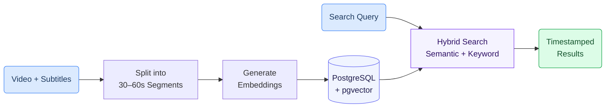

# Semantic Dental Video Search

Find the exact moment in a dental lecture where a topic is discussed — just by typing a question. The system searches across an entire video library and returns timestamped results, so you can jump directly to the relevant segment.

## How It Works

The system processes each video through three stages:

1. **Subtitles are split into segments** — Each video's subtitles are grouped into ~30–60 second chunks
2. **Each segment gets a numerical fingerprint** — An AI model converts the text into a vector embedding that captures its meaning, not just keywords
3. **Search combines meaning and keywords** — When you type a query, the system finds segments that are both semantically similar and contain matching terms

---

## Search Methods

The system supports three search modes:

- **Semantic search** — Finds results by meaning. Searching for "tooth replacement" also finds segments about "dental implants" or "prosthetics", even if those exact words aren't used
- **Keyword search** — Finds results by matching specific terms in the text using full-text search
- **Hybrid search (default)** — Combines both methods using Reciprocal Rank Fusion (RRF). Results that rank high in both semantic and keyword search appear first. This is the most reliable mode for everyday use

---

## Finnish Language Support

Finnish is an agglutinative language — words change form based on grammar (e.g. "xylitol" becomes "xylitolin", "xylitolia", "xylitolista"). Standard keyword search would miss these forms.

The system uses **prefix matching**: the search term "xylitol" automatically matches all Finnish inflections starting with "xylitol-". Combined with **trigram similarity** as a fallback, the system handles typos and word variations gracefully.

---

## Precise Timestamp Seeking

Each 30–60 second segment is backed by individual subtitle lines (2–5 seconds each). When a search result is selected, the system resolves the exact subtitle line within the segment, achieving **~3–5 second precision** for video seeking.

---

## Getting Started

The database schema and search functions are provided as ready-to-use SQL migration scripts:

1. Start a PostgreSQL database with the pgvector extension
2. Run the 5 SQL migration files in order to create the schema, indexes, and search functions
3. Insert video segments with embeddings from your AI model
4. Call the `hybrid_search()` function to search

> **SQL scripts and setup guide:** [`implementation_layer/src/gaik/software_components/RAG/pg_vector_store/sql/`](https://github.com/GAIK-project/gaik-toolkit/tree/main/implementation_layer/src/gaik/software_components/RAG/pg_vector_store/sql)

---

## Related Resources

| Resource | Link |
|----------|------|
| Video search SQL scripts | [GitHub](https://github.com/GAIK-project/gaik-toolkit/tree/main/implementation_layer/src/gaik/software_components/RAG/pg_vector_store/sql) |
| PgVectorStore Python component | [GitHub](https://github.com/GAIK-project/gaik-toolkit/tree/main/implementation_layer/src/gaik/software_components/RAG/pg_vector_store) |
| PgVectorStore README (setup guide) | [GitHub](https://github.com/GAIK-project/gaik-toolkit/blob/main/implementation_layer/src/gaik/software_components/RAG/pg_vector_store/README.md) |
