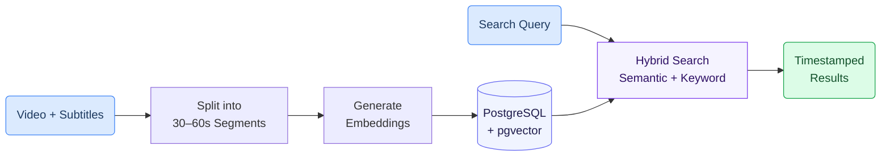

# Semantic Video Search

Find the exact moment in a lecture where a topic is discussed — just by typing a question in plain language. The system searches across an entire video library and returns timestamped results, so you can jump directly to the relevant segment.

<Callout type="info">
**Try the Live Demo:** [gaik-demo.2.rahtiapp.fi/video-search](https://gaik-demo.2.rahtiapp.fi/video-search)

Search across 11 indexed lecture videos with 300+ segments. Try queries like "tekoäly työelämässä" or "kielitaito".
</Callout>
---

## Why It Matters

- **Instant access** — Skip scrubbing through hours of video to find the 30 seconds you need
- **Natural language** — Search by meaning, not just exact keywords. "How does AI affect jobs?" finds segments about "tekoälyn vaikutus työelämään"
- **Builds on transcription** — Any video that has been [transcribed and subtitled](/docs/use-cases/dental-transcription-close-captioning) can be made searchable
- **Scales effortlessly** — Works across 1 video or 1,000 videos with the same search interface

---

## How It Works

1. **Subtitles are split into segments** — Each video's subtitles are grouped into ~30–60 second chunks
2. **Each segment gets a numerical fingerprint** — An AI model converts the text into a vector embedding that captures its meaning
3. **Search combines meaning and keywords** — When you type a query, the system finds segments that are both semantically similar and contain matching terms

---

## Search Methods

The demo offers three search modes:

| Mode | Best for | How it works |
|------|----------|-------------|
| **Hybrid** (default) | Everyday use | Combines AI meaning + keyword matching using Reciprocal Rank Fusion. Most reliable for general queries. |
| **AI meaning** | When you don't remember exact words | Finds results by meaning — "tooth replacement" also finds "dental implants" or "prosthetics". |
| **Exact words** | Specific terms or names | Classic keyword search — finds the exact words you type. |

---

## Finnish Language Support

Finnish is an agglutinative language — words change form based on grammar (e.g. "xylitol" becomes "xylitolin", "xylitolia", "xylitolista"). Standard keyword search would miss these forms.

The system uses **prefix matching** so "xylitol" automatically matches all Finnish inflections. Combined with **trigram similarity** as a fallback, it handles typos and word variations gracefully.

---

## Precise Timestamp Seeking

Each 30–60 second segment is backed by individual subtitle lines (2–5 seconds each). When a search result is selected, the system resolves the exact subtitle line within the segment, achieving **~3–5 second precision** for video playback.

---

## Getting Started

The database schema and search functions are provided as ready-to-use SQL migration scripts:

1. Start a PostgreSQL database with the pgvector extension
2. Run the 5 SQL migration files in order to create the schema, indexes, and search functions
3. Insert video segments with embeddings from your AI model
4. Call the `hybrid_search()` function to search

---

## Related Resources

| Resource | Link |
|----------|------|
| Video search SQL scripts | [GitHub](https://github.com/GAIK-project/gaik-toolkit/tree/main/implementation_layer/src/gaik/software_components/RAG/pg_vector_store/sql) |
| PgVectorStore Python component | [GitHub](https://github.com/GAIK-project/gaik-toolkit/tree/main/implementation_layer/src/gaik/software_components/RAG/pg_vector_store) |
| PgVectorStore README (setup guide) | [GitHub](https://github.com/GAIK-project/gaik-toolkit/blob/main/implementation_layer/src/gaik/software_components/RAG/pg_vector_store/README.md) |
| Live Demo | [video-search](https://gaik-demo.2.rahtiapp.fi/video-search) |
