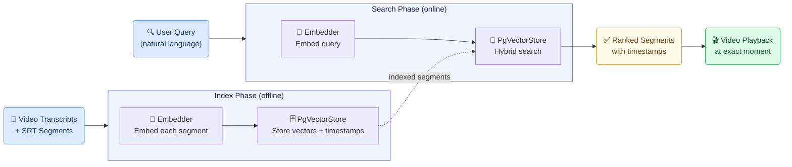
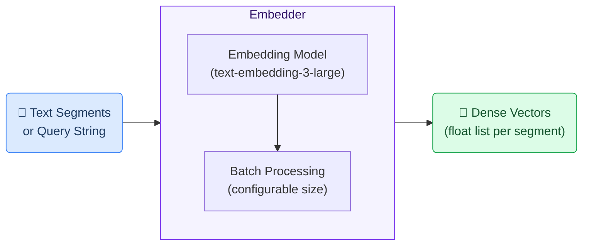
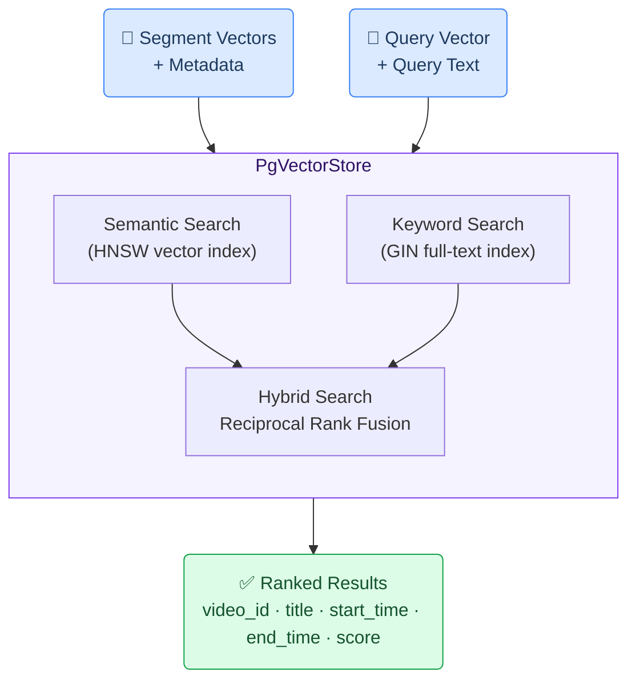
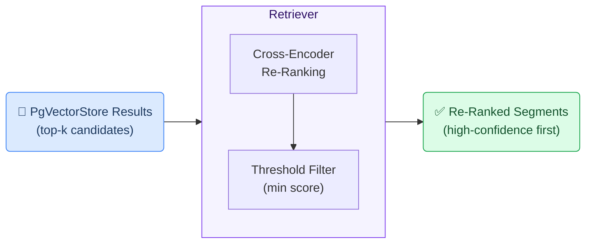

# Semantic Video Search Generic Use Case (Cross-Cutting Use Case)

This use case shows how the GAIK toolkit enables natural language search across a library of recorded video content — letting users describe what they are looking for in plain language and jump directly to the relevant moment in the video, rather than scrubbing through recordings manually.

## Business layer – use case specification

At the business layer, the use case targets organisations that accumulate recorded videos — lectures, webinars, training sessions, procedure demonstrations — and struggle to make that knowledge accessible for search and reuse. Video content is difficult to search because knowledge is locked inside spoken words rather than indexed text. Users cannot find specific moments, topics are duplicated across recordings, and cross-language access is especially difficult. The solution indexes video transcripts as searchable segments and enables semantic, keyword, and hybrid search with precise timestamp retrieval.

Concrete example fragments reflected in the use case design include:
- A growing library of recorded videos covering specialised topics that users need to find efficiently
- Users want to search by concept or question, not by keyword alone, and jump directly to the relevant moment
- Videos are recorded in one language but users may search in another language
- Existing subtitle files or transcription output can be ingested without re-processing the video
- Success is defined as faster discovery of relevant content, reduced duplication of effort, and access to video knowledge as easily as document knowledge

The canvas clarifies the purpose of the solution, the main users (educators, students, content managers, researchers, and platform administrators), and the expected outcomes.

- **Reference GenAI Product Canvas for Semantic Video Search** — [Download (video-search-canvas.png)](/images/video-search-canvas.png)

---

## Strategy layer – value evaluation and monitoring

At the strategy layer, the value evaluation model applies the [Value Evaluation Framework](https://github.com/GAIK-project/gaik-toolkit/blob/main/strategy_layer/value_evaluation_framework/README.md) to this generic use case and makes value assumptions explicit.

Example value fragments from the model include:

Functional value (primary):
"Faster semantic video search", "Direct jump to relevant moments in videos", "Cross-language search across subtitle tracks", "More precise segment and cue-level search", "Metadata and enriched video discovery", "Easy integration with partner applications and APIs", "Support for editable subtitle tracks and playback"
→ Outcome: Knowledge accessed faster and with higher quality

Informational value:
"Faster discovery of relevant video moments", "Better visibility into subtitle-based knowledge", "Searchable and reusable video content", "Stronger multilingual knowledge access"
→ Outcome: Better knowledge access with trusted evidence

Financial value:
"Low time-cost of finding relevant content", "Better reuse of existing video content", "Faster localization value from existing videos", "Reduced duplication of content-search effort"
→ Outcome: Lower access cost and better return on knowledge assets

Emotional value:
"Higher confidence in search results", "Reduced frustration from browsing videos", "Less stress for learners, trainers, and content teams"
→ Outcome: Happier users and smoother knowledge access

Social value:
"Better collaboration and wider audience access", "More inclusive learning experiences", "Stronger integration and broader educational reach"
→ Outcome: Stronger collaboration and broader educational reach

- **Reference Value Evaluation Model for Semantic Video Search** — [Download (video-search-value.png)](/images/video-search-value.png)

The same model can be used both before implementation (to evaluate expected value) and after deployment (to monitor realized value across different dimensions).

---

## Implementation layer using No-Code

_N/A — no no-code implementation is currently available for this use case._

---

## Implementation Layer Using Code-Based Method.

The code-based implementation uses GAIK's **Embedder** and **PgVectorStore** components to build a searchable index of video segments. The pipeline has two phases: an offline **indexing** phase that processes transcripts and stores them with their timestamps, and an online **search** phase that embeds a user query and retrieves the most relevant segments for playback navigation.

---

## Software Components

### 1. Embedder

Generates dense vector representations of text using an embedding model. In the semantic video search pipeline, the Embedder is used in both phases: during indexing it transforms each transcript segment into a vector for storage, and during search it embeds the user's natural language query so it can be compared against stored segment vectors. Supports batched embedding for efficient ingestion of large transcript libraries.

> 📁 [`implementation_layer/src/gaik/software_components/RAG/embedder/`](https://github.com/GAIK-project/gaik-toolkit/tree/main/implementation_layer/src/gaik/software_components/RAG/embedder)

---

### 2. PgVectorStore

A PostgreSQL-backed vector store with HNSW indexing for fast similarity search. For the semantic video search use case it stores each transcript segment together with its video metadata — title, video ID, start time, and end time — enabling results to be returned not just as text but as navigable timestamps. Supports three search modes: **semantic** (pure vector similarity), **keyword** (full-text via tsvector), and **hybrid** (Reciprocal Rank Fusion combining both). An optional Finnish text processor can be plugged in to improve search quality for morphologically complex languages.

Video-specific helper functions (`ingest_video_segments`, `format_search_results`) handle the segment ingestion and result formatting workflows, wrapping the store's general-purpose API in a video-oriented interface.

> 📁 [`implementation_layer/src/gaik/software_components/RAG/pg_vector_store/`](https://github.com/GAIK-project/gaik-toolkit/tree/main/implementation_layer/src/gaik/software_components/RAG/pg_vector_store)
>
> 📁 [`implementation_layer/examples/software_components/RAG/video_search_example.py`](https://github.com/GAIK-project/gaik-toolkit/tree/main/implementation_layer/examples/software_components/RAG)

---

### 3. Retriever *(optional)*

Provides a unified search interface over the vector store with optional cross-encoder re-ranking. In the semantic video search context, the Retriever can be added on top of the PgVectorStore search results to re-rank segments by relevance using a sentence-transformer cross-encoder model — useful when the query is ambiguous or the video library is large. The Retriever also supports threshold filtering to suppress low-confidence results.

> 📁 [`implementation_layer/src/gaik/software_components/RAG/retriever/`](https://github.com/GAIK-project/gaik-toolkit/tree/main/implementation_layer/src/gaik/software_components/RAG/retriever)

---

Example output from the demo — natural language search across indexed video content with timestamp-based results and direct playback navigation:

  

To test the semantic video search use case, please visit the [GAIK demo link](https://gaik-demo.2.rahtiapp.fi/video-search). Access is available upon registration request.

---

## Adaptable to Other Domains

The same indexing and retrieval pipeline applies to any domain where knowledge is locked in recorded video or audio — only the transcript source and optional language-specific text processing change:

- Corporate training video libraries, medical procedure recordings, legal hearing archives, e-learning course content, customer support video documentation

---

## Evaluation Methods

<Callout type="warn">
**Coming Soon:** Evaluation methods for the semantic video search use case are under development.
</Callout>

---

## Related Resources

| Resource | Link |
|----------|------|
| Embedder component | [GitHub →](https://github.com/GAIK-project/gaik-toolkit/tree/main/implementation_layer/src/gaik/software_components/RAG/embedder) |
| PgVectorStore component | [GitHub →](https://github.com/GAIK-project/gaik-toolkit/tree/main/implementation_layer/src/gaik/software_components/RAG/pg_vector_store) |
| Retriever component | [GitHub →](https://github.com/GAIK-project/gaik-toolkit/tree/main/implementation_layer/src/gaik/software_components/RAG/retriever) |
| Video search example | [GitHub →](https://github.com/GAIK-project/gaik-toolkit/tree/main/implementation_layer/examples/software_components/RAG) |
| RAG Workflow module | [GitHub →](https://github.com/GAIK-project/gaik-toolkit/tree/main/implementation_layer/src/gaik/software_modules/RAG_workflow) |
| Transcription, Captioning & Translation use case | [/use-cases/transcription-captioning-translation →](/use-cases/transcription-captioning-translation) |
| Implementation Layer overview | [GitHub →](https://github.com/GAIK-project/gaik-toolkit/tree/main/implementation_layer) |
