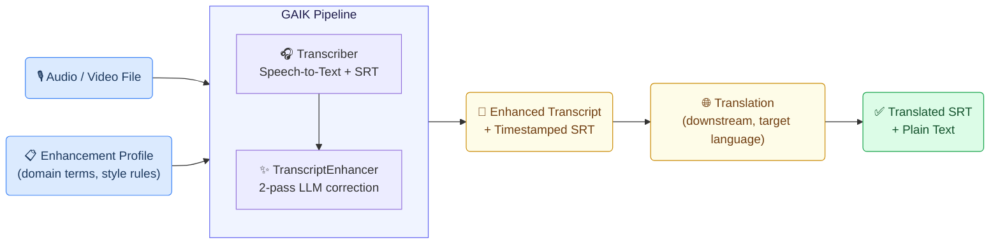
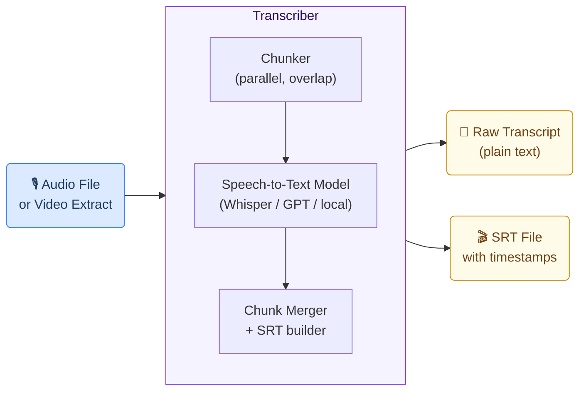
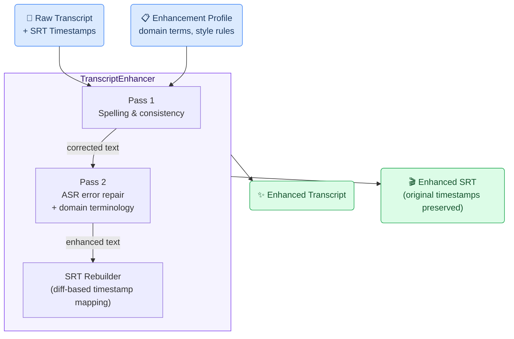

# Transcription, Captioning & Translation Generic Use Case (Cross-Cutting Use Case)

This use case illustrates how the GAIK toolkit converts spoken audio and video content into accurate, timestamped subtitles in the source language and translates them into one or more target languages — making domain-specific video content accessible, searchable, and reusable across languages and markets.

## Business layer – use case specification

At the business layer, the use case targets organizations that produce video-based educational or professional content in one language and need to make it accessible in other languages. Manual transcription and subtitle translation are slow, expensive, and error-prone — particularly for domain-specific terminology such as medical, dental, legal, or technical vocabulary. The AI-supported workflow replaces manual effort with an automated pipeline that produces accurate subtitles and translations while keeping humans in control of review and correction.

Concrete example fragments reflected in the use case design include:
- Content is produced as video lectures, webinars, or podcasts in a specialist language and domain
- The same content needs to reach audiences in one or more other languages or markets
- Manual transcription and subtitle translation are too slow to scale across a growing content library
- Domain-specific terminology (brand names, product codes, technical terms) must be preserved accurately in both transcription and translation
- Success is defined as faster time-to-market for subtitled content, consistent terminology, and reduced manual correction effort

The canvas clarifies the purpose of the solution, the main users (content managers, educators, translators, and platform administrators), and the expected outcomes.

- **Reference GenAI Product Canvas for Transcription, Captioning & Translation** — [Download (transcription-canvas.png)](/images/transcription-canvas.png)

---

## Strategy layer – value evaluation and monitoring

At the strategy layer, the value evaluation model applies the [Value Evaluation Framework](https://github.com/GAIK-project/gaik-toolkit/blob/main/evaluation_layer/value_evaluation_framework/README.md) to this generic use case and makes value assumptions explicit.

Example value fragments from the model include:

Functional value (primary):
"Faster transcription and translation", "Faster translation into multiple languages", "More consistent terminology and style", "Human review and correction support", "Seamless transcript and video access", "Batch processing for large collections"
→ Outcome: More content processed faster and with higher quality

Informational value:
"Accurate speech-to-text capture", "Better visibility into video content", "Searchable and reusable transcripts", "More reliable multilingual learning materials"
→ Outcome: Better knowledge access with trusted content

Financial value:
"Lower transcription and translation cost", "Faster localization turnaround", "Better reuse of existing video content", "Reduced dependence on manual subtitle work"
→ Outcome: Lower content production cost and better return on content

Emotional value:
"Higher confidence in transcript accuracy", "Reduced stress from manual subtitle editing", "Less frustration for educators and content teams"
→ Outcome: Happier teams and smoother publishing

Social value:
"Better collaboration across educators, translators, and content teams", "Wider access for multilingual audiences", "More inclusive learning experiences"
→ Outcome: Stronger collaboration and broader educational reach

- **Reference Value Evaluation Model for Transcription, Captioning & Translation** — [Download (transcription-value.png)](/images/transcription-value.png)

The same model can be used both before implementation (to evaluate expected value) and after deployment (to monitor realized value across different dimensions).

---

## Implementation Layer 

Two GAIK software components — **Transcriber** and **TranscriptEnhancer** — handle the AI-powered stages of the pipeline. The resulting enhanced transcript feeds into a downstream translation step that converts the content into the target language and produces SRT subtitle files ready for publishing or archival.

---

## Software Components

### 1. Transcriber

Converts audio or video input into a timestamped transcript using a configurable speech-to-text backend. Supports chunked parallel processing for long recordings (1 hour+) and multiple transcription backends — including cloud-based and local on-premises models. The output is an SRT file with millisecond-accurate timestamps alongside a plain-text version.

> 📁 [`implementation_layer/src/gaik/software_components/transcriber/`](https://github.com/GAIK-project/gaik-toolkit/tree/main/implementation_layer/src/gaik/software_components/transcriber)

---

### 2. TranscriptEnhancer

Applies a two-pass LLM correction workflow to the raw transcript to improve spelling, consistency, and domain-specific accuracy — without altering the timestamps. Pass 1 focuses on spelling and formatting consistency. Pass 2 repairs ASR errors using context: it corrects misheard words, fixes compound splitting, and preserves domain terminology (brand names, product codes, proper nouns) that the transcription model may have distorted.

A diff-based segment rebuilder maps the enhanced text back to the original SRT timestamps, ensuring subtitle timing remains accurate even when word count changes between passes.

> 📁 [`implementation_layer/src/gaik/software_components/enhance_transcript/`](https://github.com/GAIK-project/gaik-toolkit/tree/main/implementation_layer/src/gaik/software_components/enhance_transcript)

---

### Downstream tasks

Once the TranscriptEnhancer produces an accurate, corrected SRT, the result feeds into downstream steps that are outside the GAIK extraction pipeline.

**Translation** is the primary downstream task: the enhanced transcript is split into batches of segments and sent to an LLM for parallel translation into the target language. Timestamps are preserved unchanged from the source SRT. Technical terms, brand names, and product codes are retained as instructed. The translation step requires configuration per deployment (target language, batch size, domain glossary) and is not a GAIK software component — it is implemented as part of the application pipeline using the LLM API directly.

After translation, the results can be:
- **Published as subtitle files** — SRT files attached to the video for streaming platforms or learning management systems
- **Stored in a transcript library** — plain text + SRT persisted per video for search, retrieval, and re-use
- **Indexed for semantic search** — transcript text registered in a vector store for timestamp-based video search

Example output from the demo — the SRT subtitle panel with timestamped segments alongside the video player:

  

To test the transcription, captioning, and translation use case, please visit the [GAIK demo link](https://gaik-demo.2.rahtiapp.fi/dental-transcription). Access is available upon registration request.

---

## Adaptable to Other Domains

The same pipeline applies to any domain requiring accurate subtitles and multilingual translation from spoken content — only the enhancement profile and target language change:

- Medical and clinical lectures, legal proceedings, corporate training videos, technical documentation recordings, e-learning content localization

---

## Evaluation Methods

The quality of this use case is evaluated at two levels: the GAIK software components (transcription and enhancement) are assessed independently, and the downstream translation step — although not a GAIK software component — has been separately benchmarked to measure its output quality.

### Transcription Evaluation

Transcription quality is measured using **Word Error Rate (WER)** and related metrics (Character Error Rate, Spelling Error Rate, Substitution/Deletion/Insertion rates), comparing the AI-generated transcript against a verified reference. The evaluation also benchmarks the benefit of the two-pass enhancement step.

> 📊 **Transcription evaluation methods:** [`evaluation_layer/eval_methods/transcription_eval/`](https://github.com/GAIK-project/gaik-toolkit/tree/main/evaluation_layer/eval_methods/transcription_eval)

### Translation Evaluation

Translation quality is measured using four complementary metrics: **BLEU** (n-gram overlap), **chrF** (character n-gram F-score), **TER** (Translation Edit Rate), and **Cosine Similarity** (semantic embedding comparison). The evaluation compares AI-generated translations against human reference translations across multiple models.

> 📊 **Translation evaluation methods:** [`evaluation_layer/eval_methods/translation_eval/`](https://github.com/GAIK-project/gaik-toolkit/tree/main/evaluation_layer/eval_methods/translation_eval)

---

## Related Resources

| Resource | Link |
|----------|------|
| Transcriber component | [GitHub →](https://github.com/GAIK-project/gaik-toolkit/tree/main/implementation_layer/src/gaik/software_components/transcriber) |
| TranscriptEnhancer component | [GitHub →](https://github.com/GAIK-project/gaik-toolkit/tree/main/implementation_layer/src/gaik/software_components/enhance_transcript) |
| Transcriber examples | [GitHub →](https://github.com/GAIK-project/gaik-toolkit/tree/main/implementation_layer/examples/software_components/transcriber) |
| Transcription evaluation | [GitHub →](https://github.com/GAIK-project/gaik-toolkit/tree/main/evaluation_layer/eval_methods/transcription_eval) |
| Translation evaluation | [GitHub →](https://github.com/GAIK-project/gaik-toolkit/tree/main/evaluation_layer/eval_methods/translation_eval) |
| Audio to Structured Data module | [GitHub →](https://github.com/GAIK-project/gaik-toolkit/tree/main/implementation_layer/src/gaik/software_modules/audio_to_structured_data) |
| Implementation Layer overview | [GitHub →](https://github.com/GAIK-project/gaik-toolkit/tree/main/implementation_layer) |
