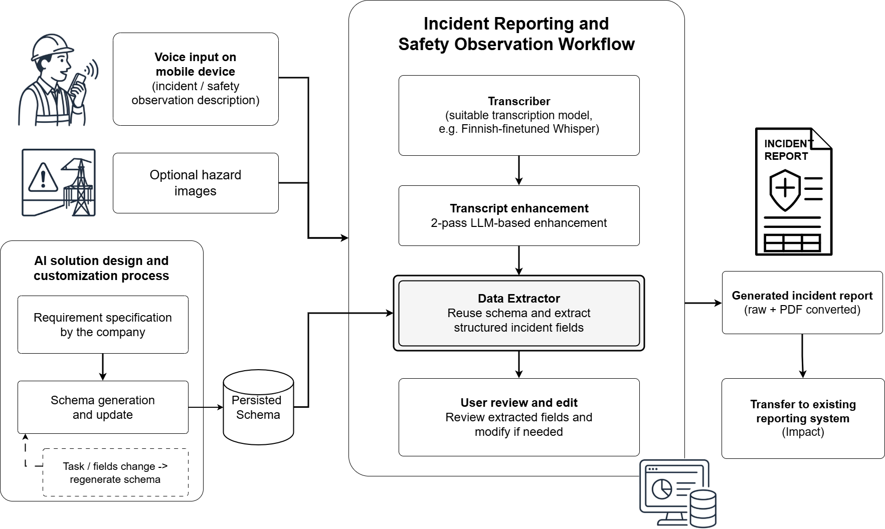
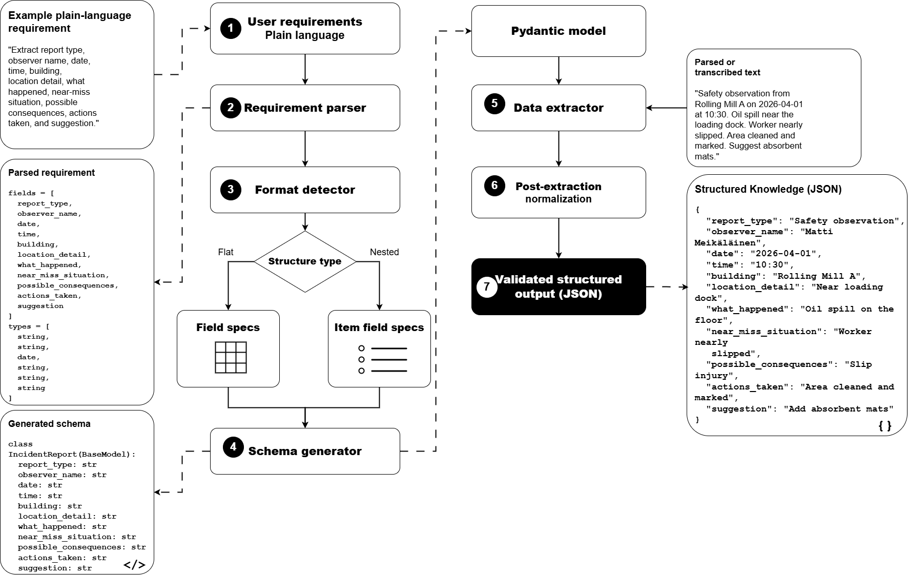

# Extraction Evaluation

Field-level evaluation pipeline for assessing structured information extraction quality from spoken or document inputs.

---

## 1. Evaluation Metrics

### 1.1 List of Metrics

The evaluation uses five complementary metrics:

- Precision
- Recall
- F1 Score
- Exact Match Rate (EMR)
- Semantic Match Rate (SMR)

### 1.2 Metric Descriptions

#### Precision

- Definition:
  - Proportion of system-filled fields that were correct. Measures how often the system avoids filling fields with wrong values.
- Formula:

```text
Precision = TP / (TP + FP)
```

- Components:
  - `TP` = field correctly extracted (value present and matches ground truth)
  - `FP` = field filled by system but incorrect or hallucinated
- Business interpretation:
  - High precision means the system rarely produces wrong or fabricated values.
  - A low-precision system may create false entries that mislead downstream reporting.

#### Recall

- Definition:
  - Proportion of expected (non-empty) fields that the system successfully captured.
- Formula:

```text
Recall = TP / (TP + FN)
```

- Components:
  - `FN` = field expected but left empty by the system
- Business interpretation:
  - High recall means the system captures most of the required information.
  - A low-recall system produces incomplete records that require manual completion.

#### F1 Score

- Definition:
  - Harmonic mean of precision and recall — a balanced view of extraction quality.
- Formula:

```text
F1 = 2 · Precision · Recall / (Precision + Recall)
```

- Business interpretation:
  - F1 is the primary summary metric when both precision and recall matter equally.
  - Above 85% indicates strong extraction performance for business use.

#### Exact Match Rate (EMR)

- Definition:
  - Proportion of exact fields (category, name, date, Yes/No) handled correctly, counting both correct extractions (TP) and correct recognition that a field is empty (TN).
- Formula:

```text
EMR = (TP + TN) / Total evaluated exact fields
```

- Components:
  - `TN` = both ground truth and prediction are empty (field correctly left blank)
- Business interpretation:
  - EMR reflects how well the system handles structured, unambiguous fields where exact wording is required.

#### Semantic Match Rate (SMR)

- Definition:
  - Proportion of descriptive fields evaluated via embedding-based cosine similarity that were accepted as correct matches.
- Formula:

```text
SMR = (TP + TN) / Total evaluated semantic fields
```

- Business interpretation:
  - SMR measures how well the system captures meaning in free-text fields where paraphrase is acceptable.
  - The threshold (default 0.50) controls how strictly "correct" is defined for semantic fields.
  - A lower threshold tolerates more paraphrase; a higher threshold requires closer wording.

---

## 2. Evaluation Tools / Code

### 2.1 Python Scripts

- `evaluate.py`
  - Main evaluation script. Loads matched ground truth and prediction JSON files, compares each field using exact matching or semantic similarity, computes field-level and aggregate precision, recall, F1, EMR, and SMR, and writes the full report to `IE_report_70%.txt`.

### 2.2 Python Dependencies

Defined in `requirements.txt`.

Main packages:
- `openai` for `text-embedding-3-large` embeddings (semantic field comparison)
- `scikit-learn` for cosine similarity computation
- `python-dotenv` for loading `OPENAI_API_KEY` from a `.env` file

### 2.3 Sample Data

The folders `data/ground truth/` and `data/predictions/` each contain one sample file (`Sample1.json`) from the incident-reporting evaluation described in section 3. This sample is provided to let you run the script immediately and verify it works end to end.

**To evaluate your own data**, replace or extend the sample files with your own ground-truth and prediction JSONs. See the [Customization Guide](#customization-guide) below for details.

---

## 3. Evaluations / Comparisons

### 3.1 Evaluation Setup / Context

The figure below shows the end-to-end incident reporting workflow that was evaluated. Employees record a spoken safety observation on a mobile device; the audio is transcribed, enhanced using a 2-pass LLM method, and passed to the data extractor, which fills in the structured incident report fields. The user reviews the result before the report is transferred to the company's reporting system.



Evaluation context:
- Domain: Workplace safety — incident reports and safety observations
- Language: Finnish
- Content: Spoken descriptions of near misses, incidents, hazards, and positive safety observations recorded by field employees
- Dataset: 15 audio samples prepared by a partner company
- Ground truth preparation: Company representatives listened to each audio recording and manually filled in the ground-truth JSON using the approved extraction schema
- AI workflow: audio transcription → 2-pass transcript enhancement → schema-guided LLM extraction → predicted JSON
- Embedding model: OpenAI `text-embedding-3-large` (semantic fields)
- Semantic threshold: 0.50

### 3.2 Field Classification

The extraction schema for the incident-reporting use case covers 13 fields split into two evaluation categories.

**Exact fields** — compared using normalized string matching (7 fields):

| Field | Description |
|-------|-------------|
| `raportinTyyppi` | Report type (e.g. "turvallisuus" / "safety") |
| `tarkkailijanNimi` | Observer name |
| `tarkkailijanOrganisaatio` | Observer organization |
| `tarkkailijaOnKesatyontekija` | Is observer a summer employee? (Yes/No) |
| `paivamaara` | Date — normalized across Finnish and ISO formats |
| `kellonaika` | Time of incident |
| `lahellaPitiTilanne` | Near-miss situation? (Yes/No) |

**Semantic fields** — compared using cosine similarity ≥ 0.50 (6 fields):

| Field | Description |
|-------|-------------|
| `rakennus` | Building or area |
| `tapahtumapaikanTarkenne` | Location detail |
| `mitaTapahtui` | What happened |
| `mahdollisetSeuraukset` | Possible consequences |
| `toteutetutToimenpiteet` | Actions taken |
| `ehdotus` | Suggestion or recommendation |

### 3.3 Results

Aggregate results from the pilot evaluation (15 samples):

| Metric | Score |
|--------|------:|
| **Precision** | **90.00%** |
| **Recall** | **87.10%** |
| **F1 Score** | **88.52%** |
| **Exact Match Rate (EMR)** | **90.67%** |
| **Semantic Match Rate (SMR)** | **87.78%** |

For a detailed discussion of the evaluation design and results in the context of incident reporting, refer to the IFKAD-2026 paper.

---

## 4. Performance Issues

- **Extraction prompt quality** — Extraction quality depends heavily on how well the LLM is guided to extract each field. Vague or ambiguous prompt instructions lead to inconsistent or incorrect field values, regardless of model capability.
- **Semantic threshold sensitivity** — The performance metrics, particularly recall and F1, are directly affected by the chosen similarity threshold. A higher threshold is stricter and will classify more borderline matches as errors, which may lower F1. The appropriate threshold depends on the domain and the acceptable level of paraphrase tolerance.
- **Model selection** — Extraction quality varies across LLM providers and model sizes. Smaller or less capable models may struggle with multi-field structured extraction, especially for domain-specific vocabulary or fields that require contextual inference.

---

## 5. Improvement Strategies

- **Calibrate the semantic threshold** — Before finalizing the evaluation threshold, manually examine a sample of ground-truth and prediction pairs. Select a threshold that correctly classifies the borderline cases for your domain rather than relying on the default.
- **Inspect and refine the generated schema** — Examine the Pydantic model and `requirements.json` produced by the GAIK Schema Generator. Small adjustments to field descriptions, type constraints, or enum values in the schema can meaningfully improve extraction consistency.
- **Finetune the extraction prompt** — Observe field-level results and iteratively improve the extraction prompt for underperforming fields. Our experiments show that extraction quality is strongly influenced by how clearly the prompt defines each field and what counts as a valid value.

---

## Reproduction Notes (Usage Guide)

### Running the evaluation

Place matched JSON files in `data/ground truth/` and `data/predictions/` (filenames must match), then run:

```bash
cd implementation_layer/eval_methods/extraction_eval
python evaluate.py
```

**Inputs:**
- `data/ground truth/SampleN.json` — one JSON per recording, filled by human annotators
- `data/predictions/SampleN.json` — one JSON per recording, produced by the extraction workflow

**Output:**
- `IE_report_70%.txt` — field-level and aggregate results

**Sample output:**

```
========== FIELD-LEVEL RESULTS ==========

Field                             TP    TN    FP    FN   Prec.    Rec.      F1
------------------------------------------------------------------------------
raportinTyyppi                    15     0     0     0     1.0     1.0     1.0
...
Overall Average                                         0.9103  0.8571  0.8732

========== AGGREGATE RESULTS ==========

Precision  (P)  = TP/(TP+FP):              0.9   (90.0%)
Recall     (R)  = TP/(TP+FN):              0.871 (87.1%)
F1 Score   (F1) = 2·P·R/(P+R):             0.8852 (88.52%)
Exact Match Rate  (EMR) = (TP+TN)/(All):   0.9067 (90.67%)
Semantic Match Rate (SMR) = (TP+TN)/(All): 0.8778 (87.78%)
```

### Adjusting the semantic threshold

To change the similarity threshold, edit `evaluate.py`:

```python
SIM_THRESHOLD = 0.50  # increase for stricter matching, decrease for more tolerance
```

---

## Customization Guide

### Using your own ground truth and prediction data

The script expects paired JSON files in `data/ground truth/` and `data/predictions/`. Both folders must contain files with identical names (e.g. `Sample1.json`, `Sample2.json`).

**Steps:**

1. Define your extraction schema (the fields you want to extract). Each field becomes a key in the JSON.
2. Collect your input data (audio recordings, documents, etc.) and run your extraction workflow to produce predicted JSON files. Place them in `data/predictions/`.
3. For each predicted file, have a human reviewer listen to the original input and fill in the correct values in a JSON with the same structure. Place these in `data/ground truth/`. Use empty string `""` for fields that are genuinely absent in the input.
4. Run `python evaluate.py` to compare.

**Example JSON structure** (adapt field names to your use case):

```json
{
  "field_one": "value",
  "field_two": "another value",
  "optional_field": ""
}
```

Both files must use the same field names and the same empty-value convention (`""` or `null` — choose one and keep it consistent).

### Adapting the field lists for your own use case

Open `evaluate.py` and update `EXACT_FIELDS`, `SEMANTIC_FIELDS`, and `FIELD_ORDER` to match your schema:

```python
# Fields that require exact (normalized string) matching
# Use for: categories, names, dates, Yes/No flags, IDs
EXACT_FIELDS = [
    "your_category_field",
    "your_name_field",
    "your_date_field",
]

# Fields where paraphrasing is acceptable (cosine similarity ≥ SIM_THRESHOLD)
# Use for: descriptions, narratives, free-text explanations
SEMANTIC_FIELDS = [
    "your_description_field",
    "your_notes_field",
]

# Full ordered list of all fields — controls column order in the report
FIELD_ORDER = EXACT_FIELDS + SEMANTIC_FIELDS
```

**Rules for field assignment:**

| Field type | Use `EXACT_FIELDS` when | Use `SEMANTIC_FIELDS` when |
|-----------|------------------------|--------------------------|
| Category / enum | ✓ Report type, status, flag | — |
| Name / ID | ✓ Person name, record ID | — |
| Date / time | ✓ Date, timestamp | — |
| Short description | — | ✓ Location detail, subject |
| Long description | — | ✓ What happened, consequences |
| Free-text note | — | ✓ Suggestion, summary |

After updating the field lists, also update `GT_FOLDER` and `SAMPLE_FOLDER` if your data is in different directories:

```python
GT_FOLDER = Path("data/ground truth/")   # path to your ground truth JSONs
SAMPLE_FOLDER = Path("data/predictions/") # path to your predicted JSONs
REPORT_FILE = Path("IE_report.txt")  # output report filename
```

---

## Integration with GAIK Toolkit

The figure below shows the internal steps of the GAIK knowledge extraction component. Plain-language requirements are parsed into field specifications, a Pydantic schema is generated, and the extractor applies that schema to parsed or transcribed text to produce a validated structured JSON output.



### Generating Predictions with the GAIK Extractor

Use the GAIK `DataExtractor` and `SchemaGenerator` to produce the prediction JSON files that feed into this evaluation:

```python
import json
from pathlib import Path
from dotenv import load_dotenv

load_dotenv()

from gaik.software_components.extractor import DataExtractor, SchemaGenerator, get_openai_config

config = get_openai_config(use_azure=True)

# Define extraction requirements in plain language
requirements = """
Extract the following fields from an incident report transcript:
- raportinTyyppi: Report type (e.g. turvallisuus, ympäristö, energia)
- tarkkailijanNimi: Observer name
- paivamaara: Date of the incident (Finnish format)
- mitaTapahtui: What happened
- lahellaPitiTilanne: Was it a near-miss? (Kyllä/Ei)
... (add all fields)
"""

# Generate schema once; reuse for repeated extraction
gen = SchemaGenerator(config=config)
extraction_model = gen.generate_schema(requirements)

extractor = DataExtractor(config=config)

# Run extraction on a transcript and save prediction JSON
transcript = Path("transcripts/Sample1.txt").read_text(encoding="utf-8")
result = extractor.extract(transcript, extraction_model)

Path("predictions/Sample1.json").write_text(
    json.dumps(result.data, indent=2, ensure_ascii=False), encoding="utf-8"
)

# Then evaluate: python evaluate.py
```

### Supported Use Cases

This evaluation methodology has been applied to the following GAIK extraction workflows:

- **Incident reporting** — Converting voice-recorded workplace safety observations into structured incident report fields (pilot evaluation: P=90.00%, R=87.10%, F1=88.52%)
- **Purchase order processing** — Extracting header and line items information from purchase orders. 
- **Construction site diary creation** — Extracting daily progress, observations, and tasks from field notes or voice recordings into standardized diary entries
- **Safety observation reporting** — Structuring safety walk-around observations and positive reinforcement notes into company reporting schemas

The same script can be reused for any of these use cases by swapping the ground truth and prediction folders and adjusting the field lists as described in the Customization Guide above.

---

## Installation & Setup

### 1. Install Dependencies

```bash
cd implementation_layer/eval_methods/extraction_eval
pip install -r requirements.txt
```

**Dependencies:**
- `openai>=1.0.0` — `text-embedding-3-large` embeddings for semantic field comparison
- `scikit-learn>=1.3.0` — cosine similarity
- `python-dotenv>=1.0.0` — loads `OPENAI_API_KEY` from `.env`

### 2. Configure API Access

Create a `.env` file in the eval folder or set the environment variable directly:

```bash
export OPENAI_API_KEY="your-api-key"
```

PowerShell:

```powershell
$env:OPENAI_API_KEY = "your-api-key"
```

---

## Related Resources

- **GAIK Extractor Component**: [guidance_layer/docs/software_components/extractor.md](../../../guidance_layer/docs/software_components/extractor.md)
- **Extraction Evaluation — Website**: [guidance_layer/website/content/docs/toolkit/evals/extraction-eval.mdx](../../../guidance_layer/website/content/docs/toolkit/evals/extraction-eval.mdx)
- **Transcription Evaluation**: [../transcription_eval/README.md](../transcription_eval/README.md)
- **Evaluation Methods Overview**: [../README.md](../README.md)
- **Project Website**: [gaik.ai](https://gaik.ai)
- **GitHub**: [github.com/GAIK-project/gaik-toolkit](https://github.com/GAIK-project/gaik-toolkit)
