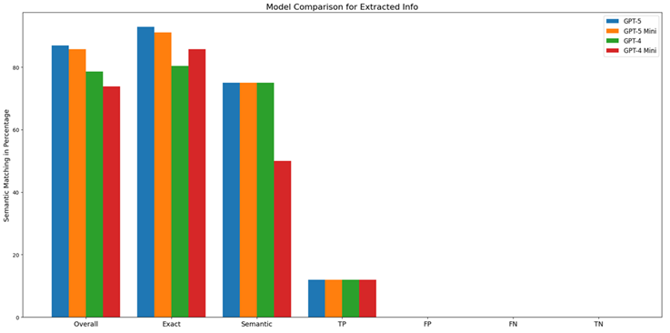

# Extraction Evaluation

Evaluation pipeline for assessing structured information extraction quality from incident-report transcripts.

## Purpose

This evaluation suite provides:

- **Structured Extraction**: LLM-based extraction from transcript text into JSON fields
- **Field-Level Comparison**: Semantic similarity between prediction and ground truth values
- **Threshold-Based Scoring**: PASS/ERROR decisions per field by exact/semantic thresholds
- **Aggregate Metrics**: Overall, exact-field, and semantic-field matching rates
- **Benchmark Visibility**: Visual model benchmark snapshot for extraction tasks

---

## Contents

### **Core Scripts**

- **`main.py`** - Runs extraction first, then evaluation
- **`IE.py`** - Extracts target fields from `.txt` transcripts and writes prediction JSONs
- **`IE_evaluation.py`** - Computes similarity and writes evaluation report

### **Data & Outputs**

- **`data/transcripts/`** - Input transcripts (`.txt`)
- **`data/GT/`** - Ground truth JSON files
- **`data/predictions/`** - Generated prediction JSON files
- **`ErrorReport.txt`** - Per-file and aggregate evaluation report

### **Benchmark Asset**

- **`images/benchmark.png`** - Benchmarking of multiple models for the extraction task

---

## Benchmark

The figure below summarizes extraction benchmarking across models:



---

## Evaluation Logic

`IE_evaluation.py` groups fields into:

- **Exact fields** (`EXACT_FIELDS`) with threshold `0.95`
- **Semantic fields** (`SEMANTIC_FIELDS`) with threshold `0.80`

For each comparable field:

1. Embed GT and prediction text values (`all-MiniLM-L6-v2` by default)
2. Compute cosine similarity
3. Mark:
   - **PASS** if similarity >= threshold
   - **ERROR** otherwise

Output includes:

- `Avg TP`, `Avg FP`, `Avg FN`, `Avg TN`
- `Avg Overall Matching`
- `Avg Exact Fields Matching`
- `Avg Semantic Fields Matching`
- `FIELD-WISE AVERAGE SIMILARITY`

---

## Installation

```bash
cd implementation_layer/eval_methods/extraction_eval
pip install openai sentence-transformers scikit-learn numpy python-dotenv
```

Set your API key:

```bash
export OPENAI_API_KEY="your-api-key"
```

PowerShell:

```powershell
$env:OPENAI_API_KEY="your-api-key"
```

---

## Usage

```bash
cd implementation_layer/eval_methods/extraction_eval
python main.py
```

`main.py` will:

1. Read transcripts from `INPUT_FOLDER`
2. Generate prediction JSONs in `PREDICTION_DIR`
3. Compare against `GROUND_TRUTH_DIR`
4. Save detailed results to `ErrorReport.txt`

---

## Configuration Notes

- Verify path values in `main.py` before running:
  - `INPUT_FOLDER`
  - `GROUND_TRUTH_DIR`
  - `PREDICTION_DIR`
- The evaluator currently appends to `ErrorReport.txt` (`"a"` mode). Clear the file between runs if needed.
- Keep missing-value conventions consistent between GT and predictions to avoid skewed metrics.

---

## Related Resources

- **Transcription Evaluation**: `implementation_layer/eval_methods/transcription_eval/README.md`
- **Evaluation Methods Overview**: `implementation_layer/eval_methods/README.md`
- **Main Toolkit README**: `README.md`
