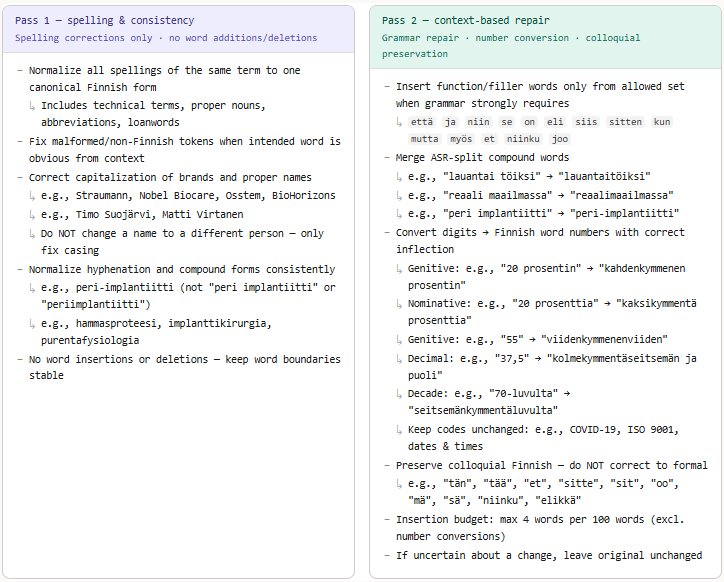

# Transcription Evaluation

This folder contains methods and scripts for evaluating automatic transcription quality and transcript post-processing quality for Finnish domain-specific audio/video material.

## 1. Evaluation metrics

### 1.1 List of metrics

The current evaluation uses the following metrics:

- Word Error Rate (WER)
- Character Error Rate (CER)
- Spelling Error Rate
- Substitution Rate
- Deletion Rate
- Insertion Rate

### 1.2 Metric descriptions

#### Word Error Rate (WER)

- Definition:
  - WER measures how many words differ between the hypothesis transcript and the reference transcript.
- Formula:

```text
WER = (S + D + I) / N * 100%
```

- Components:
  - `S` = substitutions
  - `D` = deletions
  - `I` = insertions
  - `N` = total number of words in the reference transcript
- Business interpretation:
  - WER shows the overall transcription error level. Lower is better.
  - If WER is 10%, roughly one in ten reference words is wrong, missing, or extra.
- Reference values:

| WER Range | Assessment | Typical Applications |
|-----------|-----------|---------------------|
| **< 5%** | Excellent | High-quality dictation, closed captions, medical transcription |
| **5-10%** | Very Good | Voice assistants in clean conditions, professional transcription |
| **10-20%** | Good | Meeting transcription, general-purpose STT |
| **20-30%** | Fair | Noisy environments, casual conversations |
| **> 30%** | Poor | Very challenging audio (heavy accents, background noise) |

*Source: [What is WER in Speech-to-Text - Vatis Tech 2025](https://vatis.tech/blog/what-is-wer-in-speech-to-text-everything-you-need-to-know-2025)*

#### Character Error Rate (CER)

- Definition:
  - CER measures transcription error at character level instead of word level.
- Formula:

```text
CER = (character substitutions + character deletions + character insertions) / total reference characters * 100%
```

- Components:
  - Same idea as WER, but computed over characters rather than words
- Business interpretation:
  - CER is useful for morphologically rich languages like Finnish, where one word ending may change meaning or grammatical correctness.
- Reference values:
  - No universal thresholds; lower is better.
  - CER is usually interpreted together with WER.

#### Spelling Error Rate

- Definition:
  - Spelling Error Rate isolates substitutions that are close matches, such as misspellings or pronunciation-driven distortions.
- Formula:

```text
Spelling Error Rate = spelling substitutions / total reference words * 100%
```

- Components:
  - Spelling substitutions are substitution errors where the hypothesis is close to the reference according to Levenshtein distance
- Business interpretation:
  - Helps distinguish spelling-like ASR errors from more serious semantic substitutions.
  - Useful for measuring the value of post-processing and lexical normalization.
- Reference values:
  - No universal thresholds; lower is better.


#### Spelling Error Rate

- Definition:
  - Spelling Error Rate isolates substitution errors that are *spelling-close*, such as misspellings, morphological variations, or pronunciation-driven distortions, identified using normalized Levenshtein distance.

- Formula:

```text
Spelling Error Rate = spelling-close substitutions / total reference words * 100%
```
- Components:
  - Spelling-close substitutions are substitution errors where the normalized Levenshtein distance between the hypothesis and reference token is ≤ 0.4.

The normalized distance is computed as:

```text
normalized_distance = Levenshtein_distance / length(reference_token)
```
- Business interpretation:
  - Helps distinguish spelling-like ASR errors from more serious semantic substitutions.
  - Useful for measuring the effectiveness of post-processing, especially domain-specific normalization and correction.
- Reference values:
  - No universal thresholds; lower is better.

#### Substitution Rate

- Definition:
  - Percentage of reference words that were replaced by the wrong words.
- Formula:

```text
Substitution Rate = substitutions / total reference words * 100%
```

- Business interpretation:
  - High substitution rate means the model is often hearing the wrong word, not just dropping or adding words.
- Reference values:
  - No universal thresholds; lower is better.

#### Deletion Rate

- Definition:
  - Percentage of reference words missing from the hypothesis transcript.
- Formula:

```text
Deletion Rate = deletions / total reference words * 100%
```

- Business interpretation:
  - High deletion rate means the system is omitting spoken content.
  - This is especially problematic when key terms, numbers, or phrases disappear completely.
- Reference values:
  - No universal thresholds; lower is better.

#### Insertion Rate

- Definition:
  - Percentage of extra words added by the system that were not present in the reference transcript.
- Formula:

```text
Insertion Rate = insertions / total reference words * 100%
```

- Business interpretation:
  - High insertion rate means the model is hallucinating or over-producing filler/content.
- Reference values:
  - No universal thresholds; lower is better.

---

## 2. Evaluation tools / code

The following scripts and dependencies are used to reproduce the evaluation results.

### 2.1 Python scripts

- `side_by_side_compare.py`
  - Compares reference transcripts and hypothesis transcripts
  - Produces WER, CER, spelling error rate, and aligned side-by-side reports
- `eval_enhanced.py`
  - Compares original transcripts and enhanced transcripts against the reference
  - Reports aggregate quality change after enhancement
- `enhance_transcript.py`
  - Runs two-pass transcript enhancement using GPT models
  - Pass 1 focuses on spelling consistency
  - Pass 2 focuses on context-based repair and number normalization
- `config.py`
  - Shared client/configuration helper for Azure OpenAI / OpenAI

### 2.2 Python dependencies

Defined in `requirements.txt`.

Main packages:
- `jiwer` for WER/CER style metrics
- `rapidfuzz` for edit distance / spelling comparison
- `openai` for transcript enhancement calls

### 2.3 Reproducibility inputs

Example files in this folder include:
- `data/Ajokortti.mp3`
- `data/reference.txt`
- `data/side-by-side-comparison.txt`

These support reproducible example runs and demonstration of the evaluation workflow.

---

## 3. Evaluations / Comparisons

### 3.1 Evaluation setup / context

Evaluation context:
- Domain: Finnish dental webinars
- Language: Finnish
- Content: technical dental terminology, brands, proper nouns, mixed Finnish-English terminology
- Audio quality: mixed, from professional recordings to more challenging recordings
- Goal: compare raw transcription quality and measure the benefit of post-transcript enhancement

Models/methods compared:
- aalto-asr
- gemini-2.5-pro
- gemini-3-flash-preview
- gpt-4o-transcribe
- whisper-large-finnish-v3-ct2-parameters
- whisper-openai
- WhisperX (large-parameters)
- WhisperX (large-v1-parameters)
- WhisperX (large-v2-parameters)
- WhisperX (large-v3-parameters)
- WhisperX (medium-parameters)
- WhisperX (small-parameters)
- WhisperX (tiny-parameters)

Enhancement method compared:
- Two-pass GPT-based transcript enhancement (`enhance_transcript.py`)

### 3.2 Performance comparison table

| Model | Original WER | Enhanced WER | Original Spelling | Enhanced Spelling | Original Substitution | Enhanced Substitution | Original Deletion | Enhanced Deletion | Original Insertion | Enhanced Insertion |
|------|-------------|-------------|------------------|------------------|----------------------|----------------------|------------------|------------------|------------------|------------------|
| aalto-asr | 49.37% | 44.08% | 7.53% | 5.95% | 27.47% | 22.30% | 18.25% | 18.76% | 3.65% | 3.02% |
| gemini-2.5-pro | 25.32% | 22.93% | 5.07% | 4.58% | 11.61% | 10.40% | 1.54% | 1.39% | 12.17% | 11.14% |
| gemini-3-flash-preview | 27.53% | 26.48% | 6.48% | 6.00% | 15.88% | 15.00% | 2.44% | 2.37% | 9.21% | 9.11% |
| gpt-4o-transcribe | 17.91% | 17.22% | 4.71% | 3.96% | 8.93% | 8.03% | 6.95% | 7.21% | 2.03% | 1.98% |
| whisper-large-finnish-v3-ct2-parameters | 14.57% | 12.58% | 4.55% | 3.63% | 8.44% | 7.10% | 3.22% | 3.19% | 2.91% | 2.29% |
| whisper-openai | 23.19% | 20.97% | 4.92% | 3.89% | 10.55% | 8.59% | 10.50% | 10.50% | 2.14% | 1.88% |
| WhisperX (large-parameters) | 17.32% | 15.13% | 4.50% | 3.53% | 9.08% | 7.26% | 5.66% | 5.74% | 2.57% | 2.14% |
| WhisperX (large-v1-parameters) | 25.27% | 21.56% | 6.54% | 4.71% | 12.87% | 9.75% | 9.98% | 9.86% | 2.42% | 1.96% |
| WhisperX (large-v2-parameters) | 24.50% | 22.34% | 4.73% | 3.94% | 10.47% | 8.49% | 11.53% | 11.66% | 2.50% | 2.19% |
| WhisperX (large-v3-parameters) | 17.32% | 15.11% | 4.50% | 3.47% | 9.08% | 7.21% | 5.66% | 5.66% | 2.57% | 2.24% |
| WhisperX (medium-parameters) | 25.66% | 21.36% | 6.12% | 3.71% | 12.40% | 8.44% | 10.76% | 10.55% | 2.50% | 2.37% |
| WhisperX (small-parameters) | 33.20% | 24.60% | 9.26% | 4.86% | 20.74% | 13.10% | 7.57% | 7.85% | 4.89% | 3.65% |
| WhisperX (tiny-parameters) | 69.66% | 55.69% | 10.45% | 5.69% | 46.86% | 30.83% | 12.09% | 11.94% | 10.71% | 12.92% |

### 3.3 Key findings / observations

- Best raw accuracy in this benchmark:
  - `whisper-large-finnish-v3-ct2-parameters` with `14.57%` WER
- Best enhanced accuracy in this benchmark:
  - `whisper-large-finnish-v3-ct2-parameters` with `12.58%` WER
- Enhancement improves most models:
  - typical WER reduction is around `1.5-4.5` percentage points
- Enhancement is especially useful for:
  - spelling consistency
  - proper nouns and brand names
  - technical vocabulary normalization
  - numeric normalization
- Deletion errors are harder to fix post hoc than substitution and spelling errors
- Very weak base models still benefit from enhancement, but enhancement alone does not compensate for severe transcription failures

---

## 4. Performance issues (errors)

### 4.1 List of common error categories

#### Model-level errors
| Error Type | Description | Examples | Why Model-Level |
|-----------|-------------|----------|----------------|
| **Catastrophic Omissions** | Large consecutive deletions (entire phrases missing) | Long [D:...] runs spanning multiple words/phrases | Cannot be reliably reconstructed post-transcript; requires better acoustic modeling |

**Fix Strategy**: Fine-tuning on domain-specific data, better acoustic models, improved voice activity detection

#### Post-processing-fixable errors
| Error Type | Description | Examples | Fix Strategy |
|-----------|-------------|----------|--------------|
| **Brands/Proper Nouns Garbled** | Brand/company names become phonetically similar nonsense | Straumann → Strauman<br>Dentsply Sirona → Splacirona<br>Nobel Biocare → Nobel Pajaker<br>Implantona → Implanttoona | Dictionary + fuzzy matching |
| **Name Alterations** | Person names/surnames wrong (near-miss) | Martola/Martoon<br>Pallonen/Pallosen<br>Suojärvi/Suojärven | Dictionary-mapped variants |
| **Compound/Hyphenation** | Compounds split/merged inconsistently | peri-implantiitti ↔ periimplantiitti | Consistency normalization |
| **Loanword Distortion** | English technical terms misheard as Finnish | lowdose → loudausohjelmia | Bilingual domain lexicon |
| **Number Format** | Digits vs. Finnish number words | kahdenkymmenen → 20<br>viisikymmentäkuusi → 56 | Number normalizer |
| **Decimal Tokenization** | Spoken math becomes wrong tokens | "X ja puoli" → 375 (intended 37.5) | Finnish number normalizer |
| **Finnish Morphology** | Wrong case/number endings (same lemma) | Plural/singular drift, case variations | Finnish-aware inflection |

#### Evaluation-level artifacts
| Error Type | Description | Examples | Fix Strategy |
|-----------|-------------|----------|--------------|
| **Evaluation Artifacts** | Style differences penalized by WER | hands-on ↔ handson<br>hyphen/spacing differences | Pre-evaluation normalization of reference and hypothesis |

#### "Live With" Errors**

These errors have minimal impact on meaning and are often acceptable in production:

| Error Type | Description | Examples | Why Acceptable |
|-----------|-------------|----------|---------------|
| **Function Word Deletions** | Short glue words missing | Frequent [D:ja], [D:että], [D:se] | Meaning survives; Finnish allows some ellipsis in spoken language |
| **Filler Insertions** | Extra discourse words | ... [I] around sentence starts | Doesn't change core meaning; reflects natural speech patterns |


### 4.2 Side-by-side input-output examples with highlighted errors

The main side-by-side comparison is generated by `side_by_side_compare.py`.

It aligns:
- reference transcript
- hypothesis transcript
- error markers:
  - `[S]` substitution
  - `[S,C]` substitutions with spelling errors
  - `[D]` deletion
  - `[I]` insertion

Example snippet from the current evaluation material:

**REF:** suojärven timon luento potilasvahingot protetiikassa siinä tulee hyvin laajasti protetiikkaa yleensä vähän vaikeusasteen arviointia ja muuta sitten

**HYP:** **koulutusta[I]** suojärven timon luento potilasvahingot protetiikassa siinä tulee hyvin laajasti protetiikkaa yleensä vähän vaikeusasteen arviointia ja muuta sitten

**REF:** on parodontologi martta martolan luento perimplantiitista ja sitten implantticaseja semmoinen vodcast jossa peterin kanssa käydään läpi näitä yleisiä

**HYP:** on parodontologi martta **martoon[S,C:martolan]** luento **periimplantiitista[S,C:perimplantiitista]** ja sitten **implanttikeissejä[S,C:implantticaseja]** semmoinen vodcast jossa **peetterin[S,C:peterin]** kanssa käydään läpi näitä **[D:yleisiä]**

**REF:** ongelmia tai yleisimpiä ongelmia mitä implanttien kanssa voi tulla ja ne on hyvä tunnistaa ja tietää miten ne

**HYP:** **[D:ongelmia] [D:tai]** yleisimpiä ongelmia mitä implanttien kanssa voi tulla ja ne on hyvä tunnistaa ja tietää miten ne

---

## 5. Improvement strategies

### 5.1 High-level improvement strategies

Main improvement directions:
- improve the base transcription model for the target domain
- improve post-transcript normalization and repair
- normalize evaluation artifacts before scoring
- separate acceptable spoken-language variation from true business-critical errors
- collect more domain-specific evaluation data for stable benchmarking

Concretely:
- fine-tune or select stronger Finnish/domain-specific ASR models
- improve acoustic conditions and preprocessing
- improve the second-pass repair rules/prompts
- normalize spelling, hyphenation, and number formats consistently
- add domain-specific references and benchmarks

### 5.2 Mapping table: performance issues -> improvement strategies

| Performance issue / error | Improvement strategy |
|---------------------------|----------------------|
| Catastrophic omissions | Better ASR model, fine-tuning, improved acoustic modeling, better VAD |
| Brand / proper noun distortion | Prompt-guided normalization, post-processing consistency rules |
| Name alteration | Name normalization constraints, stronger proper-noun handling |
| Compound / hyphenation inconsistency | Compound normalization rules, prompt consistency constraints |
| Loanword distortion | Better bilingual/domain handling, domain-aware post-processing |
| Number and decimal errors | Dedicated number normalization and Finnish inflection handling |
| Finnish morphology errors | Finnish-aware post-processing and prompt constraints |
| Evaluation formatting artifacts | Pre-evaluation normalization of reference and hypothesis |
| Excess filler insertions | Stronger insertion constraints in enhancement prompts |
| Function-word deletions | Better ASR recall, selective context-based repair |

---
## Reproduction notes (Usage Guide)

### Running raw transcription evaluation
Compare ASR output (hypothesis) against ground truth (reference):


```bash
python side_by_side_compare.py <reference_dir> <hypothesis_dir> <output_dir>
```
**Example:**
```bash
python side_by_side_compare.py \
  reference_transcripts/ \
  whisper_output/ \
  evaluation_reports/
```

**Outputs:**
- Per-file reports with WER, CER, spelling error rate
- Side-by-side aligned comparison showing:
  - `[S]` = Substitution
  - `[S,C]` = Spelling error (close match, Levenshtein distance ≤ 40%)
  - `[D]` = Deletion
  - `[I]` = Insertion
- Aggregate statistics across all files

**Sample Output (sample video: data/Ajokortti.mp3, model: gpt-4o-transcribe):**

```
==================================================
TRANSCRIPTION ACCURACY REPORT
==================================================
Word Error Rate (WER):      16.67%
Character Error Rate (CER): 7.88%
Spelling Error Rate:        4.98%
Substitution Rate:          9.70%
Deletion Rate:              6.72%
Insertion Rate:             0.25%
--------------------------------------------------
Total words in reference:   402
Correct words:              336
Substitutions:              39
Insertions:                 1
Deletions:                  27
==================================================
```

### Running transcript enhancement

Apply two-pass enhancement with an LLM.

```bash
python enhance_transcript.py --transcripts-dir <input_dir> --output-dir <enhanced_dir>
```

**Example:**
```bash
python eval_enhanced.py \
  reference_transcripts/ \
  whisper_output/ \
  enhanced_transcripts/
```

**What Happens:**
See the complete 2 prompts in `enhance_transcript.py`.

**Pass 1 (Spelling Consistency):**
- Normalizes spelling using dental-focused Finnish dictionary
- Fixes capitalization 
- Ensures consistent hyphenation 
- **No word additions/deletions** (preserves word count)

**Pass 2 (Context-Based Repair):**
- Fixes ASR-specific errors (compound splitting: "reaali maailmassa" → "reaalimaailmassa")
- Inserts essential function words (`että`, `ja`, `niin`) when grammar requires it
- Converts numeric digits to Finnish word numbers with **correct inflection**
  - e.g., Genitive: "20 prosentin" → "kahdenkymmenen prosentin"
  - e.g., Nominative: "20 prosenttia" → "kaksikymmentä prosenttia"
- **Preserves colloquial Finnish** (spoken language: "tän", "tää", "niinku", "mä", "sä")
- Limited insertion budget: max 4 words per 100 words



**Sample Output:**
```
Processing: Ajokortti.txt
  Original: 402 words
  Pass 1: Spelling consistency...
    -> 402 words (delta: 0)
  Pass 2: Context repair + number conversion...
    -> 405 words (delta: +3)
  Total change: 402 -> 405 words (+3)
  Saved to: enhanced_transcripts/Ajokortti.txt

================================================================================
EVALUATING ORIGINAL VS ENHANCED TRANSCRIPTS
================================================================================

Ajokortti | Orig: 16.67% | Enh: 14.18% | Delta: -2.49% | IMPROVED

================================================================================
SUMMARY
================================================================================
Files evaluated:     1
  Improved:          1
  Degraded:          0
  Unchanged:         0

================================================================================
AGGREGATE METRICS
================================================================================
Metric                         | Original   | Enhanced   | Change
--------------------------------------------------------------------------------
Word Error Rate (WER)          | 16.67%     | 14.18%     | -2.49%
Character Error Rate (CER)     | 7.88%      | 6.72%      | -1.16%
Spelling Error Rate            | 4.98%      | 3.23%      | -1.75%
Substitution Rate              | 9.70%      | 8.21%      | -1.49%
Deletion Rate                  | 6.72%      | 5.72%      | -1.00%
Insertion Rate                 | 0.25%      | 0.25%      | +0.00%
================================================================================

>>> Overall WER improved by 2.49 percentage points!
```

---

## Integration with GAIK Toolkit

### Evaluating GAIK Transcriber Component

Use these evaluation scripts to assess GAIK `Transcriber` output quality:

```python
from gaik.software_components.transcriber import Transcriber, get_openai_config
from pathlib import Path

# 1. Transcribe audio with GAIK
config = get_openai_config(use_azure=True)
transcriber = Transcriber(api_config=config, output_dir="transcripts/")
result = transcriber.transcribe("data/Ajokortti.mp3")

# 2. Save transcript for evaluation
output_file = Path("whisper_output/Ajokortti.txt")
output_file.write_text(result.raw_transcript, encoding="utf-8")

# 3. Evaluate against ground truth (using bash commands)
# python side_by_side_compare.py reference/ whisper_output/ reports/
```

### Supported Use Cases

This evaluation suite supports all GAIK transcription workflows listed in the main [README.md](../../../README.md#typical-gaik-workflows-this-toolkit-enables):

- **Incident Reporting** - Voice/recording → structured extraction → report generation
- **Construction Diary Creation** - Voice/recording + images → structured extraction → report
- **Transcription and Translation** - Domain-specific video transcription + translation
- **Construction Site Report Generation** - Multiple documents + images + audios + notes → structured report

### Running enhancement comparison

```bash
python eval_enhanced.py <reference_dir> <original_dir> <enhanced_dir>
```

---
## Installation & Setup

### 1. Install Dependencies

```bash
cd implementation_layer/eval_methods/transcription_eval
pip install -r requirements.txt
```

**Dependencies:**
- `jiwer==4.0.0` - Word error rate calculation
- `rapidfuzz==3.14.3` - Levenshtein distance for spelling errors
- `python-dotenv==1.2.1` - Environment variable management
- `openai==1.109.1` - OpenAI/Azure OpenAI API client

### 2. Configure API Access

Set environment variables for GPT-5.1 enhancement:

**Azure OpenAI:**
```bash
export AZURE_API_KEY="your-api-key"
export AZURE_ENDPOINT="https://your-endpoint.openai.azure.com/"
```

**Standard OpenAI:**
```bash
export OPENAI_API_KEY="sk-your-api-key"
```

Update `config.py` line 37 to set `use_azure=False` if using standard OpenAI.

---
## Best Practices

### For Evaluation

1. **Use Consistent References**: Ensure ground truth transcripts are accurate and consistently formatted
2. **Normalize Before Evaluation**: Apply consistent capitalization, punctuation, and number format policies
3. **Batch Processing**: Evaluate multiple files together for aggregate statistics
4. **Document Audio Conditions**: Note audio quality, speaker characteristics, background noise

### For Enhancement

1. **Start with Pass 1 Only**: Test spelling/consistency fixes before context-based repair
2. **Monitor Word Count Delta**: Pass 2 should add ≤4 words per 100 words
3. **Validate Changes**: Manually review enhanced transcripts for meaning preservation
4. **Preserve Spoken Style**: Don't "correct" colloquial language to formal written language

### For Production Use

1. **Set WER Targets**: Define acceptable WER based on use case (< 10% for professional, < 20% for general)
2. **Track Degradation**: Monitor if enhancement ever degrades quality (should be rare)
3. **A/B Testing**: Compare enhanced vs. non-enhanced for your specific audio domain
4. **Cost-Benefit Analysis**: Enhancement adds API cost; ensure WER improvement justifies expense

---

## Troubleshooting

### High WER (> 30%)

**Possible Causes:**
- Poor audio quality (background noise, low volume, crosstalk)
- Heavy accents or non-native speakers
- Technical jargon not in model vocabulary
- Incorrect reference transcript

**Solutions:**
- Improve audio quality (noise reduction, better microphone)
- Fine-tune transcription model on domain-specific data
- Add domain terms to enhancement dictionary
- Verify reference transcript accuracy

---

## Citation

If using this evaluation suite in research or publications, please reference:

**GAIK Transcription Evaluation Methods** (2025). Part of the GAIK Toolkit - Generative AI Knowledge Management.
GitHub: [github.com/GAIK-project/gaik-toolkit](https://github.com/GAIK-project/gaik-toolkit)
Project: [gaik.ai](https://gaik.ai)

---

## Related Resources

- **GAIK Transcriber Component**: [guidance_layer/docs/software_components/transcriber.md](../../../guidance_layer/docs/software_components/transcriber.md)
- **Main README**: [README.md](../../../README.md) - See "Typical GAIK workflows this toolkit enables"
- **Evaluation Methods Overview**: [../README.md](../README.md)
- **Project Website**: [gaik.ai](https://gaik.ai)
- **Documentation**: [https://gaik-project.github.io/gaik-toolkit/](https://gaik-project.github.io/gaik-toolkit/)

---