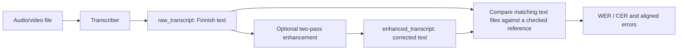

# Transcriber Example

Examples for the Transcriber software component.

## Files

- `transcriber_example.py` - Azure/OpenAI transcription example; enhancement is disabled
- `transcriber_exmaple_local_model.py` - local whisper service example using `transcription_model="whisper_local"`; two-pass enhancement is enabled

## What These Examples Show

- API-based transcription with OpenAI or Azure OpenAI
- Optional transcript error fixing through the `enhance_transcript` software component
- Local transcription service usage with runtime endpoint and key
- Accessing raw and corrected transcript outputs

## Usage

```bash
python transcriber_example.py path/to/audio.mp3
```

```bash
python transcriber_exmaple_local_model.py
```

## Input, output and evaluation



The API example saves the result using `result.save(output_dir)`. The local
example prints raw and enhanced text; configure its file, local endpoint and key
before running it. Enhancement also needs OpenAI/Azure credentials.

To compare results, save each raw/enhanced transcript under matching filenames
in separate folders. Run the
[transcription evaluation](../../../../evaluation_layer/eval_methods/transcription_eval/README.md)
scripts against the same reference folder. That guide includes a before/after WER
chart, an actual marked output and the separate QAD-1 benchmark findings.

## Related documentation

- [Transcriber Component](https://github.com/GAIK-project/gaik-toolkit/tree/main/implementation_layer/src/gaik/software_components/transcriber)
- [Software Components Overview](https://gaik-project.github.io/gaik-toolkit/toolkit/software-components#transcriber)
