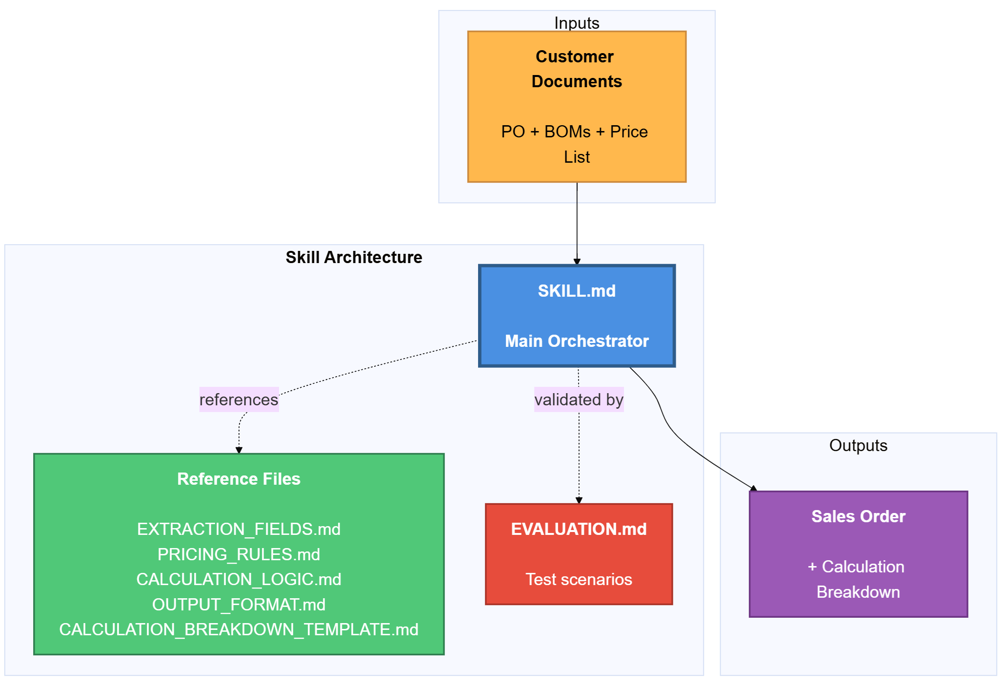

# Purchase Order Processing Skill for Claude Desktop

Transform your purchase orders and bills of material into accurate, priced sales orders — automatically.

---

## What Does This Skill Do?

This skill helps you **process purchase orders** and generate complete sales orders with accurate pricing. Simply point Claude to a folder containing your PO, BOMs, and price list, and it will:

- **Extract** order details from purchase orders (PDFs)
- **Match** material numbers with bills of material (BOMs)
- **Lookup** prices from your master price list
- **Calculate** volume discounts, fees (cutting, testing, certification), and taxes
- **Generate** a professional sales order document with complete pricing breakdown

---


---

### Example Use Cases

| Scenario | Input | Output |
|----------|-------|--------|
| Standard order processing | PO + BOMs + Price List | Sales Order with calculated pricing |
| Quick quote | PO only (no BOMs) | Sales Order using PO descriptions |
| Custom pricing | PO + BOMs + Custom Price List | Sales Order with your pricing |
| Audit trail | PO + BOMs + Price List | Sales Order + Calculation Breakdown |

### Supported File Types

| Type | Formats | Purpose |
|------|---------|---------|
| Purchase Orders | `.pdf` | Customer orders to process |
| Bills of Material | `.pdf` | Material specifications and requirements |
| Price Lists | `.xlsx`, `.csv` | Master pricing and fee information |
| Templates | `.docx` (optional) | Custom sales order format |

---

## Prerequisites

Before setting up, please install:

1. **Claude Desktop** — Download from [claude.ai/download](https://claude.ai/download)
2. **Node.js** — Download from [nodejs.org](https://nodejs.org/)
   - Required for filesystem access
---

## Setup

### Option A: Easy Setup (Recommended)

**Step 1: Configure Claude Desktop**

1. Open Claude Desktop's configuration file:
   - Press `Win + R`
   - Paste: `%APPDATA%\Claude\claude_desktop_config.json`
   - Press Enter

2. Add or update the `mcpServers` section:

```json
{
  "mcpServers": {
    "filesystem": {
      "command": "npx",
      "args": ["-y", "@modelcontextprotocol/server-filesystem", "C:\\"]
    }
  }
}
```

3. Save and close the file

**Step 2: Restart Claude Desktop**

1. Close Claude Desktop completely (check the system tray icon)
2. Open Task Manager and end any "Claude" processes
3. Start Claude Desktop again

**Step 3: Install the Skill**

1. Zip the `purchase-order-processing` folder (this entire folder)
2. Open Claude Desktop
3. Click the **Settings** icon (gear) → **Capabilities**
4. Click **"+ Add"**
5. Select the zip file you just created

✅ **Setup complete!** You're ready to use the skill.

---

## How to Use

### Step 1: Organize Your Documents

Create a folder with this structure:

```
My-Order/
├── customer_data/           ← REQUIRED: Put PO and BOMs here
│   ├── PO.pdf
│   ├── BOM1.pdf
│   ├── BOM2.pdf
│   └── BOM3.pdf
├── price_list/              ← REQUIRED: Put your price list here
│   └── price_list.xlsx
└── sample_sales_order/      ← OPTIONAL: Put a sample SO format here
    └── sample_order.docx
```

**Required:**
- `customer_data/` — At least one PO.pdf (BOMs optional if PO has all details)
- `price_list/` — Your master price list (Excel or CSV)

**Optional:**
- `sample_sales_order/` — A sample sales order showing your desired format

### Step 2: Ask Claude to Process the Order

In Claude Desktop, upload the .zip file of the documents (same structure) and say:

```
Process these documents using purchase-order-processing skill
```

Or provide the local path of the documents:

```
Generate sales order from C:\Orders\NewCustomer using purchase-order-processing skill
```

### Step 3: Get Your Sales Order

Claude will:
1. Extract data from the PO and BOMs
2. Match materials and lookup prices
3. Calculate volume discounts, fees, and taxes
4. Create a sales order document
5. Generate a calculation breakdown for audit
6. Save both files in the input folder

---

## Examples

### Example 1: Full Workflow with BOMs

**Your request:**
```
Process the purchase order in C:\Orders\Project-Q4 using purchase-order-processing skill
```

**Your folder:**
```
Project-Q4/
├── customer_data/
│   ├── PO.pdf          # 3 line items
│   ├── BOM1.pdf        # MAT-2401
│   ├── BOM2.pdf        # MAT-3567
│   └── BOM3.pdf        # MAT-4829
└── price_list/
    └── price_list.xlsx
```

**Result:**
- `SO-2025-15903_AutoTech_Manufacturing_2025-11-15.docx` — Complete sales order
- `Calculation_Breakdown.txt` — Detailed pricing calculations

---

### Example 2: Quick Quote (No BOMs)

**Your request:**
```
Generate sales order from C:\Orders\QuickQuote using purchase-order-processing skill
```

**Your folder:**
```
QuickQuote/
├── customer_data/
│   └── PO.pdf          # Contains all material details
└── price_list/
    └── price_list.xlsx
```

**Result:** Sales order generated using descriptions from the PO itself.

---

### Example 3: Custom Format with Sample

**Your request:**
```
Create sales order matching our format from C:\Orders\NewCustomer using purchase-order-processing skill
```

**Your folder:**
```
NewCustomer/
├── customer_data/
│   ├── PO.pdf
│   ├── BOM1.pdf
│   └── BOM2.pdf
├── price_list/
│   └── price_list.xlsx
└── sample_sales_order/
    └── our-format.docx   ← Your company's format
```

**Result:** Sales order matching your sample document's format and style.

---

## What Gets Calculated?

The skill automatically calculates and includes:

| Calculation | Description | Source |
|-------------|-------------|--------|
| **Material Cost** | Quantity × Unit Price | PO quantity × Price List |
| **Cutting Fees** | Cutting Fee × Cuts Required | Price List × BOM field |
| **Testing Fees** | Testing Fee × Test Lots | Price List × BOM field |
| **Certification Fees** | Cert Fee × Certificates | Price List × BOM field |
| **Volume Discount** | Tiered discount on materials | Based on subtotal |
| **Tax** | Tax on materials + fees + shipping | Configurable rate (default 6%) |
| **Grand Total** | All components combined | Complete pricing |

**Important:** The skill ALWAYS uses Price List prices, NEVER the prices from the customer's PO.

---

## Customizing the Skill

The skill is highly customizable. Edit files in the `reference/` folder to match your business needs:

| What to Change | File | Default | How to Customize |
|----------------|------|---------|------------------|
| **Volume Discount Tiers** | `PRICING_RULES.md` | 0%, 3%, 5%, 7%, 10% at $5K/$15K/$30K/$50K thresholds | Update discount tier table |
| **Tax Rate** | `CALCULATION_LOGIC.md` | 6% on materials + fees + shipping | Change default tax rate or specify at runtime |
| **Fee Defaults** | `CALCULATION_LOGIC.md` | Cutting: 0, Testing: 1 lot, Certs: 1 | Update default values in fee sections |
| **Price List Columns** | `EXTRACTION_FIELDS.md` | Type/Part, Unit Price, Fees | Map your column names to expected fields |
| **BOM Field Names** | `EXTRACTION_FIELDS.md` | Cutting_Required, Testing_Lots_Required, etc. | Add alternative field name variations |
| **Output Format** | `OUTPUT_FORMAT.md` or use `sample_order.docx` | Default text format | Edit template or provide sample document |
| **Company Info** | `OUTPUT_FORMAT.md` | Placeholders | Replace with your company details |
| **Extraction Fields** | `EXTRACTION_FIELDS.md` | Standard PO/BOM fields | Add/remove fields to extract |
| **Validation Rules** | `SKILL.md` | BOM exists, codes match, status approved | Modify validation table |
| **Calculation Formulas** | `CALCULATION_LOGIC.md` | Standard formulas | Update calculation logic |

**Easiest customization:** Place a `sample_order.docx` in the `sample_sales_order/` folder — the skill will automatically match your format.

---

## Document Requirements

### BOMs (Optional)
Include these fields for accurate fee calculations:
- `Cutting_Required`, `Testing_Lots_Required`, `Certificates_Required`
- If not specified: Cutting defaults to 0, Testing to 1 lot, Certs to 1
- See `reference/BOM_TEMPLATE_WITH_FEES.md` for template

### Price List (Required)
**Required columns:** Type/Part Designation, Unit Price
**Optional:** Cutting Fee, Testing Fee, Cert Fee, Min Order Qty, Lead Time

**Critical:** Type/Part Designation must EXACTLY match between BOM and Price List.

---

## Troubleshooting

| Issue | Solution |
|-------|----------|
| **MCP server not found** | Close Claude Desktop completely (check system tray), verify `claude_desktop_config.json`, restart |
| **File not found** | Use full Windows path (C:\Orders\...), check files are in correct subfolders (customer_data/, price_list/) |
| **Price not found** | Type/Part Designation in BOM must EXACTLY match Price List, check for typos |
| **BOM not found** | Material_Number from PO must match BOM_ID in BOM, BOMs optional if PO has all details |
| **Skill not recognized** | Settings → Capabilities, verify listed, mention "purchase-order-processing skill" in request |
| **Wrong calculations** | Review `Calculation_Breakdown.txt`, verify fee fields are numeric, check discount tiers |
| **PDF reading fails** | PDFs must be text-based (not scanned), not password-protected, use OCR if needed |

---

## Sample Data for Testing

A `sample_data/` folder with example files is added to help you test the skill.

The output for the sample data can be found in `output` folder.
---

## Important Requirements

### Currency Formatting
All currency values in generated sales orders MUST include:
- **Comma for thousands separator** — $25,567.50 NOT $25567.50
- **Exactly 2 decimal places** — $450.00 NOT $450
- **Dollar sign prefix** — $1,278.38 NOT 1278.38
- **Minus before dollar for negatives** — -$1,278.38 NOT $-1,278.38

### Special Instructions
Special instructions from the Purchase Order are copied **verbatim** to the Sales Order:
- Every instruction is included exactly as written in the PO
- No paraphrasing, summarizing, or omitting

---

## Tips for Best Results

1. **Use consistent naming** — Name BOMs as BOM1.pdf, BOM2.pdf, etc.
2. **Match Type/Part exactly** — Ensure BOM and Price List use identical product names
3. **Include fee fields in BOMs** — Add Cutting_Required, Testing_Lots_Required, Certificates_Required
4. **Keep price list current** — Update your master price list regularly
5. **Provide a sample** — If you want a specific format, include a sample sales order
6. **Review calculations** — Always check the Calculation_Breakdown.txt for accuracy
7. **Test with one order first** — Process a simple order before handling complex ones

---

## Output Files

The skill generates two files:

1. **Sales Order** (`SO-{number}_{Customer}_{Date}.docx`) — Complete order with header, customer info, line items, pricing breakdown
2. **Calculation Breakdown** (`Calculation_Breakdown.txt`) — Step-by-step audit trail of all extractions, matches, lookups, and calculations

---

## Getting Help

- **Documentation:** See `reference/` folder for detailed specifications
- **Issues:** GitHub repository issue tracker
- **Customization:** Edit reference files or provide sample documents

---

## License

This skill is provided as-is for use with Claude Desktop. Customize it to fit your business needs.

