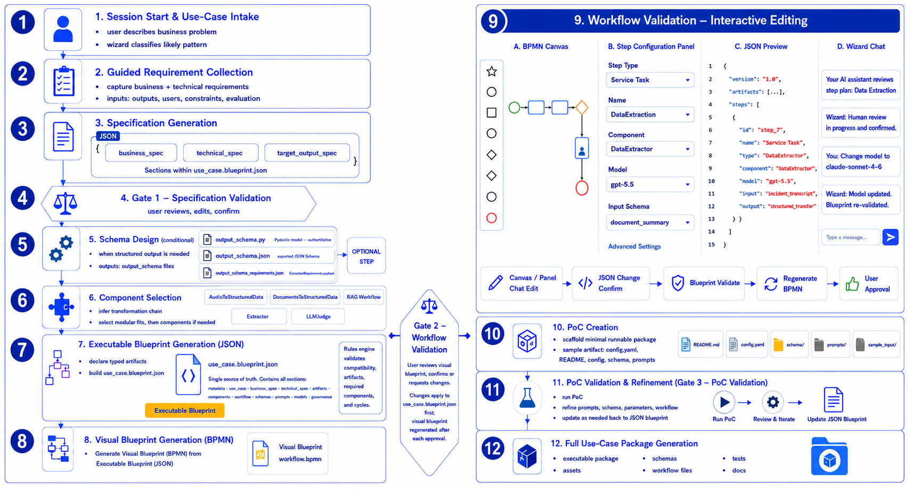

# GAIK Solution Configuration Wizard

The GAIK Solution Configuration Wizard guides users from a natural-language business problem to a validated, executable blueprint, a standards-based BPMN visual blueprint, a runnable proof of concept, and a documentation suite.

> **Full specification:** [`docs/solution_wizard.md`](docs/solution_wizard.md) — detailed requirements, design decisions, release plan, JSON blueprint schema, component registry model, validation rules, and implementation guidance for both V1 (current) and V2 (future).

**What the wizard delivers (V1 — current):**
- **Complete requirement collection** — Business, technical, and target-output requierments collected conversationally in thematic rounds, with a **completeness gate** that asks follow-up questions for anything missing instead of silently assuming
- **Component selection:** agent driven component selection from a registry 
- **Component-option awareness** — the wizard reasons about each component's behaviour-changing options (recorded in the reference cards) and infers them from the requirements or asks.
- **Two complementary blueprints** generated from the validated specification:
 - **JSON blueprint** the executable source of truth: components, artifacts, workflow steps, schemas, prompts, model settings, validation gates. Drives all downstream generation.
 - **BPMN visual blueprint** a standards-based BPMN 2.0 business-process model with swimlanes for each stakeholder role, typed tasks, gateways, data objects/stores, and message flows. Linked element-by-element to the JSON via; kept in sync by editing the JSON and regenerating.
- **Runnable PoC:** with schema files, extraction prompt, evaluation script
- **Refinement loop:** user runs PoC, shares output, wizard classifies the change (intent vs. implementation fix), updates the blueprint first for intent changes and re-validates before regenerating PoC files, or patches the PoC directly for code-only fixes
- **Documentation suite** — GenAI product canvas, technical specification, user guide, developer guide, evaluation plan

---

## Installation

Clone the repository first:

```bash
git clone https://github.com/GAIK-project/gaik-toolkit.git
```

The wizard itself requires:
- Python 3.11+
- `pydantic>=2`

```bash
pip install pydantic
```

For the interactive SDK runner (`run_wizard_interactive.py`), also install:

```bash
pip install "gaik[wizard]"   # installs claude-agent-sdk + python-dotenv
```

The PoC generated by the solution wizard will have its own `poc/requirements.txt` listing the exact GAIK extras for the selected components. Install them with:

```bash
pip install -r poc/requirements.txt
```

---

## Running the wizard

### Option 1 — Claude Code (CLI) or Claude Desktop (recommended)

Type `/solution-wizard` in a Claude Code session or Claude Desktop chat.

The wizard asks for an output directory and guides you through the full workflow. All generated files are saved to your chosen directory.

### Option 2 — Interactive wizard session via the Claude Agent SDK (CLI)

`run_wizard_interactive.py` starts a persistent, multi-turn conversation with the wizard
driven by the Claude Agent SDK (`ClaudeSDKClient`) on Azure Foundry. The wizard streams
responses token-by-token; you type answers and press Enter. The session continues until you
press Ctrl+D or Ctrl+C.

```bash
# Activate the venv that has claude-agent-sdk installed (pip install gaik[wizard])
# then, from the solution_wizard directory:

# Wizard asks for the output directory itself:
python run_wizard_interactive.py

# Pre-supply the output directory (skips that question):
python run_wizard_interactive.py --output-dir "C:\projects\my-use-case"
```

Requires Azure Foundry credentials in `../.env` (one level up from this directory) or the
current shell environment. See `.env.example` for the required variables
(`CLAUDE_CODE_USE_FOUNDRY`, `ANTHROPIC_FOUNDRY_API_KEY`, `ANTHROPIC_FOUNDRY_RESOURCE`,
`ANTHROPIC_DEFAULT_SONNET_MODEL`). Run `python run_wizard_interactive.py --preflight` to
confirm routing before a full session.

### Option 3 — Wizard as a web chat (demo website)

The wizard is also integrated as a streaming chat page in the demo website at
`implementation_layer/toolkit_demo_app`. The backend (`api/routers/solution_wizard.py`)
keeps a `ClaudeSDKClient` session alive per browser tab and streams tokens over SSE;
the frontend renders responses with full markdown + Mermaid support.

```bash
cd implementation_layer/toolkit_demo_app
uv run uvicorn api.main:app --port 8000 # backend (no --reload to avoid session drops)
bun dev # frontend at http://localhost:3000
```

Open **http://localhost:3000/solution-wizard**. Generated files (blueprint, diagrams, docs,
PoC) appear in the sidebar and can be downloaded individually or as a `.zip`. See
`implementation_layer/toolkit_demo_app/README.md` for the full setup.

---

## Wizard workflow overview

The diagram below shows the complete vision for the wizard across both releases.



**What is implemented in V1 (current):** phases 1–12 as shown — session start and use-case intake (1), guided requirement collection (2), specification generation (3), Gate 1 specification validation (4), component selection (5), executable JSON blueprint (7), BPMN visual blueprint (8), Gate 2 workflow validation, PoC creation (10), PoC validation and refinement / Gate 3 (11), documentation suite. The BPMN is regenerated from the JSON blueprint and never edited directly; during PoC validation the wizard updates the JSON based on user feedback and regenerates the BPMN accordingly.

**What is planned for V2:** a dedicated Solution Wizard web UI that hosts the full wizard workflow as a structured multi-pane workspace; interactive BPMN editing within that UI (live canvas, step configuration panel, wizard chat, synchronized JSON ↔ BPMN); full use-case package generation; Gate 4 runtime validation of the full package; and production-grade error handling and guardrails (scoped to GAIK toolkit use cases, safety constraints, graceful recovery, and session state safety).

---

## How the workflow works (complete walkthrough)

The **agent** (the LLM following `SKILL.md`) is the brain of the wizard. Everything in `scripts/` and `src/` is a deterministic helper it calls. Nothing in the Python layer talks to the user — only the agent does.

> **The agent produces meaning** (interpretation, classification, component selection, authoring the blueprint). **The Python scripts enforce correctness** (Pydantic type rules + the validator rules) and **render the derived views** (BPMN visual blueprint, PoC files, documentation). The wizard produces two complementary blueprints: the **JSON blueprint** (executable source of truth, drives all generation) and the **BPMN visual blueprint** (standards-based business-process view for stakeholder communication and review).

### Worked example

**The user's description:**

> *"We run a facilities maintenance team. Our field technicians call in equipment faults as Finnish voice messages — they describe what's broken, where it is, and how urgent it is. We'd like to turn these into structured maintenance tickets that a supervisor checks before they go into the system."*

---

**Phase 1 — Session start.** The agent asks for the output directory (`~/projects/maintenance-tickets`) and the use-case description, then classifies the pattern: audio input + structured JSON output → `audio_to_structured`. Consults `selector.py` as reference data.

**Phase 2 — Complete requirement collection .** The agent collects the full Section-8 model in thematic rounds (business, technical, target output). Key answers: audio input, **Finnish** language, structured JSON output, human review required, technician names are personal data, integration target = the maintenance system, evaluation = field-level accuracy. The agent (not a script) maps "Finnish voice messages" to `input_type=audio, language=fi`.

**Phase 3 + Gate 1 — Specification + completeness gate.** Agent drafts the full `business_spec`, `technical_spec`, and `target_output_spec`, writes a draft blueprint, and runs `check_requirements.py`. For any missing Section-9 point it asks a follow-up (ask, don't assume). Presents the summary; stops until the checklist passes **and** the user confirms.

**Phase 4 — Schema design.** For extraction use cases:

1. Agent writes `poc/prompts/extraction_requirements.md` with domain-specific field definitions, Finnish urgency cues, allowed values, and output policy.
2. Agent calls GAIK's SchemaGenerator once.

SchemaGenerator generates `output_schema.py` (Pydantic model), `output_schema_requirements.json` (payload for `load_schema()`), and `output_schema.hash` (SHA-256 of the requirements file for freshness tracking). The agent presents `output_schema.py` to the user for review. The user approves or requests changes — the agent applies changes directly; SchemaGenerator is never called again.

**Phase 5 — Component selection + options .** Agent loads the registry summary (`--show-registry`), applies the module-first rule: `AudioToStructuredData` selected. Human review = yes → `LLMJudge` added. Then it reads the reference-card `options`: language is Finnish → the module's internal Transcriber runs with `enhanced_transcript=True` (recorded in the step `parameters`), and it does **not** add a separate `TranscriptEnhancer` step (subsumption rule; `validate_blueprint.py` would warn at Rule 12 otherwise).

**Phase 6 — Blueprint assembly + validation.** Agent reads `templates/blueprint_template.json` and the closest example blueprint, fills in the blueprint. Schema paths are always `"schemas/output_schema.py"` and `"schemas/output_schema_requirements.json"`. Validates:

Validation PASSED (or proposes fixes, re-validates).

**Phase 8 + Gate 2 — Visual workflow.**

The agent `scripts/run_wizard.py` and saves the blueprint and writes **both** `workflow.mmd` (Mermaid) and `workflow.bpmn` (the BPMN visual blueprint, with `visualizations.bpmn_mapping` persisted into the JSON). Agent shows the Mermaid diagram and points the user to the BPMN; user confirms or requests edits — including business-level changes to lanes, hand-offs, or exception paths — which are applied to the JSON first (`workflow`/`artifacts`/`business_process`) and both diagrams regenerated. The diagrams are never hand-edited.

Optionally, **Phase 3.5** elicits a `business_process` section (roles/lanes, external parties, manual steps, exceptions, business decisions) so the BPMN becomes a genuine Level-2 business-process model rather than just the pipeline. If skipped, the BPMN is still rich via enrichment conventions (approval gateway + rework loop from `human_review`; parallel fork/join from multi-dependency steps; data store + send task from `integration_targets`; governance annotations).

**Phase 10 — PoC scaffolding.**

The agent runs `scripts/scaffold_poc.py`. Since `generate_schema.py` already ran and wrote the approved schema files, `scaffold_poc.py` uses them as-is without overwriting. `run_poc.py` is fully wired from the `audio_to_structured` template. The agent prints use-case-specific run instructions and asks the user to run the PoC.

**Phase 11 + Gate 3 — PoC validation and refinement.** User runs the PoC and shares the output. The agent first classifies each piece of feedback as either an **intent change** (workflow, components, schema, prompt, model, evaluation) or an **implementation fix** (path, logging, wiring bug). For intent changes the blueprint is updated first, re-validated, and then the affected PoC files are regenerated from the updated blueprint — keeping `use_case.blueprint.json` as the single source of truth. For code-only fixes the PoC is patched directly without touching the blueprint. All intent changes are recorded in `change_log`.

Schema freshness: if the user edits `extraction_requirements.md` at any point, the hash mismatch is detected on the next `run_poc.py` run and the schema is automatically regenerated from the updated prompt.

**Phase 12 — Documentation suite .** Once Gate 3 passes, the agent runs `generate_docs.py` to write the five documents into `docs/`, then fills the `<!-- AGENT: ... -->` narrative markers in each. (Phase 13 — promotion to the template library — is offered only for custom/hybrid pipelines.)

---

**Final output** in `~/projects/maintenance-tickets/` (outside the GAIK repo):

```
use_case.blueprint.json <- executable blueprint (source of truth)
workflow.mmd <- Mermaid diagram (quick flow view)
workflow.bpmn <- BPMN 2.0 visual blueprint (derived, linked by bpmn_mapping)
poc/ <- runnable proof of concept
docs/ <- documentation suite (5 files, V3)
```

### Data flow in one line per stage

```
user prose
 → [agent] normalized answers (input=audio, output=structured_json, lang=fi, review=yes)
 → [agent + selector.py] pattern=audio_to_structured, chain, module=AudioToStructuredData
 → [agent] business/technical/target_output spec ── Gate 1
 → [agent + registry.py --show-registry] components: AudioToStructuredData + LLMJudge
 → [agent writes extraction_requirements.md]
 → [generate_schema.py → SchemaGenerator] output_schema.py + requirements + hash
 → [agent presents schema → user approves]
 → [agent + template + example] draft blueprint JSON (artifacts + steps)
 → [validate_blueprint.py → blueprint.py → validator.py] PASS/errors (loop until clean)
 → [run_wizard.py → visualizer.py + bpmn_generator.py] saved blueprint + workflow.mmd + workflow.bpmn ── Gate 2
 → [scaffold_poc.py → scaffolder.py] complete poc/ folder
 → [agent prints handoff message]
 → [user runs poc/run_poc.py → shares output] ── Gate 3
 → [agent: interpret → diagnose → propose diff → re-validate → regenerate]
 → files in the user's output directory
```

---

## Output directory layout

All wizard outputs go to the directory the user specifies. Never written inside this repository.

```
<output_dir>/
├── use_case.blueprint.json        # executable blueprint (source of truth)
├── workflow.mmd                   # Mermaid diagram (quick flow view)
├── workflow.bpmn                  # BPMN 2.0 visual blueprint (derived)
├── poc/
│   ├── README.md                  # use-case-specific run instructions
│   ├── run_poc.py                 # runnable pipeline
│   ├── requirements.txt           # gaik[extras] for selected components
│   ├── .env.example               # env vars for chosen provider
│   ├── config.yaml                # model names, temperature, paths
│   ├── sample_input/              # place your input file here
│   ├── output/                    # run_poc.py writes results here
│   │   ├── result.json            # structured output (always)
│   │   └── result_report.pdf      # formatted PDF report (when output_types includes 'pdf')
│   ├── pdf_report.py              # ReportLab renderer (only when PDF output requested)
│   ├── schemas/
│   │   ├── output_schema.py       # Pydantic model (from SchemaGenerator)
│   │   ├── output_schema.json     # JSON Schema export (documentation)
│   │   ├── output_schema_requirements.json  # ExtractionRequirements payload for load_schema()
│   │   └── output_schema.hash     # SHA-256 of extraction_requirements.md
│   ├── prompts/
│   │   └── extraction_requirements.md  # agent-written field definitions for the extractor
│   └── evals/
│       ├── run_basic_eval.py      # basic evaluation script
│       └── ground_truth/          # add ground-truth files here
└── docs/                          # documentation suite (generated by generate_docs.py)
    ├── genai_product_canvas.md
    ├── technical_specification.md
    ├── user_guide.md
    ├── developer_guide.md
    └── evaluation_plan.md
```

---

## Running the PoC

```bash
cd poc/
pip install -r requirements.txt
cp .env.example .env # fill in your API key
# place input file in sample_input/
python run_poc.py
```

**Schema reuse**: `run_poc.py` computes the SHA-256 of `extraction_requirements.md` and compares it against `schemas/output_schema.hash`. If they match, the approved schema is loaded via `load_schema()` and SchemaGenerator is not called. If the prompt was edited, the hash mismatches and the schema is regenerated automatically from the updated requirements.

Inspect results in `output/`, then paste the output into the wizard conversation for Gate 3 refinement.

---

## Custom / hybrid pipelines and the dynamic template library

Use cases whose pipeline is not one of the three fixed single-module patterns (audio→structured,
document→structured, RAG) — for example *parse a PDF + transcribe audio → combine → extract*,
or any blueprint with **multiple selected modules** — are handled by the **`_generic` template**,
which is a **per-step wiring guide**, not a bare TODO:

- For each automated step the scaffolder emits a labelled block containing the component's
 **reference call pattern** (import, constructor, main method, return shape) from
 `registries/component_reference_cards.json`, plus output variables pre-named after the blueprint
 artifacts (so they chain correctly).
- It carries the same reusable helpers as the module templates (`_load_schema_if_fresh`, the
 requirements hash, per-type input loaders).
- It enforces a **result contract**: the agent assigns `extracted_fields` and `source_text`, so the
 injected LLMJudge hallucination check works for any pipeline shape.

The agent fills one call per block. The wizard never executes the PoC — reliability is confirmed when
the user runs it at Gate 3.

**Promotion to a reusable template (generalize-then-save).** Once a hybrid PoC is validated, it can be
saved to the library so the same pipeline shape is reused deterministically next time:

```bash
# The agent first generalises the validated poc/run_poc.py into poc/run_poc.py.tmpl
# (use-case literals -> ${variables}), then:
python scripts/promote_template.py \
 --blueprint ~/my-use-case/use_case.blueprint.json \
 --candidate ~/my-use-case/poc/run_poc.py.tmpl
```

Promotion is **gated** (only for validated `_generic` pipelines, with user consent) and is a
transform, not a copy. The script refuses the save unless every check passes:

- **genericity** — no use-case token (`use_case_id`, `schema_name`, field names, model names,
 language code) leaks outside a `${...}` placeholder;
- **fills cleanly** — no unfilled `${...}` for the blueprint;
- **parses** — the filled template is valid Python;
- **imports resolve** — every `from gaik…import` is a real module (use `--skip-import-check`
 if the relevant gaik extras are not installed on the promotion machine);
- **no duplicate** — the topology-aware `pattern_key` is not already in the library.

On success it writes `templates/poc/<pattern_key>/run_poc.py.tmpl` plus a `template.json` manifest
(component set, topology signature, validating blueprint, status `provisional`). The next blueprint with
the same pipeline shape is matched by `_determine_pattern()` and reused with no agent involvement.

The `pattern_key` is **topology-aware**: it is derived from a canonically sorted set of edge
descriptors `component(in=...,out=...,deps=...)`, so the same dependency graph in any step-list
order produces the same key — a template is never matched to a different wiring shape.

---

## Running tests

```bash
cd implementation_layer/solution_wizard
pytest tests/ -v
```

---

## Project structure

```
solution_wizard/
├── SKILL.md                          # orchestration layer (agent instructions)
├── README.md                         # this file
├── run_wizard_interactive.py         # interactive CLI session (Claude Agent SDK, Azure Foundry)
├── schemas/
│   ├── use_case_blueprint.schema.json  # exported from Pydantic (do not hand-edit)
│   └── component_registry.schema.json  # registry structure (validated on load)
├── registries/
│   ├── gaik_component_registry.json    # component/module catalog (with subsumes notes)
│   └── component_reference_cards.json  # verified call patterns + structured options
├── templates/
│   ├── blueprint_template.json         # blueprint skeleton with placeholders
│   ├── poc/
│   │   ├── _common/                    # shared PoC templates (README, config, eval, pdf_report)
│   │   ├── audio_to_structured/        # run_poc.py for audio → structured pattern
│   │   ├── document_to_structured/     # run_poc.py for document → structured pattern
│   │   ├── rag/                        # run_poc.py for RAG pattern
│   │   ├── _generic/                   # per-step wiring skeleton for custom/hybrid pipelines
│   │   └── <pattern_key>/              # promoted templates (added by promote_template.py)
│   └── docs/                           # five §18 document skeletons (*.md.tmpl)
├── scripts/
│   ├── run_wizard.py                   # CLI entry + --show-registry + --export-schema
│   ├── check_requirements.py           # Section-9 completeness gate
│   ├── validate_blueprint.py           # standalone blueprint validator
│   ├── generate_mermaid.py             # standalone Mermaid generator (validates first)
│   ├── generate_bpmn.py                # standalone BPMN generator (validates first)
│   ├── generate_docs.py                # documentation-suite generator (validates first)
│   ├── generate_schema.py              # calls SchemaGenerator once; saves schema + hash
│   ├── scaffold_poc.py                 # scaffolds poc/ from a validated blueprint
│   └── promote_template.py             # generalize-then-save a validated hybrid PoC
├── src/
│   └── solution_wizard/
│       ├── blueprint.py                # Pydantic models (authoritative schema)
│       ├── registry.py                 # registry + reference-card loaders, pip_requirements()
│       ├── selector.py                 # transformation chains + module-first map
│       ├── requirements.py             # Section-9 completeness checklist
│       ├── validator.py                # validation rules (incl. Rule 12 redundancy warning)
│       ├── visualizer.py               # Mermaid generation
│       ├── bpmn_generator.py           # BPMN 2.0 visual-blueprint generation (XML + DI)
│       ├── docs_generator.py           # documentation-suite generation (§18)
│       ├── schema_designer.py          # fallback schema generation (no API call)
│       └── scaffolder.py               # deterministic PoC file generation
├── examples/
│   ├── incident_reporting_blueprint.json
│   ├── document_extraction_blueprint.json
│   └── rag_workflow_blueprint.json
└── tests/
    ├── test_blueprint.py
    ├── test_validator.py
    ├── test_requirements.py
    ├── test_selector.py
    ├── test_mermaid.py
    ├── test_bpmn.py
    ├── test_reference_cards.py
    ├── test_schema_designer.py
    ├── test_scaffolder.py
    ├── test_docs.py
    └── test_pdf_report.py
```

### File descriptions

**Orchestration and configuration**

| File | Input | Output | Description |
|------|-------|--------|-------------|
| `SKILL.md` | User messages in Claude Code / Desktop | Questions, decisions, script invocations | The agent's instruction set. Defines every conversation phase, gate, and script call. The only layer that communicates with the user. |
| `registries/gaik_component_registry.json` | — | Loaded by `registry.py`; read by agent via `--show-registry` | Machine-readable catalog of 10 GAIK software modules and components. Each entry describes input/output artifact types, `best_for`, `known_limitations`, `required_parameters`, `install_extra`, and `example_blueprint_steps`. Adding a new component requires only a new entry here. |
| `schemas/use_case_blueprint.schema.json` | — | Used by external validators and documentation tools | JSON Schema exported from the Pydantic blueprint models. Regenerated by `run_wizard.py --export-schema`. Do not hand-edit. |
| `schemas/component_registry.schema.json` | — | Checked by `registry.py` on load | JSON Schema that defines the required fields for every registry entry. Prevents malformed entries from causing silent errors at runtime. |
| `templates/blueprint_template.json` | — | Starting structure for the agent when authoring a blueprint | Minimal valid blueprint skeleton with `<placeholder>` markers for every section. The agent reads this in Phase 6 (Blueprint Assembly) so it never has to author the JSON structure from memory. |
| `templates/poc/` | Template variables (substituted by `scaffolder.py`) | Filled Python files and boilerplate | Per-pattern `run_poc.py` templates for `audio_to_structured`, `document_to_structured`, `rag`, and `_generic` (skeleton with TODOs). Shared boilerplate (`.env.example`, `config.yaml`, `README.md`, `run_basic_eval.py`, and `pdf_report.py` — the optional ReportLab PDF renderer) lives in `_common/`. |
| `examples/*.json` | — | Reference patterns read by the agent during Phase 6 | Three fully valid, hand-verified blueprints (incident reporting, document extraction, RAG Q&A). The agent copies the closest one as a structural reference when assembling a new blueprint. |

---

**Python source modules (`src/solution_wizard/`)**

| Module | Input | Output | Description |
|--------|-------|--------|-------------|
| `blueprint.py` | dict / JSON file | Validated `Blueprint` object; serialized JSON; exported JSON Schema | Pydantic v2 models that define the authoritative blueprint structure. Enforces conditional rules that JSON Schema cannot (e.g. `source=generated` requires `produced_by`; `optional` has no default). Entry points: `Blueprint.from_file()`, `Blueprint.to_file()`, `Blueprint.export_json_schema()`. |
| `registry.py` | `gaik_component_registry.json` | `Registry` object with lookup/filter methods; `as_llm_context()` text summary; `pip_requirements()` list | Loads the registry JSON, validates it against `component_registry.schema.json`, and provides lookup by id or name. `pip_requirements(component_names)` derives the correct `gaik[extra]` lines for `requirements.txt`. `as_llm_context()` produces the compact text summary printed by `--show-registry`. |
| `selector.py` | Pattern name string | Ordered transformation chain (list); module registry entry | Reference data only — no scoring, no classifier. Provides two things: `transformation_chain(pattern)` returns the canonical ordered data states for a pattern (e.g. `audio_input → raw_transcript → … → final_output`), and `module_for_pattern(pattern)` looks up the single GAIK module that covers a pattern end-to-end (the module-first rule). The agent owns pattern classification; this module provides the scaffolds it consults. |
| `validator.py` | `Blueprint` object | `ValidationResult(ok, errors, warnings)` | Implements the 11 V1 validation rules: unique step IDs, artifact references, registry membership, type compatibility, required parameters, overwrite flags, `produced_by` ↔ `step.outputs` crosscheck, topological ordering, acyclicity, final-output presence, schema-ref naming convention, and assumption well-formedness. Errors block; warnings surface but do not block. |
| `visualizer.py` | `Blueprint` object | `workflow.mmd` string / file | Generates a `flowchart TD` Mermaid diagram from `workflow.steps`. Assigns GAIK palette colours by step type (blue = user input, purple = automated, yellow = decision/human review, green = final output). Steps that produce `final_output=true` artifacts are coloured green regardless of type. |
| `bpmn_generator.py` | `Blueprint` object | `workflow.bpmn` string / file; writes `visualizations.bpmn_mapping` into the blueprint | Generates the BPMN 2.0 *visual blueprint*: builds a semantic model from `workflow.steps` + `artifacts` + the optional `business_process` section, applies enrichment conventions (human_review → "Approved?" gateway + rework loop; `integration_targets` → data store + send task; ≥2 dependencies/dependents → parallel fork/join; governance → text annotations), then does deterministic layered auto-layout and emits BPMN 2.0 XML with a complete BPMNDI section (a shape for every flow node, an edge for every flow — so it renders in bpmn-js / Camunda / draw.io). Linked-by-derivation: every element id maps back to a blueprint object via `bpmn_mapping`. Changes are made in the JSON and the BPMN is regenerated; in V2 the BPMN canvas will become directly editable with changes propagated back to the JSON. |
| `schema_designer.py` | `target_output_spec` dict | `output_schema.py`, `output_schema_requirements.json`, `prompts/extraction_requirements.md` | Fallback schema generation with no API call. Converts the structured field list from the blueprint into a Pydantic model (`output_schema.py`), an `ExtractionRequirements` payload (`output_schema_requirements.json`), and a plain-text requirements string (`extraction_requirements.md`). Used by `scaffold_poc.py` when `generate_schema.py` has not been run (e.g. offline or standalone CLI use). |
| `scaffolder.py` | `Blueprint` object + output dir | Complete `poc/` folder | The deterministic PoC generator. Selects the right template via `_determine_pattern()`: a fixed single-module template (`audio_to_structured`, `document_to_structured`, `rag`) is used only when **exactly one** module is selected and all building blocks are covered by it — blueprints with multiple selected modules fall through to the dynamic library or `_generic`, preventing any module's logic from being silently dropped. Derives `requirements.txt` (including extras for card-only building blocks), injects per-step reference-card snippets into the `_generic` skeleton, and injects LLMJudge hallucination detection when present. Approved schema files in `poc/schemas/` are never overwritten. |

---

**CLI scripts (`scripts/`)**

| Script | Input | Output | Description |
|--------|-------|--------|-------------|
| `run_wizard.py` | `--blueprint` path + `--output-dir`; or `--show-registry`; or `--export-schema` | Saved `use_case.blueprint.json` + `workflow.mmd` + `workflow.bpmn`; or registry summary; or updated `schemas/use_case_blueprint.schema.json` | Main CLI entry point. In its primary mode it validates the blueprint, generates both the Mermaid and BPMN diagrams (so `visualizations.bpmn_mapping` is populated), sets `package.output_dir`, and saves the blueprint in one call. `--show-registry` prints the agent-readable component summary. `--export-schema` regenerates the JSON Schema from the Pydantic models. |
| `validate_blueprint.py` | `--blueprint` path | Pass/fail report printed to stdout; exit code 0 (pass) or 1 (fail) | Thin wrapper around `validator.validate()`. Loads the blueprint via `Blueprint.from_file()` (Pydantic type-checks on load), then runs the validation rules (12, incl. the Rule-12 redundancy warning). Errors are printed with the rule number and the offending step or artifact id. |
| `generate_mermaid.py` | `--blueprint` path + `--output-dir`; optional `--skip-validation` | `workflow.mmd` in the output directory | Generates the Mermaid diagram from the blueprint. Validates the blueprint first by default; use `--skip-validation` for draft iteration. |
| `generate_bpmn.py` | `--blueprint` path + `--output-dir`; optional `--skip-validation` | `workflow.bpmn` in the output directory | Generates the BPMN 2.0 visual blueprint from the blueprint. Validates first by default; use `--skip-validation` for draft iteration. Open the output in bpmn-js, Camunda Modeler, or draw.io. |
| `generate_schema.py` | `--requirements` (path to `extraction_requirements.md`) + `--schema-name` + `--output-dir`; optional `--no-azure` / `--model` | `output_schema.py`, `output_schema_requirements.json`, `output_schema.json`, `output_schema.hash` — all written to `<output-dir>/schemas/` | Calls GAIK `SchemaGenerator` exactly once to generate a typed Pydantic extraction model from the natural-language requirements text. Saves the schema files in the format `load_schema()` expects, and saves a SHA-256 hash of the requirements file so the PoC can detect when the prompt has changed and regenerate automatically. |
| `scaffold_poc.py` | `--blueprint` path; optional `--output-dir`, `--synthetic`, `--skip-validation` | Complete `poc/` folder in the output directory | Validates the blueprint (unless `--skip-validation`), refuses output paths inside the GAIK repo, then calls `scaffolder.scaffold_poc()`. Prints the pattern key, template save path, and use-case-specific handoff message. |
| `promote_template.py` | `--blueprint` + `--candidate` (agent-generalised `.tmpl`); optional `--status`, `--skip-import-check`, `--force` | `templates/poc/<pattern_key>/run_poc.py.tmpl` + `template.json` manifest, or a rejection report | Validates a generalised hybrid PoC template (5 checks: genericity scan, fills cleanly, parses, imports resolve, no duplicate) and saves it to the dynamic template library. Import checking is on by default; use `--skip-import-check` when gaik extras are not installed. |

---

**Tests (`tests/`)**

| File | What it tests |
|------|--------------|
| `test_blueprint.py` | Pydantic model loading, conditional artifact rules (`produced_by`, `optional`), round-trip serialisation, JSON Schema export |
| `test_validator.py` | The validation rules (incl. Rule 12 redundancy warning); each tested with a passing case (the three example blueprints) and a targeted failure fixture |
| `test_selector.py` | Transformation chains, module-first lookups, registry self-validation, required LLM-selection fields |
| `test_mermaid.py` | Mermaid output contains all step names, GAIK palette styles, correct output colours; label escaping for special characters |
| `test_bpmn.py` | BPMN output is well-formed XML with the expected element types (lanes, events, user/service/send tasks, parallel + exclusive gateways, data objects/stores, message flow, annotations); DI completeness (a shape for every flow node, an edge for every flow); stable ids + `bpmn_mapping` coverage; enrichment conventions (approval gateway + rework loop, integration data store + send task, governance annotations); backward-compatibility on the example blueprints |
| `test_requirements.py` | Section-9 completeness checker: complete blueprint passes; missing fields flagged by checklist number; explicit `"unknown"` / empty-list counts as answered; governance satisfies the privacy point; non-structured output satisfies the field point |
| `test_reference_cards.py` | Every registry component has a card; imports resolve and (with gaik installed) constructor params + method names are structurally correct; the 5 evaluator/utility cards present; `options` arrays well-formed; Transcriber declares `enhanced_transcript` with the Finnish rule + `subsumes` |
| `test_docs.py` | All five documents generated; no stray `${...}` placeholders; blueprint facts + step options present; `<!-- AGENT -->` markers preserved |
| `test_pdf_report.py` | PDF renderer produces valid `%PDF-` output for dict (with nested sub-tables), list[dict], and str inputs; blank values render as "—"; unicode-safe; `_wants_pdf()` detection; all four pattern templates parse with and without PDF block; scaffold wires `pdf_report.py` + `reportlab` in requirements when `output_types` includes `"pdf"` |
| `test_schema_designer.py` | Requirements text generation, Pydantic model generation (required/optional, enums, `Field(description=...)`), `output_schema_requirements.json` payload shape and `AllowedTypes` compliance |
| `test_scaffolder.py` | Scaffold of all three example blueprints; pattern detection; `requirements.txt` correctness; `run_poc.py` syntax (`ast.parse`); schema file presence and naming; no writes outside output dir |

---

## What is deterministic vs. agent-authored

| File | Generated by | How |
|------|-------------|-----|
| `requirements.txt`, `.env.example`, `config.yaml` | `scaffolder.py` (deterministic) | From `blueprint.models` and registry `install_extra` |
| `poc/schemas/output_schema.py` | `generate_schema.py` (SchemaGenerator API call) | From `extraction_requirements.md`; reviewed and approved by user |
| `poc/schemas/output_schema_requirements.json` | `generate_schema.py` | `ExtractionRequirements` payload for `load_schema()` |
| `poc/schemas/output_schema.hash` | `generate_schema.py` | SHA-256 of `extraction_requirements.md` for freshness tracking |
| `poc/prompts/extraction_requirements.md` | Agent (SKILL.md) | Domain-specific field definitions, language cues, output policy |
| `run_poc.py` for audio, document, or RAG pattern | `scaffolder.py` via per-pattern template | LLMJudge section injected when judge is in the blueprint; PDF block injected when `output_types` includes `"pdf"` |
| `run_poc.py` for custom/composed pipelines | Agent (SKILL.md) + `scaffolder.py` | Wiring TODOs filled from component reference cards; PDF block injected when requested |
| `poc/pdf_report.py` | `scaffolder.py` (copied from `_common/pdf_report.py.tmpl`) | Only present when `output_types` includes `"pdf"`. ReportLab renderer: dict/list[dict] → key/value tables with nested sub-tables; str → titled sections. Writes `output/result_report.pdf` alongside the JSON. |
| `workflow.mmd` | `visualizer.py` (deterministic) | Mermaid flowchart from `workflow.steps` |
| `workflow.bpmn` + `visualizations.bpmn_mapping` | `bpmn_generator.py` (deterministic) | BPMN 2.0 model from `workflow` + `artifacts` + `business_process` + enrichment conventions; the agent authors meaning into the JSON (`business_process`), Python renders the diagram |
| `evals/run_basic_eval.py` | `scaffolder.py` | Per `evaluation.eval_framework` from blueprint |
| `README.md` | `scaffolder.py` (skeleton) + Agent (prose) | Template filled; agent writes use-case-specific instructions |

---

## Adding a new component to the registry

**Option 1 — Use the `gaik-sync` skill (recommended)**

Run `/gaik-sync` in Claude Code or Claude Desktop after adding a new gaik component. In informed mode, tell it what you added — for example:

```
/gaik-sync  I just added a new component: ParallelTranscriber
```

The skill reads the component's `README.md`, constructor signature, and example script; drafts the registry entry and reference card; presents them for your review; and writes the files only after you approve. It then runs the structural tests to verify everything is consistent.

**Option 2 — Edit manually**

Edit `registries/gaik_component_registry.json` and add one entry. Required fields:

- `id`, `name`, `type` (`software_module` or `software_component`)
- `input_artifact_types`, `output_artifact_types`
- `import_path`, `source_path`, `readme_path`, `example_script_path`
- `install_extra` (pip extra for `gaik[...]`)
- `best_for`, `known_limitations`
- `required_parameters`, `optional_parameters`
- `example_blueprint_steps`

For modules, also include `uses_components`.

Also add a corresponding entry to `registries/component_reference_cards.json` with the verified `import`, `construct`, `call`, and `returns` patterns (see existing entries for the format).

Component selection is done by the agent reading these fields directly — no scoring tables to maintain. If the new component covers a use-case pattern end-to-end as a module, also add it to `_PATTERN_TO_MODULE` in `src/solution_wizard/selector.py`.

---

## Validation rules

The validator (`src/solution_wizard/validator.py`) checks:

1. Unique step IDs
2. Step inputs/outputs reference declared artifacts
3. Components exist in registry (or marked `custom`)
4. Component artifact-type compatibility
5. Required component parameters present
6. Overwrites flagged `overwrite=true`
7. Generated artifacts have valid `produced_by`; `produced_by` step actually outputs the artifact; no consume-before-produce
8. Workflow graph is acyclic (unless loop is declared with `max_iterations`)
9. At least one terminal step yields `final_output=true`
10. `schema_ref`/`requirements_ref` follow the `schemas/output_schema.*` naming convention (warning if not)
11. Assumptions well-formed; high-impact unconfirmed assumptions surfaced as warnings
12. Redundant sub-component already provided internally — a step whose component is `subsumes`-ed or `uses_components`-ed by another step in the workflow is surfaced as a warning (e.g. a separate `TranscriptEnhancer` step when the `Transcriber` already produces an enhanced transcript)
