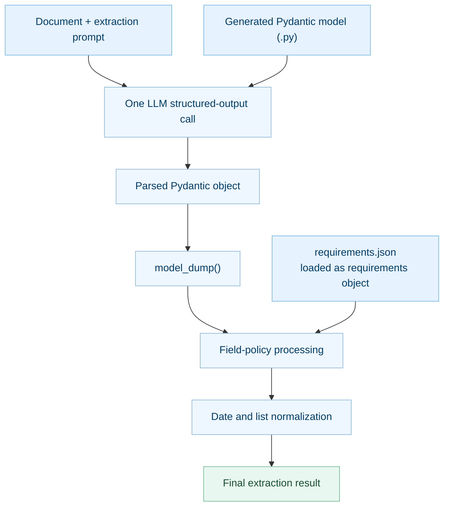

# Extractor

Extract structured data from documents using natural language requirements with automatic Pydantic schema generation.

## Installation

```bash
pip install "gaik[extract]"
```

**Note:** Works with any provider configured with `get_llm_config()` (OpenAI, Azure
OpenAI, Google, Anthropic, CSC Aitta, other OpenAI-compatible servers or optional
LiteLLM) when the model supports structured output. See the
[multi-provider guide](https://gaik-project.github.io/gaik-toolkit/toolkit/multi-provider-llm/).

---

## Quick Start

```python
from gaik.software_components.extractor import SchemaGenerator, DataExtractor, get_openai_config

# Configure
config = get_openai_config(use_azure=True)

# Use settings compatible with models that support reasoning effort.
MODEL = 'gpt-5.6-sol'
MODEL_OPTIONS = {
    'temperature': None,  # Omit temperature from the API request
    'reasoning_effort': 'low',
}

# Generate schema from natural language
generator = SchemaGenerator(config=config, model=MODEL, **MODEL_OPTIONS)
schema = generator.generate_schema(
    user_requirements="Extract: project title (string), budget (decimal), status (enum: active, completed)"
)

# Extract data
extractor = DataExtractor(config=config, model=MODEL, **MODEL_OPTIONS)
results = extractor.extract(
    extraction_model=schema,
    requirements=generator.item_requirements,
    user_requirements="Extract project info",
    documents=["Project: AI Initiative, Budget: EUR2.5M, Status: Active"]
)

print(results)  # [{'project_title': 'AI Initiative', 'budget': 2500000.0, 'status': 'active'}]
```

---

## Features

- **Natural Language -> Schema** - Describe extraction needs in plain English, get Pydantic models
- **Auto Structure Detection** - Automatically detects flat vs nested data patterns
- **Type-Safe Extraction** - Full Pydantic validation with field types, enums, and patterns
- **Multi-Provider** - OpenAI, Azure OpenAI, Google, Anthropic, Aitta and other OpenAI-compatible servers
- **JSON Export** - Save results to JSON files automatically

---

## Basic API

### SchemaGenerator

```python
from gaik.software_components.extractor import SchemaGenerator

generator = SchemaGenerator(
    config: dict,                         # get_llm_config() or get_openai_config()
    model: str | None = None,             # Optional model override
    temperature: float | None = 0.0,      # None omits the parameter
    reasoning_effort: str | None = None,  # e.g. low, medium, or high
)

# Generate schema
schema = generator.generate_schema(user_requirements: str)

# Access components
generator.extraction_model      # Generated Pydantic model
generator.item_requirements     # Field specifications
generator.structure_analysis    # Structure type analysis
```

### DataExtractor

```python
from gaik.software_components.extractor import DataExtractor

extractor = DataExtractor(
    config: dict,                         # get_llm_config() or get_openai_config()
    model: str | None = None,             # Optional model override
    temperature: float | None = 0.0,      # None omits the parameter
    reasoning_effort: str | None = None,  # e.g. low, medium, or high
)

# Extract data
results = extractor.extract(
    extraction_model=schema,
    requirements=field_specs,
    user_requirements=requirements_text,
    documents=["doc1", "doc2"],
    save_json=True,            # Optional
    json_path="results.json"   # Optional
)
```

### How Schema Artifacts Are Used

The schema generator produces two complementary artifacts. They overlap in
some field metadata, but serve different runtime purposes:

| Artifact | Main purpose | When used |
|----------|--------------|-----------|
| Generated Pydantic model (`.py`) | Defines the structured-output contract: field names, types, nesting, enums, defaults, descriptions, and whether extra fields are forbidden. | During the LLM call and initial response parsing. |
| `requirements.json` | Preserves field policies such as required-key behavior, nullability, explicit defaults, enum values, formats, and list metadata. | After parsing, for deterministic field-policy processing and normalization. |



For each document, `DataExtractor` sends the original extraction requirements
and document text in one extraction request, with the Pydantic model as the
structured response format. The model constrains the response shape, while its
field descriptions also provide semantic guidance. A format mentioned only in
a description guides the LLM; strict rejection requires that constraint to be
encoded in the Pydantic type, pattern, or validator.

The provider response is parsed and validated against the Pydantic model before
post-processing. If this initial parsing fails, requirements-based processing
is not reached. Otherwise, `model_dump()` produces a dictionary and the loaded
requirements are applied locally:

- `apply_field_policies()` fills required keys and handles nullability,
  explicit defaults, invalid enum values, and type-appropriate fallbacks.
- `normalize_extracted_data()` normalizes supported values, including requested
  date formats and scalar lists.

This post-processing does not make another LLM call. It generally repairs or
standardizes values rather than raising validation errors. It also does not
verify that a valid-looking value is factually supported by the source; that
requires a separate grounding or evidence-validation stage.

### Configuration

```python
from gaik.software_components.extractor import get_openai_config
from gaik.software_components.llm import get_llm_config

# Azure OpenAI (default)
config = get_openai_config(use_azure=True)

# Standard OpenAI
config = get_openai_config(use_azure=False)

# Any supported provider, e.g. CSC Aitta or Google
config = get_llm_config("aitta")
```

### Sampling and reasoning compatibility

For reasoning models, pass an active `reasoning_effort` and set
`temperature=None`. This omits `temperature` from the API request instead of
sending JSON `null`. Use the same options for `SchemaGenerator` and
`DataExtractor`:

```python
MODEL = 'gpt-5.6-sol'
MODEL_OPTIONS = {
    'temperature': None,
    'reasoning_effort': 'low',
}

generator = SchemaGenerator(config=config, model=MODEL, **MODEL_OPTIONS)
extractor = DataExtractor(config=config, model=MODEL, **MODEL_OPTIONS)
```

Do not combine an active reasoning effort (`low`, `medium`, or `high`) with
a custom temperature. Supported reasoning-effort values are model-specific;
check the selected model's OpenAI documentation.

---

## Environment Variables

| Variable | Required | Description |
|----------|----------|-------------|
| `AZURE_API_KEY` | Azure only | Azure OpenAI API key |
| `AZURE_ENDPOINT` | Azure only | Azure OpenAI endpoint URL |
| `AZURE_DEPLOYMENT` | Azure only | Azure deployment name |
| `OPENAI_API_KEY` | OpenAI only | Standard OpenAI API key |
| `AZURE_API_VERSION` | Optional | API version (default: 2025-03-01-preview) |

---

## Examples

See [implementation_layer/examples/software_components/extractor/](../../../../examples/software_components/extractor/) for complete examples:
- `extraction_example_1.py` - Basic extraction
- `extraction_example_2.py` - Nested/hierarchical extraction
- `extraction_example_3.py` - Manual schema definition
- `extraction_example_4.py` - Schema persistence

---

## Resources

- **Repository**: [github.com/GAIK-project/gaik-toolkit](https://github.com/GAIK-project/gaik-toolkit)
- **Examples**: [implementation_layer/examples/software_components/extractor/](https://github.com/GAIK-project/gaik-toolkit/tree/main/implementation_layer/examples/software_components/extractor)
- **Contributing**: [CONTRIBUTING.md](../CONTRIBUTING.md)
- **Issues**: [github.com/GAIK-project/gaik-toolkit/issues](https://github.com/GAIK-project/gaik-toolkit/issues)

## License

MIT - see [LICENSE](../LICENSE)

