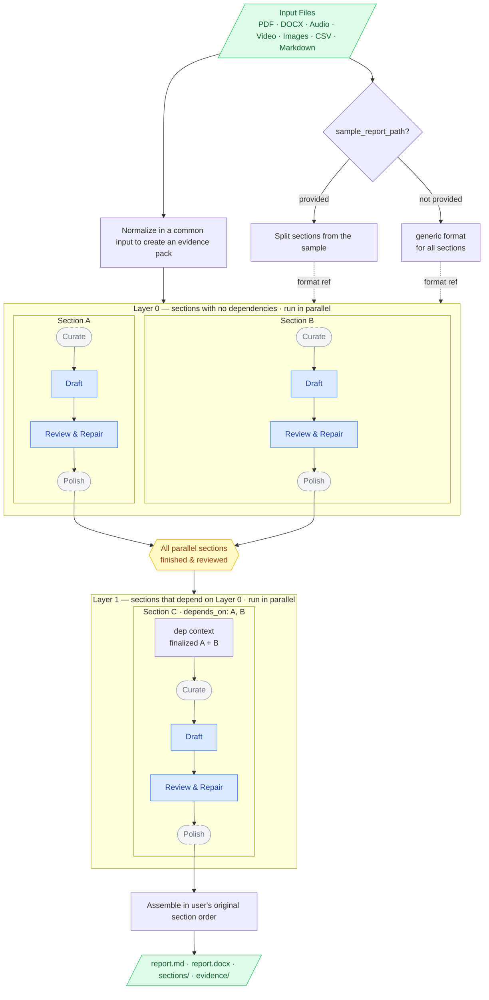

# Multi-Source Report Generator

Generate a fully user-defined report from any mix of source files — PDF, Word, Excel, audio/video, images, and plain text.

The module is built around a **use-case definition**: you tell it what report you want, and it writes it from your evidence. There are no hardcoded templates, no
fixed sections, and no domain-specific logic.

**Define your use case by providing:**

- **Report title** — the heading of the assembled report.
- **Report description** — a short description for the report's purpose and
  audience. Passed to the writer, reviewer, and polish pass as shared context to
  keep tone and focus consistent across all sections.
- **Report sections** — as many as you need, each with a title and a plain-language
  description of what the section should contain and what to extract from the
  evidence. Examples:
  - *"List all action items in a table with Owner, Due Date, and Priority columns.
    Use only items explicitly stated in the evidence."*
  - *"Summarize the company's current AI maturity level and classify it as Low,
    Moderate, or High based on development stage, data availability, and AI roadmap."*
  - *"Describe the key technical risks identified during the discussion, with a
    brief explanation of each risk and its potential impact."*
- **Input files** — any mix of supported types in any folder. The module
  normalizes every file to Markdown evidence automatically (transcribing audio,
  parsing PDFs, extracting spreadsheet tables, etc.) before writing begins.

**Key settings you can tune:**

The report writer allows the user to select several options related to parsing, transcription, extraction, writing, and agentic workflows. See the list of complete options in the next sections.

**Output:**

- **Mandatory Markdown** (`report.md`) — the assembled report, always produced.
- **Optional Word document** (`report.docx`) — set `output_docx=True`; requires
  the Pandoc system binary.

The module also supports saving the full use-case configuration to a JSON file
(`save_report_config`) and reloading it later (`load_report_config`), so a
use case defined once can be reused on new evidence without reconfiguring.

## GAIK Components Used
The report writer uses the following GAIK components for input normalizations. Input normalization means converting all supported source files into one common Markdown-like evidence format before report writing.

| Component | Used for |
|---|---|
| `PyMuPDFParser` | Fast local PDF text extraction, default for `parser_choice="auto"` |
| `VisionParser` | Vision-based PDF/image parsing |
| `MultimodalParser` | Multimodal PDF parsing with OpenAI, Claude, or Google |
| `DoclingParser` | Advanced PDF parsing with OCR/table support |
| `DocxParser` | Word document parsing |
| `Transcriber` | Audio/video transcription |
| `VisionExtractor` | Optional structured extraction from images |

## Installation

**Single-call workflow only** — lighter install, no `langgraph`:

```bash
pip install "gaik[multi-source-report-generator]"
```

**Agentic workflow** — includes everything above plus `langgraph`. Installing
this is enough for both single-call and agentic:

```bash
pip install "gaik[multi-source-report-generator-agentic]"
```

**Optional Word document (DOCX) export** — also requires the
[Pandoc](https://pandoc.org/installing.html) system binary:

```bash
pip install "gaik[multi-source-report-generator-docx]"
```

## Environment

Uses the same API configuration as other GAIK components.

For Azure OpenAI:

```text
AZURE_API_KEY
AZURE_ENDPOINT
AZURE_API_VERSION
AZURE_DEPLOYMENT
```

For standard OpenAI:

```text
OPENAI_API_KEY
```

## Workflow Options

The module offers two writing modes. Choose based on report criticality, cost tolerance, and whether sections need to build on each other.

### Option 1 — Single-Call (default, `agentic=False`)

```text
input files
  -> normalize all sources to Markdown evidence
  -> (optional) normalize sample report for format reference
  -> ONE LLM call writes the complete report
  -> split output into section objects
  -> (optional) write output files
```

The whole report — all sections — is written in a single prompt. The model sees the entire evidence pack and all section instructions at once and produces the full report in one response.

**When to use:**
- Simple or internal reports where occasional imprecision is acceptable
- Cost- or speed-sensitive scenarios (1 report-writing API call regardless of section count)
- Smaller evidence sets where the full pack fits comfortably in context
- Rapid prototyping or draft generation

**Trade-offs:**  
Fastest and cheapest. No per-section fact-checking; the model relies entirely on the prompt instructions to stay grounded. Hallucination risk is higher than agentic mode, especially with large evidence packs or complex multi-section reports.

---

### Option 2 — Agentic (`agentic=True`)
Each section is an independent LLM call. Sections are grouped into **dependency layers** and written in order; within a layer, sections run in parallel. Every section is then fact-checked and repaired by a diff-editor reviewer before the report is assembled.

```text
input files
  -> normalize all sources to Markdown evidence
  -> (optional) split sample report into per-section format references
  -> for each dependency layer (in order):
       for each section in the layer (in parallel):
         -> curate section-specific evidence brief
         -> draft section                          [LLM call]
         -> reviewer repairs factual errors        [LLM call]
         -> style polish                [LLM call]
  -> assemble report in the user's original section order
  -> write output files
```



> **Curate** — optional (`curate_evidence=True`): one LLM call per section extracts a focused evidence brief before drafting.  
> **Polish** — optional (`polish=True`): a final style/proofreading pass after mandatory review repair.

**Dependency layers** — how it works:

Sections with no `depends_on` form Layer 0 and run in parallel. Once all Layer 0 sections are fully finalized (reviewed + polished), a barrier releases Layer 1 — sections whose dependencies are now complete. Each dependent section receives the **finalized content** of its declared dependencies as context alongside the evidence, so a summary or recommendations section can synthesize from what was already written rather than re-deriving everything from the raw evidence.

Assembly order is always the user's original section order, not layer order. With no `depends_on` anywhere, all sections form a single layer and the workflow collapses to the simple parallel case.

**When to use:**
- Reports where accuracy and factual grounding matter (client-facing, formal, legal, technical)
- Large or complex evidence packs where a single monolithic call risks drift or omission
- Reports with a logical section hierarchy where later sections (summary, conclusions, recommendations) should build on earlier ones
- Any report where you want per-section format enforcement via a sample report

---

## Constructor

```python
MultiSourceReportGenerator(*, api_config: dict | None = None, use_azure: bool = True)
```

| Option | Default | Purpose |
|---|---:|---|
| `api_config` | `None` | Shared LLM/API config. If `None`, the module builds one with `get_openai_config(use_azure=use_azure)`. |
| `use_azure` | `True` | Used only when `api_config=None`. `True` loads Azure OpenAI settings; `False` loads standard OpenAI settings. |

Provider/model choices normally belong in `writer_options`, `review_options`, parser options, or transcriber options, not in the constructor.

## Quick Start

Minimal example — only the required inputs; everything else uses its default.

```python
from gaik.software_modules.multi_source_report_generator import MultiSourceReportGenerator

generator = MultiSourceReportGenerator(use_azure=True)

result = generator.run(
    input_paths=["materials/"],          # folder or list of files; all supported types picked up
    report_title="Project Assessment",
    report_description=(
        "Assess the current project state and identify practical next steps for the client."
    ),
    sections=[
        {
            "title": "Background",
            "instructions": "Summarize the project context and the company's current situation.",
        },
        {
            "title": "Findings",
            "instructions": "Describe the key findings drawn from the provided evidence.",
        },
        {
            "title": "Recommendations",
            "instructions": "Give practical, evidence-based recommendations for next steps.",
        },
    ],
    output_dir="output/report",
)

print(result.markdown_path)   # output/report/report.md
print(result.usage)
```

This runs the default single-call mode. Pass `agentic=True` (and install the extra) to use per-section drafting and review — see [Workflow Options](#workflow-options).

## Complete Usage

```python
from gaik.software_modules.multi_source_report_generator import MultiSourceReportGenerator

generator = MultiSourceReportGenerator(
    api_config=None,
    use_azure=True,
)

result = generator.run(
    # Inputs: files or folders. Folders are expanded recursively.
    input_paths=[
        "materials/specification.pdf",
        "materials/meeting_notes.docx",
        "materials/interview.mp3",
        "materials/photo_1.jpg",
        "materials/table.xlsx",
        "materials/notes/",
    ],

    # User-defined report structure.
    report_title="Project Assessment Report",
    report_description=(
        "Assess the current project state, summarize the evidence, "
        "and identify practical next steps for the client."
    ),
    sections=[
        {
            "title": "Background",
            "instructions": "Summarize the project context.",
            "required": True,
        },
        {
            "title": "Findings",
            "instructions": "Describe key findings from the evidence.",
        },
        {
            "title": "Recommendations",
            "instructions": "Give practical recommendations based only on the evidence.",
            # If the Recommendation section uses the following two sections as context and should be written only after these sections have been written
            "depends_on": ["ai_maturity_level", "current_solution_development_stage"],

        },
    ],
    report_language="English",

    # Optional sample report. Supported: .txt, .md, .markdown, .pdf, .docx.
    sample_report_path="templates/previous_report.md",

    # Output files. If None, the result is returned in memory only.
    output_dir="output/report",
    include_evidence_index=True,
    include_source_references=True,

    # Evidence size control.
    max_evidence_chars=200_000,
    section_context_mode="all_evidence",  # reserved; current behavior always uses all evidence

    # PDF parser selection.
    parser_choice="auto",  # auto, pymupdf, vision, multimodal, docling
    parser_options={
        "ctor": {
            # "use_markdown": True,  # PyMuPDFParser: Markdown-formatted output (default True)
            # "use_ocr": True,       # DoclingParser: enable OCR for scanned pages
        },
        # "openai_config": custom_config,  # override API config for VisionParser / MultimodalParser
    },

    # Audio/video transcription options.
    transcriber_options={
        "ctor": {
            "output_dir": "output/transcripts",     # save raw transcript files to disk
            "transcription_model": "gpt-4o-transcribe",  # or "whisper-1", "whisper_local"
            "enhanced_transcript": True,          # second LLM pass to fix transcription errors
            "language": "en",                     # force language; default is auto-detect
            "diarization": True,                  # label individual speakers
            "initial_prompt": "Meeting about AI advisory services.",
            # see other options in GAIK transcriber software component
        },
        "call": {
            # "custom_context": "Technical interview.",  # extra context hint for transcription
        },
    },

    # Image handling.
    image_options={
        "mode": "parse",  # parse or structured
        # "user_requirements": "Extract all visible measurements.",
        # "ctor": {},
        # "openai_config": custom_config,
    },

    # Main report writer LLM options.
    writer_options={
        "model": "gpt-5.4",
        "reasoning_effort": "medium",
    },

    # Optional agentic workflow.
    agentic=False,
    review_options=None,
    polish=False,
    strict_review=False,
    curate_evidence=False,
    verbose=False,
    progress_callback=None,
)

print(result.markdown)
print(result.markdown_path)
print(result.usage)
for section in result.sections:
    print(section.title, section.revision_warnings)
```

## `run(...)` Options

| Option | Default | Purpose |
|---|---:|---|
| `input_paths` | required | Files or folders. Folders are expanded recursively and unsupported extensions are ignored. |
| `sections` | required | List of `ReportSectionSpec` or dicts with `title`, `instructions`, optional `required`, and (agentic) optional `id` + `depends_on` (see Dependency-Ordered Sections). |
| `report_title` | `"Generated Report"` | H1 title of the assembled report. |
| `report_description` | `None` | Optional overall purpose/context for the report. Used by the writer, and in agentic mode also by curation, review, and polish prompts. |
| `report_language` | `None` | Optional language instruction, for example `"Finnish"` or `"English"`. |
| `sample_report_path` | `None` | Optional sample report used only as a style/format reference. |
| `output_dir` | `None` | If set, writes `report.md`, section files, evidence files, and metadata JSON. |
| `include_evidence_index` | `True` | Writes `evidence_index.json` when `output_dir` is set. |
| `include_source_references` | `True` | Asks the writer to reference source filenames where useful. Automatically overridden to `False` when there is only one input source (nothing to distinguish between sources). |
| `max_evidence_chars` | `None` | Truncates the normalized evidence pack before report writing. |
| `section_context_mode` | `"all_evidence"` | Reserved for future retrieval/section-context modes. Current behavior uses all evidence. |
| `parser_choice` | `"auto"` | PDF parser choice: `auto`, `pymupdf`, `vision`, `multimodal`, or `docling`. |
| `parser_options` | `None` | Parser constructor/config options. Supports `{"ctor": {...}}` and `{"openai_config": ...}` for relevant parsers. |
| `transcriber_options` | `None` | Transcriber options: `{"ctor": {...}, "call": {...}}`. |
| `image_options` | `None` | Image handling options. `{"mode": "parse"}` uses `VisionParser`; `{"mode": "structured"}` uses `VisionExtractor`. |
| `writer_options` | `None` | LLM options for the report writer. `model` and `provider` select the client; remaining keys are forwarded to `client.chat(...)`. |
| `agentic` | `False` | If `False`, writes the whole report in one LLM call. If `True`, uses per-section agentic drafting and review. |
| `review_options` | `None` | Optional separate LLM options for the agentic reviewer. If `None`, reviewer reuses the writer client/config. |
| `polish` | `False` | Agentic only. Runs a final style/proofreading pass after mandatory review repair. |
| `strict_review` | `False` | Agentic only. If unresolved reviewer edits remain, raise before final report outputs are written. |
| `curate_evidence` | `False` | Agentic only. Creates one section-specific evidence brief before drafting each section. |
| `verbose` | `False` | Agentic only. Prints workflow progress events. |
| `progress_callback` | `None` | Agentic only. Callable receiving progress strings. Overrides default printing behavior. |
| `output_docx` | `False` | Also write `report.docx` alongside `report.md` when `output_dir` is set. Requires the `multi-source-report-generator-docx` extra and the Pandoc system binary. |

## Supported Input Types

| Type | Extensions | Processing |
|---|---|---|
| Text | `.txt` | Read directly |
| Markdown | `.md`, `.markdown` | Read directly |
| CSV | `.csv` | Converted to Markdown table with Python stdlib `csv` |
| Excel | `.xlsx`, `.xls` | Converted to Markdown table with `openpyxl` |
| PDF | `.pdf` | Parsed by `parser_choice` |
| Word | `.docx` | Parsed by `DocxParser` |
| Audio | `.mp3`, `.wav`, `.m4a`, `.aac`, `.flac`, `.ogg` | Transcribed by `Transcriber` |
| Video | `.mp4`, `.mov`, `.mkv`, `.avi`, `.webm` | Transcribed by `Transcriber` |
| Images | `.png`, `.jpg`, `.jpeg`, `.webp`, `.tiff`, `.tif`, `.bmp`, `.gif` | Parsed by `VisionParser` or extracted by `VisionExtractor` |

## Agentic Mode Details

See [Workflow Options](#workflow-options) above for a comparison of single-call vs. agentic and guidance on when to use each.

### Dependency-Ordered Sections

The user may define an  `id` for each section (auto-derived from the title when omitted).

Sections are topologically sorted into **layers**. Sections with no `depends_on`
form layer 0 and run in parallel. Each subsequent layer starts only after all
sections in the previous layer are fully finalized (reviewed + polished). Finalized
dependency content is passed into the dependent section's writer and reviewer as
additional context, so a summary or recommendations section can synthesize from
what was already written rather than re-deriving it from the raw evidence.

```python
sections=[
    # Layer 0 — no dependencies, run in parallel
    {"id": "technical", "title": "Technical Analysis", "instructions": "Analyze the evidence."},
    {"id": "risks",     "title": "Risks",              "instructions": "Identify risks."},
    # Layer 1 — written after layer 0 finishes; receives finalized content of both deps
    {
        "id": "summary",
        "title": "Executive Summary",
        "instructions": "Summarize the key conclusions.",
        "depends_on": ["technical", "risks"],
    },
]
```

**What a dependent section receives:**
- Its own curated evidence brief (when `curate_evidence=True`) — focused on the
  section's own topic from the raw evidence.
- The finalized content of its declared dependencies — assembled as markdown
  sections and injected alongside the evidence.

Both inputs are available to the writer and reviewer. The reviewer treats dependency
sections as a **valid source** alongside the evidence, so legitimate synthesis is
not flagged as hallucination.

**Assembly order is always the user's original section order**, not dependency or
layer order. A section written in layer 0 can still appear last in the final report.
Sections without `depends_on` write independently from the evidence; they do not
receive content from sections that happen to run in the same layer.

With no `depends_on` anywhere, all sections form a single layer and run fully in
parallel — identical to the current default behavior.

Dependency ordering applies to agentic mode only. In single-call mode the whole
report is written at once and `depends_on` is silently ignored. The dependency graph
is validated up front: unknown ids, self-dependencies, duplicate ids, and cycles all
raise a clear error before any LLM calls are made.

### Agentic Review Behavior

In agentic mode, every section is reviewed before final assembly.

The reviewer:

- receives the same evidence used by the writer
- checks factual grounding against the evidence
- checks section instruction coverage
- checks sample-section format/style when a matching sample section exists
- proposes targeted search/replace corrections
- applies corrections locally with exact and fuzzy matching
- retries failed corrections up to the configured retry limit

Unresolved reviewer edits become `section.revision_warnings` by default.

With `strict_review=True`, unresolved reviewer edits raise before final report files such as `report.md` and `sections/` are written. Intermediate curation artifacts may already exist if `curate_evidence=True`.

### Agentic Curation

When `curate_evidence=False`, each section writer receives the full normalized evidence pack.

When `curate_evidence=True`, each section first gets a curator call:

```text
section title + section instructions + full evidence pack
-> section-specific curated brief
```

The section writer and reviewer then use the curated brief instead of the full evidence pack.

If `output_dir` is set, curated briefs are also saved to:

```text
output_dir/evidence/curated_sections/<section_slug>.md
```

If `output_dir=None`, curated briefs stay in memory only.

### Agentic Sample Report Handling

In single-call mode, the whole sample report is used as the format reference.

In agentic mode, the sample report is split into sections. For each requested section:

- first try exact heading match
- then try normalized heading match
- pass only the matched sample section to that section's writer and reviewer

The writer never copies sample facts or wording. The sample is only a format/style reference.

If no matching sample section is found:

- the section is written in a generic professional format
- a warning is added to that section's `revision_warnings`
- the reviewer does not penalize the section for not matching the sample

Main sample sections should normally use Markdown `##` headings. Lower-level headings such as `###` remain inside their parent section.

**When to use a sample report:**

The more distinctive the sample's format — unusual list structure, specific prose/bullet mix, custom heading depth, unique bold lead-in style — the more value it adds. Use it when you have a real previous report that should serve as a style template.

If the sample is about a completely different subject, the format/content separation is handled by the prompts, but there is inherent tension. If the format is generic enough that the model would produce it naturally anyway (two paragraphs + bullet list), omitting the sample often gives equally good results with less risk of content drift.

Keep a same-topic sample when you want strong style fidelity; omit it or use a generic-format sample when the subject is unrelated and the format is simple.

### Agentic Progress

Use `verbose=True` for CLI messages.

With no dependencies (all sections in one parallel layer):

```text
Writing 3 section(s) in parallel: Background, Findings, Recommendations
[Findings] evidence loaded -> drafting
[Findings] draft written (240 words) -> reviewer
[Findings] reviewer: 2 correction(s) proposed, 2 applied
[Findings] done
Assembling report in requested order -> report.md
```

With dependencies (multiple layers):

```text
Phase 1/2 — writing 2 section(s) in parallel: Technical Analysis, Risks
[Technical Analysis] evidence loaded -> drafting
[Technical Analysis] draft written (310 words) -> reviewer
[Technical Analysis] reviewer: 0 correction(s) proposed, 0 applied
[Technical Analysis] done
Phase 1/2 complete -> Phase 2
Phase 2/2 — writing 1 section(s) in parallel: Executive Summary
[Executive Summary] context: 2 dependency section(s)
[Executive Summary] evidence loaded -> drafting
[Executive Summary] draft written (180 words) -> reviewer
[Executive Summary] reviewer: 1 correction(s) proposed, 1 applied
[Executive Summary] done
Assembling report in requested order -> report.md
```

Or pass a callback:

```python
events = []
result = generator.run(
    input_paths=["materials/"],
    sections=[{"title": "Findings", "instructions": "Summarize findings."}],
    agentic=True,
    progress_callback=events.append,
)
```

### `parser_options`

```python
parser_options={
    "ctor": {
        # keyword arguments forwarded to the parser constructor
        # e.g. "use_markdown": False  for PyMuPDFParser
    },
    "openai_config": custom_config,  # override API config for VisionParser / MultimodalParser
}
```

### `transcriber_options`

All keys under `"ctor"` are forwarded to the `Transcriber` constructor. Commonly useful ones:

```python
transcriber_options={
    "ctor": {
        # --- Output ---
        "output_dir": "output/transcripts",    # save raw transcript files to disk

        # --- Model ---
        # "transcription_model": "gpt-4o-transcribe",  # or "whisper-1", "whisper_local"
        # Default: resolved from api_config (gpt-4o-transcribe for Azure, whisper-1 for OpenAI)

        # --- Transcript enhancement ---
        # "enhanced_transcript": True,          # second LLM pass to fix transcription errors
        # "enhanced_transcript_instructions": "Keep all technical terms as-is.",

        # --- Language ---
        # "language": "en",                     # force a language; default is auto-detect
        # "initial_prompt": "Meeting about AI advisory services.",  # context hint for accuracy

        # --- Speaker diarization ---
        # "diarization": True,                  # identify and label individual speakers
        # "speaker_count": 3,                   # exact number of speakers (optional)
        # "min_speakers": 2,                    # lower bound when count is unknown
        # "max_speakers": 5,                    # upper bound when count is unknown
    },
    "call": {
        # forwarded to Transcriber.transcribe(...)
        # "custom_context": "Technical interview about AI systems.",
    },
}
```

When `enhanced_transcript=True` is set, the transcriber runs a second LLM call to clean up errors (hesitations, mis-hearings, punctuation). The module uses `result.enhanced_transcript` when available, falling back to `result.raw_transcript` otherwise.

### `image_options`

General image parsing:

```python
image_options={"mode": "parse"}
```

Structured image extraction:

```python
image_options={
    "mode": "structured",
    "user_requirements": "Extract all measurements and labels.",
    "ctor": {},
}
```

### `writer_options`

```python
writer_options={
    "model": "gpt-5.4",
    "provider": "openai",       # optional; depends on config/client
    "temperature": 0,
    "reasoning_effort": "medium",
}
```

`model` and `provider` are consumed while creating the client. Other keys are forwarded to the LLM call.

### `review_options`

Agentic only:

```python
review_options={
    "model": "gpt-5.4",
    "temperature": 0,
}
```

If `review_options=None`, the reviewer and polish pass reuse the writer client/config.

## Output Files

When `output_dir` is set:

```text
output_dir/
    report.md
    report.docx             # only when output_docx=True (requires Pandoc)
    evidence_index.json
    usage.json
    sections/
        01_background.md
        02_findings.md
    evidence/
        normalized_sources.md
        curated_sections/       # only agentic=True and curate_evidence=True
            background.md       # filename = section id (auto-derived from title if not set)
            findings.md
```

The returned `ReportGenerationResult` contains:

| Field | Meaning |
|---|---|
| `title` | Report title |
| `evidence_items` | Normalized source records |
| `sections` | Generated section objects |
| `markdown` | Full assembled Markdown report |
| `markdown_path` | Path to `report.md`, or `None` |
| `docx_path` | Path to `report.docx` when `output_docx=True`, otherwise `None` |
| `usage` | Best-effort token usage from calls that expose usage |

Each `GeneratedSection` contains:

| Field | Meaning |
|---|---|
| `title` | Section title |
| `content_markdown` | Section body |
| `usage` | Best-effort per-section usage |
| `revision_warnings` | Non-fatal warnings from agentic generation |

Note: reviewer calls use `chat_parsed(...)`; provider clients may not expose usage for parsed calls. Agentic `usage` can therefore undercount total cost until parsed-call usage is surfaced by the shared LLM interface.

## Saving and Loading Configurations

All `run()` parameters can be persisted to a JSON file and reloaded for repeat
runs or to share a use-case configuration.

```python
from gaik.software_modules.multi_source_report_generator import (
    MultiSourceReportGenerator,
    save_report_config,
    load_report_config,
)

# Save the current use-case configuration to a file.
# Paths (input_paths, output_dir, sample_report_path) are stored relative to
# the config file so it is portable. All option dicts are stored as-is.
save_report_config(
    "my_report_config.json",
    input_paths=["materials/"],
    report_title="Q2 Planning Report",
    report_description="Summary of the Q2 product planning meeting.",
    sections=[
        {"title": "Decisions", "instructions": "List the key decisions."},
        {"title": "Action Items", "instructions": "List action items as a table."},
    ],
    output_dir="output/report",
    agentic=True,
    curate_evidence=True,
    polish=True,
    transcriber_options={"ctor": {"transcription_model": "gpt-4o-transcribe"}},
    writer_options={"model": "gpt-5.4"},
)

# Reload on the next run — returns a dict ready to unpack into run().
config = load_report_config("my_report_config.json")
gen = MultiSourceReportGenerator(use_azure=True)
result = gen.run(**config)
```

`save_report_config` accepts the same keyword arguments as `run()`, minus
`verbose`, `progress_callback`, and `section_context_mode` (runtime preferences
that are not part of the use-case definition). These can still be passed
directly to `run()`.

## Example

See:

```text
implementation_layer/examples/software_modules/multi_source_report_generator/report_generation_example.py
```
