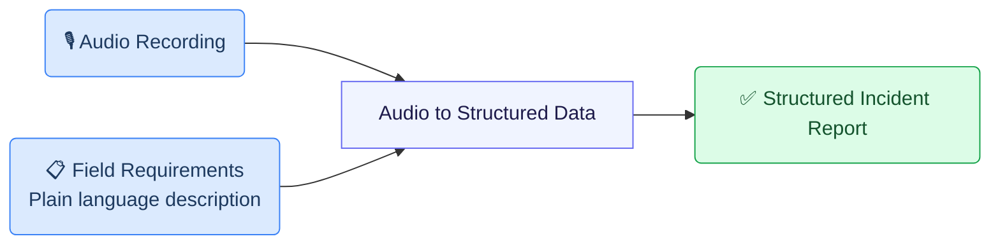
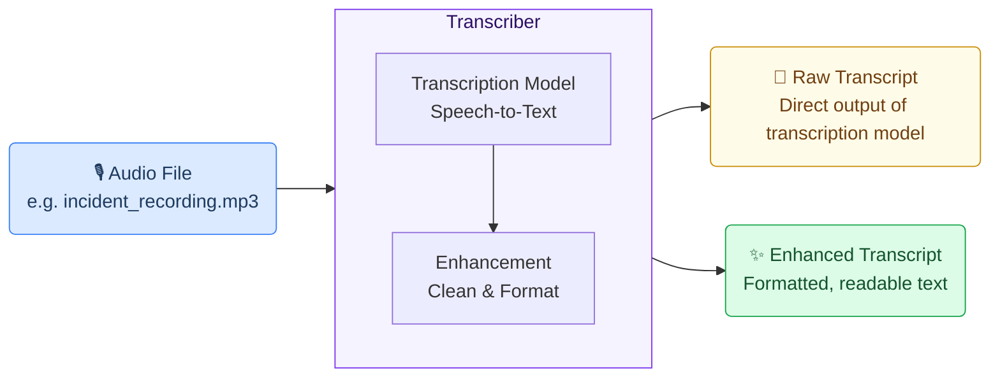
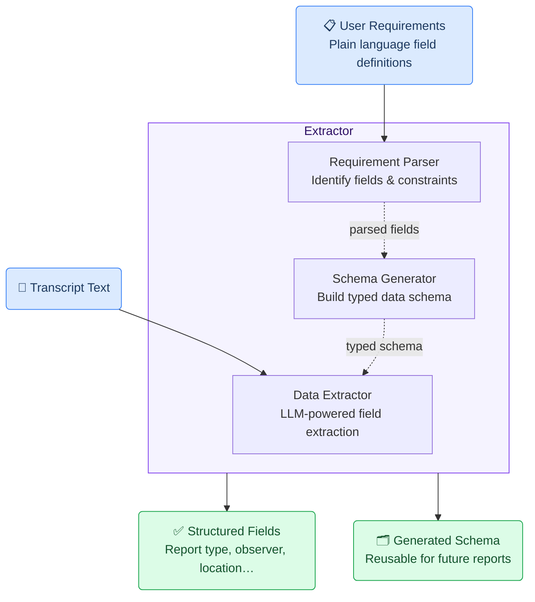
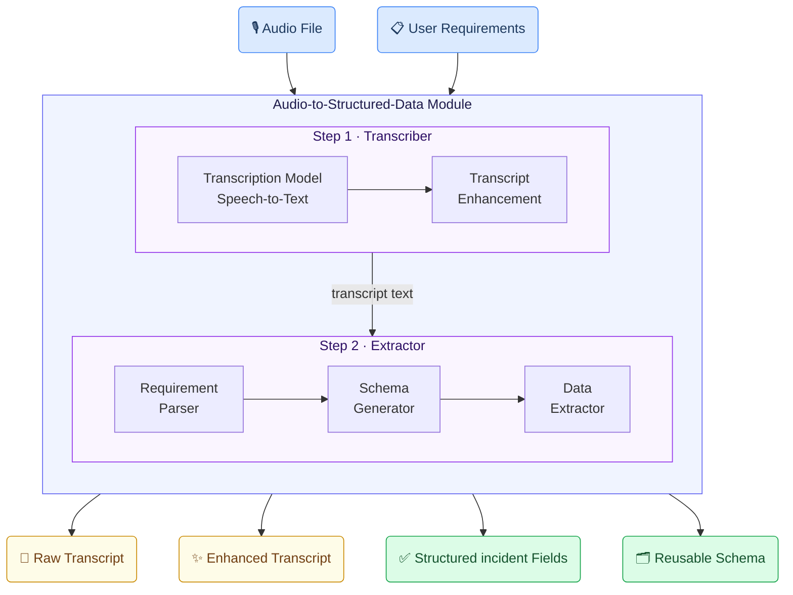

# Incident Report Writing Use Case

## Business Context

In industrial environments, employees must report unusual events — equipment failures, leaks, injuries, near-misses — accurately and promptly. Traditional methods (manual notes or online forms) create friction that leads to underreporting and incomplete data.

This use case lets an employee **record a voice message** at the scene, and the system automatically extracts all required fields to generate a structured incident report. Reporting friction reduces to a single step: **press record, describe, submit**.

---

## How GAIK Toolkit Enables This Use Case

Two software components — **Transcriber** and **Extractor** — are combined into the **Audio to Structured Data** module to handle this use case end-to-end.



---

## Software Components

### 1. Transcriber

Converts an audio recording into text using OpenAI's speech-to-text model, with an enhancement step that cleans up the raw transcript — correcting speech artefacts and improving readability.



> 📁 [`implementation_layer/src/gaik/software_components/transcriber/`](https://github.com/GAIK-project/gaik-toolkit/tree/main/implementation_layer/src/gaik/software_components/transcriber)

---

### 2. Extractor

Takes the transcript and a plain-language field specification, then returns structured data. Internally it runs three steps: the **Requirement Parser** identifies fields and constraints from your description; the **Schema Generator** builds a typed data schema; the **Data Extractor** uses an LLM to fill in each field from the transcript.

The schema is generated once and **saved for reuse** — future reports skip regeneration entirely.



> 📁 [`implementation_layer/src/gaik/software_components/extractor/`](https://github.com/GAIK-project/gaik-toolkit/tree/main/implementation_layer/src/gaik/software_components/extractor)

---

## Defining What to Extract: User Requirements

Fields are specified in plain language — no code, no schema configuration. Each line names a field and optionally defines allowed values or extraction rules:

```
Extract the following fields from the incident report.
- Report type [Choose one from: Safety, Environmental protection, Energy efficiency, ""]
- Observer name
- Observer organization [ABC Pori Oy; ABC Helsinki Oy; Other]
- Observer is a summer employee [output "Yes" only if it is explicitly stated that the reporter is a summer employee; otherwise ""]
- Event time [date text exactly as written in source; do not normalize to ISO]
- Location information
- Photo count [number of photos uploaded; if none mentioned, output ""]
- The event was serious [Yes, No]
- Description of the event area
- Possible consequences
- Implemented measures
- Proposal
```

---

## Software Module: Audio to Structured Data

Packages both components into a single workflow. Provide an audio file and field requirements — the module returns transcripts, structured fields, and the reusable schema.



Example output for an incident recording:

```
Report type:               Safety
Observer name:             Anna Virtanen
Observer organization:     ABC Pori Oy
Observer is summer employee: ""
Event time:                15.3.2024 klo 14:30
Location information:      Halli 3, linja B, puristimen alue
Photo count:               2
The event was serious:     Yes
Description of event area: Hydrauliputki vaurioitunut, öljyvuoto lattialla
Possible consequences:     Liukastumisriski, tulipaloriski
Implemented measures:      Alue eristetty, öljy imeytetty
Proposal:                  Hydrauliputki tarkistettava ennen käyttöönottoa
```

> 📁 [`implementation_layer/src/gaik/software_modules/audio_to_structured_data/`](https://github.com/GAIK-project/gaik-toolkit/tree/main/implementation_layer/src/gaik/software_modules/audio_to_structured_data)
> 📁 [`implementation_layer/examples/software_modules/`](https://github.com/GAIK-project/gaik-toolkit/tree/main/implementation_layer/examples/software_modules)

---

## Adaptable to Other Domains

The same pipeline applies to any domain requiring structured extraction from spoken descriptions — only the **User Requirements** definition changes:

- Construction site diaries, field service reports, quality inspection notes, healthcare incident reports

---

## Related Resources

| Resource | Link |
|----------|------|
| Transcriber component | [GitHub →](https://github.com/GAIK-project/gaik-toolkit/tree/main/implementation_layer/src/gaik/software_components/transcriber) |
| Extractor component | [GitHub →](https://github.com/GAIK-project/gaik-toolkit/tree/main/implementation_layer/src/gaik/software_components/extractor) |
| Audio to Structured Data module | [GitHub →](https://github.com/GAIK-project/gaik-toolkit/tree/main/implementation_layer/src/gaik/software_modules/audio_to_structured_data) |
| Module usage examples | [GitHub →](https://github.com/GAIK-project/gaik-toolkit/tree/main/implementation_layer/examples/software_modules) |
| GenAI Product Canvas (Incident Reporting) | [Download →](https://github.com/GAIK-project/gaik-toolkit/blob/main/business_layer/genAI_product_canvas/GenAI_product_canvas_Incident%20reporting_v0.1.pptx) |
| Implementation Layer overview | [GitHub →](https://github.com/GAIK-project/gaik-toolkit/tree/main/implementation_layer) |
