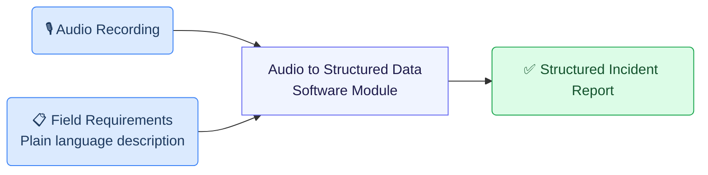
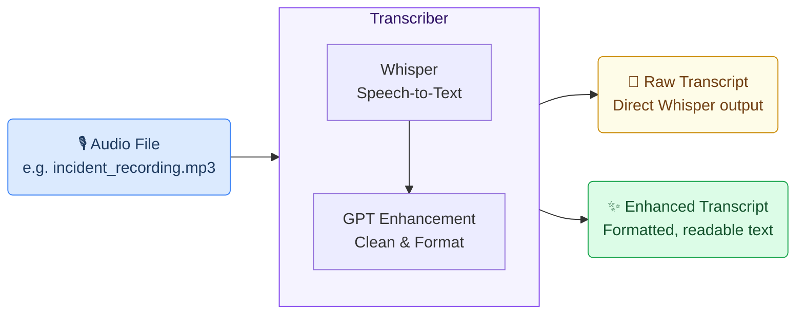
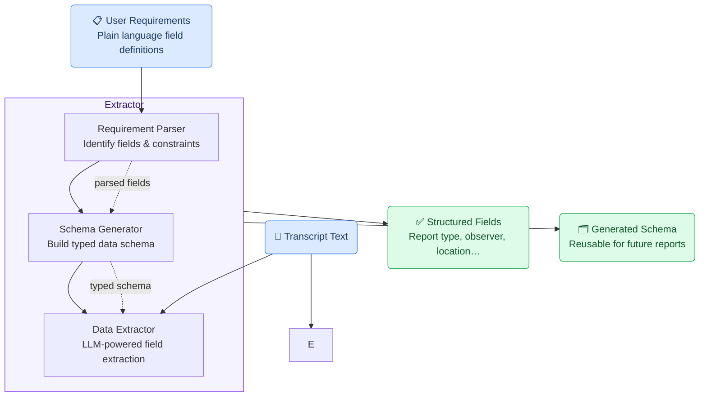
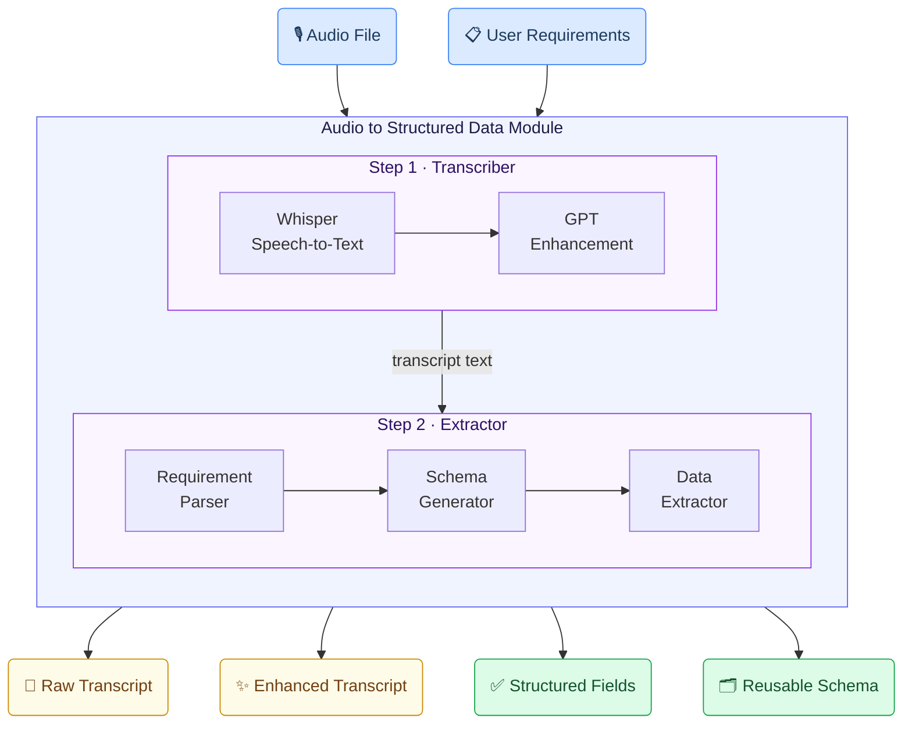

# Incident Report Writing Use Case

## Business Context

In industrial environments such as factories, manufacturing plants, and construction sites, employees regularly encounter unusual events — equipment failures, water leaks, workplace injuries, near-misses, or environmental incidents. Reporting these events accurately and promptly is critical for safety management, regulatory compliance, and continuous improvement.

Traditional reporting methods create friction:

- **Manual note-taking** is slow, error-prone, and often done after the fact when details have been forgotten.
- **Online forms** require employees to leave the incident site, navigate software interfaces, and type detailed descriptions — a significant burden in operational environments.

These barriers lead to underreporting, incomplete data, and delayed responses to safety issues.

### The Opportunity

Employees are already comfortable speaking. The incident report writing use case allows an employee to simply **record a voice message** describing what happened — in their own words, at the scene — and have the system automatically extract all required fields and generate a structured incident report.

This reduces reporting friction to a single step: **press record, describe the incident, submit**.

---

## How GAIK Toolkit Enables This Use Case

The GAIK toolkit provides software components that handle each part of the process. This use case combines two components — a **Transcriber** and an **Extractor** — which together form the **Audio to Structured Data** software module.



The following sections introduce each software component and explain how they work together.

---

## Software Components

### 1. Transcriber

The Transcriber converts an audio recording into text. It uses OpenAI transcription models for accurate speech-to-text conversion, with a GPT-based enhancement step that cleans the raw transcript — correcting speech artefacts, improving punctuation, and producing more readable prose.

**What you provide:**
- An audio file in a supported format (MP3, WAV, M4A, OGG, or video formats with ffmpeg)

**What you get back:**
- A raw transcript directly from Whisper
- An enhanced transcript refined by GPT (optional but recommended)



In the incident reporting use case, the employee's voice recording becomes clean, structured text ready for field extraction.

> 📁 **Component source:** [`implementation_layer/src/gaik/software_components/transcriber/`](https://github.com/GAIK-project/gaik-toolkit/tree/main/implementation_layer/src/gaik/software_components/transcriber)

---

### 2. Extractor

The Extractor takes the transcript text and a plain-language description of the fields you want to extract, then returns structured data with each field filled in.

It is composed of three internal steps:

| Step | What it does |
|------|-------------|
| **Requirement Parser** | Reads your plain-language field definitions and identifies each field name, type, and any constraints |
| **Schema Generator** | Automatically creates a typed data schema (Pydantic model) that defines exactly what the output should look like |
| **Data Extractor** | Applies the schema to the transcript using an LLM, extracting the value for each field |

**What you provide:**
- The transcript text (from the Transcriber)
- A plain-language description of what fields to extract and any rules for each field

**What you get back:**
- A structured record with every field filled in according to your specification



The schema is generated once from your field definitions and can be **saved and reused** for every future incident report without regenerating it — making repeated processing fast and cost-efficient.

> 📁 **Component source:** [`implementation_layer/src/gaik/software_components/extractor/`](https://github.com/GAIK-project/gaik-toolkit/tree/main/implementation_layer/src/gaik/software_components/extractor)

---

## Defining What to Extract: User Requirements

For extracting information, you can specify your requirements in plain language. Instead of writing code or configuring complex schemas, you simply describe the fields in plain language — just as you would explain the task to a colleague.

For the incident reporting use case, the requirements look like this:

```
Extract the following fields from the incident report.
- Report type [Choose one from: Safety, Environmental protection, Energy efficiency, ""]
- Observer name
- Observer organization [ABC Pori Oy; ABC Helsinki Oy; Other]
- Observer is a summer employee [output "Yes" only if it is explicitly stated that the reporter is a summer employee; otherwise ""]
- Event time [date text exactly as written in source; do not normalize to ISO]
- Location information
- Photo count [number of photos uploaded; if none mentioned, output ""]
- The event was serious [Yes, No]
- Description of the event area
- Possible consequences
- Implemented measures
- Proposal
```

Each field line can include:
- The **field name** (e.g., "Report type")
- **Allowed values** in square brackets (e.g., `[Safety, Environmental protection, Energy efficiency, ""]`)
- **Extraction rules** describing edge cases (e.g., only output "Yes" if explicitly stated)

The Requirement Parser reads this description and the Schema Generator turns it into a validated, type-safe structure automatically.

---

## Software Module: Audio to Structured Data

The **Audio to Structured Data** module packages the Transcriber and Extractor into a single, ready-to-use workflow. Instead of managing each component separately, you provide the audio file and your field requirements, and the module handles the rest — returning everything in one structured result.



### What the Module Returns

| Output | Description |
|--------|-------------|
| **Raw Transcript** | The verbatim Whisper transcription of the audio |
| **Enhanced Transcript** | GPT-refined version with improved readability |
| **Structured Fields** | All defined incident report fields, extracted and validated |
| **Generated Schema** | The Pydantic schema built from your requirements, saved for reuse |

The structured fields output for an incident recording might look like:

```
Report type:               Safety
Observer name:             Anna Virtanen
Observer organization:     ABC Pori Oy
Observer is summer employee: ""
Event time:                15.3.2024 klo 14:30
Location information:      Halli 3, linja B, puristimen alue
Photo count:               2
The event was serious:     Yes
Description of event area: Hydrauliputki vaurioitunut, öljyvuoto lattialla
Possible consequences:     Liukastumisriski, tulipaloriski
Implemented measures:      Alue eristetty, öljy imeytetty
Proposal:                  Hydrauliputki tarkistettava ennen käyttöönottoa
```

> 📁 **Module source:** [`implementation_layer/src/gaik/software_modules/audio_to_structured_data/`](https://github.com/GAIK-project/gaik-toolkit/tree/main/implementation_layer/src/gaik/software_modules/audio_to_structured_data)
>
> 📁 **Usage example:** [`implementation_layer/examples/software_modules/`](https://github.com/GAIK-project/gaik-toolkit/tree/main/implementation_layer/examples/software_modules)

---

## Customization and Extensibility

This use case can be adapted to any domain that requires structured extraction from spoken descriptions:

- **Construction site diaries** — daily work logs recorded on-site
- **Field service reports** — technician recordings after equipment maintenance
- **Quality inspection notes** — auditor observations during production line checks
- **Healthcare incident reports** — clinical event recordings in medical settings

All you need to change is the **User Requirements** definition. The toolkit components remain the same; only the field specifications adapt to your domain.

---

## Related Resources

| Resource | Link |
|----------|------|
| Transcriber component | [GitHub →](https://github.com/GAIK-project/gaik-toolkit/tree/main/implementation_layer/src/gaik/software_components/transcriber) |
| Extractor component | [GitHub →](https://github.com/GAIK-project/gaik-toolkit/tree/main/implementation_layer/src/gaik/software_components/extractor) |
| Audio to Structured Data module | [GitHub →](https://github.com/GAIK-project/gaik-toolkit/tree/main/implementation_layer/src/gaik/software_modules/audio_to_structured_data) |
| Module usage examples | [GitHub →](https://github.com/GAIK-project/gaik-toolkit/tree/main/implementation_layer/examples/software_modules) |
| GenAI Product Canvas (Incident Reporting) | [Download →](https://github.com/GAIK-project/gaik-toolkit/blob/main/business_layer/genAI_product_canvas/GenAI_product_canvas_Incident%20reporting_v0.1.pptx) |
| Implementation Layer overview | [GitHub →](https://github.com/GAIK-project/gaik-toolkit/tree/main/implementation_layer) |
