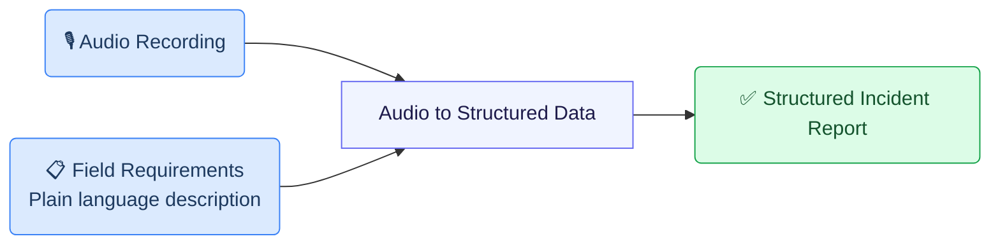
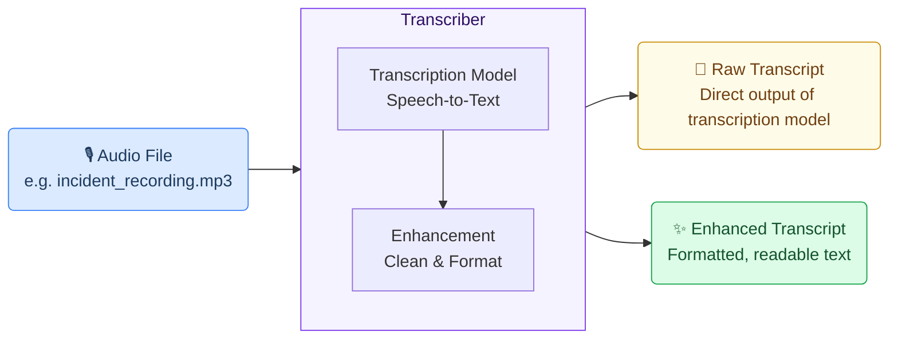
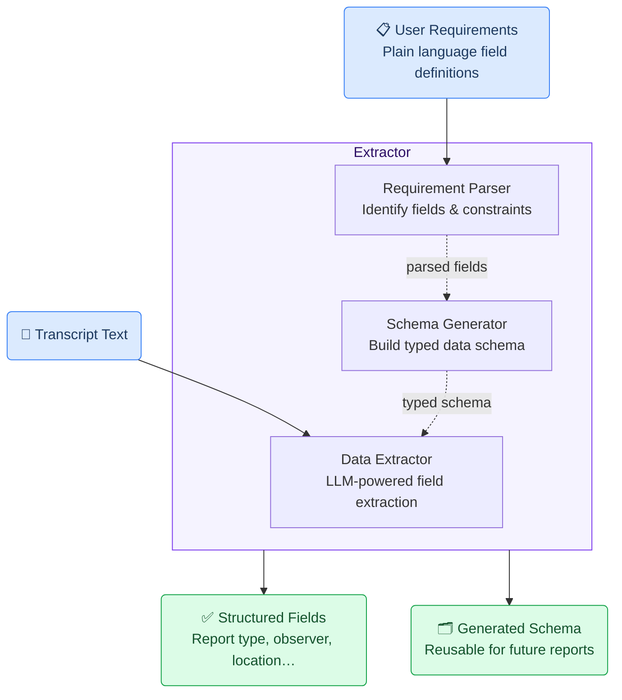
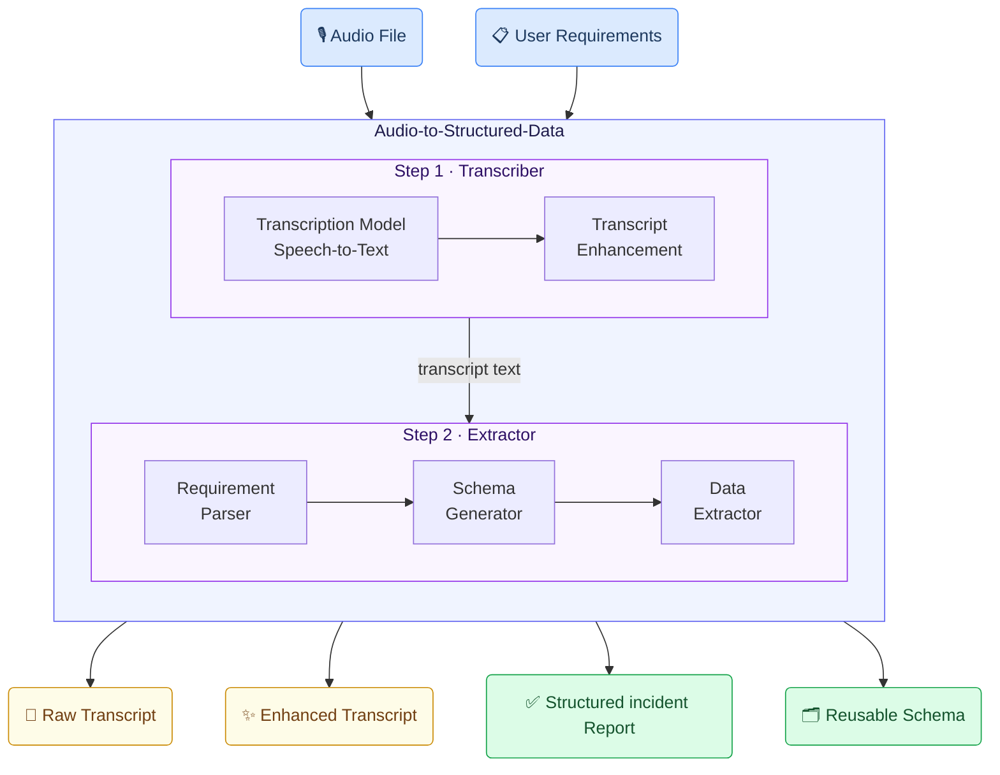
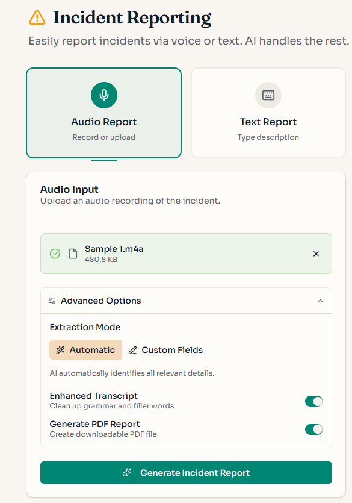
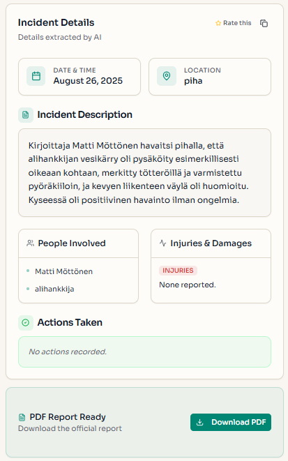

# Incident Reporting Generic Use Case (Cross-Cutting Use Case)

The incident reporting use case illustrates how the toolkit connects use case design, value evaluation, and implementation into a single GenAI-enabled solution for safety and incident management.


## Business layer – use case specification

At the business layer, the use case is specified using the GenAI product canvas. The focus is on improving how incidents, near misses, safety observations, and safety-related initiatives are reported in operational environments. The canvas clarifies the purpose of the solution (supporting incident reporting as part of daily work), the main users (employees and supervisors), and the expected outcomes.

Concrete example fragments reflected in the use case design include:
- Reporting is based on spoken descriptions of incidents and safety observations
- The goal is to produce complete, standardized incident reports
- The solution supports reporting directly from operational contexts (e.g. on-site, during work)
- Success is defined in terms of faster reporting, higher reporting quality, and better downstream usability of incident data

The canvas provides a shared understanding of what the GenAI solution does and why it is valuable, without digging into technical implementation details.


- **Reference GenAI Product Description for Incident Reporting** - [Download Raw File (GenAI_product_canvas_Incident reporting_v0.1.pptx)](https://github.com/GAIK-project/gaik-toolkit/blob/main/business_layer/genAI_product_canvas/GenAI_product_canvas_Incident%20reporting_v0.1.pptx)


## Strategy layer – value evaluation and monitoring

At the strategy layer, the value evaluation model for incident reporting applies the [Value Evaluation Framework](https://github.com/GAIK-project/gaik-toolkit/blob/main/strategy_layer/value_evaluation_framework/README.md) 
to this generic use case and makes value assumptions explicit.

Example value fragments from the model include:

Functional value (primary):
“Faster reporting”, “Less effort”, “Complete, standardized reports”, “Accessible on-site”
→ Outcome: More incidents reported, faster fixes

Informational value:
“Better incident data”, “Improved insights”, “Stronger analytics”
→ Outcome: Smarter prevention decisions

Emotional value:
“Higher confidence”, “Increased trust”, “Less reporting friction”
→ Outcome: Employees feel safer and heard

The same model can be used both before implementation (to evaluate expected value) and after deployment (to monitor realized value across different dimensions).


The source version of the **Value evaluation model: Incident reporting** - [Download Raw File (Value_evaluation_model_for Incident_reporting_v0.1.pptx)](https://github.com/GAIK-project/gaik-toolkit/blob/main/strategy_layer/value_evaluation_framework/Value_evaluation_model_for%20Incident_reporting_v0.1.pptx) 
“Lower admin effort”, “Accident cost avoidance”, “Productivity gains”

## Implementation layer using No-Code

Incident reporting can be supported by Generative AI using no-code approach.
At the implementation layer, the use case is realized using no-code assets from the toolkit:
1) [Prompt templates for incident report writing](https://github.com/GAIK-project/gaik-toolkit/blob/main/implementation_layer/no-code-assets/prompts/Incident%20report%20writing/README.md) 
2) [Reusable agent skills that define how incident information is structured and processed](https://github.com/GAIK-project/gaik-toolkit/blob/main/implementation_layer/no-code-assets/agent-skills/incident-report-writing/README.md)

The GitHub assets specify the expected inputs and outputs of the incident reporting task, focusing on producing consistent, structured incident reports without requiring custom software development. Organizations can adapt these assets to their own reporting formats, terminology, and policies while keeping the core logic intact.

The no-code layer shows how a GenAI solution can be used in everyday work without building software. Business users work with ready-made templates and rules that define what information should be captured and how the result should look.

What the business user sets up (once):

A safety manager defines a reporting template, not code. Conceptually, it says:
- “These are the fields our incident report must contain”
- “These are the only allowed options for key fields”
- “Do not guess or invent missing information”
- “If something is not said, leave it empty”

This logic is captured in a prompt template, which acts like a digital reporting policy.

What happens in daily work:

**Step 1 – Reporting by voice**
An employee or supervisor records a short voice message describing:
- an incident
- a safety observation
- or a safety-related initiative

No form, no typing, no computer required.

**Step 2 – Automatic structuring (no-code logic)**
The prompt template converts the spoken description into a standardized incident report, following strict business rules. For example, the assistant is instructed to:

- extract only information explicitly mentioned
- classify the report using fixed categories (e.g. Safety observation, Near miss: Yes/No)
- keep descriptions short and factual
- ensure dates, locations, and causes follow a consistent format

From a business perspective, this is equivalent to enforcing rules like:

- “If the speaker does not mention a date, leave the date field empty.”
- “If the cause does not match our predefined categories, do not fill it in.”
- “Never add explanations or extra text.”

Example of what the business gets out:

Instead of free text, the output is a ready-to-use structured report, aligned with the company’s reporting form:

- Type of form: Safety observation
- Event date and time: 15.03.2024 14:30
- Location: Building A, Assembly line
- Near miss: Yes
- Direct cause: 5S
- Corrective actions performed: Yes

Anything not mentioned in the voice report is intentionally left blank.

This makes the result:
- easy to paste into an existing system
- safe to store in a database
- reliable for analytics and reporting
- suitable for audits and compliance
---

## Implementation Layer Using Code-Based Method. 

Two software components — **Transcriber** and **Extractor** — are combined into the **Audio to Structured Data** module to handle this use case end-to-end.



---

## Software Components

### 1. Transcriber

Converts an audio recording into text using OpenAI's speech-to-text model, with an enhancement step that cleans up the raw transcript — correcting speech artefacts and improving readability.



> 📁 [`implementation_layer/src/gaik/software_components/transcriber/`](https://github.com/GAIK-project/gaik-toolkit/tree/main/implementation_layer/src/gaik/software_components/transcriber)

---

### 2. Extractor

Takes the transcript and a plain-language field specification, then returns structured data. Internally it runs three steps: the **Requirement Parser** identifies fields and constraints from your description; the **Schema Generator** builds a typed data schema; the **Data Extractor** uses an LLM to fill in each field from the transcript.

The schema is generated once and **saved for reuse** — future reports skip regeneration entirely.



> 📁 [`implementation_layer/src/gaik/software_components/extractor/`](https://github.com/GAIK-project/gaik-toolkit/tree/main/implementation_layer/src/gaik/software_components/extractor)

---

## Defining What to Extract: User Requirements

Fields are specified in plain language — no code, no schema configuration. Each line names a field and optionally defines allowed values or extraction rules:

```
Extract the following fields from the incident report.
- Report type [Choose one from: Safety, Environmental protection, Energy efficiency, ""]
- Observer name
- Observer organization [ABC Pori Oy; ABC Helsinki Oy; Other]
- Observer is a summer employee [output "Yes" only if it is explicitly stated that the reporter is a summer employee; otherwise ""]
- Event time [date text exactly as written in source; do not normalize to ISO]
- Location information
- Photo count [number of photos uploaded; if none mentioned, output ""]
- The event was serious [Yes, No]
- Description of the event area
- Possible consequences
- Implemented measures
- Proposal
```

---

## Software Module: Audio to Structured Data

Packages both components into a single workflow. Provide an audio file and field requirements — the module returns transcripts, structured fields, and the reusable schema.



Example output for an incident recording:

<p>
  
  
</p>

```
Report type:               Safety
Observer name:             Anna Virtanen
Observer organization:     ABC Pori Oy
Observer is summer employee: ""
Event time:                15.3.2024 klo 14:30
Location information:      Halli 3, linja B, puristimen alue
Photo count:               2
The event was serious:     Yes
Description of event area: Hydrauliputki vaurioitunut, öljyvuoto lattialla
Possible consequences:     Liukastumisriski, tulipaloriski
Implemented measures:      Alue eristetty, öljy imeytetty
Proposal:                  Hydrauliputki tarkistettava ennen käyttöönottoa
```

> 📁 [`implementation_layer/src/gaik/software_modules/audio_to_structured_data/`](https://github.com/GAIK-project/gaik-toolkit/tree/main/implementation_layer/src/gaik/software_modules/audio_to_structured_data)
> 📁 [`implementation_layer/examples/software_modules/`](https://github.com/GAIK-project/gaik-toolkit/tree/main/implementation_layer/examples/software_modules)

---

## Adaptable to Other Domains

The same pipeline applies to any domain requiring structured extraction from spoken descriptions — only the **User Requirements** definition changes:

- Construction site diaries, field service reports, quality inspection notes, healthcare incident reports

---

## Evaluation Methods

The quality of this use case is evaluated by assessing each software component independently:

### Transcriber Evaluation

Transcription quality is measured using standard metrics such as **Word Error Rate (WER)**, which quantifies the accuracy of the speech-to-text conversion. The evaluation also includes comparison of various transcription models and methods to enhance the raw transcript as a post-transcription step.

> 📊 **Transcription evaluation methods:** [`implementation_layer/eval_methods/transcription_eval/`](https://github.com/GAIK-project/gaik-toolkit/tree/main/implementation_layer/eval_methods/transcription_eval)

### Extractor Evaluation

The quality of structured information extraction is evaluated through **cosine similarity ratio**, which measures how accurately the extracted fields match the expected values. This method assesses both the semantic correctness and completeness of the extracted data.

> 📊 **Extraction evaluation methods:** [`implementation_layer/eval_methods/extraction_eval/`](https://github.com/GAIK-project/gaik-toolkit/tree/main/implementation_layer/eval_methods/extraction_eval)

---

## Related Resources

| Resource | Link |
|----------|------|
| Transcriber component | [GitHub →](https://github.com/GAIK-project/gaik-toolkit/tree/main/implementation_layer/src/gaik/software_components/transcriber) |
| Extractor component | [GitHub →](https://github.com/GAIK-project/gaik-toolkit/tree/main/implementation_layer/src/gaik/software_components/extractor) |
| Audio to Structured Data module | [GitHub →](https://github.com/GAIK-project/gaik-toolkit/tree/main/implementation_layer/src/gaik/software_modules/audio_to_structured_data) |
| Module usage examples | [GitHub →](https://github.com/GAIK-project/gaik-toolkit/tree/main/implementation_layer/examples/software_modules) |
| GenAI Product Canvas (Incident Reporting) | [Download →](https://github.com/GAIK-project/gaik-toolkit/blob/main/business_layer/genAI_product_canvas/GenAI_product_canvas_Incident%20reporting_v0.1.pptx) |
| Implementation Layer overview | [GitHub →](https://github.com/GAIK-project/gaik-toolkit/tree/main/implementation_layer) |
